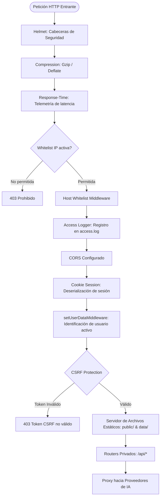

# Backend Express & Servicios de Servidor

Este documento detalla la arquitectura del servidor Node.js de SillyTavern ubicado en `src/`, su ciclo de vida, la jerarquía de middleware, la estructura de endpoints REST y los mecanismos internos de procesamiento de datos.

---

## 1. Estructura del Directorio Backend (`src/`)

```
src/
├── server-startup.js        # Configuración de listeners de red, redirecciones y registro de routers
├── server-main.js           # Inicialización de Express, middlewares globales y ciclo de vida
├── command-line.js          # Parser de argumentos CLI (yargs) y valores por defecto
├── config-init.js           # Carga y validación de config.yaml
├── constants.js             # Constantes globales de rutas, nombres de archivos y límites
├── users.js                 # Modelo de usuarios, sesiones, Scrypt, árbol de carpetas por usuario
├── plugin-loader.js         # Descubrimiento e inicialización dinámica de plugins de Express
├── request-proxy.js         # Proxy inverso para peticiones a APIs externas de LLM
├── jimp.js                  # Procesamiento de imágenes (Jimp WASM: avif, webp, png, jpeg)
├── prompt-converters.js     # Normalización de mensajes a formatos OpenAI, Claude, Claude-v1, etc.
│
├── endpoints/               # Controladores REST modulares (más de 40 routers especializados)
│   ├── characters.js        # Gestión integral de personajes (PNG chunk read/write, JSON, clonado)
│   ├── chats.js             # Guardado/carga de chats en JSONL, paginación, checkpoints y ramas
│   ├── worldinfo.js         # CRUD de lorebooks, importación, exportación y unión
│   ├── secrets.js           # Almacenamiento seguro de API keys en secrets.json
│   ├── content-manager.js   # Descarga e importación de assets y paquetes desde repositorios
│   ├── backends/            # Conectores especializados para motores de inferencia
│   │   ├── chat-completions.js  # Interfaz OpenAI-compatible (Ollama, vLLM, Aphrodite, LM Studio)
│   │   ├── kobold.js            # Conector directo para KoboldAI / KoboldCpp
│   │   └── text-completions.js  # Modo de completado de texto crudo legado
│   └── ...
│
├── middleware/              # Filtros y validadores de peticiones
│   ├── accessLogWriter.js   # Registro de accesos HTTP en disco
│   ├── basicAuth.js         # Autenticación HTTP Basic estándar
│   ├── hostWhitelist.js     # Protección contra ataques de Host Header injection
│   ├── whitelist.js         # Filtrado de direcciones IP autorizadas
│   ├── validateFileName.js  # Prevención de Directory Traversal en nombres de archivo
│   └── multerMonkeyPatch.js # Normalización de uploads multipart
│
├── png/                     # Lectura/escritura de metadatos en fragmentos PNG (tEXt / iTXt)
└── vectors/                 # Base de datos vectorial embebida (Vectra) y embeddings locales
```

---

## 2. Inicialización y Jerarquía de Middleware

El flujo de procesamiento de una petición entrante en `server-main.js` sigue un orden determinista y estricto:



### Seguridad y Cabeceras
- **Helmet**: Se aplica al inicio del pipeline. 
  > [!WARNING]
  > Como se analiza en [[PROBLEMAS_TECNICOS]], `server-main.js` tiene `contentSecurityPolicy: false`. Esto permite la ejecución de scripts en línea requeridos por extensiones del cliente, pero abre vectores de riesgo XSS.
- **Protección CSRF**: Implementada mediante `csrf-sync`. Requiere que las peticiones que mutan estado (`POST`, `PUT`, `DELETE`) incluyan la cabecera `X-CSRF-Token` o un campo en el cuerpo.
- **Aislamiento Multi-Usuario**: Si `enableUserAccounts` está activo, `setUserDataMiddleware` vincula la sesión con el directorio de datos correspondiente (`data/<user_handle>/`).

---

## 3. Arquitectura de Endpoints Clave

Los controladores en `src/endpoints/` desacoplan la lógica de dominio en routers Express independientes:

### A. Gestión de Personajes (`src/endpoints/characters.js`)
- Gestiona la especificación de tarjetas de personaje V2 y V3.
- Utiliza las utilidades de `src/png/` para extraer e inyectar fragmentos `tEXt` o `iTXt` codificados en base64 en imágenes PNG de avatares. Esto permite que una sola imagen contenga tanto la imagen física como la definición completa del personaje (nombre, descripción, primer mensaje, escenarios y lorebooks vinculados).
- Implementa una caché en disco (`diskCache`) para acelerar listados masivos de personajes sin re-parsear miles de archivos PNG en cada recarga.

### B. Gestión de Chats (`src/endpoints/chats.js`)
- Los mensajes no se almacenan en bases de datos relacionales, sino en **archivos JSONL planos** (`.jsonl`).
- Cada línea del archivo es un objeto JSON serializado que representa un mensaje individual (`name`, `is_user`, `send_date`, `mes`, `extra`).
- La primera línea del archivo JSONL contiene un objeto especial que almacena los metadatos del chat (`chat_metadata`), incluyendo:
  - Información del mundo asociado (`world_info`).
  - **Estado del grupo RPG**: Miembros del grupo, estadísticas vivas, estados y relaciones (`chat_metadata.party`).
  - **Instrucciones dinámicas activas**: Parámetros del Dynamic Context Manager (`chat_metadata.dynamicContext`).
  - Ubicación y tablero activo (`chat_metadata.currentLocation`, `currentBoard`).

### C. Lorebooks y World Info (`src/endpoints/worldinfo.js`)
- Lee y escribe archivos JSON en la carpeta `worlds/` del usuario.
- En este fork, el endpoint procesa estructuras enriquecidas que incluyen el objeto `dndData` (facciones, razas, clases, monstruos, objetos y mapas vinculados al mundo).

### D. Conectores de IA y Streaming (`src/endpoints/backends/` y `openai.js`, etc.)
- Actúan como puentes seguros entre el cliente web y las APIs remotas de LLM.
- **Ocultación de Credenciales**: Las claves de API se leen desde `secrets.json` en el servidor y nunca se exponen en texto plano al navegador.
- **Server-Sent Events (SSE)**: Cuando el proveedor remoto emite tokens en streaming, el servidor Express retransmite estos trozos (chunks) en tiempo real al frontend a través de conexiones HTTP SSE (`text/event-stream`), reduciendo la latencia percibida por el usuario a milisegundos.

---

## 4. Almacenamiento Vectorial y RAG (`src/vectors/`)

SillyTavern incorpora un motor RAG (Retrieval-Augmented Generation) integrado:
- Utiliza la librería **Vectra** como almacén vectorial basado en disco.
- Permite generar embeddings a través de:
  1. Proveedores en la nube (OpenAI `text-embedding-3-small`, Cohere, Google, etc.).
  2. Modelos locales ejecutados directamente en Node.js mediante `@xenova/transformers` / `transformers.js` (ej. `all-MiniLM-L6-v2`).
- Las colecciones vectoriales se utilizan para indexar chats pasados o archivos PDF/TXT y recuperar fragmentos semánticamente relevantes antes de generar la respuesta.

---

## 5. Sistema de Plugins Backend (`plugins/` y `src/plugin-loader.js`)

A diferencia de las extensiones del frontend (que son módulos JS cargados en el navegador), SillyTavern soporta **Plugins de Servidor**:
- Se instalan en el directorio `plugins/<plugin-name>/`.
- Disponen de su propio `package.json` y dependencias.
- El archivo de entrada (`index.js`) exporta una función que recibe la instancia de Express y argumentos del servidor, permitiendo:
  - Registrar nuevos endpoints bajo `/api/plugins/<plugin-name>`.
  - Conectar tareas programadas o sockets WebSocket adicionales.
  - Extender la lógica del backend con bibliotecas nativas de Node.js o Python.

---

## 6. Enlaces Relacionados
- [[Arquitectura-General]]: Visión de conjunto del sistema.
- [[Almacenamiento-Persistencia]]: Esquema detallado del sistema de archivos en `data/`.
- [[Seguridad-Autenticacion]]: Análisis de controles de acceso y sesiones.
- [[PROBLEMAS_TECNICOS]]: Hallazgos de concurrencia, bloqueo de archivos y CSP.
