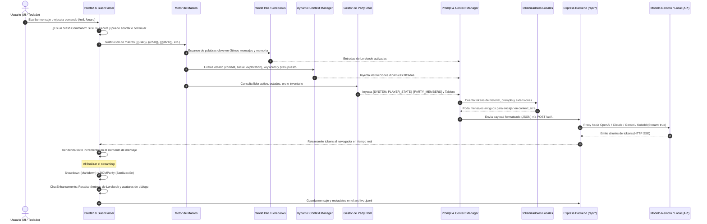

# Ciclo de Vida del Prompt & Pipeline de Generación

El proceso que transforma la interacción del usuario en una respuesta contextualizada de la IA es el núcleo de SillyTavern. En este fork enriquecido con mecánicas de juego de rol (RPG), este pipeline incorpora capas avanzadas de evaluación de estado de campaña, presupuesto de tokens, inyección de fichas D&D y telemetría de combate.

---

## 1. Diagrama del Pipeline Completo

---

## 2. Desglose Fase por Fase

### Fase 1: Entrada y Evaluación de Comandos de Barra (Slash Commands)
- El usuario ingresa texto en `#send_textarea`.
- Si comienza con `/` (ej. `/roll 1d20+5`, `/party heal 10`, `/goto Campamento`), se transfiere a `public/scripts/slash-commands.js`.
- El comando puede mutar el estado del juego (ej. actualizar la vida de un miembro del grupo en `party.js`), emitir un mensaje de sistema en el chat o inyectar texto en el flujo de envío regular.

### Fase 2: Expansión de Macros
- Se evalúan cadenas dinámicas mediante `substituteParams()` en `public/scripts/macros.js`:
  - `{{user}}`: Nombre actual del usuario o del líder del grupo activo.
  - `{{char}}`: Nombre del personaje activo.
  - `{{persona}}`: Descripción de la personalidad del usuario.
  - `{{location}}`: Nombre de la localización actual de la campaña.
  - `{{date}}`, `{{time}}`, `{{random::a,b,c}}`, `{{getvar::variable_name}}`.

### Fase 3: Activación de Lorebooks (World Info)
- `public/scripts/world-info.js` analiza los últimos $N$ mensajes del chat configurados (`scan_depth`).
- Si encuentra palabras clave primarias o secundarias coincidentes, activa las entradas correspondientes.
- Las entradas se ordenan por prioridad (`insertion_order`) y se ubican según la estrategia seleccionada (al inicio del contexto, antes del historial o intercaladas a una profundidad específica).

### Fase 4: Filtrado del Dynamic Context Manager
- `public/scripts/dynamic-context-manager.js` toma el relevo:
  - Lee el estado actual de la campaña (`currentState`: `combat`, `exploration`, `social`, `rest`, `stealth`, `travel`, `shopping`).
  - Filtra las reglas e instrucciones que coinciden con dicho estado o con los personajes participantes.
  - Aplica el **presupuesto de tokens** (`tokenBudget`): si la suma de instrucciones supera el límite configurado (por ejemplo, 1500 tokens), poda las instrucciones de menor prioridad.

### Fase 5: Inyección de Ficha D&D y Entorno Táctico
- En `public/script.js::addPersonaDescriptionExtensionPrompt()`:
  1. Si hay grupo, inyecta el bloque `[SYSTEM: PLAYER_STATE]` con HP actual/máximo, EXP, Nivel, Monedas, Inventario y Condiciones activas del líder.
  2. Inyecta el bloque `[SYSTEM: PARTY INFORMATION]` detallando los aliados presentes.
  3. Inyecta `[LOCATION_BOARD_CONTEXT]` describiendo el mapa actual, el plano de cuadrícula y las coordenadas `(X, Y)` de cada token o monstruo visible.
  4. Inyecta la Nota de Autor (`Author's Note`) con su profundidad de inserción asignada.

### Fase 6: Tokenización, Poda y Plantilla de Instrucción
- Se utilizan bibliotecas WASM locales (`tiktoken` para modelos OpenAI, `sentencepiece` para Llama/Mistral, o tokenizadores de Claude) para calcular el peso exacto de cada bloque.
- Si el contexto total supera el límite del modelo (`max_context_length - max_tokens_to_generate`), se eliminan los mensajes más antiguos del chat (estrategia FIFO), conservando siempre intactos los primeros mensajes si están fijados (pinned).
- Se aplica la plantilla de instrucción (`src/prompt-converters.js`): se envuelven los roles en los delimitadores requeridos (ej. `<|im_start|>system...<|im_end|>` para ChatML).

### Fase 7: Transporte y Streaming (SSE)
- El cliente envía la petición HTTP `POST` a los endpoints correspondientes de Express (ej. `/api/openai/generate`).
- El backend reenvía la petición al proveedor con cabeceras de streaming.
- Los paquetes recibidos se transfieren al cliente usando Server-Sent Events (`text/event-stream`).
- `public/scripts/sse-stream.js` captura los chunks y actualiza el texto del mensaje en la pantalla letra por letra.

### Fase 8: Post-Procesamiento y Persistencia
1. **Showdown.js** compila Markdown a HTML.
2. **DOMPurify** limpia el HTML contra ataques de script inyectados por el modelo.
3. **ChatEnhancements (`public/scripts/chat-enhancements.js`)**:
   - Escanea el texto renderizado buscando nombres de entidades de Lorebook y genera un hipervínculo con tooltip (``).
   - Identifica diálogos entrecomillados y antepone el avatar circular del personaje correspondiente.
4. Se serializa la conversación y los metadatos en disco mediante `POST /api/chats/save`.

---

## 3. Enlaces Relacionados
- [[Dynamic-Context-Manager]]: Lógica matemática de filtrado y control de presupuesto de tokens.
- [[Sistema-Party]]: Estructura de las variables del grupo inyectadas en el prompt.
- [[Conectores-IA]]: Compatibilidad de modelos y diferencias de tokenizadores.
- [[Chat-Enhancements]]: Mecanismo de post-procesamiento visual del chat.
