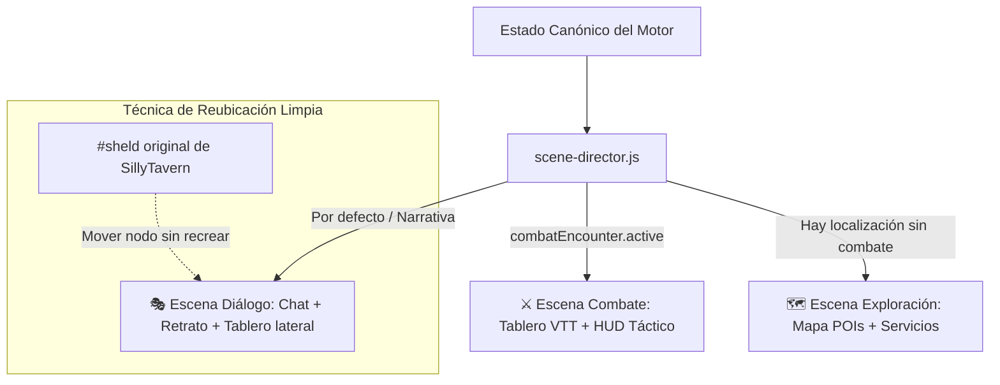

# Frontend Estructura & Ecosistema de Cliente

Este documento describe la arquitectura de la interfaz de usuario de SillyTavern situada en `public/`, su estructura DOM en `index.html`, los patrones de interacción en JavaScript vanilla y jQuery, las hojas de estilo y la integración de las interfaces del motor RPG / D&D.

---

## 1. Topología del Directorio Frontend (`public/`)

```
public/
├── index.html               # Documento DOM monolítico principal (10.840 líneas)
├── script.js                # Orquestador central de la aplicación (12.794 líneas)
├── style.css                # Estilos base del sistema e interfaz de usuario
├── login.html               # Formulario de inicio de sesión para modo multi-usuario
│
├── css/                     # Capas de estilos modulares
│   ├── campaigns.css        # Tarjetas de campaña y panel de selección en bienvenida (2.438 líneas)
│   ├── game-shell.css       # Layout y escenas a pantalla completa del Modo Videojuego
│   ├── dnd-character.css    # Ficha de personaje D&D, inventario, ranuras y estados (1.330 líneas)
│   ├── world-map.css        # Contenedor zoomable de mapas, niebla y tokens (2.026 líneas)
│   ├── dynamic-context-manager.css # Modal y reglas de contexto dinámico (355 líneas)
│   ├── chat-enhancements.css# Tooltips de entidades y avatares inline en chat (149 líneas)
│   ├── st-tailwind.css      # Utilidades pre-generadas de estilo Tailwind
│   └── ...
│
├── lib/                     # Bibliotecas de terceros cargadas sin empaquetador
│   ├── jquery-3.5.1.min.js  # Motor de selección y manipulación del DOM
│   ├── jquery-ui.min.js     # Soporte de arrastre (drag-and-drop) y redimensionado
│   ├── toastr.min.js        # Notificaciones emergentes
│   ├── select2.min.js       # Menús desplegables con búsqueda integrada
│   └── eventemitter.js      # Bus de eventos desacoplado
│
└── scripts/                 # Módulos ES funcionales (más de 80 archivos)
    ├── game-engine/         # Motor RPG modular, desacoplado y con tests en Node.js
    │   ├── ui/shell/        # Game Shell: director de escenas, pantalla de título, pausa
    │   │   ├── game-shell.js     # Contenedor raíz y transiciones cinemáticas
    │   │   ├── scene-director.js # Orquestador canónico de cambio de escena
    │   │   ├── welcome-title.js  # Pantalla de título de videojuego
    │   │   └── pause-menu.js     # Menú de pausa (Esc) con opciones de juego
    │   ├── combat/          # Combate táctico a 0 tokens: turnos, IA enemiga, papeles, botín, jefes
    │   ├── board/           # Tablero determinista, cuadrícula A*, niebla, terreno vivo
    │   ├── rules/           # Reglas: paquete de reglas, habilidades, grimorio, modos, heridas
    │   ├── campaign/        # La campaña: tiempo, gremio, encargos, casos, crónica, mascota
    │   ├── world/           # Viaje, estaciones y crecimiento del mundo
    │   ├── world-builder/   # Generadores: mazmorras, tableros con intención, mundos con IA
    │   └── compendio/       # La biblioteca de contenido de public/compendio/
    ├── party.js             # Gestor de grupo RPG, ficha D&D e inventario (19.006 líneas)
    ├── dnd-system.js        # Lógica matemática D&D 5e, slots, dados y modificadores (1.230 líneas)
    ├── dynamic-context-manager.js # Gestor de contexto dinámico y tokens (998 líneas)
    ├── campaigns.js         # Vista de campañas por mundos y sesiones de chat (1.723 líneas)
    ├── world-map-renderer.js# Motor de renderizado de mapas con zoom y cuadrícula (1.336 líneas)
    ├── world-content-popups.js # Formularios emergentes de entidades D&D (1.110 líneas)
    ├── chat-enhancements.js # Resaltado de lorebook y avatares de diálogo en chat (661 líneas)
    ├── active-instructions.js # Inyector de instrucciones personalizadas en el prompt (279 líneas)
    ├── slash-commands.js    # Parser y ejecutor de comandos de barra `/`
    ├── world-info.js        # Editor y evaluador de Lorebooks
    ├── popup.js             # Sistema unificado de diálogos modales (Popup)
    └── ...
```

---

## 2. Anatomía del DOM Monolítico (`index.html`)

A diferencia de las SPAs contemporáneas que montan componentes bajo demanda, `public/index.html` contiene el esqueleto completo de todos los paneles, cajones (drawers), modales y plantillas ocultas embebidos en el marcado estático:

```mermaid
graph TD
    Body[body.no-blur]
    Body --> TopBar[#top-bar: Barra superior de accesos rápidos]
    Body --> TopSettings[#top-settings-holder: Cajones retráctiles]
    
    subgraph Cajones_Drawers [Cajones de Configuración]
        TopSettings --> LeftNav[#left-nav-panel: Parámetros de Samplers & Presets]
        TopSettings --> RightNav[#right-nav-panel: Ajustes de interfaz y extensiones]
        TopSettings --> CharPanel[#character-management-panel: Listado y edición de personajes]
    end
    
    Body --> ChatHolder[#chat: Contenedor principal de mensajes]
    ChatHolder --> MessageTemplate[Plantillas de mensaje: .mes / .mes_text]
    
    Body --> FormHolder[#form_sheld: Área de entrada de texto del usuario]
    FormHolder --> SendArea[#send_textarea & Botones de envío / impersonar / regenerar]
    
    Body --> ModalsHolder[Modales y Diálogos Superpuestos]
    subgraph RPG_Modals [Nuevas Interfaces del Motor RPG]
        ModalsHolder --> PartyDrawer[#party_drawer: Barra de estado del grupo en vivo]
        ModalsHolder --> DndCharSheet[#dnd_character_modal: Ficha D&D interactiva]
        ModalsHolder --> WorldMapModal[#world_map_modal: Visor de mapas y tableros]
        ModalsHolder --> DynCtxModal[#dynamic_context_modal: Panel de contexto dinámico]
        ModalsHolder --> DiceRollOverlay[#combat_dice_overlay: Animación de dados de combate]
    end
```



### Plantillas Ocultas (`display: none`)
Muchos componentes reutilizables existen como elementos ocultos en `index.html` que jQuery clona mediante `.clone()` cuando se requiere una nueva instancia (ej. `#entry_edit_template` para entradas de lorebook, o filas de inventario).

---

## 3. Arquitectura del Orquestador (`script.js`)

`script.js` es el punto neurálgico del cliente. Exporta las variables de estado reactivo global consumidas por todos los módulos auxiliares:

- `chat`: Array de objetos que contiene el historial de mensajes de la conversación abierta.
- `chat_metadata`: Objeto de metadatos persistido en la primera línea del archivo JSONL.
- `characters`: Catálogo en memoria de todas las tarjetas de personaje cargadas.
- `this_chid`: Identificador del personaje actualmente seleccionado.
- `selected_group`: Identificador del grupo si el chat es multifuncional.
- `eventSource`: Instancia de `EventEmitter` para la señalización asíncrona de eventos.

### Inicialización de los Módulos del Fork RPG
Al final de la rutina `firstLoadInit()` en `script.js`, se inicializan los subsistemas de juego creados en este fork:

```javascript
// public/script.js (Línea ~765)
initPartyPanel();              // Monta la UI del grupo y restaura estado desde chat_metadata
initActiveInstructions();      // Registra observadores de instrucciones de usuario
initDynamicContextManager();   // Arranca la máquina de estados de campaña
initChatEnhancements();        // Conecta el observador de mutación para lorebook y avatares
```

---

## 4. Pipeline de Inyección del Estado de Personaje y Grupo

Cuando se prepara una petición para enviar a la IA en `script.js` (función `addPersonaDescriptionExtensionPrompt`), el sistema evalúa si existe un grupo RPG activo:

```javascript
// public/script.js (Línea ~3137)
const partyLeader = getActivePartyLeader();

if (partyLeader) {
    // Si hay un líder de grupo, sus estadísticas D&D reemplazan la persona global
    const playerStateLines = [
        '[SYSTEM: PLAYER_STATE]',
        `HP: ${partyLeader.hp ?? 0}/${partyLeader.maxHp ?? 0}`,
        `EXP: ${partyLeader.xp ?? 0}/${partyLeader.xpNext ?? 0}`,
        `Nivel: ${partyLeader.level ?? 1}`,
        `Oro: ${partyLeader.gold ?? 0}`,
        `Plata: ${partyLeader.silver ?? 0}`,
        `Cobre: ${partyLeader.copper ?? 0}`,
        `Inventario: ${partyLeader.inventory || ''}`,
        `Estado: ${partyLeader.conditions || ''}`,
    ].join('\n');

    setExtensionPrompt('PERSONA_PLAYER_STATE', playerStateLines, extension_prompt_types.IN_PROMPT, 0, false, extension_prompt_roles.SYSTEM);
}

// Inyección del resumen del resto de miembros del grupo
const partyDescription = getPartyDescription();
if (partyDescription) {
    setExtensionPrompt('PARTY_MEMBERS', `[SYSTEM: PARTY INFORMATION]\n${partyDescription}`, extension_prompt_types.IN_PROMPT, 0, false, extension_prompt_roles.SYSTEM);
}

// Inyección de ubicación geográfica y tablero táctico
const currentLocName = chat_metadata?.['currentLocation'] || '';
const currentBoardName = chat_metadata?.['currentBoard'] || '';
if (currentLocName || currentBoardName) {
    // Inyecta contexto de tablero y posición de tokens
}
```

---

## 5. Renderizado de Mensajes y Sanitización

El ciclo de presentación de mensajes de chat opera bajo las siguientes etapas:

1. **Recepción del Texto Crudo**: Llega vía streaming SSE o como bloque final.
2. **Transformación Markdown**: **Showdown.js** procesa negritas, cursivas, tablas y bloques de código con extensiones personalizadas (`showdown-exclusion.js`, etc.).
3. **Desinfección (Sanitización)**: **DOMPurify** limpia el HTML resultante para filtrar etiquetas potencialmente maliciosas (`<script>`, `<iframe>`, etc.).
4. **Inserción en el DOM**: Se inyecta en el elemento `.mes_text` correspondiente.
5. **Post-Procesamiento (`chat-enhancements.js`)**:
   - Escanea el texto en busca de palabras clave activas de Lorebooks y las envuelve en etiquetas `<span class="wi-highlight">` con tooltips informativos.
   - Detecta diálogos entre comillas e inserta pequeños avatares flotantes indicando quién pronuncia cada frase.

---

## 6. 🎮 El Modo Videojuego (Game Shell) & Director de Escenas

A través del comando `/modojuego` (o arrancando con el modo habilitado), SillyTavern oculta los cajones técnicos y se transforma en un videojuego cinemático de tres escenas gestionado por `public/scripts/game-engine/ui/shell/`:



### A. Reubicación Dinámica de `#sheld` (Sin Duplicar el Chat)
Para conservar el 100% de la compatibilidad con el streaming de texto, swipes, expresiones regulares, macros y adjuntos de SillyTavern, el Shell **no recrea** la interfaz de conversación:
- Localiza el elemento contenedor `#sheld` (que aloja `#chat` y `#form_sheld`).
- Mediante JavaScript nativo, traslada el nodo DOM `#sheld` al panel izquierdo de la **Escena de Diálogo**.
- Al salir del modo videojuego, `#sheld` vuelve exactamente a su posición jerárquica original en `index.html`.

### B. El Orquestador de Escenas (`scene-director.js`)
El director de escena **obedece al motor de juego canónico**, no a la prosa libre del LLM:
- **Combate (`combat`)**: Se activa si `combatEncounter.active === true` o si hay un tablero táctico activo en confrontación.
- **Exploración (`exploration`)**: Se activa cuando el grupo viaja a una localización geográfica en el mapa pero no está en cuadrícula de batalla.
- **Diálogo (`dialogue`)**: Escena por defecto para conversar con el narrador y los acompañantes. En pantallas panorámicas, reserva el 50% derecho para mostrar el tablero táctico o la ilustración de la sala en tiempo real.

### C. Pantalla de Título & Menú de Pausa
- **Pantalla de Título (`welcome-title.js`)**: Portada inmersiva con fondo temático, botones de *Nueva Campaña*, *Continuar Partida* y *Configuración*, cubriendo la interfaz de bienvenida de SillyTavern.
- **Menú de Pausa (`pause-menu.js`)**: Al pulsar `Esc`, se despliega un menú transparente que permite pausar la música, editar la campaña con `/campana`, revisar las reglas con `/rules`, o salir al menú principal.

---

## 7. Enlaces Relacionados
- [[Arquitectura-General]]: Visión sistémica global.
- *ANALISIS_FALLAS_JUGABLES_Y_SOLUCIONES*: Diagnóstico lúdico y soluciones de diseño.
- [[PROPUESTA_FRONTEND_MODO_JUEGO]]: Documento de diseño original del Game Shell (Fase H).
- [[Ciclo-De-Vida-Prompt]]: Flujo detallado desde la pulsación de tecla hasta la respuesta del LLM.
- [[Sistema-Party]]: Estructura interna de `party.js` y gestión del grupo.
- [[Campanas-Mapas-Tableros]]: Mecánicas del renderizador de mapas en `world-map-renderer.js`.
- *PROBLEMAS_TECNICOS*: Análisis de rendimiento DOM y vulnerabilidades de interpolación.
