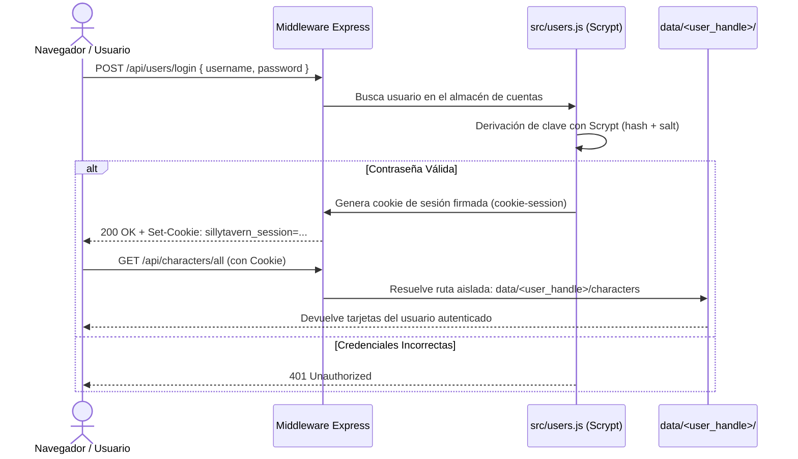

# Seguridad, Autenticación & Aislamiento de Datos

SillyTavern está diseñado primariamente como una herramienta de uso local en un solo dispositivo, pero cuenta con capacidades completas para despliegues multi-usuario y exposición en redes locales o públicas.

Este documento examina las defensas implementadas, el modelo de autenticación, la gestión de sesiones y los vectores de riesgo que deben ser considerados por administradores y desarrolladores.

---

## 1. Modelo de Autenticación y Cuentas de Usuario

El archivo `src/users.js` gestiona el ciclo de vida de los usuarios cuando la opción `enableUserAccounts` está habilitada en `config.yaml`:



### Características del Sistema de Cuentas:
1. **Hash Criptográfico de Contraseñas**: Utiliza **Scrypt** nativo de Node.js (`crypto.scrypt`), un algoritmo resistente a ataques por fuerza bruta mediante GPU y ASIC.
2. **Firmado de Sesiones**: Las cookies se firman con una clave secreta aleatoria generada en el primer arranque y guardada en `data/cookie-secret.txt`.
3. **Integración con Proveedores SSO**: Soporta cabeceras de autenticación delegada de proxies inversos corporativos como **Authelia** (`Remote-User`) y **Authentik**.
4. **Aislamiento por Directorios**: El middleware `setUserDataMiddleware` garantiza que cada petición sólo tenga visibilidad sobre la carpeta `data/<handle>/` del usuario autenticado.

---

## 2. Defensas de Red y Protección Contra Ataques

1. **Protección Anti-CSRF (`csrf-sync`)**:
   - Para evitar que páginas web de terceros ejecuten acciones en nombre del usuario local (Cross-Site Request Forgery), todas las peticiones `POST`, `PUT` y `DELETE` requieren un token sincronizado (`X-CSRF-Token`).
   - El token se genera en el servidor y se inyecta en el cliente durante el apretón de manos inicial.

2. **Filtrado por Lista Blanca de IPs (`src/middleware/whitelist.js`)**:
   - Si `whitelistMode: true` está configurado, el servidor rechaza cualquier conexión cuya IP no esté explícitamente listada en `whitelist` (soporta rangos CIDR en IPv4 e IPv6).

3. **Protección contra Host Header Injection (`src/middleware/hostWhitelist.js`)**:
   - Valida que la cabecera `Host` de la petición coincida con las direcciones autorizadas en `config.yaml`, previniendo ataques de envenenamiento de caché o redirecciones maliciosas.

4. **Prevención de Directory Traversal (`src/middleware/validateFileName.js`)**:
   - Limpia y valida nombres de archivo mediante `sanitize-filename` y comprueba que ninguna ruta resuelta escape de su directorio padre autorizado mediante `isPathUnderParent()`.

---

## 3. Vectores Críticos de Riesgo y Vulnerabilidades

A pesar de las capas de defensa, existen aspectos críticos que requieren atención inmediata (ver análisis completo en [[PROBLEMAS_TECNICOS]]):

### A. Deshabilitación de Content Security Policy (CSP)
En `src/server-main.js`:
```javascript
app.use(helmet({
    contentSecurityPolicy: false,
}));
```
- **Causa**: SillyTavern y sus extensiones dependen de la carga dinámica de scripts, estilos en línea y evaluación de plantillas.
- **Riesgo**: La ausencia de CSP significa que cualquier script inyectado con éxito en el DOM se ejecutará con todos los privilegios de la sesión del usuario.

### B. Sanitización en el Renderizado del Chat
- El chat utiliza **DOMPurify** tras compilar con Showdown.js.
- **Riesgo**: Si un usuario importa una tarjeta de personaje o un Lorebook malicioso de un repositorio público que contenga código JavaScript ofuscado, un fallo de configuración en las reglas de DOMPurify podría desencadenar ejecución remota de código en el cliente (XSS).

### C. Almacenamiento de Claves de API en Texto Plano (`secrets.json`)
- Las API keys de OpenAI, Claude, Google, etc. se almacenan en formato JSON plano en `data/default-user/secrets.json`.
- **Riesgo**: Cualquier usuario o proceso con acceso de lectura local al sistema de archivos puede sustraer las claves sin necesidad de desencriptación.

### D. Interpolación Insegura en Componentes Visuales del Fork
- En `public/scripts/world-map-renderer.js` (línea ~898), las etiquetas de tokens y avatares se concatenan directamente a plantillas jQuery sin escapar (`${token.name}`, `${token.avatar}`).
- **Riesgo**: Nombres de personajes con comillas o etiquetas HTML pueden provocar XSS en el navegador.

---

## 4. Enlaces Relacionados
- [[Backend-Express]]: Middleware de seguridad y ciclo de peticiones.
- [[Almacenamiento-Persistencia]]: Estructura de carpetas seguras por usuario.
- [[PROBLEMAS_TECNICOS]]: Diagnóstico en profundidad de las fallas de seguridad identificadas.
- [[PROPUESTAS_MEJORA]]: Propuestas para cifrado en reposo y CSP estricta.
