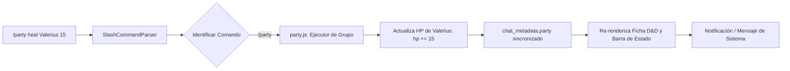

# Sistema de Slash Commands & Motor de Macros

SillyTavern incorpora un motor de scripting completo que permite automatizar flujos, ejecutar lógica condicional, interactuar con la interfaz e intervenir en el estado de la partida directamente desde la caja de texto del chat o desde botones programables.

En este fork, el sistema se utiliza intensivamente para controlar el motor D&D mediante comandos dedicados para tiradas de dados, curación de personajes, gestión de equipamiento y alternancia de estados tácticos.

---

## 1. Arquitectura del Parser de Comandos (`slash-commands/`)

El sistema de comandos de barra se estructura bajo un diseño orientado a objetos en `public/scripts/slash-commands/`:

```
public/scripts/slash-commands/
├── SlashCommandParser.js      # Lexer y parser sintáctico de cadenas
├── SlashCommand.js            # Clase base para la definición de comandos
├── SlashCommandArgument.js    # Definición de tipos y validación de argumentos
├── SlashCommandEnumValue.js   # Soporte para argumentos de enumeración fija
└── SlashCommandClosure.js     # Soporte para bloques de código y subrutinas { ... }
```

### Tipos de Argumentos Soportados (`ARGUMENT_TYPE`)
- `STRING`: Cadenas de texto plano o entrecomilladas (`"cadena con espacios"`).
- `NUMBER`: Valores numéricos enteros o decimales.
- `BOOLEAN`: Banderas lógicas (`true`/`false`, `on`/`off`).
- `VARIABLE`: Nombres de variables internas guardadas en memoria o metadatos.
- `CLOSURE`: Bloques de código ejecutables `{ comando1; comando2 }` para estructuras como `/if`, `/while` o callbacks.
- `ENUM`: Lista restringida de opciones con autocompletado en el editor.

---

## 2. Comandos Clave del Motor RPG / D&D

El fork registra comandos especializados en `party.js`, `dynamic-context-manager.js` y `dnd-system.js`:



### Catálogo de Comandos D&D
1. **Gestión de Salud y Estado (`/party`)**:
   - `/party heal [nombre] [cantidad]`: Restaura puntos de golpe al personaje.
   - `/party damage [nombre] [cantidad]`: Aplica daño, reduciendo HP y evaluando estados de inconsciencia si llega a 0.
   - `/party addxp [nombre] [cantidad]`: Añade experiencia; si supera `xpNext`, sube de nivel y recalcula puntos de vida máximos.
   - `/party addgold [cantidad]`: Modifica el inventario de monedas del grupo (oro, plata, cobre).
   - `/party condition [nombre] [condicion]`: Aplica o retira estados alterados (ej. *Envenenado*, *Cegado*, *Aturdido*).

2. **Tiradas de Dados Animadas (`/roll` y `/dnd`)**:
   - `/roll 1d20+5`: Ejecuta una tirada d20 sumando el bonificador, envía el resultado al chat como mensaje de sistema y dispara el overlay de animación de dados (`combatDiceOverlayElement`).
   - `/dnd check [nombre] [habilidad]`: Realiza una prueba de característica con el modificador de la ficha.
   - `/dnd attack [nombre] [arma]`: Realiza tirada de ataque contra la Clase de Armadura (AC) del objetivo.

3. **Control Táctico del Dynamic Context (`/dynctx`)**:
   - `/dynctx state [idle|combat|exploration|social|stealth|rest]`: Cambia inmediatamente la máquina de estados de la campaña. Al entrar en `combat`, el gestor activa las reglas e instrucciones de combate en el siguiente prompt.
   - `/dynctx budget [tokens]`: Ajusta dinámicamente el presupuesto máximo de tokens para instrucciones.

4. **Navegación de Mapas y Tableros (`/map` y `/board`)**:
   - `/map goto [nombre_lugar]`: Desplaza al grupo a una nueva ubicación, actualiza `currentLocation` y carga el mapa correspondiente.
   - `/board set [nombre_tablero]`: Carga la cuadrícula táctica y posiciona los tokens.
   - `/board move [token_id] [x] [y]`: Mueve un personaje o enemigo en la cuadrícula de combate.

---

## 3. Comandos Esenciales de SillyTavern

Además de los comandos RPG, el sistema base ofrece herramientas avanzadas de control de flujo:
- `/echo [texto]`: Imprime texto localmente en la interfaz.
- `/sys [texto]`: Inserta un mensaje del sistema en el chat.
- `/gen`: Dispara manualmente una generación de la IA.
- `/swipe [next|prev|index]`: Cambia de alternativa de respuesta generada.
- `/setvar [nombre] [valor]` / `/getvar [nombre]`: Almacena y recupera variables persistentes.
- `/if left=[val] right=[val] rule=[eq|ne|gt|lt] then={ ... } else={ ... }`: Ejecución condicional de bloques.
- `/while left=[val] right=[val] rule=[eq|ne] do={ ... }`: Bucles de ejecución para scripts complejos.

---

## 4. El Motor de Macros (`public/scripts/macros.js`)

Las macros permiten interpolar variables dinámicas en cualquier mensaje, prompt del sistema o entrada de Lorebook mediante la sintaxis `{{nombre_macro}}`:

| Macro | Valor que Retorna |
| :--- | :--- |
| `{{user}}` | Nombre del usuario activo o del líder del grupo RPG. |
| `{{char}}` | Nombre del personaje activo en el chat. |
| `{{persona}}` | Descripción de la personalidad del usuario o resumen del líder D&D. |
| `{{model}}` | Identificador del modelo de lenguaje en uso (ej. `gpt-4o`, `claude-3-5-sonnet`). |
| `{{date}}` / `{{time}}` | Fecha y hora actual del sistema o del mundo simulado. |
| `{{random::opción1,opción2,opción3}}` | Selecciona aleatoriamente una de las opciones especificadas. |
| `{{pick::clave::elemento}}` | Selector determinista de listas. |
| `{{getvar::mi_variable}}` | Obtiene el valor de una variable creada con `/setvar`. |
| `{{location}}` | Nombre de la localización activa de la campaña. |
| `{{hp}}` / `{{maxHp}}` | Vida actual y máxima del líder del grupo. |

> [!TIP]
> Las macros pueden anidarse: `{{getvar::{{random::clave1,clave2}}}}` resolverá primero la macro interna aleatoria y luego recuperará la variable correspondiente.

---

## 5. Enlaces Relacionados
- [[Ciclo-De-Vida-Prompt]]: Sustitución de macros durante la construcción del prompt.
- [[Sistema-Party]]: Modificación del estado del grupo mediante `/party`.
- [[Dynamic-Context-Manager]]: Transición de estados con `/dynctx`.
- [[Campanas-Mapas-Tableros]]: Movimiento de tokens con `/board move`.
