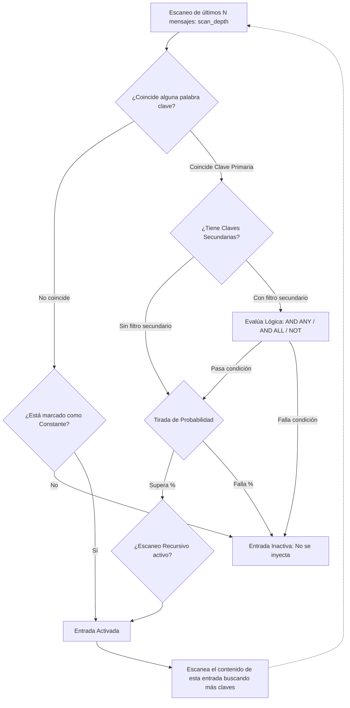

# World Info & Lorebooks (Libros del Mundo)

El sistema de **World Info (Lorebooks)** de SillyTavern es una base de datos asociativa que introduce información contextual sobre el universo narrativo sólo cuando es relevante, optimizando el consumo de tokens en la ventana de contexto.

En este fork (`danieljhesseling/SillyTavern`), el Lorebook tradicional ha sido ampliado sustancialmente para convertirse en el **repositorio maestro de entidades de rol**, albergando fichas D&D, monstruos, facciones, objetos mágicos, mapas de mundo y tableros de combate.

---

## 1. Mecánica de Activación y Lógica Booleana

Cada entrada en un Lorebook define una serie de reglas de activación evaluadas en cada turno:



### Modos de Clave y Lógica
1. **Claves Primarias (`key`)**: Lista de términos que disparan la entrada al aparecer en los mensajes recientes (ej. `["Goblin", "Trasgo"]`). Admite expresiones regulares delimitadas por barras `/.../i`.
2. **Claves Secundarias (`secondary_keys`)**: Reglas de filtrado complementarias:
   - `AND ANY`: Requiere la clave primaria Y al menos una secundaria.
   - `AND ALL`: Requiere la clave primaria Y todas las secundarias especificadas.
   - `NOT ANY`: Se activa con la primaria a menos que esté presente alguna secundaria.
3. **Entradas Constantes (`constant: true`)**: Se inyectan siempre, sin importar el contenido del chat.
4. **Escaneo Recursivo (`recursive_scanning`)**: Permite que el texto de una entrada activada despierte a otras entradas vinculadas (creando redes de relaciones semánticas).

---

## 2. Posicionamiento en el Contexto

Las entradas activadas se ordenan por su peso (`insertion_order`) y se posicionan según la estrategia configurada:
- **Al inicio del Prompt (Top of Context)**: Ideal para reglas generales de mundo.
- **Antes del Historial de Chat**: Proporciona contexto previo a los diálogos.
- **In-Chat Depth (Profundidad @ D)**: Intercala la entrada $D$ mensajes atrás del último turno, obligando al LLM a prestar máxima atención debido al sesgo de proximidad (recency bias).

---

## 3. Extensión RPG: El Esquema `dndData`

En este fork, las entradas tradicionales de World Info han sido enriquecidas con un objeto estructurado `dndData`. Esto permite que una entrada no sea solo un párrafo de texto, sino una entidad viva para el motor de juego:

```typescript
interface DndWorldEntryData {
  entityType: 'character' | 'npc' | 'monster' | 'race' | 'class' | 'faction' | 'location';
  name: string;
  avatar?: string;
  cr?: string;                     // Challenge Rating (Monstruos)
  hp?: number;
  maxHp?: number;
  armorClass?: number;
  speed?: number;
  abilities?: {
    str: number;
    dex: number;
    con: number;
    int: number;
    wis: number;
    cha: number;
  };
  // Para ubicaciones y mapas:
  mapUrl?: string;
  locationMapUrl?: string;
  boards?: Array<{
    name: string;
    imageUrl: string;
    gridSize: number;
    tokens: Array<{ id: number; name: string; x: number; y: number; avatar: string }>;
  }>;
}
```

### Funciones de Acceso Globales en `public/scripts/world-info.js`:
El fork exporta utilidades reactivas para consultar estos datos en cualquier parte de la aplicación:
- `getCurrentWorldMapUrl()`: Obtiene la imagen del mapa general del mundo vinculado al chat.
- `getCurrentWorldLocationMaps()`: Lista los planos de ciudades, mazmorras o regiones.
- `getCurrentWorldBoards()`: Devuelve los tableros tácticos con cuadrícula de combate.
- `getCurrentWorldEnemies()`: Extrae los monstruos y adversarios declarados en el Lorebook.
- `getCurrentWorldNPCs()`: Proporciona los personajes no jugadores con sus fichas completas.

---

## 4. Integración Visual y UX

1. **Navegador de Contenido del Mundo (`world-content-browser.js`)**:
   - Panel dedicado para explorar visualmente monstruos, PNJs, facciones y lugares del Lorebook sin editar el JSON crudo.
2. **Formularios Especializados (`world-content-popups.js`)**:
   - Modales de interfaz enriquecida con campos D&D 5e: tiradas de salvación, competencias de habilidad, escuelas de magia, costes en oro y dados de daño.
3. **Resaltado en Chat (`chat-enhancements.js`)**:
   - Las palabras clave activas del Lorebook se subrayan automáticamente en los mensajes del chat, desplegando un tooltip con la descripción, imagen y estadísticas al pasar el cursor.

---

## 5. Enlaces Relacionados
- [[Ciclo-De-Vida-Prompt]]: Fase de escaneo y activación en el pipeline.
- [[Campanas-Mapas-Tableros]]: Vinculación de mapas y tableros declarados en el Lorebook.
- [[World-Content-Popups]]: Formularios de creación de entidades D&D.
- [[Chat-Enhancements]]: Mecánica de subrayado visual y previsualización.
