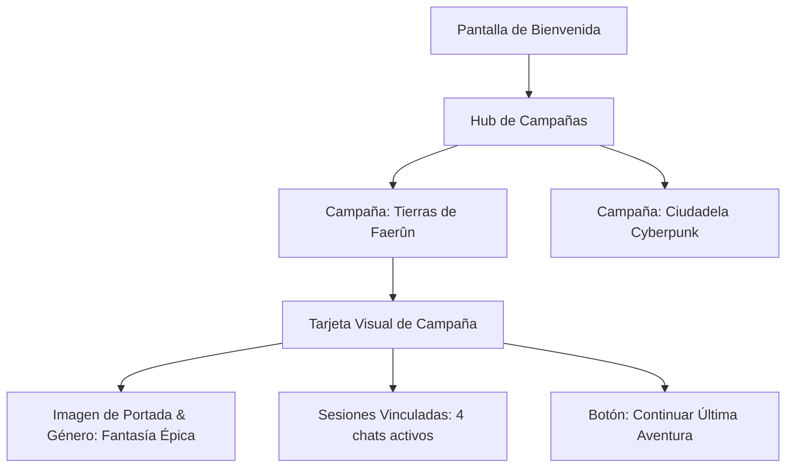
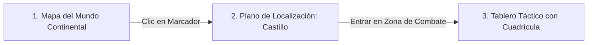

# Campañas, Mapas de Mundo & Tableros Tácticos

Este documento describe la suite de visualización espacial y gestión de campañas conformada por `public/scripts/campaigns.js` y `public/scripts/world-map-renderer.js`. Esta capa dota a SillyTavern de capacidades propias de un **Tablero Virtual (Virtual Tabletop - VTT)** como Roll20 o Foundry VTT.

---

## 1. El Hub de Campañas (`public/scripts/campaigns.js`)

El gestor de campañas reorganiza el panel de bienvenida (`welcomePanel.html`) para transformar chats aislados en sagas estructuradas por mundos:



- **Agrupación Automática**: Inspecciona los metadatos de los últimos 100 chats (`fetchRecentChatsWithMetadata`) y los clasifica según su `world_info`.
- **Información Visual**: Presenta la portada del mundo (`coverImage`), etiqueta de género, número de sesiones y fecha del último turno jugado.
- **Acceso Inmediato**: Hacer clic en una tarjeta abre directamente la última sesión o permite desplegar el selector de sesiones históricas.

---

## 2. El Motor de Mapas Zoomable (`world-map-renderer.js`)

El motor gráfico implementa un contenedor dinámico con soporte completo para navegación fluida mediante ratón o gestos táctiles (`createZoomableContainer`):

- **Zoom Dirigido por Cursor**: La rueda del ratón (`wheel`) amplía o reduce la imagen centrando la escala exactamente en las coordenadas relativas del puntero.
- **Arrastre y Panning**: Permite desplazar mapas de alta resolución (4K/8K) con baja sobrecarga de CPU utilizando aceleración por hardware (`transform: translate(...) scale(...)`).
- **Límites de Zoom**: Escala configurable entre `0.5x` (visión global) y `6.0x` (inspección detallada de tokens).

---

## 3. Niveles de Navegación Espacial

El sistema soporta una jerarquía espacial de tres niveles:



### Nivel 1: Mapa del Mundo (World Map)
- Muestra la geografía completa del reino o planeta.
- Contiene chinchetas y marcadores interactivos (POIs) que representan ciudades, fortalezas o ruinas.
- Al hacer clic en un marcador, el grupo viaja geográficamente a dicho destino, actualizando `chat_metadata.currentLocation`.

### Nivel 2: Mapa de Localización (Location Map)
- Planos de asentamientos, distritos urbanos o mapas de superficie de mazmorras.
- Muestra puntos clave y conexiones con otros mapas o tableros interiores.

### Nivel 3: Tableros Tácticos de Combate (Tactical Boards)
- Diseñados específicamente para resolver escaramuzas y encuentros bélicos.
- **Cuadrícula Superpuesta (Grid)**: Ajuste dinámico del tamaño de celda (ej. 50px por casilla estándar de 5 pies).
- **Colocación de Tokens**:
  - Cada miembro del grupo, aliado, PNJ o monstruo enemigo se representa mediante una ficha circular con su avatar y nombre.
  - Los tokens pueden ser arrastrados y soltados en cualquier celda de la cuadrícula.
- **Panel de Coordenadas**: Panel lateral retráctil que lista todos los personajes en el mapa y permite modificar con precisión numérica sus coordenadas `X` e `Y`.

---

## 4. Niebla de Guerra (Fog of War)

Para preservar el misterio en mazmorras y áreas inexploradas, el visor integra una capa de niebla de guerra:
- Áreas no descubiertas por los jugadores permanecen oscurecidas por una máscara semitransparente o negra.
- A medida que los tokens se mueven, el radio de visión revela el entorno circundante, actualizando el mapa en memoria.

---

## 5. Inyección Contextual en el Prompt del LLM

Para que la IA sea plenamente consciente de la situación táctica y espacial, `public/script.js` compila el estado del mapa y lo inyecta como contexto del sistema:

```text
[SYSTEM: LOCATION AND TACTICAL BOARD CONTEXT]
Ubicación actual: Ruinas del Templo Olvidado
Tablero activo: Salón del Trono en Ruinas
Tokens en el tablero:
- Valerius (Guerrero - Nivel 3): Posición (X: 4, Y: 8)
- Lyra (Maga - Nivel 3): Posición (X: 2, Y: 7)
- Goblin Arquero 1: Posición (X: 10, Y: 4) [Distancia: ~35 pies]
- Líder Goblin: Posición (X: 12, Y: 3) [Distancia: ~45 pies]
```

Con esta información, el modelo de lenguaje describe los ataques considerando rangos de movimiento, coberturas y distancias físicas reales sin perder la coherencia espacial.

---

## 6. Enlaces Relacionados
- [[Sistema-Party]]: Miembros del grupo representados como tokens en el tablero.
- [[WorldInfo-Lorebooks]]: Definición de mapas y tableros en el esquema `dndData`.
- [[Dynamic-Context-Manager]]: Activación de estado `combat` al desplegar el tablero.
- [[PROPUESTA_FRONTEND_MODO_JUEGO]]: Escenarios a pantalla completa de combate y exploración (Game Shell).
- [[ROADMAP_JUEGO_SIN_COMANDOS]]: Movimiento táctico A* y selección de objetivos point-and-click.
- [[PROBLEMAS_TECNICOS]]: Análisis de seguridad por interpolación de nombres de tokens en `world-map-renderer.js`.
