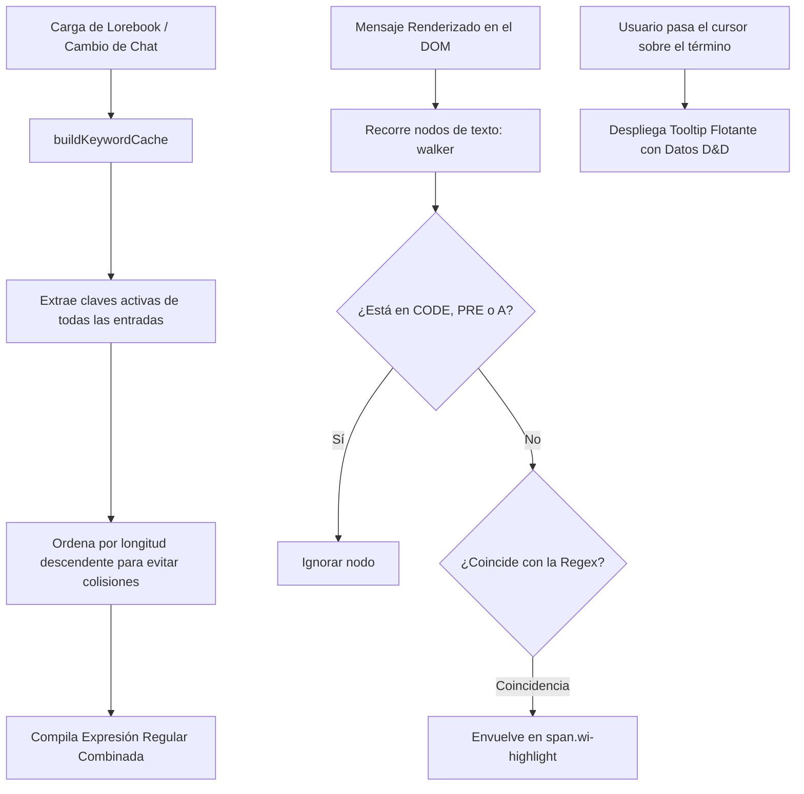

# Chat Enhancements (Mejoras Visuales del Chat)

El módulo `public/scripts/chat-enhancements.js` enriquece la experiencia visual de lectura en el chat mediante dos intervenciones automáticas sobre los mensajes renderizados:
1. **Subrayado y Tooltips de Entidades de Lorebook**: Detecta términos del mundo en el texto y permite previsualizar su lore e imagen al pasar el cursor.
2. **Avatares de Diálogo en Línea**: Identifica quién está hablando en las líneas de diálogo entrecomilladas y coloca el avatar circular del personaje junto al texto.

---

## 1. Resaltado de Entidades de Lorebook (World Info Highlighting)

### Anatomía del Tooltip Flotante (`tooltipEl`)
Al posar el cursor sobre una palabra resaltada (ej. `Goblin`, `Espada Larga`, `Castillo de Neverwinter`), el tooltip muestra:
- **Icono / Miniatura**: Avatar de la entidad.
- **Tipo de Entidad**: Monstruo, Objeto Mágico, Facción, etc.
- **Resumen Estadístico**: AC, HP o descripción esencial.
- **Extracto Descriptivo**: Primeros 220 caracteres del contenido del Lorebook.

---

## 2. Avatares de Diálogo en Línea (Speech Avatars)

En novelas interactivas y partidas con múltiples personajes (Group Chats o grupos RPG), distinguir quién está hablando en párrafos largos de texto narrativo puede resultar confuso.

El módulo analiza las oraciones entre comillas (`"..."`, `“...”`, `«...»`):
1. Examina el contexto inmediato anterior o posterior en busca del nombre del personaje (ej. *«—¡Cuidado con la trampa!— gritó Valerius.»*).
2. Si encuentra coincidencia con un miembro del grupo (`partyMembers`) o personaje de la conversación:
   - Inyecta un pequeño avatar circular (``) justo al lado de la comilla de apertura.
   - Aplica un sutil sombreado de color acorde a la facción o alineamiento del personaje.

---

## 3. Caché de Palabras Clave y Gestión de Rendimiento

Para no penalizar el rendimiento del navegador durante el desplazamiento del chat:
- **Caché Singleton**: La lista de palabras clave se almacena en el mapa `keywordEntryMap`.
- **Compilación Perezosa**: La expresión regular sólo se recompila cuando se modifican los Lorebooks (`WORLDINFO_UPDATED`) o se cambia de mundo.
- **Exclusión de Etiquetas (`SKIP_TAGS`)**: El algoritmo omite deliberadamente bloques de código (`<code>`, `<pre>`), hipervínculos (`<a>`), campos de texto y scripts para no alterar el código formateado.

> [!WARNING]
> Como se señala en *PROBLEMAS_TECNICOS*, el uso del límite de palabra `\b` en la expresión regular combinada falla con términos que contienen apóstrofes o caracteres especiales (ej. *D'Artagnan*, *El'Druin* o palabras acentuadas en español).

---

## 4. Enlaces Relacionados
- [[WorldInfo-Lorebooks]]: Fuente de las claves y entidades resaltadas.
- [[Frontend-Estructura]]: Ciclo de renderizado de mensajes en el DOM.
- [[Sistema-Party]]: Miembros del grupo reconocidos en los diálogos en línea.
- *PROBLEMAS_TECNICOS*: Análisis de rendimiento de expresiones regulares masivas.
