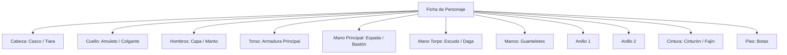

# Mecánicas D&D 5e, Items & Equipamiento

El módulo `public/scripts/dnd-system.js` implementa las matemáticas, reglas y estructuras de datos oficiales de **Dungeons & Dragons 5ª Edición**, adaptadas para interactuar con modelos de lenguaje y la interfaz de usuario.

---

## 1. Fórmulas y Matemáticas Centrales

### A. Modificadores de Característica
Para cualquiera de las seis puntuaciones básicas (Fuerza, Destreza, Constitución, Inteligencia, Sabiduría, Carisma):
$$\text{Modificador} = \left\lfloor \frac{\text{Puntuación} - 10}{2} \right\rfloor$$

```javascript
// public/scripts/dnd-system.js
export function getAbilityModifier(score) {
    const s = Number(score) || 10;
    return Math.floor((s - 10) / 2);
}
```

### B. Capacidad de Carga y Sobrecarga
- **Carga Máxima Estándar**: $\text{Fuerza} \times 15 \text{ libras}$.
- **Sobrecarga (Encumbrance)**: Si el peso total supera $\text{Fuerza} \times 5 \text{ lbs}$, la velocidad se reduce en 10 pies. Si supera $\text{Fuerza} \times 10 \text{ lbs}$, la velocidad se reduce en 20 pies y se tiene desventaja en tiradas de ataque y salvaciones basadas en Fuerza, Destreza o Constitución.

### C. Cálculo Dinámico de Clase de Armadura (AC)
El sistema evalúa el modo de destreza de la armadura equipada (`armorDexMode`):
- **Armadura Ligera (`full`)**: $\text{AC} = \text{Base} + \text{Modificador de Destreza}$.
- **Armadura Media (`max_2`)**: $\text{AC} = \text{Base} + \min(\text{Modificador de Destreza}, 2)$.
- **Armadura Pesada (`none`)**: $\text{AC} = \text{Base}$ (no suma Destreza; puede requerir Fuerza mínima para no penalizar velocidad).
- **Escudo (`off_hand`)**: Otorga $+2$ a la AC.

---

## 2. Ranuras de Equipamiento (`EQUIPMENT_SLOTS`)

El personaje dispone de ranuras anatómicas de equipo donde los objetos pueden ser equipados activamente:



---

## 3. Modelo de Datos del Objeto (`DndItem`)

Los objetos en el inventario no son simples cadenas de texto, sino entidades de datos ricas:

```typescript
interface DndItem {
  id: string;                          // Identificador alfanumérico generado
  name: string;                        // Nombre del objeto
  type: 'weapon' | 'armor' | 'gear';   // Tipo principal
  category?: 'weapon' | 'armor' | 'gear' | 'magic' | 'mount_vehicle_trade';
  subcategory?: string;                // Ej. 'martial_melee', 'heavy_armor', 'potion'
  slot: string | null;                 // Ranura de equipamiento requerida
  image: string;                       // Imagen gráfica o icono
  weight: number;                      // Peso unitario en libras (lbs)
  description: string;                 // Texto descriptivo o lore
  rarity?: 'Common' | 'Uncommon' | 'Rare' | 'Very Rare' | 'Legendary' | 'Artifact';
  
  // Propiedades de Armas
  damageDice?: string;                 // Ej. '1d8', '2d6'
  damageType?: string;                 // 'slashing', 'piercing', 'bludgeoning', etc.
  properties?: string;
  finesse?: boolean;                   // Permite usar Destreza en vez de Fuerza
  heavy?: boolean;
  light?: boolean;                     // Habilita combate con dos armas
  reach?: boolean;                     // Alcance +5 pies
  twoHanded?: boolean;                 // Ocupa ambas manos
  versatile?: boolean;                 // Puede usarse a una o dos manos
  versatileDamage?: string;            // Ej. '1d10'
  range?: number;                      // Rango normal (ej. 30 ft)
  longRange?: number;                  // Rango con desventaja (ej. 120 ft)

  // Propiedades de Armaduras
  baseArmorClass?: number;             // Ej. 14 para Cota de Malla
  armorDexMode?: 'full' | 'max_2' | 'none';
  stealthDisadvantage?: boolean;       // Desventaja en Sigilo al portarla
  strengthRequirement?: number;        // Fuerza mínima requerida

  // Propiedades Mágicas y Consumibles
  magical?: boolean;
  magicalBonus?: number;               // Ej. +1, +2, +3
  attunement?: boolean;                // Requiere sintonización (máximo 3)
  cursed?: boolean;                    // Objeto maldito
  consumable?: boolean;                // Se destruye al usarse
  uses?: number;                       // Cargas restantes
  maxUses?: number;                    // Cargas máximas
  recharge?: string;                   // Tasa de recarga (ej. 'dawn', 'short_rest')
  effects: Array<{ stat: string; modifier: number }>; // Modificadores directos a atributos
}
```

---

## 4. Operaciones de Inventario

1. **Equipar (`equipItem`)**:
   - Comprueba si el objeto es compatible con la ranura.
   - Si la ranura está ocupada, desequipa automáticamente el objeto previo.
   - Si el arma es `twoHanded`, vacía automáticamente la mano secundaria (`off_hand`).
   - Aplica los efectos de modificadores (`applyEquipmentEffects`) al personaje.
2. **Consumir (`consumeItemInInventory`)**:
   - Para pociones, pergaminos o raciones: reduce el contador de `uses`.
   - Si llega a 0 y es `consumable`, retira el objeto del inventario o lo marca como agotado.
3. **Sintonización (Attunement)**:
   - D&D 5e restringe la sintonización a un máximo de 3 objetos mágicos simultáneos por personaje. El sistema valida este límite antes de conceder las propiedades mágicas activas.

---

## 5. Enlaces Relacionados
- [[Sistema-Party]]: Estructura de `partyMembers` que contiene los ítems equipados.
- [[World-Content-Popups]]: Modales interactivos para crear y editar objetos mágicos y armas.
- [[Dynamic-Context-Manager]]: Notificación al LLM del equipamiento portado por el grupo.
