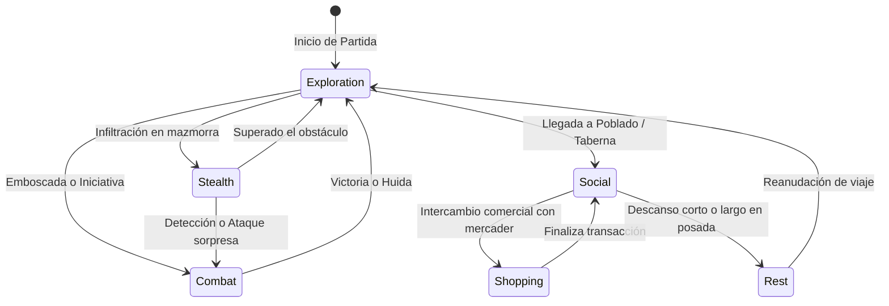
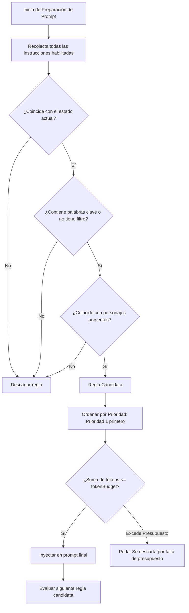

# Dynamic Context Manager (Gestor de Contexto Dinámico)

El **Dynamic Context Manager** (`public/scripts/dynamic-context-manager.js`) es uno de los subsistemas más sofisticados añadidos en este fork. Resuelve el problema fundamental de la degradación de contexto y el desperdicio de tokens en partidas de rol complejas con LLMs.

En lugar de inyectar todas las reglas, descripciones de PNJs, objetivos de misiones e instrucciones de combate en cada turno, el gestor evalúa dinámicamente el **estado de la campaña**, las palabras clave recientes y los personajes presentes para filtrar y presupuestar las instrucciones enviadas a la IA.

---

## 1. Máquina de Estados de Campaña (`CAMPAIGN_STATES`)

El contexto se modula a través de estados semánticos que representan la situación actual de los aventureros:



Los estados definidos en el código son:
- `idle`: Estado neutro o conversacional estándar.
- `combat`: Combate activo; activa reglas de iniciativa, turnos, AC y tiradas de daño.
- `exploration`: Exploración de terreno, trampas, acertijos y navegación de mapas.
- `social`: Diálogos diplomáticos, investigación, persuasión e intimidación.
- `rest`: Descanso corto o prolongado; recuperación de HP y espacios de conjuro.
- `stealth`: Acciones encubiertas; exige tiradas enfrentadas de Sigilo vs Percepción Pasiva.
- `travel`: Viaje prolongado en mundo abierto; eventos climáticos y encuentros aleatorios.
- `shopping`: Negociación económica; lista de precios y regateo según el Carisma.

---

## 2. Modelo de Datos de Instrucción Dinámica (`DynamicInstruction`)

```typescript
interface DynamicInstruction {
  id: string;                          // Identificador único
  label: string;                       // Título descriptivo visible en UI
  text: string;                        // Texto literal inyectado en el prompt
  enabled: boolean;                    // Activa / Inactiva
  category: 'combat' | 'relationship' | 'quest' | 'location' | 'item' | 'lore' | 'rules' | 'npc' | 'custom';
  priority: number;                    // 1 (Crítica) a 10 (Accesoria)
  targetCharacters: string[];          // Se activa sólo si estos personajes están presentes
  excludeCharacters: string[];         // Se desactiva si estos personajes están presentes
  keywords: string[];                  // Palabras clave que disparan la regla en mensajes recientes
  states: string[];                    // Estados de campaña en los que aplica (vacío = todos)
  groupOnly: boolean;                  // Sólo para chats grupales
  soloOnly: boolean;                   // Sólo para chats 1-a-1
  scanDepth: number;                   // Cuántos mensajes hacia atrás busca las palabras clave
  _tokenCache: number | null;          // Caché efímero del peso en tokens
}
```

---

## 3. Algoritmo de Presupuesto y Poda de Tokens

Para evitar rebasar la ventana de contexto o encarecer innecesariamente las llamadas a la API, el gestor impone un límite estricto de tokens (`tokenBudget`, por defecto 1500 tokens):



### Código de Evaluación (Extracto Conceptual):
```javascript
// public/scripts/dynamic-context-manager.js
const sorted = candidates.sort((a, b) => a.priority - b.priority);
let usedTokens = 0;
const activePrompts = [];

for (const instr of sorted) {
    const cost = await getTokenCountAsync(instr.text);
    if (usedTokens + cost <= campaignState.tokenBudget) {
        usedTokens += cost;
        activePrompts.push(instr);
    } else {
        console.log(`DynamicContext: Instrucción '${instr.label}' podada por límite de presupuesto.`);
    }
}
```

---

## 4. Interfaz de Usuario y Métricas en Tiempo Real

El gestor dispone de una ventana de configuración (`#dynamic_context_modal` estilizada en `dynamic-context-manager.css`):
- **Selector de Estado Rápido**: Botones tipo "chip" para conmutar entre `combat`, `exploration`, etc. con un solo clic.
- **Medidor de Presupuesto en Vivo**: Barra de progreso visual que muestra cuántos tokens de los asignados (ej. `840 / 1500`) están siendo consumidos actualmente por las reglas activas.
- **Editor de Reglas**: Formularios modales para crear nuevas instrucciones con asignación de prioridades, palabras clave y condiciones de personajes.

---

## 5. Enlaces Relacionados
- [[Ciclo-De-Vida-Prompt]]: Momento exacto de inyección en el prompt final.
- [[Campanas-Mapas-Tableros]]: Cambio automático a estado `combat` al colocar tokens en un tablero.
- [[SlashCommands-Macros]]: Control del estado mediante `/dynctx state`.
- [[PROBLEMAS_TECNICOS]]: Recomendaciones de optimización del conteo asíncrono de tokens.
