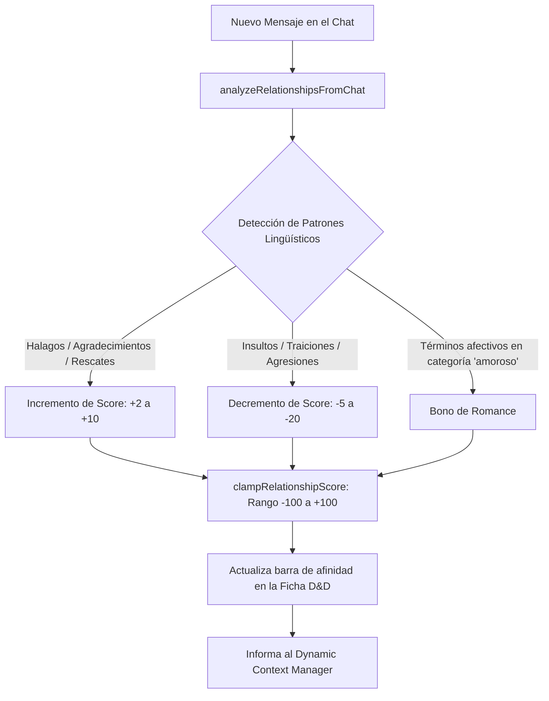

# Sistema de Relaciones & Memorias de Personaje

En las campañas de rol prolongadas, la interacción social, la lealtad, los romances y las rivalidades entre compañeros y PNJs son tan determinantes como el combate.

El módulo `public/scripts/dnd-system.js` en conjunción con `public/scripts/party.js` introduce un **sistema dinámico de afinidad y recuerdos persistentes** que rastrea cómo evolucionan los vínculos afectivos entre los aventureros y los personajes del mundo.

---

## 1. El Modelo de Relación (`DndRelationship`)

Cada miembro del grupo mantiene una colección de relaciones con otros personajes:

```typescript
interface DndRelationship {
  characterName: string;               // Nombre del personaje destino
  characterAvatar: string;             // Avatar gráfico
  category: 'normal' | 'amoroso' | 'familiar'; // Eje de la relación
  score: number;                       // Puntuación de afinidad (-100 a +100)
  type?: 'ally' | 'rival' | 'friend' | 'enemy' | 'neutral' | 'romantic' | 'family';
  description?: string;                // Resumen narrativo del vínculo
  lastInteraction: string;             // Marca de tiempo o nota del último suceso
}
```

### Escala de Puntuación y Rangos de Afinidad
El valor numérico está acotado estrictamente entre $-100$ y $+100$ mediante la función `clampRelationshipScore()`:

| Rango de Score | Clasificación | Comportamiento Típico en Diálogo |
| :---: | :--- | :--- |
| **$-100$ a $-60$** | **Hostil / Enemigo** | Desconfianza absoluta, hostilidad verbal, negativa a cooperar. |
| **$-59$ a $-20$** | **Rival / Frío** | Distancia emocional, desacuerdos frecuentes, escepticismo. |
| **$-19$ a $+19$** | **Neutral** | Trato profesional o pragmático sin afecto particular. |
| **$+20$ a $+59$** | **Amigo / Compañero** | Confianza mutua, apoyo en combate, disposición a compartir recursos. |
| **$+60$ a $+89$** | **Aliado Cercano / Confidente**| Lealtad demostrada, confesión de secretos y vulnerabilidades. |
| **$+90$ a $+100$** | **Devoto / Amor Verdadero** | Dispuesto al autosacrificio mutuo; vínculo inquebrantable. |

---

## 2. Analizador de Diálogo en Chat (`analyzeRelationshipsFromChat`)

El sistema cuenta con un motor heurístico que evalúa los turnos de conversación para sugerir o aplicar variaciones en los lazos afectivos:



---

## 3. Sistema de Memorias y Recuerdos (`DndMemory`)

Para evitar que los eventos cruciales se pierdan en el olvido del modelo tras decenas de turnos, el sistema registra hitos narrativos estructurados:

```typescript
interface DndMemory {
  id: string;                          // Identificador único
  title: string;                       // Título corto del recuerdo
  description: string;                 // Resumen del hecho vivido
  timestamp: number;                   // Fecha del evento
  significance: 'minor' | 'major' | 'pivotal'; // Grado de impacto emocional
  participants: string[];              // Personajes involucrados
}
```

- **Memorias Pivotales (`pivotal`)**: Traumas, victorias épicas o pactos de sangre. Se inyectan con máxima prioridad en el prompt del sistema cuando los participantes están en escena.
- **Memorias Mayores (`major`)**: Misiones completadas o decisiones morales relevantes.

---

## 4. Visualización en la Ficha de Personaje

Dentro de la ficha D&D de cada miembro del grupo:
- Pestaña **"Relaciones"**: Muestra tarjetas visuales con el avatar del personaje, barra de afinidad coloreada (rojo para enemistad, azul para amistad, rosa/púrpura para romance) y selector de categoría.
- Pestaña **"Memorias"**: Línea de tiempo cronológica con los recuerdos registrados, permitiendo al usuario añadir o editar recuerdos manualmente.

---

## 5. Enlaces Relacionados
- [[Sistema-Party]]: Miembros del grupo que albergan las colecciones de relaciones y memorias.
- [[Dynamic-Context-Manager]]: Instrucciones de categoría `relationship` condicionadas al score.
- [[PROPUESTA_JUEGO_DND_GLOOMHAVEN_PERSONA]]: Sistema de vínculos Persona (Rangos 1-10) y perks mecánicas en combate.
- [[ROADMAP_JUEGO_SIN_COMANDOS]]: Fichas de confidente interactivas en el Party Strip y botones para pasar tiempo juntos.
- [[DND-Mecanicas-Items]]: Fórmulas y utilidades matemáticas en `dnd-system.js`.
