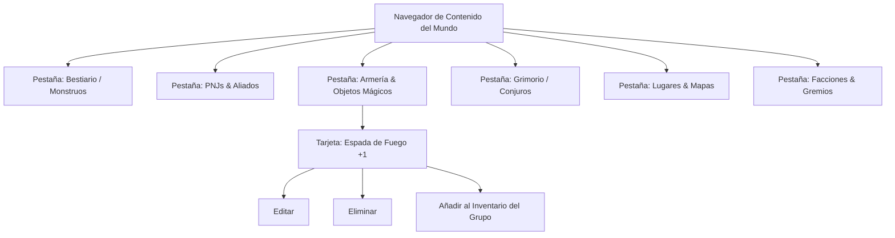

# World Content Popups & Navegador de Entidades

La gestión de entidades en un juego de rol de mesa requiere formularios especializados para manejar estadísticas complejas (escuelas de magia, dados de daño, modificadores, clases de armadura y competencias).

Los módulos `public/scripts/world-content-browser.js` y `public/scripts/world-content-popups.js` sustituyen la edición de texto plano tradicional en los Lorebooks por una **suite de formularios visuales enriquecidos** inspirada en interfaces modernas de software de rol (como Fable & Friends y D&D Beyond).

---

## 1. El Navegador de Contenido (`world-content-browser.js`)

El navegador proporciona una vista de cuadrícula organizada en pestañas según la naturaleza de la entidad:



- **Filtros Dinámicos**: Búsqueda por texto, filtrado por rareza (Común a Artefacto), categoría de objeto o Desafío de Monstruo (CR).
- **Acciones Rápidas**: Permite transferir un objeto directamente desde el Lorebook al inventario de un miembro del grupo con un solo clic.

---

## 2. Formularios Especializados por Tipo de Entidad (`world-content-popups.js`)

Al crear o editar una entidad, el sistema levanta un modal con campos adaptados a su categoría específica:

### A. Ficha de Monstruo / Adversario
- **Parámetros de Combate**: Puntos de Golpe (`HP`), Clase de Armadura (`AC`), Desafío (`CR`: desde `1/8` hasta `30`), Dados de Golpe (`Hit Dice`) y Velocidad (`Speed`).
- **Puntuaciones de Atributo**: Bloque completo de Fuerza, Destreza, Constitución, Inteligencia, Sabiduría y Carisma con cálculo automático del modificador visible.
- **Vulnerabilidades y Resistencias**: Selector multiselección con los 13 tipos de daño elementales (Ácido, Fuego, Frío, Fuerza, Necrótico, Radiante, etc.).

### B. Formulario de Armas y Armaduras
- **Armas**: Selector de dado de daño (`1d4`, `1d6`, `1d8`, `1d10`, `1d12`, `2d6`), tipo de daño (Cortante, Perforante, Contundente), propiedades especiales (Sutil, Pesada, Ligera, Dos Manos, Versátil, Arrojadiza) y alcance.
- **Armaduras**: Selección de tipo (`full`, `max_2`, `none`), valor base de AC, penalización de sigilo y requisito mínimo de Fuerza.
- **Objetos Mágicos**: Bonificador mágico (`+1`, `+2`, `+3`), requisito de sintonización (`Attunement`), efectos malditos y contador de cargas consumibles.

### C. Ficha de Conjuros (Spells)

> [!IMPORTANT]
> **Desde R4 (2026-09-26), esta ficha es solo lore.** Lo que se escribe aquí va al Lorebook para que el narrador lo conozca, pero **el motor no lo lanza**: los conjuros jugables viven en el grimorio, en código (`game-engine/rules/grimoire.js`, decisión DR3 de [[ROADMAP_PROFUNDIDAD]]). Una fila de datos con escuela o círculo se rechaza como habilidad.

- **Escuela de Magia**: Abjuración, Conjuración, Adivinación, Encantamiento, Evocación, Ilusión, Nigromancia, Transmutación.
- **Nivel de Conjuro**: Truco (Cantrip) o Nivel 1 al 9.
- **Componentes**: Verbales (V), Somáticos (S), Materiales (M) y descripción de costes.
- **Mecánicas**: Tipo de tirada de salvación (ej. Salvación de Destreza) o bonificador de ataque de conjuro.

---

## 3. Integración con el Sistema de Modales (`public/scripts/popup.js`)

Todos los formularios se montan sobre la clase `Popup` de SillyTavern, garantizando coherencia visual con el resto de la aplicación:

```javascript
// public/scripts/world-content-popups.js
const popup = new Popup(
    formHtml,
    POPUP_TYPE.CONFIRM,
    'wcp-modal-dialog',
    { okText: 'Guardar Entidad', cancelText: 'Cancelar' }
);

const result = await popup.show();
if (result === POPUP_RESULT.AFFIRMATIVE) {
    // Serializa los campos del formulario y actualiza la entrada en el Lorebook
}
```

---

## 4. Enlaces Relacionados
- [[WorldInfo-Lorebooks]]: Esquema donde se almacenan las entidades editadas.
- [[DND-Mecanicas-Items]]: Reglas aplicadas a los objetos creados en estos modales.
- [[Sistema-Party]]: Destino de los ítems y PNJs creados mediante este panel.
