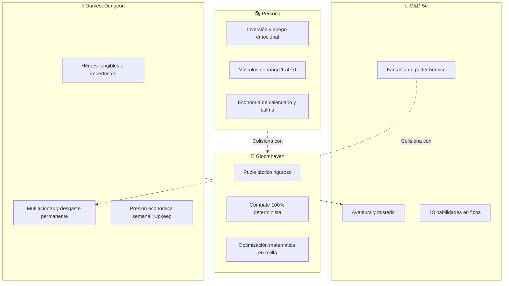

# ⚖️ Análisis Profundo de Fallas Jugables & Soluciones Sistémicas
## *Equilibrando D&D 5e, Gloomhaven, Persona y Darkest Dungeon en SillyTavern*

> [!NOTE]
> **Propósito de este documento**:
> Analizar la fricción lúdica y la disonancia ludonarrativa provocadas al fusionar cuatro géneros de rol con filosofías contradictorias, y formalizar las **soluciones de diseño sistémico (a 0 tokens)** para que el motor funcione como un videojuego orgánico, adictivo y sin callejones sin salida.
> 
> Complementa a [[PROPUESTA_JUEGO_DND_GLOOMHAVEN_PERSONA]], actualiza las prioridades en [[ROADMAP_MAESTRO]] y genera tareas activas en [[POR_HACER]].

---

## 🧭 1. El Diagnóstico Fundamental: El Choque de Cuatro Filosofías

El motor RPG de `my-silly` integra cuatro pilares de rol de excelencia, pero cada uno presupone una psicología de jugador distinta:



Si estos sistemas se conectan sin amortiguadores mecánicos, **se produce una canibalización mutua**. A continuación se detallan las 7 fallas lúdicas resultantes y cómo solventarlas mediante ingeniería de diseño.

---

## ⚠️ 2. Las 7 Fallas Jugables Críticas

### 1. La Disonancia Cruel: Afecto (*Persona*) vs. Mutilación Táctica (*Gloomhaven* / *Darkest Dungeon*)
* **Mecánica actual**: En `rules/injuries.js`, si un acompañante con vínculo afectivo cae a 0 PG, no muere permanentemente, pero sufre heridas mutilantes irreversibles (p. ej., pierna amputada con $-15$ de velocidad o $-2$ a destreza; mano perdida impidiendo armas a dos manos).
* **Falla de experiencia**: En *Persona*, el jugador invierte decenas de días de calendario en cultivar una relación (Rango 1 al 10). El jugador desarrolla **apego emocional real**. Pero en el combate táctico de cuadrícula (*Gloomhaven*), cada casilla y bonificador numérico son vitales.
  * Si tu acompañante favorito acumula una pierna rota y un ojo tuerto, **se convierte en un lastre táctico objetivo**.
  * El juego castiga al jugador con un dilema frustrante: **o dejas en la taberna al personaje que más quieres** para no perder combates, **o lo llevas a la batalla y te masacran** por culpa de sus penalizadores.
  * *Darkest Dungeon* funciona porque sus héroes son números desechables que reclutas en una diligencia; *Persona* funciona porque tus amigos son irremplazables.

### 2. El Abismo Ludonarrativo: Libertad Infinita en Chat vs. Rigidez Muda en Tablero
* **Mecánica actual**: El jugador alterna entre la ventana de conversación con el LLM y la cuadrícula táctica de combate.
* **Falla de experiencia**: El jugador tiene dos mentes desconectadas en la misma sesión:
  * **En el chat**: Siente libertad absoluta (*«Me balanceo en la soga, pateo el brasero hacia los ojos del orco y salto tras el arcón»*).
  * **En el tablero**: Esa creatividad desaparece. La interfaz solo ofrece: *clic para mover 4 casillas, clic en atacar con la espada corta (1d6+2), terminar turno*.
  * Si el jugador intenta ser creativo en el chat durante el combate, el motor determinista no procesa esa prosa. Y viceversa: lo que ocurre en la cuadrícula (flanqueos, derribos, esquivas críticas) no se narra en el chat de forma simultánea.

### 3. La Espiral de Quiebra del *Upkeep* (Falta de "Fail-Forward")
* **Mecánica actual**: `rules/upkeep.js` liquida semanalmente la cuenta de manutención (comida, hospedaje, tasas de guardia, sueldos de mercenarios). Si no se paga, los mercenarios contratados rehúsan acompañar al grupo (`companions.js`).
* **Falla de experiencia**: En D&D, el botín financia la aventura (comprar una espada flamígera o pergaminos). Al introducir facturas semanales sin un colchón narrativo:
  * Un combate desfavorable $\rightarrow$ personajes heridos $\rightarrow$ curarlos exige oro y días de cama $\rightarrow$ pasan los días sin ingresos $\rightarrow$ llega el viernes con cobro de posada $\rightarrow$ bancarrota $\rightarrow$ mercenarios en huelga.
  * **Resultado**: Un *softlock* psicológico. El juego se degrada a un simulador de angustia financiera medieval. Si la bancarrota termina en parálisis y no en nuevas tramas o acuerdos desesperados, el jugador abandona la partida.

### 4. El "Síndrome del Escaparate Vacío": Tableros Estáticos vs. Instanciación Contextual
* **Mecánica actual**: Las plantillas originales de mundo (`starter-templates.js`) tenían enemigos clavados en casillas fijas del tablero o escenarios vacíos sin vida.
* **Falla de experiencia**: **Un tablero nunca debe tener enemigos "pegados de fábrica" si no hay una misión o circunstancia activa**.
  * Un tablero de taberna debe ser un espacio social donde caminar entre bancos, interactuar con el tabernero y escuchar rumores. Solo si estalla una reyerta de bar, el motor debe generar hostiles contextualmente.
  * Una cripta visitada sin misión debe ser una ruina silenciosa para explorar. Si el jugador acepta un contrato de cazarrecompensas, esa misma cripta se puebla de muertos vivientes adaptados al nivel del grupo.
  * Los tableros con enemigos estáticos congelados destruyen la rejugabilidad y la sensación de mundo vivo.

### 5. El Aliado Suicida en Modo Solo (El Síndrome de la Misión de Escolta)
* **Mecánica actual**: En Modo Solo, el jugador controla únicamente a su héroe; los compañeros se desplazan y atacan mediante árboles algorítmicos deterministas basados en `enemy-ai.js`.
* **Falla de experiencia**: En *Gloomhaven*, la IA de los monstruos es predecible **para que el jugador la explote y anticipe sus movimientos**.
  * Pero cuando esa misma lógica algorítmica pilota a **tu propio compañero**, el jugador siente que sufre una **misión de escolta perpetua**.
  * Si Brand avanza por la ruta A* más corta hacia un arquero, recibe 2 ataques de oportunidad, pisa una trampa y sufre una mutilación permanente, el jugador no piensa *«qué valiente es Brand»*; piensa: *«el código del juego es inepto y me arruinó la partida»*.

### 6. Localidades como "Muros de Texto" sin Ecosistema Funcional
* **Mecánica actual**: Muchas localidades son contenedores narrativos (`locationMaps[]`) sin tableros o con fichas de texto estáticas.
* **Falla de experiencia**: Al llegar a un pueblo, el jugador desea afilar armas, comprar antídotos, rezar en un templo para retirar una maldición o buscar contratos.
  * Si no hay nodos mecánicos funcionales, el jugador recurre a teclearle al LLM: *«Voy al herrero y le compro una espada»*.
  * El LLM responderá: *«El herrero asiente y te entrega una espada por 10 monedas»*, pero **el oro del motor no disminuye, el inventario de la ficha no cambia y la forja no existe como entidad del juego**.

### 7. El Desierto de la Ficha: 18 Habilidades D&D Inútiles en el Diálogo
* **Mecánica actual**: La ficha de personaje calcula modificadores para Engaño, Persuasión, Atletismo, Sigilo, Percepción, etc.
* **Falla de experiencia**: En combate se usan la CA, los PG y el ataque. Pero en la escena social, **el 80% de la ficha es cosmético**.
  * Si un jugador con Carisma 8 y sin competencia escribe una prosa brillante, el LLM le otorga el éxito social.
  * Si un jugador construye un Bardo con Carisma 18 y maestría en Persuasión pero escribe una frase escueta, el LLM puede tratarlo con frialdad. Las decisiones de progresión de la ficha fuera del combate quedan desactivadas.

---

## 🛠️ 3. Catálogo de Soluciones Sistémicas (Arquitectura a 0 Tokens)

Para subsanar estas 7 fallas sin multiplicar el consumo de tokens ni rehacer el motor:

| Falla Actual | Solución Sistémica Propuesta | Implementación Técnica |
| :--- | :--- | :--- |
| **1. Compañero mutilado = lastre** | **Prótesis y Roles de Campamento** | Añadir prótesis mágicas/enanas que transforman el penalizador en una mecánica única, o permitir que el héroe mutilado asuma un rol pasivo en el Gremio/Campamento (Consejero, Intendente) otorgando ventajas a la party. |
| **2. Bipolaridad Chat / Tablero** | **Action Chips Tácticos & Epílogo Automático** | En combate, botones de acción contextual (`[Provocar]`, `[Empujar hacia trampa]`) que tiran en JS y aplican estados en la cuadrícula. Al terminar la batalla, un resumen estructurado automático dispara el epílogo narrativo del DM. |
| **3. Espiral de muerte por Upkeep** | **Mecánica de Deuda & Favores de Facción** | Si no hay oro el viernes, se activa un evento de bancarrota: una facción local o un usurero cubre la deuda a cambio de un contrato forzoso con dilema moral (*Fail-Forward*). La ruina abre misiones, no *Game Over*. |
| **4. Tableros con enemigos fijos** | **Desacoplamiento: Geometría vs. Spawners** | El tablero solo almacena terreno (`#`, `.`, `c`, puertas). Las entidades se instancian dinámicamente según la misión activa, el nivel del grupo y la hora del día (`spawnTable`). |
| **5. Aliado suicida en Modo Solo** | **Posturas de Compañero (Stances)** | Selector de 1 clic en la tarjeta del aliado: *Defensivo* (máximo a 2 casillas del líder), *Agresivo* (foco en el enemigo más cercano) o *Retaguardia* (mantener distancia y rango). |
| **6. Localidades vacías** | **Nodos de Servicios de Asentamiento** | Integrar en el esquema de localidad (`services: []`) accesos directos a Taberna, Forja, Alquimia, Templo y Tablón de Misiones con interacción real sobre el oro e inventario. |
| **7. Ficha ignorada en diálogo** | **Tiradas Sociales en Cliente** | El cliente detecta intenciones y ofrece botones con CD precalculada (`[Persuasión CD 12]`). El motor tira en JS y envía al modelo solo el resultado final: `[Éxito en Persuasión: 15 vs 12]`. |

---

## 🏗️ 4. Especificación Técnica de los Tres Nuevos Subsistemas

### 4.1. Desacoplamiento de Tableros & Spawning Dinámico
Los archivos de campaña y plantillas deben separar la capa física de la capa de encuentro:

```typescript
// Estructura desacoplada de Tablero
interface TacticalBoardDefinition {
  id: string;
  name: string;
  gridWidth: number;
  gridHeight: number;
  terrain: string[];                  // Mapa ASCII puro (#, ., c, ~, D)
  spawnPoints: {
    partyDefault: Array<{ x: number; y: number }>;
    ambushZones: Array<{ x: number; y: number }>;
    interactables: Array<{ x: number; y: number; type: 'chest' | 'lever' | 'altar' }>;
  };
  // NOTA: 'enemies' NO se guarda estáticamente aquí.
}

// Spawner invocado según contexto de la misión
interface MissionSpawnContext {
  missionId: string;
  dangerTier: 'low' | 'medium' | 'deadly';
  enemyTypes: string[];               // IDs leídas del Bestiario
  objectiveType: 'eliminate_all' | 'assassinate_target' | 'survive_rounds' | 'escape';
}
```

### 4.2. Nodos de Servicios de Localidad (`Settlement Services`)
Cada localidad registrada en `world_info` o en el mapa expone un abanico de servicios disponibles:

```typescript
type SettlementServiceType = 'tavern' | 'blacksmith' | 'apothecary' | 'temple' | 'job_board' | 'moneylender';

interface SettlementLocation {
  id: string;
  name: string;
  type: 'village' | 'town' | 'city' | 'keep' | 'sanctuary' | 'black_market';
  services: SettlementServiceType[];
  factionId?: string;
  wealthLevel: 1 | 2 | 3 | 4;
}
```

* **Taberna (`tavern`)**: Descanso corto/largo, comida para upkeep, reclutamiento y rumores de Lorebook.
* **Herrería (`blacksmith`)**: Compra/venta de armas, reparación y forja de prótesis mecánicas.
* **Boticario (`apothecary`)**: Pociones, antídotos y tratamiento médico para acelerar la curación de heridas (`daysLeft`).
* **Templo (`temple`)**: Sanación de heridas permanentes, curación de maldiciones y compra de agua bendita.
* **Prestamista (`moneylender`)**: Gestión de deuda cuando el Upkeep semanal no se puede saldar con fondos propios.

### 4.3. Posturas de Compañero en Modo Solo (`Companion Stances`)
En combate, cuando `mode === 'solo'`, el cálculo de A* y foco de los aliados se subordina a su postura activa:

1. **🛡️ Defensiva (Guardaespaldas)**:
   - Destino de movimiento: Celda vacía adyacente al jugador o entre el jugador y el enemigo más cercano.
   - Acción: Esquiva (*Dodge*) o ataque de oportunidad si un enemigo entra en su zona.
2. **⚔️ Agresiva (Carga)**:
   - Destino: Enemigo con menor CA o menor vida a su alcance.
   - Prioriza daño rápido.
3. **🏹 Retaguardia (Soporte / Rango)**:
   - Destino: Mantener una distancia de $4$ a $6$ casillas respecto al enemigo más cercano con línea de visión despejada.
   - Ataques a distancia o conjuros de apoyo.

---

## 🔗 Enlaces Relacionados
- [[HOME]]: Índice central de la wiki.
- [[ROADMAP_MAESTRO]]: Plan general por niveles donde se integran estas fases.
- [[POR_HACER]]: Tareas inmediatas de desarrollo.
- [[Campanas-Mapas-Tableros]]: Visualización espacial y VTT.
- [[DND-Mecanicas-Items]]: Reglas mecánicas D&D 5e e inventario.
- [[Frontend-Estructura]]: Arquitectura del Game Shell y director de escenas.
