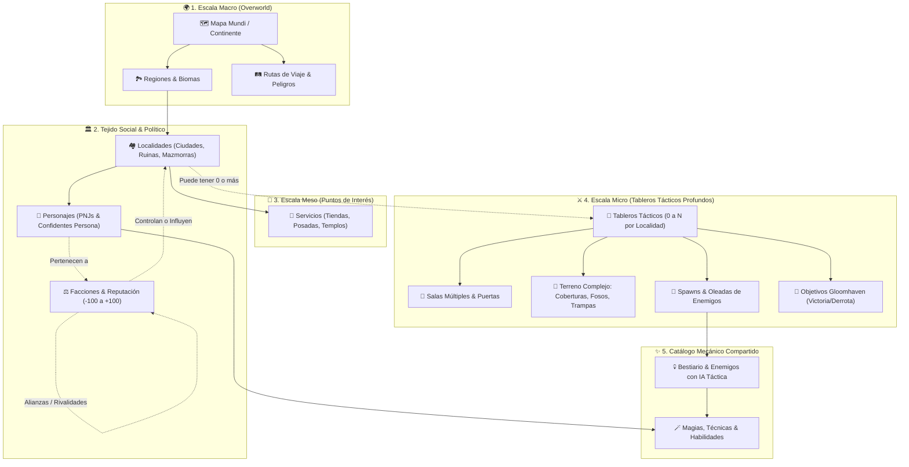
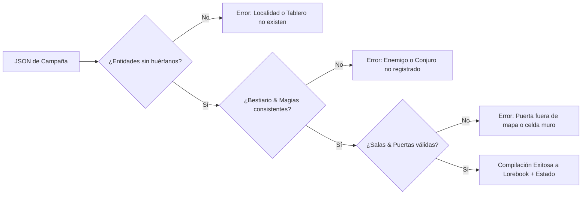

# 🌍 Diseño del Generador de Mundos Profundo
## *Estructuración de Campañas Vivas: De un JSON a una Aventura Completa (D&D + Persona + Gloomhaven)*

> **Objetivo**: Elevar el generador de campañas y mundos de una simple "sala con 2 o 3 monstruos" a un **ecosistema narrativo y táctico profundo**, estructurado mediante un esquema JSON riguroso. Este esquema permite que una IA (un Gem de Gemini, Claude o un modelo local) o un autor manual generen campañas multicapa con **Personajes**, **Enemigos**, **Mapa Mundi**, **Localidades**, **Tableros Tácticos Profundos**, **Facciones** y **Magias/Habilidades**.


---

## 📍 Lectura del 2026-09-23: qué de esto ya existe, y qué hay que corregir

Este es un documento de **diseño**. Lo que falta y en qué orden vive en **[[POR_HACER]]**, no aquí: un marcador metido en un documento de diseño se pudre en dos días, y ya ha pasado dos veces en esta wiki.

### Lo que el motor ya hace, y este documento puede dar por hecho

| Lo que propone | Estado real |
| :--- | :--- |
| Salas, puertas y niebla dinámica; los enemigos de una sala cerrada "duermen" y entran en iniciativa al abrirla | ✅ Hecho, y comprobado en navegador (paso 24 del recorrido) |
| Los 7 tipos de objetivo (`eliminate` … `loot`), principales y opcionales | ✅ Hechos, y editables sin tocar World Info |
| Cobertura ligera **+2 CA** y pesada **+5 CA** | ✅ Exactamente esos números, y por **línea de fuego**: lo que da cobertura es lo que hay entre tirador y objetivo |
| Reputación de −100 a +100 | ✅ Hecho y conectado: `economy.js` modifica precios, cobra peajes de camino y la memoria del mundo informa al narrador |
| Casi todas las reglas de validación cruzada de la sección 5 | ✅ Ya las aplica `campaign-pack.js`: rectangularidad, borde de muro, inicio del grupo en casilla transitable, enemigo que no está en el bestiario, misión que apunta a un tablero inexistente |
| Compilación a Lorebook + `chat_metadata` + Modo Juego (sección 7) | ✅ Es literalmente lo que hace el importador desde la Fase G |
| Localidades con 0, 1 o N tableros | ✅ Hecho en Fase A4: localidades puramente sociales/comerciales son válidas |
| Catálogo único de magias y habilidades | ✅ Hecho en D5: `rules/abilities.js` con panel `/habilidades` |

### Lo que hay que corregir antes de usarlo como contrato

1. **Los perfiles tácticos son cuatro, no seis.** El motor tiene `aggressive`, `skirmisher`, `guardian` y `coward`. `controller` y `sniper` **no existen**: un paquete que los pida se juega como `aggressive`. Antes lo hacía en silencio; desde el 2026-09-22 el validador **avisa** y nombra los que sí hay. *(De paso apareció un fallo real: el importador escribía `profile: "brute"`, que tampoco es un perfil del motor, así que **todo** enemigo sin perfil declarado se guardaba con una etiqueta falsa. Corregido.)*
2. **Los caracteres de terreno nuevos no existen.** `W` (agua), `L` (letal), `T` (trampa) y `^` (elevación) no los entiende el tablero: hoy los tipos de terreno son **código**, no datos (**P23**).
3. **No conviene un segundo esquema.** `campaign-pack-schema.js` no está escrito a mano: se **genera** desde el motor — los tipos de objetivo desde `scenarios.js`, los perfiles desde `enemy-ai.js`, los caracteres del mapa desde `terrain.js` — y eso es a propósito, porque el productor de los datos (tu Gem) vive fuera de este repositorio y un contrato copiado a mano se queda viejo en silencio. Un `DEEP_WORLD_SCHEMA` de 300 líneas en un `.md` es exactamente esa copia. **Lo que vale de aquí son los campos**; el sitio donde ponerlos es el esquema generado, ampliándolo.
4. **Los modelos citados son de otra época** y el fork es agnóstico de proveedor: `/esquema-campana` entrega el contrato para pegárselo a cualquier modelo, y la generación con IA ya funciona sin estar atada a Gemini.
5. **Los tableros NO deben guardar enemigos estáticos de fábrica.** La geometría del mapa nace limpia (`terrain.js`). Los enemigos se instancian contextualmente según la misión activa o la tabla de peligro del bioma (*ver [[ANALISIS_FALLAS_JUGABLES_Y_SOLUCIONES]] §4.1*). Clavar enemigos fijos a un mapa hace que los tableros se sientan como escaparates muertos.
6. **Las localidades requieren nodos de servicio explícitos (`services: []`).** Posada, herrería, boticario, templo, tablón y prestamista deben responder a botones funcionales con impacto real en oro, inventario y heridas (*[[ANALISIS_FALLAS_JUGABLES_Y_SOLUCIONES]] §4.2*).

### Lo que sí entra en el plan, y dónde

- **P18** a **P23**: rutas de viaje con tiempo y peligro, horarios de PNJ, interactuables, oleadas, fases de jefe y terreno nuevo.
- **A13** y **A14**: Desacoplar enemigos de tableros y nodos de servicio en localidades.

---

## 🏛️ 1. Arquitectura de Jerarquía y Relaciones

Para que el mundo no sea una colección inconexa de datos, cada entidad se articula en una jerarquía espacial, social y mecánica coherente:



---

## 🧩 2. Las 7 Categorías en Detalle

### Categoría 1: 👤 Personajes (PNJs, Aliados & Confidentes)
No son simples nombres estáticos. Dan vida a las localidades y proporcionan la dimensión social y de rol inspirada en *Persona* y *Baldur's Gate*.

* **Subtipos de Personaje**:
  * `companion`: Aliado reclutable para el grupo; combate a tu lado y estrecha lazos en el tiempo libre.
  * `confidant`: PNJ de apoyo social (tipo *Persona*); no entra en batalla física pero otorga **perks mecánicas** en combate a medida que sube su rango de vínculo (1 al 10).
  * `merchant`: Comerciante con inventario vinculado a una facción.
  * `quest_giver`: Personaje clave para activar tramas y contratos.
  * `nemesis`: Villano recurrente con motivaciones propias.
* **Propiedades Principales**:
  * **Identidad**: `id`, `name`, `title`, `personality`, `backstory`, `motivation`.
  * **Sistema de Vínculo Persona**: `arcana` (ej. *El Mago*, *La Sacerdotisa*, *El Emperador*), `initialBondPoints` (0 a 100) y `bondPerks` (habilidades activas/pasivas que desbloquea el grupo al alcanzar ciertos rangos).
  * **Mecánica D&D**: Clase, nivel, HP, CA, tiradas de salvación y estadísticas base (STR, DEX, CON, INT, WIS, CHA).
  * **Magias/Habilidades**: Lista de IDs que referencian al catálogo unificado (`spells_and_abilities`).
  * **Presencia Espacial & Horario (`schedule`)**: Localidad habitual (`locationId`) y ubicación por franja horaria (Mañana, Tarde, Noche).
  * **Hooks de Conversación**: Palabras clave para inyección de trasfondo en el Lorebook / World Info.

---

### Categoría 2: 💀 Enemigos (Bestiario, Élites & Jefes con IA)
Monstruos y antagonistas dotados de estadísticas D&D 5e y un perfil de inteligencia artificial táctica para el motor determinista.

* **Propiedades Principales**:
  * **Identidad & Desafío**: `id`, `name`, `type` (`humanoid`, `undead`, `beast`, `aberration`, `fiend`, `dragon`, `elemental`, etc.), `cr` (Desafío 0 a 20+), `xpValue`.
  * **Estadísticas de Combate**: `hp`, `maxHp`, `armorClass`, `speedFeet`, salvaciones y tiradas de ataque.
  * **Perfil Táctico de IA (`profile`)**:
    * `aggressive`: Carga directamente contra el enemigo más cercano o el más vulnerable en cuerpo a cuerpo.
    * `skirmisher`: Golpea a distancia o en carrera y busca activamente cobertura (`c` o `C`) al terminar su movimiento.
    * `guardian`: Se posiciona entre los enemigos a distancia y los personajes del jugador, bloqueando cuellos de botella y pasillos.
    * `coward`: Huye hacia la salida o busca refuerzos si sus puntos de vida bajan del 30%.
    * `controller`: Prioriza lanzar conjuros de control de área y aplicar estados (`stunned`, `restrained`, `blinded`).
    * `sniper`: Mantiene distancia máxima (60-120 ft) y ataca desde plataformas elevadas (`^`).

  > ⚠️ **Los dos últimos no existen en el motor.** Hay cuatro perfiles: `aggressive`, `skirmisher`, `guardian` y `coward`. Un paquete que pida `controller` o `sniper` se juega como `aggressive`, y el validador lo avisa. `controller` necesita magia (**D5**) y `sniper` necesita elevación (**P23**).
  * **Acciones & Ataques**: Rango (`attackRangeFeet`), bonificador de ataque, daño (`diceFormula` ej: `1d8+3`), tipo de daño (`slashing`, `piercing`, `fire`, etc.).
  * **Habilidades Mágicas / Marciales**: Referencias a IDs del catálogo `spells_and_abilities`.
  * **Defensas**: Resistencias, inmunidades y vulnerabilidades a tipos de daño.
  * **Fases de Jefe (`bossPhases`)**: Disparadores opcionales (ej. al 50% de HP o tras 3 rondas) que modifican su perfil táctico, aumentan su CA o desencadenan una habilidad legendaria.
  * **Tabla de Botín (`lootTable`)**: Monedas de oro garantizadas y lista de objetos con probabilidad porcentual de caída.

---

### Categoría 3: 🗺️ Mapa Mundi (World Map & Rutas de Viaje)
La capa geográfica superior que enmarca la campaña, conecta asentamientos y genera sensación de odisea.

* **Propiedades Principales**:
  * **Continente / Reino**: `id`, `name`, `overview`, `biomes` (bosques, desiertos, cordilleras, pantanos, tundras).
  * **Red de Viaje (Grafo de Rutas - `travelRoutes`)**:
    * Conexiones explícitas entre localidades (`originLocationId` $\leftrightarrow$ `destinationLocationId`).
    * `distanceDays` o `distanceHours`: Tiempo necesario para completar el trayecto (avanza el calendario del juego).
    * `dangerLevel` (1 a 5): Frecuencia e intensidad de tiradas de encuentro aleatorio durante el viaje.
    * `routeType`: Calzada real protegida, sendero montañoso traicionero, travesía marítima/fluvial o túnel del inframundo.
    * `costGold`: Peajes o coste de carruaje/barco.
  * **Factores Ambientales & Clima**: Clima predominante por región que puede influir en la visibilidad o velocidad de movimiento.
  * **Influencia Territorial**: Qué facción ejerce soberanía sobre cada región del mapa.

---

### Categoría 4: 🏘️ Localidades (Asentamientos, Mazmorras & POIs)
Los puntos focales donde transcurre la interacción narrativa, el descanso y el comercio.

* **Regla Fundamental de Diseño: Flexibilidad de Tableros**:
  > **Una localidad puede tener 0 o más tableros tácticos:**
  > * **0 Tableros**: Una villa comercial tranquila, un refugio de ermitaño o un cruce de caminos. El juego se enfoca 100% en diálogo con PNJs, gestión de inventario, compras y progreso de vínculos sociales.
  > * **1 Tablero**: Una cripta abandonada, una posada donde ocurre una emboscada o una torre solitaria.
  > * **N Tableros (Múltiples)**: Una gran ciudadela o mazmorra profunda que incluye varios mapas tácticos independientes (ej. *"Nivel 1: Las Puertas Exteriores"*, *"Nivel 2: Las Cloacas"*, *"Nivel 3: La Sala del Trono"*).
* **Propiedades Principales**:
  * **Identidad**: `id`, `name`, `type` (`city`, `village`, `outpost`, `ruins`, `dungeon`, `camp`, `sanctuary`), `description`.
  * **Soberanía & Seguridad**: `controllingFactionId`, nivel de seguridad de la guardia (afecta la facilidad de cometer crímenes o descansar).
  * **Servicios Disponibles (`services`)**:
    * `shops`: Lista de tiendas (armería, botica, bazar mágico) con su catálogo de venta y modificador de precios según la reputación de facción.
    * `inn`: Posada para descansos cortos/largos (recuperación de HP y ranuras de conjuro).
    * `temple`: Alivio de maldiciones, curación de estados y resurrección de aliados caídos.
    * `bounty_board`: Tablón de encargos y contratos de caza.
  * **Población Residente**: Lista de IDs de personajes (`residentNpcIds`) que habitan o frecuentan el lugar.
  * **Tableros Tácticos Vinculados**: Array de IDs (`boardIds`) que pertenecen a esta localización.
  * **Entradas de Lorebook**: Palabras clave para activar contexto automático en el chat cuando el jugador hable del lugar.

---

### Categoría 5: 🎯 Tableros Tácticos con Profundidad (Tactical Battlemaps)
Los tableros tácticos dejan de ser cuadrículas planas para convertirse en escenarios dinámicos con salas, puertas, terrenos especiales y eventos por oleadas.

* **Profundidad de Terreno y Coberturas (Matriz ASCII Enriquecida)**:
  * `#` : Muro indestructible; bloquea completamente el paso físico y la línea de visión (LoS).
  * `.` : Suelo transitable estándar (coste 5 pies de movimiento por celda).
  * `D` : Puerta cerrada; bloquea paso y visión hasta que un personaje la abra o fuerce.
  * `o` : Puerta abierta; permite paso y línea de visión completa.
  * `~` : Terreno difícil (barro, escombros, aguas poco profundas); cruzarlo cuesta el doble de movimiento (10 pies por celda).
  * `c` : Cobertura ligera (mesas volcadas, vallas bajas); otorga **+2 a la Clase de Armadura (CA)** y salvaciones de Destreza contra ataques a distancia.
  * `C` : Cobertura pesada (columnas de piedra, esquinas reforzadas); otorga **+5 a la CA** y salvaciones de Destreza.
  * `W` : Agua profunda o foso; requiere tirada de atletismo o penaliza severamente el movimiento.
  * `L` : Superficie letal (lava, ácido, pinchos); inflige daño elemental automático a quien empiece o termine su turno en la celda.
  * `T` : Trampa oculta; invisible hasta ser descubierta (percepción pasiva); inflige daño o estado `restrained`/`poisoned`.
  * `^` / `v` : Desnivel o plataforma elevada; proporciona ventaja táctica a tiradas de proyectil desde lo alto.
* **Sistema de Salas y Pacing (`rooms`)**:
  * Un tablero se divide en **salas** (`id`, `cells`, `doors`, `enemyIds`, `revealed`).
  * **Niebla de guerra dinámica**: Los enemigos en salas no reveladas están en estado de "espera / sueño". Al abrir una puerta (`D` $\rightarrow$ `o`), la sala se desvela y sus ocupantes se incorporan activamente a la iniciativa.
* **Elementos Interactables (`interactables`)**:
  * Cofres cerrados (`locked: true`, CD de forzado, botín contenido).
  * Palancas y mecanismos (`triggersAction: 'openDoor(x,y)'` o `'drainWater'`).
  * Barricadas destruibles con sus propios HP y CA.
* **Puntos de Inicio & Desacoplamiento de Encuentros**:
  * `partyStart`: Coordenadas seguras donde se despliega el grupo al entrar.
  * **Spawners por Misión** (`missionSpawns`): Los enemigos **no se graban estáticamente en el tablero base**. Pertenecen a la misión o contrato activo y se instancian al iniciar el encargo (*ver [[ANALISIS_FALLAS_JUGABLES_Y_SOLUCIONES]] §4.1*).
  * `reinforcementWaves`: Refuerzos contextuales programados (ej. "En la ronda 3 entran 2 arqueros" o "Si salta la alarma, aparecen 3 guardias").
* **Escenarios y Condiciones de Victoria/Derrota (Gloomhaven style)**:
  * 7 tipos de objetivo soportados: `eliminate`, `eliminate_all`, `survive_rounds`, `reach_cell`, `escort`, `protect`, `loot`.
  * Objetivos principales (obligatorios para la victoria) y opcionales (recompensas adicionales de oro/XP).

---

### Categoría 6: ⚖️ Facciones (Política, Reputación & Consecuencias)
Las facciones articulan los conflictos del mundo, reaccionan a las decisiones del jugador y transforman la economía y las misiones.

* **Propiedades Principales**:
  * **Identidad**: `id`, `name`, `emblem`, `alignment`, `leaderNpcId`.
  * **Ideología**: Metas públicas, doctrinas y secretos oscuros.
  * **Escala de Reputación con el Jugador (-100 a +100)**:
    | Rango | Estado | Efecto en Juego |
    | :--- | :--- | :--- |
    | **-100 a -50** | **Hostil** | Ataque a la vista en sus territorios; comerciantes niegan el servicio; envían cazarrecompensas. |
    | **-49 a -10** | **Desconfiado** | Precios de tiendas con recargo del +50%; guardias vigilan de cerca; misiones bloqueadas. |
    | **-9 a +25** | **Neutral** | Trato estándar de negocios; precios normales; acceso a contratos básicos. |
    | **+26 a +75** | **Amistoso** | Descuento del -20% en comercios; acceso a misiones de rango medio y cuarteles privados. |
    | **+76 a +100** | **Aliado / Venerado** | Acceso a la armería secreta de la facción; apoyo militar en tableros tácticos; aliados leales. |
  * **Dinámica Inter-Facción (Relaciones Políticas)**:
    * Matriz de alianzas y rivalidades (`allies`, `rivals`).
    * **Causa y efecto**: Cumplir una misión para la *Orden del Sol* (+20 rep) puede restar automáticamente reputación con el *Culto de la Sombra* (-25 rep).
  * **Zonas de Influencia**: Localidades bajo su control político o militar.

---

### Categoría 7: 🪄 Magias y Habilidades (Spells & Abilities System)
Un catálogo exhaustivo y unificado de conjuros mágicos, técnicas marciales y habilidades pasivas utilizables por el grupo, los PNJs y los enemigos.

* **Propiedades Principales**:
  * **Identidad**: `id`, `name`, `description`.
  * **Clasificación**: `cantrip` (truco infinito), `spell` (consume ranura de nivel 1 a 9), `martial_technique` (maniobra marcial con recarga), `passive` (efecto constante).
  * **Escuela o Disciplina**: Evocación, Abjuración, Nigromancia, Ilusión, Transmutación, etc., o Técnicas Marciales (Posturas, Golpes de Escudo).
  * **Coste de Acción**: `action`, `bonus_action`, `reaction`, `free`.
  * **Alcance & Área de Efecto (AoE)**:
    * Rango: `self`, `touch`, o distancia en pies (ej. 30, 60, 120 ft).
    * Forma de Área: `single_target`, `cone_15ft`, `sphere_20ft`, `line_30ft`, `cube_10ft`.
  * **Coste de Recursos**: Ranura de conjuro (`spellSlotLevel`), puntos de esfuerzo/maná, o usos por descanso (`per_short_rest`, `per_long_rest`).
  * **Mecánica de Resolución**:
    * **Ataque de Toque / Distancia**: Tirada de d20 + modificador de ataque mágico contra la CA del objetivo.
    * **Tirada de Salvación**: Atributo requerido (DEX, CON, WIS, etc.) contra la CD (Clase de Dificultad) del lanzador.
  * **Efectos de Impacto**:
    * Daño: Fórmula de dados (ej. `3d6`, `8d6`), tipo de daño (`fire`, `cold`, `lightning`, `poison`, `radiant`, `necrotic`, `psychic`, `force`, `slashing`, etc.).
    * Curación: Fórmula de dados (ej. `2d4+2`).
    * Estados Alterados (`conditions`): Aplicación de condiciones D&D (`blinded`, `charmed`, `frightened`, `poisoned`, `prone`, `restrained`, `stunned`, `unconscious`) con duración en rondas.
  * **Escalado por Ranura Superior (`upcasting`)**: Aumento de dados de daño o número de objetivos por cada nivel de ranura superior al base.

---

## 📜 3. Especificación Formal: El Esquema JSON Unificado (`DEEP_WORLD_SCHEMA`)

A continuación se define el esquema completo en estándar **JSON Schema Draft-07**, listo para usarse como validador en el motor y como guía de salida estructurada (`responseSchema`) en llamadas a modelos de lenguaje (Gemini / OpenAI / Claude):

```json
{
  "$schema": "http://json-schema.org/draft-07/schema#",
  "title": "DeepCampaignWorld",
  "description": "Esquema unificado para campañas y generadores de mundos de rol táctico profundo",
  "type": "object",
  "required": [
    "version",
    "worldInfo",
    "factions",
    "spellsAndAbilities",
    "worldMap",
    "characters",
    "bestiary",
    "tacticalBoards",
    "quests"
  ],
  "properties": {
    "version": { "type": "integer", "const": 2 },
    "worldInfo": {
      "type": "object",
      "required": ["name", "genre", "synopsis"],
      "properties": {
        "name": { "type": "string" },
        "genre": { "type": "string" },
        "synopsis": { "type": "string" },
        "themeTags": { "type": "array", "items": { "type": "string" } },
        "calendarSettings": {
          "type": "object",
          "properties": {
            "currentDay": { "type": "integer", "default": 1 },
            "timeOfDay": { "type": "string", "enum": ["morning", "afternoon", "evening", "night"] }
          }
        }
      }
    },
    "factions": {
      "type": "array",
      "items": {
        "type": "object",
        "required": ["id", "name", "description", "initialReputation"],
        "properties": {
          "id": { "type": "string" },
          "name": { "type": "string" },
          "motto": { "type": "string" },
          "description": { "type": "string" },
          "initialReputation": { "type": "integer", "minimum": -100, "maximum": 100 },
          "allies": { "type": "array", "items": { "type": "string" } },
          "rivals": { "type": "array", "items": { "type": "string" } }
        }
      }
    },
    "spellsAndAbilities": {
      "type": "array",
      "items": {
        "type": "object",
        "required": ["id", "name", "type", "actionCost"],
        "properties": {
          "id": { "type": "string" },
          "name": { "type": "string" },
          "type": { "type": "string", "enum": ["cantrip", "spell", "martial_technique", "passive"] },
          "level": { "type": "integer", "minimum": 0, "maximum": 9 },
          "schoolOrDiscipline": { "type": "string" },
          "actionCost": { "type": "string", "enum": ["action", "bonus_action", "reaction", "free"] },
          "rangeFeet": { "type": "integer" },
          "targetArea": { "type": "string", "enum": ["single", "cone_15ft", "sphere_20ft", "line_30ft", "self"] },
          "damage": {
            "type": "object",
            "properties": {
              "dice": { "type": "string" },
              "type": { "type": "string" }
            }
          },
          "healing": { "type": "string" },
          "savingThrow": {
            "type": "object",
            "properties": {
              "ability": { "type": "string", "enum": ["STR", "DEX", "CON", "INT", "WIS", "CHA"] },
              "dc": { "type": "integer" }
            }
          },
          "inflictsCondition": { "type": "string" },
          "description": { "type": "string" }
        }
      }
    },
    "worldMap": {
      "type": "object",
      "required": ["name", "regions", "locations", "travelRoutes"],
      "properties": {
        "name": { "type": "string" },
        "regions": {
          "type": "array",
          "items": {
            "type": "object",
            "required": ["id", "name", "biome"],
            "properties": {
              "id": { "type": "string" },
              "name": { "type": "string" },
              "biome": { "type": "string" },
              "description": { "type": "string" }
            }
          }
        },
        "locations": {
          "type": "array",
          "items": {
            "type": "object",
            "required": ["id", "name", "regionId", "type", "description"],
            "properties": {
              "id": { "type": "string" },
              "name": { "type": "string" },
              "regionId": { "type": "string" },
              "type": { "type": "string", "enum": ["city", "village", "fortress", "ruins", "dungeon", "camp", "poi"] },
              "controllingFactionId": { "type": "string" },
              "description": { "type": "string" },
              "hasShops": { "type": "boolean" },
              "hasInn": { "type": "boolean" },
              "residentNpcIds": { "type": "array", "items": { "type": "string" } },
              "boardIds": { "type": "array", "items": { "type": "string" } },
              "loreKeys": { "type": "array", "items": { "type": "string" } }
            }
          }
        },
        "travelRoutes": {
          "type": "array",
          "items": {
            "type": "object",
            "required": ["fromLocationId", "toLocationId", "distanceHours", "dangerLevel"],
            "properties": {
              "fromLocationId": { "type": "string" },
              "toLocationId": { "type": "string" },
              "distanceHours": { "type": "integer" },
              "dangerLevel": { "type": "integer", "minimum": 1, "maximum": 5 },
              "routeType": { "type": "string" }
            }
          }
        }
      }
    },
    "characters": {
      "type": "array",
      "items": {
        "type": "object",
        "required": ["id", "name", "role", "locationId"],
        "properties": {
          "id": { "type": "string" },
          "name": { "type": "string" },
          "role": { "type": "string", "enum": ["companion", "confidant", "merchant", "quest_giver", "neutral", "antagonist"] },
          "locationId": { "type": "string" },
          "factionId": { "type": "string" },
          "description": { "type": "string" },
          "personality": { "type": "string" },
          "arcana": { "type": "string" },
          "initialBondPoints": { "type": "integer", "default": 0 },
          "stats": {
            "type": "object",
            "properties": {
              "hp": { "type": "integer" },
              "ac": { "type": "integer" },
              "class": { "type": "string" },
              "level": { "type": "integer" }
            }
          },
          "knownAbilities": { "type": "array", "items": { "type": "string" } },
          "lorebookKeys": { "type": "array", "items": { "type": "string" } }
        }
      }
    },
    "bestiary": {
      "type": "array",
      "items": {
        "type": "object",
        "required": ["id", "name", "type", "cr", "hp", "armorClass", "profile"],
        "properties": {
          "id": { "type": "string" },
          "name": { "type": "string" },
          "type": { "type": "string" },
          "cr": { "type": "number" },
          "xp": { "type": "integer" },
          "hp": { "type": "integer" },
          "armorClass": { "type": "integer" },
          "speedFeet": { "type": "integer", "default": 30 },
          "profile": { "type": "string", "enum": ["aggressive", "skirmisher", "guardian", "coward", "controller", "sniper"] },
          "attackRangeFeet": { "type": "integer", "default": 5 },
          "meleeAttack": {
            "type": "object",
            "properties": {
              "bonus": { "type": "integer" },
              "dice": { "type": "string" },
              "damageType": { "type": "string" }
            }
          },
          "knownAbilities": { "type": "array", "items": { "type": "string" } },
          "lootGold": { "type": "integer" },
          "description": { "type": "string" }
        }
      }
    },
    "tacticalBoards": {
      "type": "array",
      "items": {
        "type": "object",
        "required": ["id", "name", "locationId", "map", "partyStart"],
        "properties": {
          "id": { "type": "string" },
          "name": { "type": "string" },
          "locationId": { "type": "string" },
          "map": {
            "type": "array",
            "items": { "type": "string" },
            "description": "Matriz ASCII con '#', '.', 'D', 'o', '~', 'c', 'C', 'W', 'L', 'T', '^'"
          },
          "partyStart": {
            "type": "array",
            "items": {
              "type": "object",
              "required": ["x", "y"],
              "properties": { "x": { "type": "integer" }, "y": { "type": "integer" } }
            }
          },
          "rooms": {
            "type": "array",
            "items": {
              "type": "object",
              "required": ["id", "cells", "doors"],
              "properties": {
                "id": { "type": "string" },
                "name": { "type": "string" },
                "cells": { "type": "array", "items": { "type": "string" } },
                "doors": { "type": "array", "items": { "type": "string" } },
                "enemyIds": { "type": "array", "items": { "type": "string" } },
                "revealed": { "type": "boolean", "default": false }
              }
            }
          },
          "initialEnemies": {
            "type": "array",
            "items": {
              "type": "object",
              "required": ["enemyId", "x", "y"],
              "properties": {
                "enemyId": { "type": "string" },
                "x": { "type": "integer" },
                "y": { "type": "integer" }
              }
            }
          },
          "interactables": {
            "type": "array",
            "items": {
              "type": "object",
              "required": ["type", "x", "y"],
              "properties": {
                "type": { "type": "string", "enum": ["chest", "lever", "barricade", "altar"] },
                "x": { "type": "integer" },
                "y": { "type": "integer" },
                "locked": { "type": "boolean" },
                "dc": { "type": "integer" },
                "lootDescription": { "type": "string" }
              }
            }
          }
        }
      }
    },
    "quests": {
      "type": "array",
      "items": {
        "type": "object",
        "required": ["id", "name", "act", "boardId", "objectives"],
        "properties": {
          "id": { "type": "string" },
          "name": { "type": "string" },
          "act": { "type": "integer" },
          "boardId": { "type": "string" },
          "description": { "type": "string" },
          "rewards": {
            "type": "object",
            "properties": {
              "xp": { "type": "integer" },
              "gold": { "type": "integer" },
              "factionReputation": {
                "type": "object",
                "properties": {
                  "factionId": { "type": "string" },
                  "amount": { "type": "integer" }
                }
              }
            }
          },
          "objectives": {
            "type": "array",
            "items": {
              "type": "object",
              "required": ["type", "label"],
              "properties": {
                "type": {
                  "type": "string",
                  "enum": ["eliminate", "eliminate_all", "survive_rounds", "reach_cell", "escort", "protect", "loot"]
                },
                "label": { "type": "string" },
                "targetEnemyId": { "type": "string" },
                "allyCharacterId": { "type": "string" },
                "rounds": { "type": "integer" },
                "cell": {
                  "type": "object",
                  "properties": { "x": { "type": "integer" }, "y": { "type": "integer" } }
                },
                "optional": { "type": "boolean", "default": false }
              }
            }
          }
        }
      }
    }
  }
}
```

---

## 💡 4. Ejemplo Práctico Completo: *"El Feudo de Aldermoor"*

A continuación se muestra un paquete de campaña compacto pero que ilustra todas las relaciones cruzadas funcionando en perfecta armonía:

```json
{
  "version": 2,
  "worldInfo": {
    "name": "El Feudo Sombrío de Aldermoor",
    "genre": "Fantasía Oscura Táctica",
    "synopsis": "Un valle fronterizo asolado por una niebla nigromántica. Dos facciones se disputan los recursos mientras las criptas antiguas despiertan.",
    "themeTags": ["gothic", "undead", "political_intrigue", "dungeon_crawler"],
    "calendarSettings": { "currentDay": 1, "timeOfDay": "morning" }
  },
  "factions": [
    {
      "id": "fac_guardia_plateada",
      "name": "La Guardia Plateada",
      "motto": "Acero puro contra la podredumbre",
      "description": "Una guarnición militar estricta que mantiene el orden con puño de hierro en Aldermoor.",
      "initialReputation": 15,
      "allies": [],
      "rivals": ["fac_culto_osario"]
    },
    {
      "id": "fac_culto_osario",
      "name": "El Culto del Osario",
      "motto": "La carne perece, el hueso permanece",
      "description": "Fanáticos nigromantes que veneran los túmulos del bosque profundo.",
      "initialReputation": -60,
      "allies": [],
      "rivals": ["fac_guardia_plateada"]
    }
  ],
  "spellsAndAbilities": [
    {
      "id": "spell_ray_of_sickness",
      "name": "Rayo de Enfermedad",
      "type": "spell",
      "level": 1,
      "schoolOrDiscipline": "Nigromancia",
      "actionCost": "action",
      "rangeFeet": 60,
      "targetArea": "single",
      "damage": { "dice": "2d8", "type": "poison" },
      "inflictsCondition": "poisoned",
      "description": "Dispara un rayo verdoso que pudre la carne e intoxica."
    },
    {
      "id": "ability_shield_bash",
      "name": "Golpe de Escudo",
      "type": "martial_technique",
      "actionCost": "bonus_action",
      "rangeFeet": 5,
      "targetArea": "single",
      "damage": { "dice": "1d4", "type": "bludgeoning" },
      "savingThrow": { "ability": "STR", "dc": 13 },
      "inflictsCondition": "prone",
      "description": "Embiste al enemigo con el broquel para derribarlo al suelo."
    }
  ],
  "worldMap": {
    "name": "Valle de Aldermoor",
    "regions": [
      {
        "id": "reg_tierras_bajas",
        "name": "Tierras Bajas de Aldermoor",
        "biome": "Colinas neblinosas y bosques caducifolios",
        "description": "Campos de cultivo semiabandonados cercados por vallas de piedra."
      }
    ],
    "locations": [
      {
        "id": "loc_pueblo_aldermoor",
        "name": "Pueblo de Aldermoor",
        "regionId": "reg_tierras_bajas",
        "type": "village",
        "controllingFactionId": "fac_guardia_plateada",
        "description": "Asentamiento fortificado con empalizadas de madera. El único refugio seguro.",
        "hasShops": true,
        "hasInn": true,
        "residentNpcIds": ["npc_capitan_valen", "npc_elena_sanadora"],
        "boardIds": [],
        "loreKeys": ["Aldermoor", "Pueblo", "Empalizada"]
      },
      {
        "id": "loc_cripta_olvidada",
        "name": "La Cripta de los Antepasados",
        "regionId": "reg_tierras_bajas",
        "type": "dungeon",
        "controllingFactionId": "fac_culto_osario",
        "description": "Túmulo milenario cubierto de líquenes del que emana un hedor cadavérico.",
        "hasShops": false,
        "hasInn": false,
        "residentNpcIds": [],
        "boardIds": ["board_cripta_nivel_1"],
        "loreKeys": ["Cripta", "Túmulo", "Catacumbas"]
      }
    ],
    "travelRoutes": [
      {
        "fromLocationId": "loc_pueblo_aldermoor",
        "toLocationId": "loc_cripta_olvidada",
        "distanceHours": 4,
        "dangerLevel": 3,
        "routeType": "Sendero boscoso sin patrullar"
      }
    ]
  },
  "characters": [
    {
      "id": "npc_capitan_valen",
      "name": "Capitán Valen",
      "role": "quest_giver",
      "locationId": "loc_pueblo_aldermoor",
      "factionId": "fac_guardia_plateada",
      "description": "Veterano curtido con coraza plateada abollada y mirada desconfiada.",
      "personality": "Pragmático, hosco pero honorable. Desprecia a los cobardes.",
      "arcana": "El Carro",
      "initialBondPoints": 10,
      "stats": { "hp": 45, "ac": 17, "class": "Guerrero", "level": 4 },
      "knownAbilities": ["ability_shield_bash"],
      "lorebookKeys": ["Valen", "Capitán", "Comandante"]
    },
    {
      "id": "npc_elena_sanadora",
      "name": "Elena la Boticaria",
      "role": "confidant",
      "locationId": "loc_pueblo_aldermoor",
      "factionId": "fac_guardia_plateada",
      "description": "Herborista del pueblo capaz de destilar pociones a partir de hongos raros.",
      "personality": "Compasiva y reflexiva. Busca la paz entre los campesinos.",
      "arcana": "La Sacerdotisa",
      "initialBondPoints": 0,
      "stats": { "hp": 18, "ac": 12, "class": "Clérigo", "level": 2 },
      "knownAbilities": [],
      "lorebookKeys": ["Elena", "Boticaria", "Sanadora"]
    }
  ],
  "bestiary": [
    {
      "id": "enemy_esqueleto_guerrero",
      "name": "Esqueleto Guerrero",
      "type": "undead",
      "cr": 0.25,
      "xp": 50,
      "hp": 13,
      "armorClass": 13,
      "speedFeet": 30,
      "profile": "aggressive",
      "attackRangeFeet": 5,
      "meleeAttack": { "bonus": 4, "dice": "1d6+2", "damageType": "slashing" },
      "knownAbilities": [],
      "lootGold": 3,
      "description": "Restos humanos reanimados con cimitarra oxidada."
    },
    {
      "id": "enemy_adepto_osario",
      "name": "Adepto del Osario",
      "type": "humanoid",
      "cr": 1,
      "xp": 200,
      "hp": 24,
      "armorClass": 12,
      "speedFeet": 30,
      "profile": "controller",
      "attackRangeFeet": 60,
      "meleeAttack": { "bonus": 3, "dice": "1d4+1", "damageType": "bludgeoning" },
      "knownAbilities": ["spell_ray_of_sickness"],
      "lootGold": 15,
      "description": "Cultista encapuchado que canaliza miasmas necrománticas."
    }
  ],
  "tacticalBoards": [
    {
      "id": "board_cripta_nivel_1",
      "name": "Atrio de las Lápidas",
      "locationId": "loc_cripta_olvidada",
      "map": [
        "################",
        "#....#.........#",
        "#.c..D...~~....#",
        "#....#...~~....#",
        "#....#####D#####",
        "#..............#",
        "#..C.......c...#",
        "#..............#",
        "################"
      ],
      "partyStart": [
        { "x": 2, "y": 7 },
        { "x": 3, "y": 7 }
      ],
      "rooms": [
        {
          "id": "sala_entrada",
          "name": "Vestíbulo de los Huérfanos",
          "cells": ["1,5", "2,5", "3,5", "4,5", "1,6", "2,6", "3,6", "4,6", "1,7", "2,7", "3,7", "4,7"],
          "doors": ["5,2", "10,4"],
          "enemyIds": ["enemy_esqueleto_guerrero"],
          "revealed": true
        },
        {
          "id": "sala_altar",
          "name": "Altar del Osario",
          "cells": ["6,1", "7,1", "8,1", "9,1", "6,2", "7,2", "8,2", "9,2"],
          "doors": ["5,2"],
          "enemyIds": ["enemy_adepto_osario"],
          "revealed": false
        }
      ],
      "initialEnemies": [
        { "enemyId": "enemy_esqueleto_guerrero", "x": 10, "y": 6 }
      ],
      "interactables": [
        {
          "type": "chest",
          "x": 13,
          "y": 2,
          "locked": true,
          "dc": 12,
          "lootDescription": "Poción de Curación Menor y 25 monedas de plata."
        }
      ]
    }
  ],
  "quests": [
    {
      "id": "quest_limpiar_cripta",
      "name": "El Silencio de las Tumbas",
      "act": 1,
      "boardId": "board_cripta_nivel_1",
      "description": "El Capitán Valen sospecha que los ruidos del túmulo anuncian un ataque. Entra y purga el altar.",
      "rewards": {
        "xp": 300,
        "gold": 50,
        "factionReputation": { "factionId": "fac_guardia_plateada", "amount": 25 }
      },
      "objectives": [
        {
          "type": "eliminate",
          "label": "Derrotar al Adepto del Osario",
          "targetEnemyId": "enemy_adepto_osario",
          "optional": false
        },
        {
          "type": "loot",
          "label": "Recuperar las ofrendas del cofre sellado",
          "optional": true
        }
      ]
    }
  ]
}
```

---

## 🔍 5. Reglas de Validación e Integridad Cruzada

Cuando el importador de SillyTavern procesa el JSON, ejecuta las siguientes comprobaciones para garantizar que la campaña funcione sin errores:



1. **Integridad Espacial**:
   * Cada `locationId` en `tacticalBoards[]` debe coincidir con un ID en `worldMap.locations[]`.
   * Toda localidad con `boardIds` debe referenciar tableros existentes en `tacticalBoards[]`.
   * Si una localidad tiene `boardIds: []`, el motor la tratará correctamente como **asentamiento de pura narrativa/diálogo/comercio** sin abrir el visor de combate.
2. **Integridad de Bestiario & Habilidades**:
   * Cada `enemyId` situado en `initialEnemies` o en `rooms[].enemyIds` debe existir en `bestiary[]`.
   * Cada ID de `knownAbilities` en personajes o enemigos debe existir en `spellsAndAbilities[]`.
3. **Integridad de Salas y Geometría Táctica**:
   * Las filas del mapa ASCII deben tener **exactamente la misma longitud** (rectangularidad estricta).
   * El borde perimetral exterior completo debe ser muro indestructible (`#`).
   * Toda puerta definida en `rooms[].doors` debe coincidir con una celda `D` u `o` en la matriz.
   * Todas las celdas de inicio de grupo (`partyStart`) deben caer sobre celdas transitables (`.`, `~`, `c`, `C`), jamás sobre muros (`#`) ni terrenos letales (`L`).
4. **Integridad Social & Reputación**:
   * Toda `controllingFactionId` o facción en recompensas de misiones debe existir en `factions[]`.
   * Los personajes asignados a una localidad (`locationId`) deben reflejarse en los `residentNpcIds` de la misma.

---

## 🤖 6. Estrategia de Generación con IA (Gemini Gems / Modelos Grandes)

Generar una campaña completa de esta envergadura en una sola llamada puede exceder los límites de tokens de salida de modelos con ventanas pequeñas (4K tokens). Sin embargo, con modelos como **Gemini 1.5 Pro / 2.0 Pro** (con ventana de 2 millones de tokens de entrada y 8K de salida), el proceso se puede realizar mediante dos estrategias:

### Estrategia A: Generación Monolítica (Ideal para aventuras cortas / módulos de 1 acto)
Se envía la idea o el PDF del libro en una sola petición solicitando el esquema `DEEP_WORLD_SCHEMA` completo.

### Estrategia B: Generación Modular en 4 Pasos (Para libros completos o campañas épicas)
Para adaptar un libro entero (ej. *La Maldición de Strahd* o una novela de 300 páginas), se divide el trabajo en 4 llamadas encadenadas guardando los IDs:

```
Paso 1: [Mundo, Facciones & Magias]
        Genera: worldInfo, factions[], spellsAndAbilities[]

Paso 2: [Geografía & Asentamientos]
        Recibe los IDs de facciones del Paso 1.
        Genera: worldMap.regions[], worldMap.locations[], worldMap.travelRoutes[]

Paso 3: [Personajes & Bestiario]
        Recibe los IDs de localidades y magias.
        Genera: characters[], bestiary[]

Paso 4: [Tableros Tácticos & Misiones]
        Recibe los IDs de localidades, enemigos y personajes.
        Genera: tacticalBoards[] (matrices ASCII con salas y puertas) y quests[]
```

### Prompt Maestro para el GEM de Gemini (Listo para Copiar y Pegar)

```markdown
Eres un Arquitecto Maestro de Campañas de Rol Táctico y Narrativo (especializado en la fusión de D&D 5e, Persona y Gloomhaven).
Tu tarea es convertir el texto, trasfondo o libro que te proporcione en una campaña estructurada, coherente y profunda.

DEBES DEVOLVER EXCLUSIVAMENTE UN OBJETO JSON VÁLIDO que cumpla rigurosamente con la especificación DEEP_WORLD_SCHEMA (versión 2).

REGLAS ESENCIALES DE COHERENCIA:
1. JERARQUÍA ESPACIAL: El Mapa Mundi contiene Localidades. Cada Localidad puede tener 0 tableros (si es una aldea pacífica o punto de encuentro puramente social) o 1 o más tableros tácticos (si contiene mazmorras, criptas o fortalezas).
2. TABLEROS PROFUNDOS:
   - Los mapas son matrices ASCII rectangulares con bordes cerrados por '#'.
   - Usa 'D' para puertas cerradas que separan salas ('rooms').
   - Usa coberturas ('c' y 'C') y terreno difícil ('~') para crear opciones tácticas interesantes.
   - Distribuye enemigos en salas no reveladas para que despierten al abrir la puerta correspondiente.
3. VÍNCULOS PERSONA: Asigna a los personajes principales un Arcana del tarot y perks que potencien al grupo.
4. FACCIONES VIVAS: Define al menos 2 facciones con intereses contrapuestos y valores de reputación claros.
5. MAGIAS Y TÉCNICAS: Todas las habilidades mágicas o marciales asignadas a personajes y enemigos deben estar registradas en el catálogo "spellsAndAbilities".
6. ID CONSISTENTES: Todos los identificadores deben ser alfanuméricos en minúsculas con guiones bajos (ej: "loc_aldea_rio", "enemy_lobo_huargo").

Idioma de los nombres, descripciones y diálogos: Español.
```

---

## 🎮 7. Integración con el Motor SillyTavern

Una vez que el usuario sube o genera este JSON en el Asistente de Creación de Mundos de SillyTavern, el motor de la bifurcación lo compila automáticamente hacia tres subsistemas:

1. **Compilación a Lorebook (`world_info`)**:
   * Cada localidad, personaje, facción y criatura genera una entrada en el Lorebook con sus `loreKeys`.
   * Cuando el jugador o la IA mencionan una facción o un PNJ en el chat, SillyTavern inyecta su ficha sin saturar la memoria principal.
2. **Compilación a Metadatos de Sesión (`chat_metadata`)**:
   * Almacena las variables vivas del juego: reputación con cada facción (`factionsReputation`), día y hora del calendario, inventarios de tiendas y estado de las misiones (`questsState`).
3. **Alimentación del Modo Juego (Game Shell)**:
   * **Pantalla de Mapa Mundi**: Dibuja el mapa geográfico, calcula tiempos de viaje entre rutas y gestiona encuentros aleatorios según `dangerLevel`.
   * **Pantalla de Localidad / Diálogo**: Despliega las tiendas, posadas y opciones de interacción social con los confidentes.
   * **Pantalla de Combate Táctico**: Carga el tablero correspondiente de `tacticalBoards[]`, dibuja la niebla de guerra, evalúa la apertura de puertas y lanza el bucle de turnos con los perfiles de IA del bestiario.

---

## 🏁 Conclusión: El Salto Cualitativo

Con este diseño, el generador de mundos deja de ser un "creador de peleas aleatorias" y se convierte en un **generador integral de campañas de rol completas**:
* Los jugadores pueden viajar entre ciudades pacíficas donde solo comercian y entablan vínculos.
* Pueden adentrarse en catacumbas tácticas con salas interconectadas y niebla de guerra estilo Gloomhaven.
* Sus acciones elevan o destruyen su relación con facciones que controlan regiones enteras.
* Cada hechizo y técnica marcial sigue reglas mecánicas claras y justas.

**Todo empaquetado en un único contrato JSON portable, offline y sin dependencias externas.**
