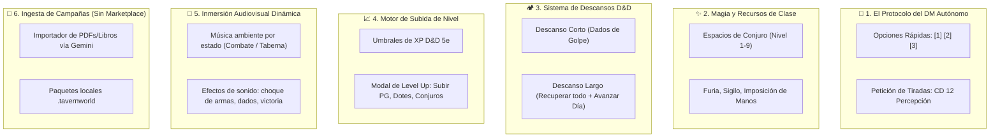

# 🛡️ Objetivo: La Experiencia "Friends & Fables"
## *Convertir SillyTavern en un TTRPG Completo con Director de Juego IA (100% Local, Privado y Sin Marketplace)*

> **Referente**: **Friends & Fables** (`fables.gg` / *Craft*) es la plataforma líder de rol con IA: un Dungeon Master virtual (*Franz*) que narra la campaña, plantea dilemas, exige tiradas de habilidad, gestiona combates tácticos en cuadrícula bajo reglas D&D 5e y guía la progresión de la party.
> 
> **Tu Condición Expresa**: **CERO MARKETPLACE**. Nada de tiendas de compras dentro de la app, microtransacciones, dependencias de nube cerrada ni economía de activos. Todo debe ser **un juego personal, autosuficiente, offline-first y gratuito**.

---

## 📊 1. Radiografía de tu Proyecto: ¿Qué tienes YA frente a Friends & Fables?

Has avanzado mucho más de lo que parece. La mayoría de proyectos que intentan imitar a *Friends & Fables* solo tienen un chatbot que alucina tiradas. **Tú tienes un motor real**:

| Característica | Friends & Fables | Tu Fork Actual (`my-silly`) | Estado |
| :--- | :--- | :--- | :---: |
| **Tablero Táctico** | Cuadrícula con niebla y visión | Tablero con A*, niebla de guerra, línea de visión y coberturas (`terrain.js`) | ✅ **100% Hecho** |
| **Combate Determinista** | Turnos, dados e iniciativa | Máquina de turnos, IA de monstruos (4 perfiles), tiradas auditables y 0 tokens | ✅ **100% Hecho** |
| **Frontend Dedicado (Game Shell)** | Interfaz limpia sin ruido | 3 pantallas completas cinemáticas (Diálogo, Mapa, Combate) con conmutación automática | ✅ **100% Hecho** |
| **Vínculos y Acompañantes** | Seguimiento de relaciones | Sistema Persona: Rangos 1-10 con perks reales en combate (*Follow-up, Relevo, Aguantar*) | 🌟 **Superior** |
| **Economía de Tiempo** | Días y descansos | Calendario con franjas horarias (Mañana, Tarde, Noche) enlazado a la partida | ✅ **100% Hecho** |
| **Reglas D&D 5e Modificables** | Reglas cerradas | Editor visual de 25 tablas de reglas (`/rules`), condiciones y armas personalizadas | 🌟 **Superior** |
| **DM Autónomo Proactivo** | Pide tiradas, da opciones rápidas | Conversación abierta por chat (falta protocolo de control del DM) | 🟡 **Parcial** |
| **Magia y Recursos de Clase** | Espacios de conjuro, habilidades | Ataque estándar con armas (falta el libro de hechizos y puntos de clase) | 🟡 **Parcial** |
| **Subida de Nivel (Level Up)** | Árbol de progresión D&D 5e | XP y nivel numérico en ficha (falta selector de rasgos por nivel) | 🟡 **Parcial** |
| **Descansos D&D** | Short & Long Rest automáticos | `calendar.js` tiene el tiempo, falta aplicar recuperación de PG y Dados de Golpe | 🟡 **Parcial** |

---

## 🧩 2. Las 6 Piezas que te Faltan para igualarlo

Para que la experiencia de juego sea idéntica a *Friends & Fables*, necesitas cerrar estas 6 áreas específicas:

---

### Pieza 1: El Protocolo del DM Autónomo (Tiradas de Habilidad & Opciones Rápidas)

En *Friends & Fables*, el jugador no siempre tiene que inventarse qué escribir. El Dungeon Master virtual estructura cada turno con **tres elementos clave**:
1. **Narración sensorial del entorno**: Describe qué ven, oyen o huelen los personajes.
2. **Petición explícita de Tiradas de Habilidad (Skill Checks)**:
   * En lugar de asumir que logras algo, el DM escribe:
     `[CHECK: Percepción | CD: 13 | Actor: Valerius]`
   * El motor intercepta este bloque, tira el `d20 + Sabiduría + Competencia` de Valerius, y muestra en pantalla:
     * *Éxito*: Desbloquea un secreto o evita una emboscada.
     * *Fallo*: El peligro te pilla por sorpresa.
3. **Botones de Sugerencia Rápida (Action Prompts)**:
   * Al final del mensaje, ofrece 3 opciones lógicas y la opción de escribir libremente:
     * `[1]` *Examinar los jeroglíficos de la tumba.*
     * `[2]` *Avanzar con sigilo hacia la puerta entornada.*
     * `[3]` *Preparar las armas y registrar la sala.*
     * `[4]` *[Escribir acción propia en el input...]*

---

### Pieza 2: Magia D&D 5e y Recursos de Clase (Spellbook & Class Resources)

Actualmente tu motor táctico resuelve ataques de armas físicas (`1d8+3`, distancia, etc.). *Friends & Fables* incluye el repertorio mágico y habilidades heroicas:

1. **Espacios de Conjuro (Spell Slots)**:
   * Rastreo de ranuras gastadas: Nivel 1 (4), Nivel 2 (3), etc.
   * Cantrips (Trucos): Ilimitados (ej. *Rayo de Fuego*, *Toque Helado*).
2. **Habilidades con Usos Limitados**:
   * *Guerrero*: Tomar Aliento (*Second Wind*) (1 por descanso corto), Acción Súbita (*Action Surge*).
   * *Bárbaro*: Furia (2 usos por descanso largo, otorga resistencia a daño físico y +2 daño).
   * *Pícaro*: Acción Astuta (*Cunning Action*: Destrabarse o Esconderse como acción adicional), Ataque Furtivo (*Sneak Attack*).
   * *Paladín*: Imposición de Manos (reserva de PG curativos) y Castigo Divino (*Divine Smite*).
3. **En la Barra Táctica**:
   * Un botón **✨ Magia / Habilidades** que despliega el menú de conjuros preparados del personaje con sus dados y áreas de efecto (ej. *Línea 30 pies*, *Esfera 20 pies*).

---

### Pieza 3: Sistema de Descansos D&D 5e (Short & Long Rest)

Pendiente desde la Fase D (`D5`), es el corazón de la gestión de recursos de aventura:

1. **Descanso Corto (1 hora en el calendario)**:
   * El grupo se toma un respiro en una zona segura.
   * Cada personaje puede gastar **Dados de Golpe (Hit Dice)** (ej. 1d10 para Guerrero) para recuperar vida:
     $$\text{Curación} = \text{roll}(1\text{d}10) + \text{Modificador de Constitución}$$
   * Recupera habilidades de descanso corto (ej. *Tomar Aliento*, espacios del Brujo).
2. **Descanso Largo (8 horas / Pasa a la mañana siguiente)**:
   * Recupera **el 100% de los Puntos de Golpe**.
   * Recupera la mitad de los Dados de Golpe máximos.
   * Restablece todos los espacios de conjuro y furias.
   * Puede desencadenar **encuentros nocturnos aleatorios** si acampan en territorio hostil sin montar guardias.

---

### Pieza 4: Motor de Progresión y Subida de Nivel (Level Up)

Cuando un monstruo es derrotado o se completa una misión, el motor ya entrega XP (`loot.js`). Falta el ciclo de subida de nivel:

1. **Tabla de XP Oficial D&D 5e**:
   * Nivel 1: 0 XP | Nivel 2: 300 XP | Nivel 3: 900 XP | Nivel 4: 2.700 XP | Nivel 5: 6.500 XP...
2. **Modal de Subida de Nivel ("LEVEL UP!")**:
   * Al alcanzar el umbral, aparece una notificación brillante en la ficha del personaje.
   * Un diálogo interactivo permite:
     * Tirar o fijar el aumento de PG (ej. `1d10 + CON` o media fija de 6 + CON).
     * En Nivel 3: Seleccionar Arquetipo / Subclase (ej. *Campeón*, *Maestro de Batalla*, *Evocador*).
     * En Nivel 4: Elegir entre Mejora de Característica (+2 a un atributo o +1 a dos) o una Dote.
     * Añadir nuevos conjuros aprendidos a la lista del personaje.

---

### Pieza 5: Inmersión Audiovisual y FX (Atmósfera de Mesa Virtual)

*Friends & Fables* destaca porque la mesa se siente viva:

1. **Música y Paisajes Sonoros por Estado**:
   * SillyTavern ya incluye un reproductor de audio (`audio-player.js`).
   * Solo falta vincularlo a la máquina de estados:
     * Estado `social` / `idle` en poblado: Música relajante de laúd o murmullo de taberna.
     * Estado `combat`: Pistas de combate épicas y percusión tensa.
     * Estado `exploration` en cripta: Goteras, viento subterráneo y ambiente tétrico.
2. **Efectos de Sonido (SFX) en Combate**:
   * Sonido al rodar dados (`d20`).
   * Impacto de espada / flecha / estallido mágico.
   * Fanfarria corta al ganar un encuentro.
3. **Dados 3D en Pantalla**:
   * SillyTavern ya soporta la librería de dados 3D (`Dice-Box` / W福). Asegurar que las tiradas del motor hagan rodar los dados visualmente en pantalla si el usuario lo tiene activado.

---

### Pieza 6: Ingesta Local de Campañas (Tu propia "Biblioteca", Sin Marketplace)

En vez de una tienda comercial en línea, tu juego dispondrá de un **Gestor de Campañas Local**:
* **Librería Personal**: Una carpeta `data/default-user/campaigns/` donde guardas tus mundos.
* **Importar Módulos con 1 Clic**: El pipeline que diseñamos en `ROADMAP_INGESTA_CAMPANAS_LIBROS.md`: arrastras los 5 JSONs generados por tu GEM de Gemini o un archivo ZIP `.tavernworld` y la aventura queda lista en tu pantalla de inicio.
* **Exportar tu Aventura**: Un botón para empaquetar tu mundo, PNJs, misiones y mapas para compartirlo con amigos o hacer copias de seguridad, sin pasar por ninguna plataforma corporativa.

---

## 🚀 3. Hoja de Ruta Ejecutable: El Camino hacia "Friends & Fables"

Organizado en 4 baterías lógicas para construir de forma iterativa:

| Batería | Nombre | Contenido |
| :---: | :--- | :--- |
| **Batería F1** | **El DM Autónomo (Skill Checks y Opciones)** | Parser de tiradas de habilidad en el chat (`[CHECK: Habilidad CD]`), tirada automática determinista en pantalla y botones de acción rápida `[1]` `[2]` `[3]`. |
| **Batería F2** | **Descansos y Recursos (Short/Long Rest)** | Modales de descanso corto (gasto de Dados de Golpe) y descanso largo (recuperación total + salto de día en calendario). |
| **Batería F3** | **Grimorio y Habilidades Tácticas** | Gestión de espacios de conjuro (Spell Slots) y botones de hechizos/habilidades en la barra de combate táctico. |
| **Batería F4** | **Motor de Subida de Nivel (Level Up)** | Detección de umbrales de XP, aumento de PG y selector de rasgos/dotes al subir de nivel. |

---

## 🎯 Conclusión

Tu proyecto ya tiene el **núcleo técnico más difícil**: el tablero A*, la niebla de guerra, el combate determinista a 0 tokens, el sistema de vínculos Persona y las 3 pantallas completas del Game Shell.

Lo que separa tu versión actual de *Friends & Fables* no es una reescritura, sino **darle voz de Dungeon Master al LLM (tiradas de habilidad y opciones rápidas)** y **completar los recursos de clase D&D (magia, descansos y subida de nivel)**.

Todo 100% privado, local y sin pagar a ninguna plataforma externa.
