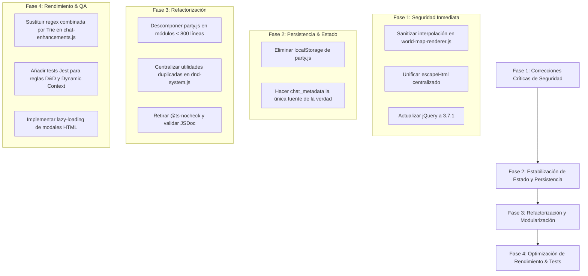

# Auditoría de Problemas Técnicos, Vulnerabilidades & Deuda Técnica

Este documento presenta una **auditoría técnica profunda e independiente** del código fuente de SillyTavern y de las extensiones RPG de la rama `my-silly`. Los hallazgos se clasifican por severidad, detallando el archivo exacto, la línea de código afectada, el impacto potencial y la recomendación técnica de remediación.

---

## 1. Matriz Resumen de Problemas Detectados

| ID | Categoría | Severidad | Descripción Breve | Archivo / Componente |
| :--- | :--- | :---: | :--- | :--- |
| **SEC-01** | Seguridad | **CRÍTICA** | Content Security Policy deshabilitada (`contentSecurityPolicy: false`). | `src/server-main.js:95` |
| **SEC-02** | Seguridad | **ALTA** | Vulnerabilidad XSS por interpolación directa de variables en el DOM. | `public/scripts/world-map-renderer.js:898` |
| **SEC-03** | Seguridad | **MEDIA** | 4 implementaciones divergentes e incompletas de `escapeHtml`. | `party.js`, `campaigns.js`, `active-instructions.js` |
| **SEC-04** | Seguridad | **MEDIA** | Almacenamiento de claves de API en texto plano. | `src/endpoints/secrets.js` |
| **SEC-05** | Seguridad | **MEDIA** | Uso de biblioteca jQuery 3.5.1 desactualizada con CVEs conocidas. | `public/lib/jquery-3.5.1.min.js` |
| **CONC-01**| Concurrencia | **ALTA** | Desincronización entre `localStorage` y `chat_metadata.party`. | `public/scripts/party.js:93-122` |
| **CONC-02**| Concurrencia | **MEDIA** | Escrituras asíncronas concurrentes sin bloqueo de archivos (File Locking).| `src/endpoints/chats.js` |
| **PERF-01**| Rendimiento | **ALTA** | Archivo HTML monolítico masivo (~10,884 líneas, 860 KB) sin lazy loading. | `public/index.html` |
| **PERF-02**| Rendimiento | **ALTA** | Monolitos de JavaScript masivos sin empaquetar (`party.js`, `script.js`). | `party.js` (4,734 lín.), `script.js` (12k lín.) |
| **PERF-03**| Rendimiento | **MEDIA** | Expresión regular masiva combinada con riesgo de ReDoS y fallo en UTF-8. | `public/scripts/chat-enhancements.js:98` |
| **PERF-04**| Rendimiento | **MEDIA** | Ausencia de virtualización del DOM en chat y cuadrículas de tableros. | `public/script.js`, `world-map-renderer.js` |
| **MEM-01** | Memoria | **MEDIA** | Fuga de memoria por acumulación de event listeners en redibujados. | `public/scripts/world-map-renderer.js:82-100` |
| **MAINT-01**| Mantenimiento| **MEDIA** | Uso generalizado de `// @ts-nocheck` y ausencia de tipado estricto. | `world-content-popups.js`, `chat-enhancements.js` |
| **MAINT-02**| Mantenimiento| **BAJA** | Duplicación de código utilitario idéntico entre módulos independientes. | `party.js` y `world-info.js` |
| **MAINT-03**| QA / Tests | **ALTA** | Cobertura de pruebas automatizadas nula para el motor RPG (0% tests). | `tests/` |

---

## 2. Diagnóstico Detallado de Hallazgos

### 2.1. Vulnerabilidades de Seguridad & Riesgos de Inyección

#### [SEC-01] Deshabilitación Completa de Content Security Policy (CSP)
- **Ubicación**: `src/server-main.js` (Líneas 95-97)
```javascript
app.use(helmet({
    contentSecurityPolicy: false,
}));
```
- **Diagnóstico**: Helmet tiene su módulo CSP desactivado deliberadamente para permitir la carga de scripts en línea, estilos dinámicos de temas y extensiones de terceros.
- **Impacto**: Si cualquier entrada de usuario, tarjeta de personaje importada de internet o salida generada por el LLM consigue inyectar una etiqueta `<script>` o un atributo `onerror`, el script malicioso se ejecutará sin restricción alguna en el contexto de la aplicación, con acceso total a las sesiones, claves de API y sistema de archivos.
- **Solución Recomendada**: Configurar una política CSP estricta basada en nonces criptográficos generados por sesión (`res.locals.cspNonce`) para scripts legítimos y deshabilitar `'unsafe-inline'` y `'unsafe-eval'`.

---

#### [SEC-02] Vulnerabilidad de Cross-Site Scripting (XSS) en el Renderizador de Mapas
- **Ubicación**: `public/scripts/world-map-renderer.js` (Líneas 897-910)
```javascript
for (const token of tokens) {
    const row = $(`
        <div class="wm-char-row">
            ${token.avatar
                ? ``
                : `<div class="wm-char-avatar">???</div>`}
            <span class="wm-char-name">${token.name}</span>
            <div class="wm-char-coords">
                <input type="number" class="wm-char-coord-input" data-token-id="${token.id}" ... />
            </div>
        </div>
    `);
    body.append(row);
}
```
- **Diagnóstico**: `token.name` y `token.avatar` se interpolan directamente en la plantilla de cadena sin pasar por una función de escape o sanitización.
- **Impacto**: Si un token tiene como nombre `">`, o si el avatar contiene atributos maliciosos, se produce una ejecución inmediata de código JavaScript (XSS persistente) en el navegador del usuario al abrir el visor de mapas.
- **Solución Recomendada**: Utilizar la construcción segura de nodos del DOM mediante jQuery:
```javascript
const row = $('<div class="wm-char-row"></div>');
const nameSpan = $('<span class="wm-char-name"></span>').text(token.name);
// Asignación segura de atributos:
const img = $('').addClass('wm-char-avatar').attr('src', token.avatar).attr('alt', token.name);
```

---

#### [SEC-03] Múltiples Implementaciones Divergentes e Incompletas de `escapeHtml`
- **Ubicación**: 
  - `public/scripts/party.js` (Línea 196)
  - `public/scripts/campaigns.js` (Línea 22)
  - `public/scripts/active-instructions.js` (Línea 22)
  - `public/scripts/world-content-popups.js` (Línea 73)
- **Diagnóstico**: Cada archivo implementa su propia función auxiliar de escape con expresiones regulares distintas:
  - En `campaigns.js` y `active-instructions.js`: no se escapan las comillas simples (`'`).
  - En `world-content-popups.js`: `esc(s)` no escapa comillas simples (`'`).
  - En `party.js`: escapa `'` como `&#039;`, pero carece de normalización para caracteres de control.
- **Impacto**: Inconsistencias graves donde valores seguros en un modal se vuelven vulnerables al usarse dentro de atributos delimitados por comillas simples en otro componente.
- **Solución Recomendada**: Unificar en una única función utilitaria centralizada en `public/scripts/utils.js` basada en `DOMPurify.sanitize()` o en una sustitución robusta de 5 entidades XML estándar (`&`, `<`, `>`, `"`, `'`).

---

#### [SEC-04] Almacenamiento de Claves de API en Texto Plano (`secrets.json`)
- **Ubicación**: `src/endpoints/secrets.js`
- **Diagnóstico**: Todas las claves privadas (OpenAI API Key, Anthropic Key, Gemini Key, etc.) se almacenan en texto plano en el archivo `data/<user>/secrets.json`.
- **Impacto**: Cualquier programa local, script ejecutado en el sistema o copia de seguridad accidental expone inmediatamente todas las credenciales de facturación del usuario.
- **Solución Recomendada**: Cifrar `secrets.json` en reposo utilizando **AES-256-GCM**, derivando la clave criptográfica de la contraseña del usuario o de una clave maestra del sistema (`master.key`).

---

#### [SEC-05] Uso de Biblioteca jQuery 3.5.1 con Vulnerabilidades Conocidas (CVEs)
- **Ubicación**: `public/lib/jquery-3.5.1.min.js`
- **Diagnóstico**: jQuery 3.5.1 fue lanzado en mayo de 2020. Contiene vulnerabilidades documentadas de manipulación del DOM mediante `htmlPrefilter` (CVE-2020-11022 y CVE-2020-11023), que permiten XSS al pasar marcado que contiene elementos `<option>` o construcciones específicas no autorizadas.
- **Solución Recomendada**: Actualizar a jQuery 3.7.1 (última versión estable y parcheada).

---

### 2.2. Concurrencia, Estado y Persistencia

#### [CONC-01] Doble Almacenamiento Conflictivo de Party (`localStorage` vs `chat_metadata`)
- **Ubicación**: `public/scripts/party.js` (Líneas 93-101 y 157-185)
```javascript
function savePartyState() {
    try {
        window.localStorage.setItem('sillytavern_partyMembers', JSON.stringify(partyMembers));
    } catch (e) { ... }
    savePartyToMetadata(); // Guarda en chat_metadata.party
}
```
- **Diagnóstico**: El estado de los miembros del grupo se guarda simultáneamente en `localStorage` (global a todo el dominio/navegador) y en `chat_metadata` (específico del chat abierto).
- **Impacto**:
  1. Si el usuario abre dos chats distintos en pestañas diferentes, la pestaña A sobreescribirá el grupo de la pestaña B en `localStorage`.
  2. Al recargar o reiniciar, `loadPartyForChat()` lee prioritariamente `chat_metadata.party`, pero ciertas funciones auxiliares consultan la clave global, provocando que miembros de una campaña aparezcan mágicamente en otra.
- **Solución Recomendada**: Eliminar por completo el uso de `localStorage` para la persistencia del grupo. Toda la información debe estar vinculada de forma estricta y única a `chat_metadata.party`.

---

#### [CONC-02] Escrituras Asíncronas sin Bloqueo de Archivos (File Locking)
- **Ubicación**: `src/endpoints/chats.js` y `src/users.js`
- **Diagnóstico**: Las modificaciones del chat y de los metadatos se efectúan mediante llamadas asíncronas a `fs.promises.writeFile` o streams sin mecanismos de cerrojo (flock / file locking).
- **Impacto**: Si una generación de IA en streaming escribe tokens en el archivo JSONL al mismo tiempo que el usuario modifica manualmente un mensaje o una estadística del grupo, pueden intercalarse bytes en el archivo, corrompiendo la sintaxis JSONL y dañando el historial de la partida.
- **Solución Recomendada**: Utilizar colas de escritura serializadas en memoria por cada archivo abierto (pattern Mutex per File) o apoyarse universalmente en `write-file-atomic` para evitar escrituras parciales.

---

### 2.3. Rendimiento, Monolitos & Consumo de Recursos

#### [PERF-01] Documento DOM Monolítico Masivo (`index.html`)
- **Ubicación**: `public/index.html` (10,884 líneas, 860,776 bytes)
- **Diagnóstico**: `index.html` alberga todo el marcado estático de la aplicación: más de 50 modales, menús de ajuste, paneles de extensiones y plantillas ocultas que se cargan y parsean en el hilo principal antes de renderizar el primer pixel.
- **Impacto**:
  - Tiempo de bloqueo total (TBT) y Largest Contentful Paint (LCP) elevados en dispositivos móviles o equipos modestos.
  - Consumo excesivo de memoria en el árbol DOM (más de 4,000 nodos DOM vivos en todo momento).
- **Solución Recomendada**: Fragmentar los paneles y modales en archivos de plantilla HTML separados en `public/scripts/templates/` y cargarlos asíncronamente bajo demanda mediante `fetch()` cuando el usuario abra dicho panel por primera vez.

---

#### [PERF-02] Monolitos de Código Fuente Gigantescos
- **Ubicación**:
  - `public/scripts/party.js`: **4,734 líneas** (209 KB en un solo archivo).
  - `public/script.js`: **12,000+ líneas** (513 KB).
  - `public/scripts/world-info.js`: **332 KB**.
  - `public/scripts/slash-commands.js`: **303 KB**.
- **Diagnóstico**: Acumulación masiva de responsabilidades dentro de archivos individuales (violación flagrante del principio de responsabilidad única). `party.js` mezcla:
  - Definición de tipos y estado de los miembros.
  - Lógica de progresión D&D y fórmulas de dados.
  - Manipulación directa del DOM y estilos CSS.
  - Registro de comandos de barra.
  - Lógica de sincronización y red.
- **Impacto**: Dificultad extrema para mantener el código, imposibilidad de realizar tree-shaking y riesgo muy elevado de regresiones al introducir cambios.
- **Solución Recomendada**: Descomponer `party.js` en submódulos especializados dentro de una carpeta `public/scripts/party/`:
  - `party-state.js` (gestión de estado y mutadores puros)
  - `party-ui.js` (renderizado de cajón y ficha)
  - `party-combat.js` (dados e iniciativa)
  - `party-commands.js` (slash commands)

---

#### [PERF-03] Expresión Regular Masiva con Riesgo de ReDoS en `chat-enhancements.js`
- **Ubicación**: `public/scripts/chat-enhancements.js` (Líneas 95-99)
```javascript
const sortedKeywords = Array.from(newMap.keys())
    .sort((a, b) => b.length - a.length)
    .map(kw => escapeRegex(kw));
keywordRegex = new RegExp(`\\b(${sortedKeywords.join('|')})\\b`, 'gi');
```
- **Diagnóstico**: Si un usuario tiene Lorebooks extensos con cientos de entradas y miles de claves alternativas, el sistema compila una expresión regular gigantesca con miles de ramas `(k1|k2|k3|...)`.
- **Impacto**:
  1. **ReDoS / Sobrecarga de CPU**: En motores V8, evaluar expresiones regulares con miles de alternancias sobre cada bloque de texto renderizado satura el hilo principal del navegador.
  2. **Fallo en Caracteres no-ASCII**: El delimitador `\b` (word boundary) en JavaScript solo reconoce caracteres ASCII (`[a-zA-Z0-9_]`). Términos con tildes (ej. *Dragón*, *Invocación*), eñes (*Montaña*) o apóstrofes no coincidirán correctamente en los límites de palabra.
- **Solución Recomendada**: Utilizar una estructura de datos basada en **Árbol de Prefijos (Trie / Aho-Corasick Algorithm)** para búsqueda de múltiples patrones en tiempo lineal $O(N)$ sin expresiones regulares.

---

### 2.4. Memoria y Ciclo de Vida del DOM

#### [MEM-01] Acumulación de Event Listeners en Componentes de Mapa y Tablero
- **Ubicación**: `public/scripts/world-map-renderer.js` (Líneas 82-100 y 912-920)
```javascript
img.on('load', function () { ... });
container.on('wheel', function (e) { ... });
row.find('.wm-char-coord-input').on('change', function () { ... });
```
- **Diagnóstico**: `createZoomableContainer` enlaza eventos de ratón (`wheel`, `mousemove`, `mousedown`) directamente en elementos del DOM sin proveer una función de desmontaje (`destroy()` o `.off()`). Cada vez que el usuario cambia de mapa, se recrea el contenedor y los listeners antiguos permanecen retenidos en memoria si el nodo no es recolectado por el garbage collector.
- **Solución Recomendada**: Implementar un método `destroy()` que ejecute `container.off()` y desvincule referencias circulares al cerrar la vista de mapa.

---

### 2.5. Mantenibilidad, Tipado y Ausencia de Pruebas

#### [MAINT-01] Uso de `// @ts-nocheck` en Nuevos Módulos del Motor RPG
- **Ubicación**:
  - `public/scripts/world-content-popups.js` (Línea 1: `// @ts-nocheck`)
  - `public/scripts/chat-enhancements.js` (Línea 9: `// @ts-nocheck`)
- **Diagnóstico**: La directiva `// @ts-nocheck` suprime cualquier comprobación estática de tipos de TypeScript/JSDoc en VS Code y herramientas de análisis estático.
- **Impacto**: Errores comunes de ejecución (`TypeError: Cannot read properties of undefined`) pasan desapercibidos hasta que el usuario final los encuentra en runtime.
- **Solución Recomendada**: Eliminar `// @ts-nocheck` y corregir las discrepancias de tipos mediante definiciones JSDoc (`/** @param {...} */`) o migrar gradualmente los archivos a TypeScript `.ts`.

---

#### [MAINT-02] Duplicación Textual de Funciones Utilitarias
- **Ubicación**:
  - `public/scripts/party.js` (Líneas 223-250)
  - `public/scripts/world-info.js` (Líneas 93-120 en la diff del fork)
- **Diagnóstico**: La función `normalizeDndEntityType` y `getDndEntryType` existen duplicadas palabra por palabra en ambos archivos.
- **Solución Recomendada**: Centralizar todas las utilidades D&D en `public/scripts/dnd-system.js` e importarlas limpiamente.

---

#### [MAINT-03] Ausencia Total de Pruebas Automatizadas para el Motor RPG
- **Ubicación**: Carpeta `tests/`
- **Diagnóstico**: El directorio `tests/` solo contiene tests legados de utilidades (`util-pure.test.js`). El subsistema RPG (que suma más de 24,000 líneas de código entre JS, CSS y HTML) cuenta con **0% de cobertura de pruebas unitarias o de integración**.
- **Impacto**: Cualquier refactorización o actualización del núcleo upstream de SillyTavern corre el riesgo inminente de romper el inventario, los dados, la vida del grupo o el Dynamic Context sin que nadie lo detecte previamente.
- **Solución Recomendada**: Crear una suite de pruebas en Jest para `dnd-system.js` y `dynamic-context-manager.js` que valide:
  - Cálculo correcto de modificadores de característica y AC.
  - Adición, equipamiento y consumo de ítems de inventario.
  - Evaluación correcta del presupuesto de tokens en el Dynamic Context Manager.

---

## 3. Plan de Mitigación y Hoja de Ruta Priorizada



---

## 4. Enlaces Relacionados
- [[Arquitectura-General]]: Visión arquitectónica general.
- [[PROPUESTAS_MEJORA]]: Catálogo de 200 soluciones y mejoras propuestas.
- [[Guia-Desarrollo-Flujo]]: Guía para desarrolladores sobre buenas prácticas.
