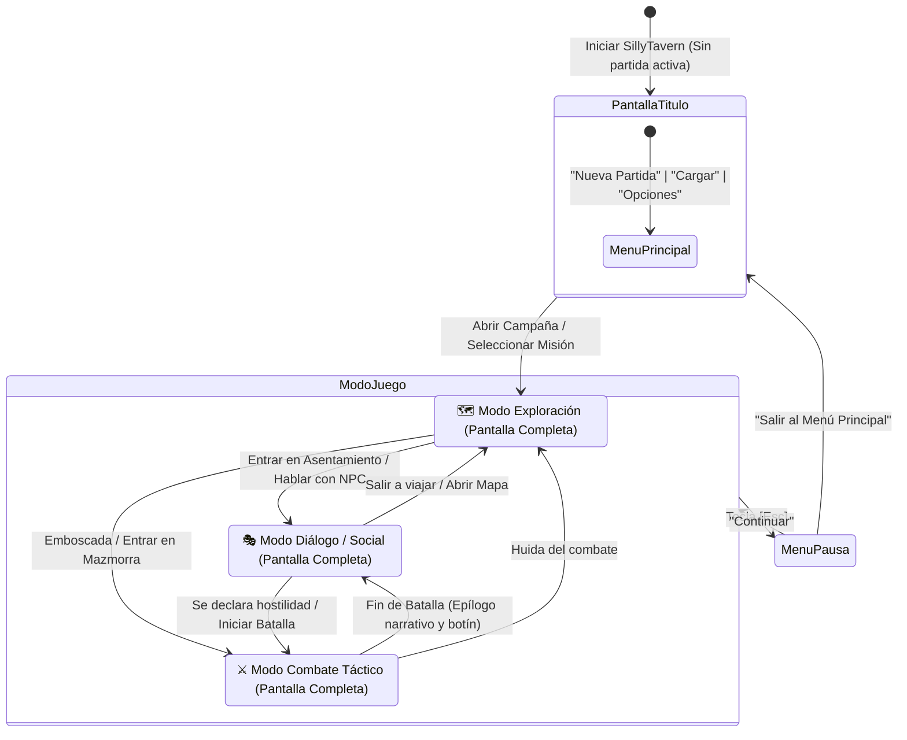

# 🎮 Plan Principal: Frontend Dedicado "Modo Videojuego" (Game Shell)
## *Pantallas Cinemáticas Contextuales: Combate, Exploración y Diálogo a Pantalla Completa*

> **Estado**: plan ejecutable. La idea y las maquetas son del documento original; la sección 0 recoge las tres correcciones que hacían falta para poder construirlo, y la 6 es la hoja de ruta reescrita.
> 
> **Concepto Central**: En lugar de saturar la pantalla con interfaces partidas o abarrotadas, el juego utiliza **3 Pantallas Completas Cinemáticas** que se activan y alternan dinámicamente según la acción del personaje:
> 1. 🎭 **Modo Diálogo / Social (Pantalla Completa)**: Estilo *Persona / Novela Visual*, centrado en la narrativa, retratos de personajes y toma de decisiones.
> 2. 🗺️ **Modo Exploración / Viaje (Pantalla Completa)**: Vista de mapa de mundo y planos de ciudades para orientarse y seleccionar misiones.
> 3. ⚔️ **Modo Combate Táctico (Pantalla Completa)**: Tablero de batalla estilo *Gloomhaven* con cuadrícula limpia, rastreador de turnos superior y barra de acciones tácticas.
> 
> Todo el ruido técnico de SillyTavern desaparece tras una **Pantalla de Título de Videojuego** al inicio y un **Menú de Pausa (`Esc`)** durante la partida.

---

## ⚠️ 0. De propuesta a plan ejecutable — 2026-09-21

La idea se sostiene y la decisión de arquitectura es correcta. Lo que sigue son las tres cosas que había que resolver antes de escribir una línea, comprobadas contra el código.

### 0.1 · El director escucha al **motor**, no al Dynamic Context

> [!WARNING]
> **Esto era un fallo de diseño, no un detalle.** El plan original hacía que el director de escena siguiera la máquina de estados de `dynamic-context-manager.js`. Ese estado **lo decide el modelo**:
>
> - `detectStateFromMessage` lo cambia por heurística **sobre la prosa del LLM**.
> - La herramienta `dnd_update_state` la invoca **el propio modelo**.
>
> Con eso, una frase de ambiente que diga *«todos a la iniciativa»* saltaría a la pantalla de combate sin que hubiera combate. Y un combate de verdad empieza con `/fight`, que sí es el motor.

La pantalla que ves **es estado del juego, no narración**, así que la decide quien lleva el estado:

| Pregunta al motor | Pantalla |
| :--- | :--- |
| `combatEncounter.active` | ⚔️ Combate |
| Hay tablero abierto (`currentBoardName`) | ⚔️ Combate, en reposo |
| Hay localización pero no tablero | 🗺️ Exploración |
| Nada de lo anterior | 🎭 Diálogo |

El estado del DCM sigue haciendo su trabajo, que es decidir qué se inyecta en el prompt. Simplemente no manda en la interfaz.

### 0.2 · El chat se **mueve**, no se replica

El modo diálogo necesita la caja de texto de SillyTavern con todo lo que arrastra: streaming, swipes, macros, expresiones regulares, adjuntos, tokenizador. Reimplementarla es rehacer media aplicación.

Comprobado en el DOM: `#sheld` contiene `#chat` y `#form_sheld` **juntos**, y el CSS apenas depende de esa jerarquía (`#sheld` aparece cuatro veces en `style.css`, sin selectores descendientes). Así que el Shell **reubica `#sheld` entero** dentro de la pantalla que toque, y lo devuelve a su sitio al salir.

Eso convierte el problema más caro del plan en una operación de dos líneas, y es la razón de que este plan sea viable.

### 0.3 · Se reutilizan los renderizadores, no se hacen otros

Ya existen y están conectados: el rastreador de iniciativa, los objetivos del escenario, el registro de combate, el panel de campaña con el calendario y los vínculos, el tablero con terreno y niebla. **El Shell los recoloca.** Si dibujara versiones propias habría dos interfaces que mantener, y se desincronizarían.

### 0.4 · Lo que este plan no hace

- **No toca `index.html`.** Todo vive en archivos nuevos, como el resto del fork.
- **No reescribe los paneles de configuración.** «Opciones» abre los de SillyTavern tal cual: son decenas de paneles y reubicarlos es un proyecto en sí mismo, no un modal.
- **No se activa solo.** El Shell se enciende y se apaga; si algo se rompe, se apaga y el juego sigue funcionando como hoy.

---

## 🏛️ 1. Decisión de Arquitectura: Por qué el "Game Shell"

Se evaluó la posibilidad de crear un proyecto externo en React/Vite, pero se descartó en favor del Game Shell integrado:
* **El backend de SillyTavern es solo un proxy**: No existe un endpoint para turnos de rol; todo el escaneo de Lorebooks, streaming y las más de 6.200 líneas de tu motor RPG (`game-engine/`, `combat/`, `bonds.js`, `scenarios.js`) viven en el navegador.
* **Cero colisiones con Upstream**: No se modifica el `index.html` de 10.839 líneas de SillyTavern. Todo se orquesta en archivos 100% nuevos (`game-shell.js` + `game-shell.css`).
* **Reaprovechamiento total**: La conexión con Gemini, la persistencia atómica y los tokenizadores siguen funcionando intactos por debajo sin duplicar código.

---

## 🎬 2. La Máquina de Estados: El "Director de Escena"

El controlador pregunta **al motor** en qué situación está la partida —¿hay un encuentro activo?, ¿hay un tablero abierto?, ¿hay localización?— y conmuta entre los tres escenarios.

> [!WARNING]
> **No usa la máquina de estados del `dynamic-context-manager`**, aunque el diagrama de abajo venga de ahí. Ese estado lo decide el modelo, por heurística sobre su propia prosa o llamando a `dnd_update_state`, y con él una frase de ambiente podría saltar a la pantalla de combate sin que hubiera combate. Ver la sección 0.1.



---

## 🖥️ 3. Pantalla de Inicio: Menú Principal (Title Screen)

Al iniciar SillyTavern o salir de una campaña, el viewport muestra la pantalla de inicio limpia:

```text
+-----------------------------------------------------------------------+
|                                                                       |
|                          🏰 SILLY TAVERN RPG                          |
|                     - CRÓNICAS DE AVENTURAS -                         |
|                                                                       |
|                       [ ⚔️ NUEVA PARTIDA ]                             |
|                       [ 📂 CARGAR PARTIDA ]                            |
|                       [ ⚙️ OPCIONES ]                                 |
|                       [ 📜 COMPENDIO / REGLAS ]                       |
|                                                                       |
| v2.0-RPG Engine                                  Conectado: Gemini Pro|
+-----------------------------------------------------------------------+
```

* **⚔️ Nueva Partida**: Abre tu `campaign-wizard.js` (Plantillas rápidas, Lienzo blanco con Gemini o Importar libro/módulo).
* **📂 Cargar Partida**: Galería de campañas con arte de portada, compañeros activos, día de calendario y botón "Continuar".
* **⚙️ Opciones**: Modal donde queda **recogida toda la configuración técnica de SillyTavern** (API Keys, samplers, audio, backup).
* **📜 Compendio**: Editor y visor de reglas D&D (`/rules`).

---

## 🎭 4. Las 3 Pantallas Cinemáticas a Pantalla Completa

Una vez dentro de la partida, el juego nunca mezcla todo en una pantalla apretada. En su lugar, despliega la pantalla completa especializada según lo que esté ocurriendo:

---

### Escenario A: 🎭 Modo Diálogo / Narrativa / Social (Estilo Persona)

Se activa durante conversaciones, eventos de vínculo, descansos en tabernas o investigación:

```text
+-----------------------------------------------------------------------+
| 📍 Posada del Jabalí Blanco        🌅 Día 3 · Tarde         [Esc] ⚙️  |
+-----------------------------------------------------------------------+
|                                                                       |
|                       [ ILUSTRACIÓN DE FONDO                          |
|                         O RETRATO GRANDE                              |
|                          DEL PERSONAJE ]                              |
|                                                                       |
|                                                                       |
+-----------------------------------------------------------------------+
| [Avatar Lyra]  LYRA VALENTINE (Hechicera - Rango de Vínculo: 4)       |
| "El rastro de magia corrupta conduce directamente a la cripta.        |
|  Si vamos a entrar allí, necesitaremos fuego... y mucho cuidado."     |
| --------------------------------------------------------------------- |
| > ¿Qué respondes o qué haces?                                         |
| [Input de texto para hablar con Lyra o tomar una decisión...]         |
+-----------------------------------------------------------------------+
| 🛡️ [Valerius HP: 28/28] [Lyra HP: 16/18]   |   [🗺️ Ver Mapa] [📜 Quests] |
+-----------------------------------------------------------------------+
```

* **Enfoque**: Novela visual y rol puro. Toda la pantalla está dedicada al personaje con el que hablas y a la atmósfera del lugar.
* **Sin botones técnicos**: Las herramientas de reintentar mensaje o editar se ocultan; el foco es la toma de decisiones y el diálogo.
* **Barra inferior de diálogo**: Retrato grande, texto limpio con palabras de lorebook resaltadas (con tooltip informativo al pasar el ratón) y caja de entrada de acción.

---

### Escenario B: 🗺️ Modo Exploración / Viaje (Mapa de Mundo a Pantalla Completa)

Se activa cuando el grupo se desplaza por el reino, viaja entre regiones o consulta el plano de una ciudad:

```text
+-----------------------------------------------------------------------+
| 📍 Valle de Faerûn - Mapa Regional        🌅 Día 3 · Mañana  [Esc] ⚙️  |
+-----------------------------------------------------------------------+
|                                                                       |
|       [ MAPA CONTINENTAL / REGIONAL ZOOMABLE A PANTALLA COMPLETA ]    |
|                                                                       |
|             (🏰 Ciudadela Alta)                                       |
|                    \                                                  |
|                     \____ [📍 Grupo Actual: Cruce de Caminos]         |
|                                  \                                    |
|                                   \____ (💀 Cripta Olvidada)          |
|                                         [Misión: El Nigromante]       |
|                                                                       |
|   [ Niebla de exploración revelada a medida que viajas ]             |
|                                                                       |
+-----------------------------------------------------------------------+
| 🧭 DESTINO: Cripta Olvidada (Viaje: ~4 horas) | [⚔️ Viajar] [🏕️ Acampar] |
+-----------------------------------------------------------------------+
```

* **Enfoque**: Orientación espacial, estrategia de viaje y elección de misiones.
* **Interactividad**: Clic en un marcador (POI) para ver su descripción, requerimientos o viajar hacia él (avanzando el reloj del calendario).

---

### Escenario C: ⚔️ Modo Combate Táctico (Gloomhaven / VTT a Pantalla Completa)

En el momento en que se declara un combate (`/fight` o un encuentro hostil), la pantalla transiciona de inmediato a la mesa táctica:

```text
+-----------------------------------------------------------------------+
| ⚔️ RONDA 2 | Turno: [Valerius] ➔ [Goblin 1] ➔ [Lyra]       [Esc] ⚙️  |
+-----------------------------------------------------------------------+
|                                                      | 📜 COMBAT LOG  |
|                                                      | Valerius ataca |
|   ################################################   | con Espada:    |
|   #......................c.......................#   | 1d20+5 = 18    |
|   #..[Valerius]..........#.......................#   | Impacta (CA 12)|
|   #......................#.......[Goblin 1]......#   | Daño: 1d8+3=8  |
|   #........[Lyra]........D.......................#   |                |
|   ################################################   | Goblin 1 cae a |
|                                                      | 4/12 PG        |
|   [ Cuadrícula con Niebla, Coberturas y Rango A* ]  | [Auto-Scroll]  |
+------------------------------------------------------+----------------+
| 🛡️ TURNO DE VALERIUS (Movimiento: 20/30 pies)                        |
| [⚔️ Atacar] [🏃 Mover] [✨ Habilidad] [🎒 Objeto] [⏭️ Fin de Turno]     |
+-----------------------------------------------------------------------+
```

* **Enfoque**: Táctica 100% determinista sin gasto de tokens.
* **Rastreador de Iniciativa Superior**: Muestra la hilera de avatares con el orden exacto de turnos y quién tiene el turno activo en ese instante.
* **Tablero Central Gigante**: Aprovecha todo el ancho de la pantalla para calcular rutas A*, coberturas (`c`/`C`) y línea de visión.
* **Barra Táctica Inferior**: Botones de acción directa (*Mover casillas resaltadas*, *Atacar*, *Usar Objeto*, *Pasar Turno*).
* **Transición de Salida**: Cuando el último enemigo muere o el grupo escapa, la pantalla **salta automáticamente de regreso al Modo Diálogo** para mostrar la narración del epílogo, el botín y la subida de experiencia.

---

## 🎛️ 5. El Conmutador Rápido (Modo Director)

Aunque el juego cambia de pantalla de forma inteligente según la acción del personaje, el jugador siempre tiene el control manual en todo momento mediante un **dock flotante minimalista o atajos de teclado**:

| Atajo | Vista | Cuándo se usa |
| :---: | :--- | :--- |
| `[1]` | 🎭 **Diálogo / Rol** | Para consultar la conversación reciente o charlar con un compañero. |
| `[2]` | 🗺️ **Mapa / Exploración** | Para ver dónde está el grupo en el mundo o revisar las rutas. |
| `[3]` | ⚔️ **Tablero / Combate** | Para inspeccionar la sala actual o mover tokens tácticos. |
| `[4]` | 📜 **Misiones & Vínculos** | Abre el panel de objetivos de Gloomhaven y el árbol de Confidentes. |
| `[Esc]` | ⚙️ **Menú de Pausa** | Pausa la partida, permite guardar, ajustar la IA o salir al Menú Principal. |

---

## 🛠️ 6. Hoja de Ruta Ejecutable

Cinco pasos, **del final hacia el principio**. El plan original empezaba por la pantalla de título; este empieza por el combate, y por tres razones: es la pantalla que más gana con el cambio —el tablero pide ancho y hoy vive en un cajón—, es la única que **no depende de la caja de texto**, y todos sus datos ya existen. Si funciona, valida la arquitectura entera con el riesgo más bajo. Si no, has perdido una pantalla y no el Shell.

Cada paso deja el juego en un estado jugable y se puede parar ahí.

---

### H1 ✅ HECHO · 2026-09-21

**Lo que quedó construido**
- `game-engine/ui/shell/scene-director.js` — puro, 24 tests. Decide la escena a partir de lo que sabe el motor y devuelve también **por qué**, que es lo que acaba en el tooltip y en los tests.
- `game-engine/ui/shell/game-shell.js` — monta la capa, **mueve** `#world_location_maps_row` al escenario y lo devuelve al cerrarse, con un nodo de comentario marcando el hueco para que vuelva al sitio exacto.
- `css/game-shell.css` — la capa, la retícula tablero/registro, y `#top-bar` apartada **solo** bajo `body.game-shell-on`.
- La barra de acciones: **Atacar** (lista de quien está a tu alcance, con distancia, PG y CA), **Fin de turno**, **Objetivos** y **Abandonar**. Cuando no puede atacar, dice por qué.
- `/modojuego` lo enciende y lo apaga; `Esc` también. `1` `2` `3` conmutan escena — hoy solo la de combate existe, y las otras dos salen anunciadas y desactivadas en vez de fingidas.

**Lo que comprobó el navegador y los tests no**: `setLocationMapsVisibility(hidden)` decía *visibility* y recibía *hidden*. Encender el Modo Juego lo **plegaba**, y la pantalla completa salía vacía: 0 muros, 0 fichas, 0 filas de iniciativa. Ahora se llama `setLocationMapsHidden` y el recorrido lo fija.

**Cómo quedó verificado**: 24 tests puros del director, y 19 comprobaciones nuevas en `tools/e2e-campaign.mjs` (paso 18), estables en dos pasadas seguidas — que el tablero está en el escenario y **sigue habiendo uno solo**, que se ve con sus muros y sus fichas, que el rastreador lista a los cuatro combatientes, que atacar desde la barra deja línea en el registro, y que `Esc` devuelve el panel al mismo padre, al mismo sitio y sin dejar nada del Shell por el camino.

---

### H2 ✅ HECHO · 2026-09-21

**Lo que quedó construido**
- `game-engine/ui/shell/dialogue-scene.js` — puro, 17 tests. Quién habla, cómo está el grupo y en qué momento del calendario va la partida. Lee el día y los rangos de `campaign-view.js`, el mismo modelo que usa la pestaña Campaña: dos paneles que leen lo mismo no pueden discrepar sobre el rango de nadie.
- La escena: retrato grande, nombre, rango de vínculo, el chat debajo y la franja del grupo al pie con vida, estados y quién está caído.
- `#sheld` **movido**, con dos reglas de especificidad (`#game-shell #sheld`) que lo convierten en una caja más sin tocar la regla original. Fuera del Shell no se aplica nada.
- Las dos escenas se montan al abrir y conmutar **enseña una y esconde la otra**: mover el chat en cada pulsación sería una ocasión de perder su desplazamiento o su foco.

**El riesgo era mover el chat, y salió bien.** El recorrido lo comprueba por los dos lados: dentro de la escena el chat conserva sus mensajes, su formulario y su botón de enviar visible, y un `/send` desde dentro aparece ahí mismo — el que está montado en la escena es el vivo. Al apagar vuelve al mismo padre, al mismo sitio y con su `position: absolute` de siempre, y la caja sigue aceptando texto.

**Lo que encontró el navegador**: al escribir, el foco se queda en la caja, y desde ahí `Esc` y `1` `2` `3` pertenecen al mensaje, no al juego. Pinchar en el chat era **una puerta de ida**: solo el ratón te sacaba del Modo Juego. Ahora `Esc` sale primero de la caja y el segundo apaga el juego, como en cualquier editor de texto. El manejador de `Esc` de SillyTavern es de documento y no depende del foco, así que sigue parando una generación o cerrando un editor de mensaje igual que antes.

**Cómo quedó verificado**: 17 tests puros y 19 comprobaciones nuevas en el recorrido (paso 19), estables en dos pasadas.

---

### H3 ✅ HECHO · 2026-09-21

**Lo que quedó construido**
- `detectSceneEvent(antes, ahora)` — los cuatro sucesos que mueven la pantalla, **nombrados uno a uno**: empieza un combate, termina, se abre un tablero, se sale de él. No se deducen de «la escena automática cambió», porque un combate que termina con el tablero abierto deja al selector en el tablero y aun así hay que volver al diálogo: lo que viene es el epílogo, y el epílogo es narración.
- `directScene(antes, ahora, elegida)` — un suceso manda sobre tu elección **y se queda puesto**. Si no, el epílogo duraría un parpadeo: el tablero abierto tiraría de la pantalla de vuelta a la mesa en el redibujado siguiente. Tu tecla vuelve a mandar en cuanto la pulsas, hasta que pase algo nuevo.
- El Shell recuerda la situación anterior y la explicación en curso, y refresca también cuando llega un mensaje: el retrato es de quien acaba de hablar.
- Y **enseña la escena más parecida que exista**: el director dice dónde está la partida, pero qué pantallas hay es problema del Shell. Salir de un tablero manda al mapa, y hasta que H4 lo construya lo que se ve es la conversación — no una pantalla cuyo único contenido sea la noticia de que aún no existe.

**Escucha al motor, no al Dynamic Context**, que es la corrección 0.1 puesta en código y fijada con un test: con `combatActive: false`, ninguna otra cosa mueve la pantalla a combate.

**Lo que encontró el navegador**: el epílogo llega como mensaje, el mensaje provoca un redibujado, y ese redibujado reescribía *«termina el combate»* por *«elegida a mano»*. La explicación ahora solo cambia cuando pasa algo o cuando la pantalla se mueve.

**Cómo quedó verificado**: 37 tests en el director (13 nuevos) y 12 comprobaciones en el recorrido (paso 20) que recorren el ciclo entero — de charla, `/fight` y la pantalla salta sola; tecla `1` y manda tu elección; `/combat-stop` y vuelve sola con el epílogo, que no es un mensaje de sistema.

---

### H4 ✅ HECHO · 2026-09-21

**Lo que quedó construido**
- `game-engine/ui/shell/exploration-scene.js` — puro, 12 tests. Dónde está el grupo, qué tableros hay aquí y todos los sitios del mundo con su estado y, si están cerrados, **qué les falta**.
- `game-engine/ui/shell/party-strip.js` — la franja del grupo, extraída: la quieren dos escenas, así que no vive en la que la necesitó primero.
- El panel de viaje al lado del mapa, con los tableros de la localización y las localizaciones del mundo.
- En `party.js`: el mapa de campaña guardado con el chat, y `markLocationComplete`, que se llama al **ganar** el escenario de un tablero.

**El tablero y el mapa son el mismo panel.** Lo que cambia entre la escena de combate y la de exploración no es el panel —que ya sabe dibujar el tablero cuando hay uno abierto y el mapa cuando no— sino lo que lo rodea. Dos secciones habrían sido dos cosas que mantener en sintonía.

**`campaign-map.js`, cargado por fin.** Llevaba 275 líneas escritas y probadas sin que nadie lo llamara. `explainLock` es la razón de que valga la pena: un sitio cerrado se ve y dice qué le falta, en vez de esconderse. Esconderlo haría la campaña más pequeña de lo que es y no dejaría nada a lo que apuntar.

**Y el mapa se mueve**: cumplir la misión de un tablero marca la localización como superada, que es lo que abre las siguientes. Ganar es lo único que abre puertas.

**Una trampa que el navegador dejó ver a tiempo**: el cajón del grupo esconde la pestaña que no toca con `tab-panel-hidden`, y el panel del tablero es una de ellas. Dentro del Shell ese panel *es* la escena, así que cambiar de pestaña por detrás lo habría hecho desaparecer.

**Con esto los 37 módulos del motor están conectados**, por primera vez. Con una salvedad honesta: de `campaign-map.js` se usa la mitad del mapa de campaña; la de salas y puertas sigue esperando a su tarea.

**Cómo quedó verificado**: 12 tests puros y 14 comprobaciones en el recorrido (paso 21), estables en dos pasadas.

---

### H5 ✅ HECHO · 2026-09-21

**La pantalla de título no se construyó: ya existía.** La bienvenida con las tarjetas de campaña se dibuja dentro de `#chat`, y `#chat` viaja dentro de `#sheld`, que el Shell mueve desde H2. El título es la misma sección del diálogo con otro rótulo y sin el ruido de una conversación: sin retrato, sin franja de grupo, sin conmutador y sin caja de escribir. Desde ahí se continúa una campaña y vuelves a la partida **sin salir del Modo Juego**.

**El menú de pausa**, con `Esc`: Continuar, Opciones, Compendio y reglas, Salir al menú principal, Salir del Modo Juego. `Esc` ya no apaga el juego — apagarlo es una opción del menú, no un accidente.

**«Opciones abre los paneles de SillyTavern tal cual» resultó ser gratis.** Su barra está en la capa 3005 y sus cajones en la 4005, por encima de esta capa (3000): en pausa basta con dejar de esconderla y todo se abre donde siempre. El botón pulsa el mismo icono de siempre.

El compendio es el editor de `/rules`, extraído a `openCompendium()` para que el comando y la pausa abran exactamente lo mismo.

**Lo que encontró el navegador**: los controles de zoom del mapa (capa 25) y la de los dados (99999) se comían el clic del menú; el clic se quedaba reintentando indefinidamente. El menú está ahora por encima de todo lo prestado y **por debajo de la barra de SillyTavern a propósito**, porque si no, sus paneles no se podrían pulsar estando en pausa.

**Esta es la primera parte sin módulo puro nuevo.** Es presentación, y lo que la sostiene es el recorrido de navegador: 10 comprobaciones (paso 22) que abren el compendio, abren las opciones, salen al título, comprueban que las campañas que hay son las de siempre, continúan una y vuelven a apagarlo todo sin dejar rastro.

---

## ✅ La Fase H, cerrada · 2026-09-21

Las cinco partes están hechas y verificadas. El Modo Videojuego se enciende con `/modojuego` y se apaga desde su menú de pausa, y **mientras está apagado la aplicación es exactamente la de antes** — que era la condición con la que empezó todo esto.

Nada de lo que hay dentro es una copia: el tablero, el chat y la pantalla de bienvenida son los de SillyTavern, movidos y devueltos. Por eso la capa puede desaparecer sin llevarse nada por delante.

## 🧪 Cómo se sostiene esto

Es la primera capa del proyecto que es **presentación**, y eso significa que la red de seguridad de siempre —módulos puros con tests— no llega igual de lejos. La respuesta:

| Qué | Cómo se prueba |
| :--- | :--- |
| **Qué escena toca** | Tests puros sobre `scene-director.js`, que no toca el DOM |
| **Que la escena se monta** | El recorrido de navegador, como todo lo demás |
| **Que apagar el Shell no rompe nada** | Una comprobación dedicada: encender, apagar, y que `#sheld` esté donde estaba y el chat siga aceptando mensajes |
| **Que no duplica interfaz** | Las escenas llaman a los renderizadores que ya existen; si aparece una copia, es que algo se hizo mal |

> [!IMPORTANT]
> **El Shell se puede apagar.** No es una preferencia estética: es la garantía de que una capa de presentación que se rompa en un merge con upstream no deje el juego inservible. Mientras `/modojuego` esté apagado, la aplicación es exactamente la de hoy.

---

## ⏱️ Lo que ya está hecho y este plan solo recoloca

| Pieza | Estado | Dónde se usa |
| :--- | :--- | :--- |
| Tablero con terreno, niebla, puertas y rutas | ✅ | H1 |
| Rastreador de iniciativa y marcadores de estado | ✅ | H1 |
| Registro de combate con desglose de tiradas | ✅ | H1 |
| Objetivos de escenario | ✅ | H1 |
| Calendario, vínculos y perks | ✅ | H2 |
| Asistente de campaña y tarjetas de campañas | ✅ | H5 |
| Editor de reglas | ✅ | H5 |
| Mapa de mundo y localizaciones | ✅ | H4 |
| Tablero de campaña con requisitos | ⬜ | H4 — el último módulo sin conectar |

Casi 8.000 líneas de motor ya conectadas. Este plan es, en su mayor parte, **cambiar de sitio lo que ya funciona**.

---

## 🔗 Enlaces Relacionados
- [[HOME]]: Hub central de la wiki.
- [[ROADMAP]]: Hoja de ruta del motor RPG.
- [[Dynamic-Context-Manager]]: La máquina de estados (`combat`, `exploration`, `social`) que alimenta al Scene Director.
- [[ROADMAP_INGESTA_CAMPANAS_LIBROS]]: Pipeline para alimentar el juego con libros de rol.
