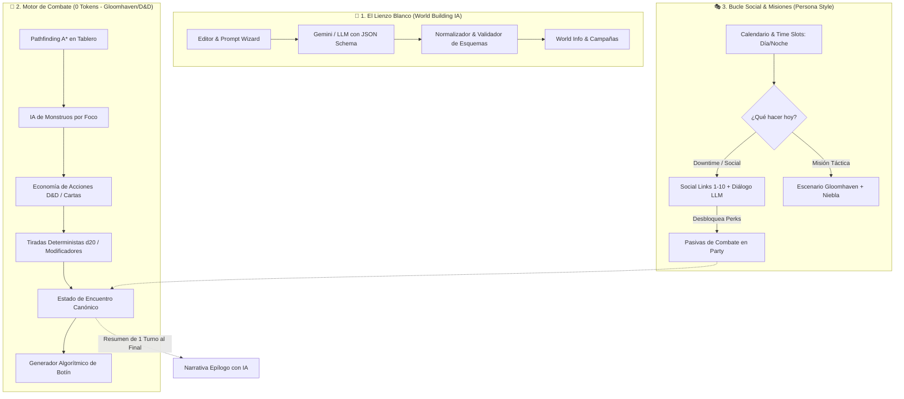
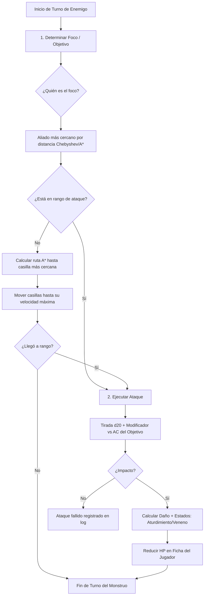
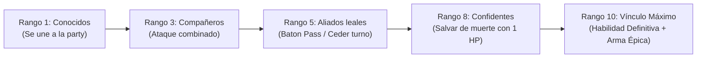

# ⚔️ Propuesta de Diseño & Arquitectura: Motor Híbrido RPG
## *D&D 5e + Gloomhaven (Táctica) + Persona (Vínculos & Tiempo) en SillyTavern*

> **Objetivo**: Convertir tu fork de SillyTavern (`my-silly`) en un videojuego de rol completo, con un **Lienzo Blanco de World Building** asistido por IA, un **Motor de Combate Táctico 100% Determinista (0 Tokens)** estilo Gloomhaven, y un **Bucle Social y de Calendario** estilo Persona.

---

## 📍 Qué es este documento (2026-09-22)

Esta propuesta se escribió el **2026-09-20, antes de escribir una sola línea de código**. Se construyó casi entera: los tres pilares están en pie y jugables.

Se conserva por dos razones, y ninguna es llevar la cuenta de nada:

1. **El diseño sigue siendo el del motor de hoy** — la separación entre narración y estado, los perfiles tácticos de enemigo, los rangos de vínculo con perks reales.
2. **La tabla de más abajo**, con lo que la realidad desmintió. Es la parte cara: son los errores que ya se pagaron.

> [!IMPORTANT]
> **Esto no es un marcador.** Lo que falta y en qué orden está en **[[POR_HACER]]**; el plan, en [[ROADMAP]]. El texto original se conserva tal cual, con notas de corrección donde hizo falta.

**Lo que la propuesta acertó**: elegir JavaScript sobre Unity o Python; que el combate no necesita al modelo; y el orden combate → Persona → Lienzo Blanco.

**Lo que corrigió la realidad**:

| La propuesta decía | Lo que pasó |
| :--- | :--- |
| El combate cuesta tokens y el motor los ahorra | El combate turno a turno **nunca costó nada**: los mensajes de sistema no llegan al modelo. Lo que se gana es jugabilidad ([[ROADMAP]] §1) |
| «Menos de 300 tokens en todo el combate» | Confundía el tamaño del prompt con el coste de la llamada; ver la nota en *El Puente Narrativo* |
| La niebla de guerra ya existía | No existía; se construyó en la Fase A |
| A* es lo primero | Sobre una cuadrícula sin obstáculos es una línea recta: primero hicieron falta los obstáculos |
| Los rangos suben con `analyzeRelationshipsFromChat` | Suben por **acciones registradas**; el analizador solo puede sugerir |
| Generar con Gemini | Interfaz agnóstica de proveedor |
| 1–2 meses | La lógica llevó dos días; lo lento fue conectarla y comprobarla ([[ROADMAP]], *Sobre los Plazos*) |
| No contemplaba un paquete de reglas | Hizo falta: sin él no hay «añadir armas sin tocar código» (Fase C) |

---

## 🧭 1. Diagnóstico de tu Estado Actual: ¿Dónde estás parado?

Antes de elegir tecnologías o escribir código, es crucial valorar lo que ya has construido en `my-silly`:

1. **Patrimonio de Código Sólido**: Cuentas con más de 24.000 líneas propias repartidas en 38 archivos nuevos (`dnd-system.js`, `party.js`, `combat-rules.js`, `campaigns.js`, `world-map-renderer.js`, `dynamic-context-manager.js`).
2. **Cero Colisiones con Upstream**: La regla de oro aplicada en la Batería 0 (*"código nuevo va en archivo nuevo"*) te ha permitido integrar 194 commits de SillyTavern sin perder una sola funcionalidad.
3. **Infraestructura de Tests & Tipos**: La Batería 1 ya dejó 47 tests unitarios para las reglas D&D y 0 errores de tipos en tus archivos clave.
4. **VTT Funcional**: `world-map-renderer.js` ya cuenta con zoom/panning acelerado por hardware, cuadrícula de combate, drag & drop de tokens, distancias Chebyshev y niebla de guerra. *(Corrección 2026-09-21: la niebla de guerra **no existía** al escribir esto; se construyó después, en la Fase A del [[ROADMAP]].)*

> [!IMPORTANT]
> **Tu mayor ventaja competitiva**: No estás empezando desde cero. Ya tienes resuelta la parte más difícil y tediosa de cualquier RPG narrativo: la integración con modelos de lenguaje, el sistema de fichas, el inventario, los mapas y la interfaz de usuario.

---

## ⚖️ 2. Comparativa Tecnológica: ¿Unity? ¿Python? ¿O seguir en JavaScript/Web?

El usuario planteó la duda: *"Estoy abierto a cualquier cosa, desde usar motores con python, unity, seguir solo con javascript con el backend."*

Analicemos las 3 opciones con rigor de ingeniería:

| Criterio | Opción A: Migrar a Unity / Godot | Opción B: Motor Híbrido Python (Sidecar) | Opción C: JavaScript Nativo Desacoplado (Recomendada) |
| :--- | :--- | :--- | :--- |
| **Tiempo de Desarrollo** | 🔴 **Muy Lento (6-12 meses)**: Reescribir UI de chat, streaming SSE, lorebooks, modales, inventario. | 🟡 **Medio (3-5 meses)**: Mantener frontend web y comunicar vía WebSockets/REST con un proceso Python. | 🟢 **Rápido (1-2 meses)**: Aprovecha el 100% de la base instalada. Construcción iterativa. |
| **Gasto de Recursos / Latencia** | 🔴 Pesado. Requiere exportar builds, compilar C#, gestionar cliente pesado. | 🟡 Dos runtimes paralelos (Node.js + Python venv). Latencia IPC por socket en cada acción. | 🟢 **Ultra Ligero**: JavaScript V8 en cliente/Node.js ejecuta A* y tiradas en < 1 ms sin sobrecarga. |
| **Sinergia con SillyTavern** | 🔴 Mínima. SillyTavern quedaría relegado a un backend headless de IA. | 🟡 Media. Rompe la portabilidad del servidor único de SillyTavern. | 🟢 **Total**: Se integra como subsistema de primer nivel sin romper compatibilidad upstream. |
| **Mantenimiento & Despliegue** | 🔴 Complejo. Mantener dos proyectos y sincronizar versiones. | 🟡 Complejo. Scripts de arranque dual, dependencias pip + npm. | 🟢 **Óptimo**: `npm start` sigue levantando todo. Despliegue en 1 clic (local, Docker, servidor). |

### 🏆 Veredicto de Arquitectura: Opción C (JavaScript / TypeScript Modular)
**No abandones el ecosistema web**. Los algoritmos tácticos de Gloomhaven (pathfinding A*, cálculo de cobertura, árboles de decisión de monstruos, tablas de botín) son puramente matemáticos y algorítmicos. En JavaScript corren a velocidad nativa en el navegador del usuario a **cero coste de tokens** y sin depender de ningún proceso externo.

---

## 🧩 3. Arquitectura del Sistema: Los 3 Pilares del Juego



---

## 🎨 Pilar 1: El Lienzo Blanco (World Building Asistido por IA)

### ¿Cómo funciona el concepto de "Lienzo Blanco"?
El jugador o máster no tiene que rellenar decenas de formularios a mano. Mediante un asistente de creación (*World Builder Prompt Wizard*), introduces una idea general y la IA genera las estructuras de datos listas para jugar.

### Flujo de Trabajo
1. **Entrada Libre del Usuario**:
   > *"Quiero un mundo de fantasía oscura victoriana donde la magia proviene de consumir polvo de cometas caídos. Crea la ciudad principal 'Nocturna', tres facciones rivales, y 3 monstruos típicos de las alcantarillas."*

2. **Generación con Gemini usando Structured Outputs (JSON Schema)** *(corrección: agnóstico de proveedor; ver [[ROADMAP]], Fase F)*:
   En lugar de generar texto libre que luego es imposible de parsear, se envía una llamada a Gemini utilizando esquemas estructurados estrictos:
   ```typescript
   interface GeneratedWorldPackage {
     worldMeta: { name: string; synopsis: string; themes: string[] };
     locations: Array<{ id: string; name: string; type: 'city' | 'dungeon' | 'wilderness'; description: string }>;
     factions: Array<{ name: string; goals: string; reputation: number }>;
     bestiary: Array<{ name: string; cr: number; hp: number; ac: number; actions: Array<{ name: string; damage: string; range: number }> }>;
     items: Array<{ name: string; type: string; rarity: string; effects: any[] }>;
     confidants: Array<{ name: string; arcana: string; initialAffinity: number; background: string; combatPerk: string }>;
   }
   ```

3. **Inyección Automática en el Motor**:
   - Las localizaciones se añaden al mapa zoomable como **puntos de interés (POIs)**.
   - Las facciones y el lore se guardan en el **Lorebook** (`world_info`).
   - Los monstruos se registran en el **Bestiario** para poder arrastrarlos al tablero táctico como tokens.
   - Los confidentes se añaden a la lista de personajes reclutables de la **Party**.

---

## ⚔️ Pilar 2: Motor de Combate Algorítmico (0 Tokens — Estilo Gloomhaven)

Este es el núcleo de tu petición: **que el combate sea un juego táctico real, ágil, entretenido y con CERO gasto de tokens**.

### A. La Regla de Oro: Separación Total entre Narrativa y Estado
El LLM **no decide** si un goblin acierta, cuánto daño hace, o adónde se mueve. El motor lógico en JavaScript ejecuta la simulación al 100%.

### B. Algoritmo de IA de Enemigos (Inspirado en Gloomhaven)
En Gloomhaven, los monstruos no necesitan inteligencia artificial generativa; siguen reglas deterministas claras que el jugador puede prever tácticamente:



#### Reglas de Comportamiento del Monstruo:
1. **Determinación del Foco**:
   - Prioridad 1: Miembro de la party más cercano en casillas (usando distancia de tablero).
   - Desempate: El personaje con menor iniciativa o menor HP actual.
2. **Perfiles Tácticos por Tipo de Enemigo**:
   - **Melé Agresivo (ej. Berserker, Lobo)**: Avanza directamente hacia el foco por el camino más corto. Si no alcanza, usa toda su velocidad.
   - **A Distancia / Tirador (ej. Arquero Goblin, Hechicero)**: Si el jugador está a menos de 10 pies (cuerpo a cuerpo), se retira 10 pies hacia atrás (para evitar desventaja) y dispara a distancia máxima.
   - **Protector / Tanque (ej. Caballero, Gólem)**: Se interpone en la línea recta entre los tiradores aliados y los jugadores.
   - **Cobarde / Huida (si HP < 25%)**: Intenta escapar hacia la salida o buscar cobertura.

### C. Sistema de Resolución de Daño y Recompensas (Loot Tables)
- **Tiradas**: Implementadas en `party/combat-rules.js` (`rollDiceDetailed`), mostrando animación visual de dados en pantalla.
- **Economía de Acciones**: Cada participante dispone de:
  - `Movimiento` (pies según velocidad / 5 pies por celda).
  - `Acción Principal` (Atacar, Conjurar, Habilidad, Usar Ítem).
  - `Acción Adicional` (Poción rápida, habilidad de clase).
- **Tablas de Recompensas Algorítmicas**:
  - Al derrotar a un enemigo, el motor consulta una tabla de botín basada en su nivel/CR:
    $$\text{Oro} = \text{CR} \times 10 + \text{roll}(2\text{d}6) \times 5$$
  - Probabilidad de objeto aleatorio (gema, poción, pergamino, arma común/rara) consultada directamente de las tablas D&D en `dnd-system.js`.

### D. El "Puente Narrativo" (Solo cuando tú quieras)
Durante los turnos de combate, la pantalla muestra un **Combat Log** gráfico en el lateral (estilo videojuego CRPG como Baldur's Gate o Solasta). 
**Únicamente cuando el combate finaliza** (victoria o retirada), se le pasa al LLM un prompt condensado:
> *"El grupo acaba de vencer a 3 Goblins tras 4 rondas. El golpe de gracia lo dio Lyra con una descarga de fuego. Describe la escena de victoria en un párrafo conciso."*
> 
**Gasto de tokens en todo el combate: menos de 300 tokens en total.**

> [!WARNING]
> **Corrección (2026-09-21).** Ese «menos de 300 tokens» confunde el tamaño del *prompt del epílogo* con el coste de la *llamada*. Una generación reenvía todo el contexto (prompt de sistema, lorebook, fichas, historial), así que el epílogo cuesta **lo que cuesta una respuesta normal**, no 300 tokens. Y el combate turno a turno ya era gratis antes de este diseño: los mensajes de sistema no llegan al modelo ([[ROADMAP]] §1). Además, hoy el resumen del final **ni siquiera llega al modelo**: es el defecto de B6, todavía abierto.

---

## 🎭 Pilar 3: El Núcleo Persona (Vínculos, Calendario & Gloomhaven Misiones)

La magia de la saga **Persona** reside en el equilibrio entre la vida cotidiana (socializar, subir atributos de personalidad, estrechar lazos) y el combate táctico en mazmorras.

### A. El Sistema de Calendario y Bloques de Tiempo (*Time Slots*)
El juego avanza mediante un reloj o calendario dentro de la campaña:

| Momento del Día | Actividades Disponibles | Consumo de Tiempo |
| :--- | :--- | :--- |
| 🌅 **Mañana / Tarde** | • **Ir a una Misión / Mazmorra** (Inicia escenario táctico Gloomhaven).<br>• **Entrenar / Estudiar** (+Bonos a estadísticas secundarias).<br>• **Forjar / Comprar equipo** en el mercado. | Consume 1 Bloque |
| 🌙 **Noche** | • **Pasar tiempo con un Confidente** (Evento de diálogo social con LLM).<br>• **Descanso Largo / Campamento** (Recupera HP y espacios de conjuro). | Pasa al día siguiente |

### B. Confidants / Social Links (Rangos del 1 al 10)
Cada compañero del grupo (y ciertos NPCs del pueblo/ciudad) tiene un nivel de vínculo social:



#### ¿Cómo interactúa esto con el combate y el LLM?
1. **Subir de Rango**: Al interactuar con el personaje en el chat (conversación guiada por el LLM), el analizador de afinidad (`analyzeRelationshipsFromChat`) detecta el progreso. Al alcanzar el umbral de puntos, se activa el evento de "Rank Up".
   > *Corrección: no se implementó así. Los rangos suben por **acciones registradas** (misión completada, regalo, evento de confidente); el analizador de chat solo puede **sugerir**. Ver [[ROADMAP]], Fase D.*
2. **Beneficios Mecánicos Reales en el Combate**:
   - **Rango 3 - Follow-up Attack**: Si el líder asesta un golpe crítico, el compañero tiene un 50% de probabilidad de realizar un ataque gratuito inmediato.
   - **Rango 5 - Baton Pass**: Tras derrotar a un enemigo, el personaje puede pasar su movimiento restante a otro compañero.
   - **Rango 8 - Endure**: Si el líder va a caer a 0 HP, el compañero con afinidad 8+ se interpone y absorbe el golpe o le permite quedarse a 1 HP (1 vez por día).

### C. Misiones al Estilo Gloomhaven
- **Tablero de Campaña**: El mapa del mundo muestra localizaciones con un marcador de estado:
  - 🔒 *Bloqueada* (requiere información o nivel de relación).
  - ⚔️ *Misión Disponible* (Escenario con objetivos claros: "Eliminar al Chamán", "Sobrevivir 6 rondas", "Rescatar al rehén").
  - ✅ *Completada* (permanece explorada, otorga recompensas pasivas).
- **Estructura de la Mazmorra**:
  - Varias salas interconectadas por puertas cerradas.
  - La niebla de guerra cubre las salas contiguas. Al abrir una puerta, el motor revela los enemigos y activa la tirada de iniciativa.

---

## 🛠️ 4. Plan de Implementación Modular en tu Fork

Para mantener la disciplina del fork y asegurar que todo sea fácil de desarrollar, proponemos estructurar las nuevas capacidades en una carpeta dedicada: `public/scripts/game-engine/`:

```text
public/scripts/
├── game-engine/                    <-- NUEVO MOTOR DESACOPLADO
│   ├── world-builder/              # Lienzo Blanco
│   │   ├── gemini-wizard.js        # Comunicación con API de Gemini (JSON Schema)
│   │   └── schema-validator.js     # Valida y guarda en Lorebook/WorldInfo
│   ├── combat/                     # Motor Táctico 0 Tokens
│   │   ├── grid-pathfinding.js     # Algoritmo A* para casillas del tablero
│   │   ├── enemy-ai.js             # Foco, patrones tácticos y árboles de decisión
│   │   ├── turn-machine.js         # Máquina de estados: iniciativa, rondas, acciones
│   │   └── loot-tables.js          # Recompensas algorítmicas y drop de items
│   ├── persona/                    # Núcleo Social & Tiempo
│   │   ├── calendar-system.js      # Gestión de Días, Turnos Mañana/Noche
│   │   ├── confidant-system.js     # Rangos 1-10 y eventos de progreso
│   │   └── combat-perks.js         # Habilidades pasivas vinculadas a la afinidad
│   └── index.js                    # Punto de entrada unificado
├── world-map-renderer.js           <-- Conexión de clics y rendering de tablero
├── party/combat-rules.js           <-- Reglas D&D y dados ya existentes
└── dnd-system.js                   <-- Fórmulas, AC, inventario y relaciones
```

> [!NOTE]
> **Se siguió la idea, no los nombres.** El árbol de archivos de verdad, siempre al día, está en [[Mapa-Codigo-Archivos]] — copiarlo aquí solo serviría para tener dos versiones y que una fuera mentira.
>
> Las diferencias que importan: `world-builder/` no habla con Gemini sino con **el proveedor que tengas puesto**; `persona/` se llama `campaign/` y agrupa también los escenarios y el mapa de campaña; `grid-pathfinding.js` es `board/pathfinding.js`; y hay una carpeta que la propuesta no contemplaba, **`rules/`**, sin la cual el editor de reglas que pediste no es posible.

---

## 🚀 5. Las tres fases que propuso

**Fase 1 · Motor táctico autónomo** — A* sobre el tablero, IA de enemigos, resolución de ataques, botín al vaciarse el tablero.
**Fase 2 · Sistema Persona** — reloj de calendario, rangos de confidente, perks mecánicas en combate.
**Fase 3 · Lienzo Blanco** — modal de creación de mundos y generación con IA por esquemas.

Las tres se hicieron, en ese orden, y el orden resultó ser el bueno: el combate era lo que sostenía a los otros dos. Lo que quedó fuera — la magia, las actividades de día que no sean descansar, los confidentes que no están en tu grupo — vive en [[POR_HACER]].

---

## 🎯 Conclusión y Siguiente Paso

Tienes en tus manos una oportunidad extraordinaria: **transformar SillyTavern de una interfaz de chat a un juego de rol táctico híbrido de primer nivel**, sin pagar la enorme factura de reescribir todo en Unity y sin arruinarte en tokens de IA durante las batallas.

> [!NOTE]
> **Y así fue.** Se hizo, y sin reescribir nada en Unity: hoy se juega a pantalla completa, con el tablero, los vínculos, el calendario y las campañas de libro. Lo que viene ahora está en [[POR_HACER]].
