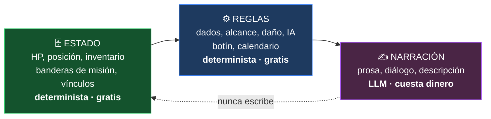
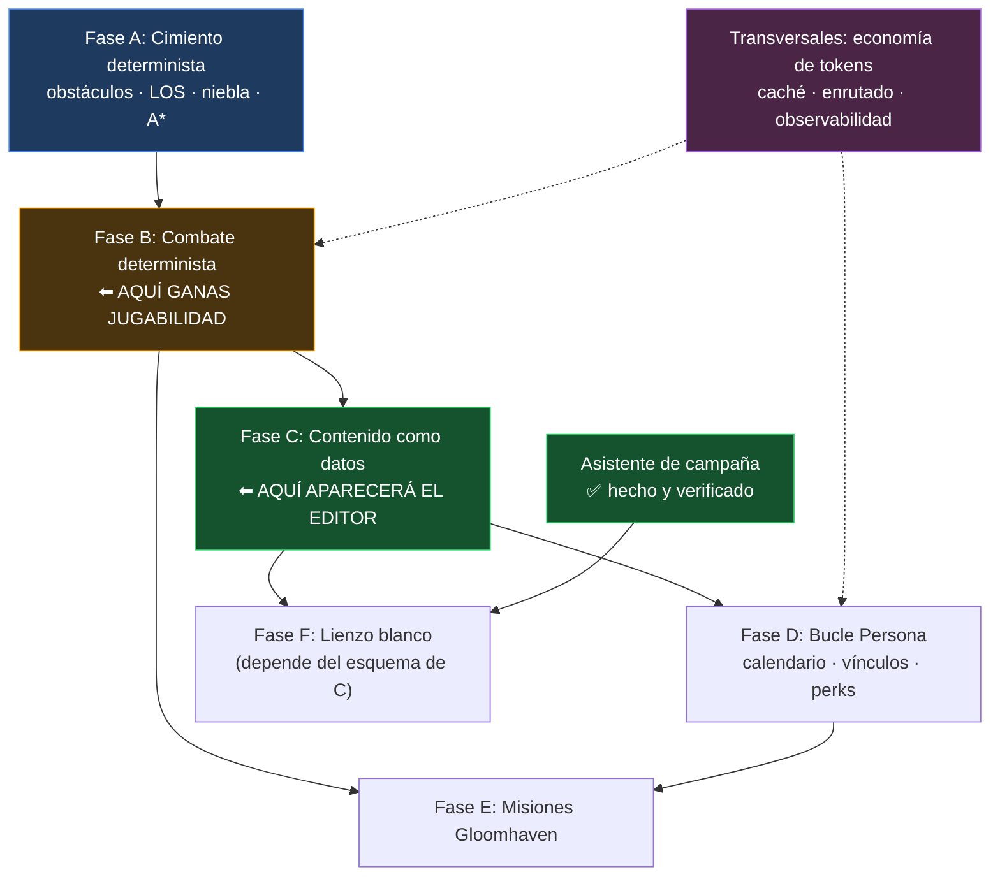

# 🎯 Roadmap — De SillyTavern a un Juego de Rol Táctico Asequible

Plan único de trabajo. Reconcilia tres fuentes: la auditoría de [[PROBLEMAS_TECNICOS]], el catálogo de [[PROPUESTAS_MEJORA]], y el diseño de juego de [[PROPUESTA_JUEGO_DND_GLOOMHAVEN_PERSONA]]. Sustituye a la versión anterior de este documento, que solo cubría higiene de ingeniería.

**El objetivo, en una frase**: un juego de rol táctico donde la IA escribe la historia y las relaciones, y **todo lo demás es lógica determinista**, editable por ti, que no cuesta nada ejecutar.

---

## 📍 Dónde Estamos — 2026-09-21

La lógica de las Fases A a E está escrita y probada. Lo que un jugador puede tocar es menos, y esta tabla separa las tres cosas porque confundirlas fue el error más repetido de este proyecto (ver el *Registro de Correcciones* al final).

| Fase | Lógica y tests | Conectada al juego real | Interfaz |
| :--- | :---: | :--- | :--- |
| **Asistente de campaña** | ✅ | ✅ | ✅ verificado en navegador real |
| **A · Terreno, visión, niebla, rutas** | ✅ | ✅ alcance, muros, niebla y **cobertura en el ataque** | ✅ paleta de pintura · ✅ **puertas con clic** |
| **B · Combate** | ✅ | ✅ **todo, incluida la máquina de turnos** | ✅ registro, rastreador de iniciativa, marcadores de estado |
| **C · Contenido como datos** | ✅ | ✅ cada campaña carga su propio paquete | ✅ **editor visual** (`/rules`) |
| **D · Calendario y vínculos** | ✅ | ✅ pestaña **Campaña** y perks en el combate | ✅ día, rangos y perks · ⬜ descansos |
| **E · Escenarios y tablero de campaña** | ✅ | 🟡 los objetivos deciden el combate · ⬜ salas y puertas | 🟡 objetivos en el tablero |
| **F · Lienzo blanco (IA)** | ✅ | ✅ dentro del asistente | ✅ con previsualización |
| **T · Medir el gasto** | ✅ | ✅ `/prompt` | ✅ desglose por bloque |
| **G · Ingesta de libros** | 🟡 el contrato, hecho | 🟡 `/esquema-campana` | 🟡 · el GEM lo llevas tú, fuera del código |
| **H · Modo videojuego** | 🟡 director y diálogo, hechos y probados | 🟡 `/modojuego` · teclas `1` y `3` | 🟡 dos de las tres pantallas |

> [!NOTE]
> **Cómo leerla.** ✅ hecho y comprobado · 🟡 parcial · ⬜ sin empezar. *Conectada* quiere decir que un jugador puede provocarla: un módulo que solo ejecutan los tests cuenta como ⬜, por bien probado que esté.
>
> Esto ya no se estima, se mide: `node tools/check-engine-wiring.mjs` responde hoy **34 de 35 módulos conectados**. El único que falta es `campaign-map.js` (275 líneas), que espera la escena de exploración (H4).

**Lo que sigue, en este orden:**

1. **El director automático** (H3): que empezar un combate cambie la pantalla y terminarlo la devuelva al diálogo para el epílogo. Las dos escenas que necesita ya existen.
2. **La escena de exploración** (H4), que trae consigo `campaign-map.js`, el último módulo del motor que nadie carga.
3. **La pantalla de título y el menú de pausa** (H5): lo último, porque una fachada sobre escenas a medias no sirve de nada.
4. **Retomar la ingesta** (Fase G): el validador, el compilador y la importación.

La pantalla de combate (H1) y la de diálogo (H2) están hechas desde el 2026-09-21.

**Mientras tanto, el Gem no está bloqueado**: `/esquema-campana` ya entrega el contrato exacto, así que se puede probar con un libro real en paralelo — y lo que se aprenda ahí puede cambiar el contrato, que hoy es barato de cambiar.

La dirección cambió el 2026-09-21 con [[ROADMAP_INGESTA_CAMPANAS_LIBROS]]: la meta deja de ser *«generar un mundo»* y pasa a ser *«meter un libro y jugarlo»*.

Desde el 2026-09-21 lo pendiente está dividido en [[POR_HACER]] por **quién decide**: lo que se puede hacer sin preguntar, lo que necesita una decisión tuya, y las propuestas.

El detalle, con todo lo demás, está en [[POR_HACER]].

> [!TIP]
> **Sesión del 2026-09-21.** Tres bloques. Primero, el defecto del epílogo y todo lo que podía hacerse sin decisiones: cobertura en el ataque, guardián de tiradas conectado, puertas con clic, registro de combate en el tablero real, `/combat-stop`, reglas de encuentro en las campañas nuevas, ESLint a cero y tres herramientas en `tools/`. Después, el bloque de prioridad alta entero: **Fase F** (generar el mundo con IA desde el asistente), **editor visual de reglas** (`/rules`), **paquete de reglas por campaña** y **medición del gasto** (`/prompt`). Y por último, **A1 y A2**: rastreador de iniciativa con marcadores de estado y escalado por tamaño (con `/condition` para ponerlos a mano), y **botín por CR** — ganar da oro, experiencia y objetos. Con eso la **Fase B queda completa** salvo la decisión sobre la máquina de turnos. Todo verificado en un navegador real. El detalle está en [[POR_HACER]], *Hecho*.

---

## 🧱 0. El Principio que Ordena Todo

Tres capas, y la línea que las separa es la decisión de diseño más importante del proyecto:



> [!IMPORTANT]
> **El LLM lee el estado, nunca lo escribe.** Narra lo que el motor ya decidió. En cuanto la prosa del modelo se convierte en la fuente de verdad de un HP o de un rango de vínculo, pierdes a la vez el control, la reproducibilidad y el dinero.

Esta regla es la que hace el juego barato, la que lo hace depurable, y la que permite que sea editable. Todo el resto del documento se deriva de ella.

> [!NOTE]
> **Un matiz verificado en el código (2026-09-21).** El principio se cumple sin excepciones para el combate y los vínculos. Para el estado **narrativo** hay una puerta que ya estaba abierta: el Dynamic Context registra 8 herramientas `dnd_*` con las que el modelo puede cambiar la fase de la campaña, el lugar, las misiones, las banderas y las instrucciones (`dnd_update_state`, `dnd_set_location`, `dnd_manage_quest`, `dnd_set_flag`, `dnd_add_instruction`, `dnd_update_instruction`, `dnd_remove_instruction`, más `dnd_get_campaign_status` para leer). Ninguna toca HP, inventario ni la posición de las fichas. Conviene decidir si el estado narrativo se queda como excepción declarada; lo que no conviene es afirmar que no existe.

---

## 💸 1. De Dónde Sale el Gasto

Antes de planificar hay que entender el gasto, porque determina el orden de las fases.

El coste de una partida **no** lo domina lo que el modelo escribe, sino lo que le mandas leer en cada turno: prompt de sistema, lorebook, fichas del grupo, estado del tablero, historial. Ese bloque se reenvía **entero, en cada llamada**.

```
coste ≈ (tokens de contexto) × (llamadas por sesión) × (precio de entrada)
```

> [!WARNING]
> **Corrección importante (2026-09-21).** Una versión anterior de este documento afirmaba que un combate de 4 rondas costaba ~20 llamadas al modelo y que resolverlo en el motor sería el mayor ahorro del proyecto. **Es falso en este código.**
>
> Verificado en tres pasos:
> 1. `postCombatNarration` llama a `sendSystemMessage`, no al modelo.
> 2. Los mensajes de sistema se crean con `is_system: true` (`system-messages.js`).
> 3. `script.js` filtra el prompt con `chat.filter(x => !x.is_system || ...)`.
>
> **El combate turno a turno siempre ha costado cero tokens**: esos mensajes nunca llegan al modelo. No había nada que ahorrar ahí, y el epílogo, como mucho, *añade* una llamada en lugar de quitar veinte (hoy ni siquiera llega al modelo: ver el defecto de la Fase B).

### Dónde está el gasto, entonces

Estructuralmente solo puede venir de tres sitios, y **ninguno se ha medido todavía**:

- El contexto base de cada turno: prompt de sistema, lorebook, fichas del grupo, instrucciones del Dynamic Context
- El historial real de chat (mensajes de usuario y del modelo), que sí crece
- Cuántos turnos se juegan

| # | Palanca | Dónde |
| :-- | :--- | :--- |
| **1** | **Medir primero.** Vista previa del prompt compilado y contador reconciliado con el proveedor. No se puede optimizar lo que no se ve. | T3, T4 |
| **2** | **Contexto cacheado**: estático delante, volátil detrás, para los proveedores con caché de prompt. | T1 |
| **3** | **Resumen periódico del historial**, para que el contexto no crezca sin límite. | T8 |
| **4** | **Modelo por tarea**: lo mecánico a un modelo pequeño o local. | T2 |

> [!IMPORTANT]
> **Medir va primero, y no es un trámite.** La lección de esta corrección es que una suposición razonable sobre dónde se va el dinero puede estar completamente equivocada, y que un plan construido encima hereda el error. Las tarifas por token además cambian y dependen del proveedor: consulta las vigentes del que uses.

### La consecuencia sobre el orden del plan

Las Fases A y B **no ahorran tokens**. Lo que entregan es jugabilidad: IA que respeta muros, rondas contadas, economía de acciones, un guardián contra tiradas inventadas y un registro legible. Son valiosas, pero conviene llamarlas por su nombre.

---

## ✅ 2. Lo Que Ya Está Hecho

| Batería | Resultado |
| :--- | :--- |
| **B0 · Higiene del fork** | Remote `upstream` con push desactivado · 194 commits integrados (merge `76125af27`) · formateo automático desactivado sobre archivos de upstream · regla *"código nuevo va en archivo nuevo"* escrita en [[Guia-Desarrollo-Flujo]] |
| **B1 · Red de seguridad** | 47 tests para las reglas D&D · gate de tipos acotado al fork (`tools/check-fork-types.mjs`) · `@ts-nocheck` eliminados · CI propio en `push` |
| **B2 · Descomposición** | `party.js` 4.707 → 4.279 líneas (**4.549 hoy**: integrar el combate real lo hizo crecer de nuevo) · `party/combat-rules.js`, `item-forms.js`, `types.js`, `html.js` (y después `positions.js`) · 68 tests nuevos |
| **Seguridad** | XSS del renderizador de mapas (4 puntos, y uno más en la cabecera del tablero, hallado al hacer el asistente) · XSS vivo en `world-content-browser.js` · 11 copias de `escapeHtml` unificadas · límites de palabra Unicode · doble persistencia del grupo |
| **Motor de juego (A–E)** | 18 archivos y 4.666 líneas en `game-engine/` (tablero, combate, campaña, reglas, interfaz) · lógica completa de las Fases A a E con tests · lo que está conectado, en *Dónde Estamos* |
| **Asistente de campaña** | Botón *Nueva campaña* · 4 plantillas · tarjetas *Iniciar* para mundos sin partida · verificado de extremo a extremo (sección propia más abajo) |

**Estado verificable** (medido el 2026-09-21): 1.273 tests en 49 suites · 0 errores de tipos en 49 archivos del fork · **0 errores de ESLint** · 34 de 35 módulos del motor conectados al juego · 124 comprobaciones en navegador real, estables en dos pasadas.

> [!NOTE]
> Este trabajo no era un desvío. Sin el merge no tendrías los 194 commits de upstream; sin los tests no podrías tocar el motor de combate sin miedo; sin el gate de tipos cada refactor sería a ciegas. Las fases que vienen se apoyan en eso.

---

## 🔍 3. El Punto de Partida Real *(foto del 2026-09-20, antes de la Fase A)*

Verificado contra el código, porque el documento de diseño parte de supuestos incorrectos. **Es el punto de partida, no el estado actual: todo lo marcado ❌ ya existe** (Fases A a C).

| Capacidad | Estado real |
| :--- | :--- |
| Zoom, panning, cuadrícula, drag & drop de tokens | ✅ Existe en `world-map-renderer.js` |
| Distancia Chebyshev, celdas alcanzables, dados, fórmulas de daño | ✅ Existe y **con tests** en `party/combat-rules.js` |
| **IA de enemigos** (foco → mover → atacar) | ✅ **Ya existe**: `resolveEnemyTurnAction`, 152 líneas, junto con `startCombat`, `runCombatTurnLoop`, `handlePlayerCombatMove/Attack` |
| **Niebla de guerra** | ❌ **No existe.** Cero coincidencias en todo `public/` |
| **Obstáculos, muros, terreno** | ❌ **No existen en el modelo de datos** |
| **Contenido editable** (armas, ataques, condiciones) | ❌ **25 tablas codificadas en JavaScript**, ~270 líneas en `dnd-system.js` |

> [!WARNING]
> **Dos correcciones que cambian el plan de la propuesta de diseño:**
>
> 1. **A\* sobre una cuadrícula sin obstáculos es una línea recta.** Ya tienes eso resuelto con Chebyshev. A* solo aporta cuando hay paredes que rodear — y las paredes no están en el modelo. Implementar A* antes que los obstáculos es trabajo tirado.
> 2. **La IA de enemigos no se escribe desde cero, se refactoriza.** `resolveEnemyTurnAction` ya hace foco por proximidad, movimiento y ataque. Lo que falta son los perfiles tácticos, no el esqueleto.

---

## 🟡 Fase A — El Cimiento Determinista `MOTOR COMPLETO — 2026-09-20`

> **Por qué primero**: nada del combate táctico existe sin esto.

| ID | Tarea | Resultado |
| :--- | :--- | :--- |
| **A1** | Modelo de obstáculos y terreno. | ✅ `game-engine/board/terrain.js` · 30 tests |
| **A2** | Línea de visión. | ✅ `game-engine/board/line-of-sight.js` · 25 tests |
| **A3** | Niebla de guerra. | ✅ `game-engine/board/fog-of-war.js` · 21 tests |
| **A4** | Pathfinding A*. | ✅ `game-engine/board/pathfinding.js` · 28 tests |
| **A5** | Tests. | ✅ **104 tests** |
| **A6** | Integración visual: editor de terreno y renderizado de niebla. | ✅ Capas en `world-map-renderer.js` + paleta de pintura |

### Decisiones de diseño que conviene recordar

**Almacenamiento disperso.** Terreno y niebla guardan solo las excepciones, no una matriz densa. Un tablero de 50×50 son 2.500 celdas y casi todas son suelo; esto vive dentro del world info, así que el tamaño importa. Un tablero entero de suelo abierto ocupa menos de 60 bytes.

**Tipos de terreno como tabla de datos, no como `switch`.** `TERRAIN_TYPES` ya tiene la forma que la Fase C necesita, así que extraerlo a un paquete de reglas será una mudanza, no una reescritura.

**La línea de visión es simétrica por construcción.** Bresenham elige distintas celdas según desde qué extremo empieces, así que un muro puede dejar que A vea a B sin que B vea a A. En un táctico eso se lee como un bug. La primera implementación **falló el test de simetría en 102 pares**; la solución fue canonicalizar el orden de los extremos para que el cálculo sea bit a bit idéntico en ambos sentidos. Hay un test que recorre los 10.000 pares de un mapa con muros.

**Tres estados de niebla**: `unknown`, `explored`, `visible`. Solo `explored` se persiste, porque es lo único que es memoria. Y la memoria recuerda el terreno, **no las criaturas**: un goblin que entró detrás de ti no aparece.

**No se cortan esquinas en diagonal.** Pasar entre dos muros que se tocan por la esquina no es legal por defecto, porque permite atravesar paredes diagonales selladas. Configurable con `allowCornerCutting`.

### Ya está conectado

`getReachableCells` sustituye al `buildReachableCells` anterior en los dos puntos de `party.js` que resaltan movimiento. Los tableros sin terreno se comportan igual que antes — un terreno vacío es suelo abierto — y pasan a respetar muros y terreno difícil en cuanto un tablero tenga terreno definido.

**A6 está completo** (capas de terreno y niebla, paleta de pintura, y desde el 2026-09-21 las **puertas se abren con un clic** y la **cobertura cuenta en el ataque**).

Sobre la cobertura conviene ser exacto: cuenta la de la **casilla del objetivo**, que es la regla que `getCoverBonus` documenta. D&D 5e la calcula sobre la línea entre atacante y objetivo, lo que exige trazarla; el sitio donde hacerlo ya está aislado en una función (`getTargetArmorClass`), así que afinarlo después no mueve ninguna llamada. El registro lo dice en voz alta — *«incluye +2 por cobertura media»* — porque una tirada que cambia sin explicar por qué es indistinguible de un error.

---

## 🟢 Fase B — El Combate Determinista `COMPLETA — 2026-09-21`

> **Qué entrega**: un combate que respeta el terreno y cuenta rondas (y, cuando se conecte el guardián, no se inventa tiradas). **No ahorra tokens** — ver la corrección de la sección 1: el combate ya era gratis.

| ID | Tarea | Resultado |
| :--- | :--- | :--- |
| **B1** | Máquina de turnos: iniciativa, rondas, estado de turno. | ✅ `combat/turn-machine.js` · 40 tests · **conectada**: es la que corre el combate real |
| **B3** | Economía de acciones: movimiento, acción, adicional, reacción. | ✅ En la misma máquina, y **en uso**: atacar gasta la acción del turno |
| **B2** | Perfiles tácticos de enemigo. | ✅ `combat/enemy-ai.js` · 33 tests · **conectado** (`planEnemyTurn`) |
| **B7** | Interceptar tiradas alucinadas (`PROP-135`). | ✅ `combat/roll-guard.js` · 33 tests · **conectado** a cada mensaje del modelo |
| **B4** | Combat log gráfico que sustituye la narración por turno. | ✅ `ui/combat-log.js` · 25 tests · marco pixel art · **montado en el tablero real** |
| **B6** | Resumen único al terminar el combate. | ✅ **Llega al modelo** como mensaje de narrador — ver ⬇️ |
| **B5** | Botín algorítmico por CR. | ✅ `combat/loot.js` · 23 tests · oro, PX y objetos repartidos entre los supervivientes |
| **B8** | Rastreador de iniciativa, marcadores de estado, escalado por tamaño. | ✅ `combat/initiative-tracker.js` · 34 tests · más `/condition` |

> [!IMPORTANT]
> **B6: el defecto que este documento dio por hecho, y cómo se cerró.** Hasta el 2026-09-21 `endCombat` publicaba el resumen con `postCombatNarration`, es decir como mensaje de sistema. `script.js` filtra esos mensajes del prompt (`chat.filter(x => !x.is_system ...)`), el mismo mecanismo de §1 que hace gratis el combate. El jugador veía el resumen y **el modelo nunca lo recibía**. Nada fallaba, ningún test protestaba, y el comentario sobre ese código afirmaba lo contrario. Estaba *enganchado*, no *funcionando*.
>
> El arreglo no fue cambiar una bandera sino quitar la ocasión de volver a equivocarse. `game-engine/ui/chat-channel.js` obliga a quien publica a **nombrar el público** — `CHANNEL.PLAYER` o `CHANNEL.MODEL` — y deriva `is_system` de ahí. Sus tests comprueban lo que de verdad importa, *¿lo lee el modelo?*, en lugar de la bandera que lo implementa. En `party.js` conviven ahora dos funciones con nombres que no se confunden: `postCombatNarration` (solo el jugador, gratis) y `postForModel` (también el modelo).
>
> **No dispara ninguna llamada.** El mensaje se queda en el chat y entra en el prompt de tu siguiente turno, así que un combate terminado sigue costando cero por sí mismo.
>
> Verificado en un navegador real (`tools/e2e-campaign.mjs`): tras `/combat-stop`, el último mensaje del motor tiene `is_system=false`. La comprobación va por el resultado, no por la intención.

### Lo que se arregló al portar la IA

La versión dentro de `party.js` tenía dos defectos que solo se ven al escribirle tests:

1. **Se movía en línea recta con `Math.sign` y atravesaba muros.** Ahora usa el A* de la Fase A.
2. **El alcance de ataque estaba fijo a 5 pies**, daba igual qué empuñara la criatura.

Además, el modelo de encuentro **no contaba rondas**, solo un índice dentro del orden de iniciativa. Sin contador de rondas no hay forma de resolver *"sobrevive 6 rondas"* ni de hacer expirar la duración de un conjuro. Ahora las cuenta el propio `party.js` (la máquina de turnos `turn-machine.js` también lo hace, pero no está conectada), y los encuentros guardados antes de que existiera el contador se reanudan en la ronda 1 en vez de fallar.

### Los cuatro perfiles tácticos

| Perfil | Comportamiento |
| :--- | :--- |
| **Agresivo** | Se acerca al objetivo alcanzable más cercano por la ruta más corta y ataca. |
| **Tirador** | Mantiene distancia. Si algo lo alcanza en cuerpo a cuerpo, retrocede y luego dispara. |
| **Guardián** | Se interpone entre la amenaza y el aliado suyo peor herido. |
| **Cobarde** | Pelea mientras está sano; por debajo del 25% de vida huye y deja de atacar. |

La elección de objetivo usa **distancia de camino, no distancia en línea recta**: un personaje al otro lado de un muro deja de parecer más cercano de lo que está.

> [!IMPORTANT]
> **La IA devuelve un plan, no ejecuta nada.** `planEnemyTurn` entrega `{ focusId, path, destination, movementCostFeet, action, targetId, rationale }` y quien llama lo aplica. Eso es lo que permite testear al oponente de forma exhaustiva — y testearlo exhaustivamente es la única razón para confiar en un enemigo que nadie supervisa.

> [!NOTE]
> **Desempates deterministas.** Cuando dos casillas son tácticamente idénticas, el ganador dependía del orden en que el algoritmo de inundación las visitó: estable, pero imposible de razonar. Ahora hay una preferencia fija arriba-izquierda. Cuesta cero y garantiza que la misma situación produce siempre el mismo movimiento, que es la promesa entera de un oponente determinista.

### Sobre el guardián de tiradas (B7)

Solo corrige **afirmaciones estructuradas**: notación de dados seguida de un total (`1d20+5 = 23`, `2d6 -> 9`, `1d8: 4`, `2d6+3 (12)`). La prosa suelta se deja intacta, porque reescribirla exigiría entender la frase y una reescritura que se equivoca es peor que ninguna. El prompt debe pedir la forma estructurada; esto la hace cumplir.

Incluye `isClaimPossible`, que detecta el caso que más importa: totales que los dados **no pueden producir** (un `1d20+5` no puede dar 30).

**Conectado desde el 2026-09-21**, sobre cada mensaje que llega del modelo. Con un matiz que decide cómo se juega:

| Modo | Qué hace | Cuándo |
| :--- | :--- | :--- |
| `imposibles` *(por defecto)* | Corrige solo los totales que los dados **no pueden dar** | Siempre: es aritmética, no opinión |
| `estricto` | El motor tira por **todas** las tiradas del modelo | Si quieres que el motor sea la única autoridad sobre los dados |
| `off` | No toca nada | — |

Se cambia con `/rollguard`. El modo viaja en el metadato del chat, así que es por campaña.

**Por qué `imposibles` es el defecto**: `guardRolls` re-tira cada afirmación, de modo que un `1d20+5 = 18` perfectamente legítimo se sustituye igualmente por otro número. Es la lectura fuerte de *«el motor decide»*, y es defendible, pero aplicada a todo el chat sorprende. Corregir un total imposible, en cambio, no admite discusión. Cada corrección se anuncia en el registro.

### La interfaz (A6 + B4)

El renderizador gana dos capas nuevas: **terreno** bajo los tokens (es el tablero, no un adorno encima) y **niebla** sobre todo lo demás. Ambas dibujan solo lo necesario — el terreno pinta únicamente las celdas que no son suelo, igual que se almacenan.

El **editor de terreno** se abre con el botón *Terreno* bajo el tablero: eliges pincel (muro, terreno difícil, cobertura media o de tres cuartos, puerta) y pintas arrastrando. El terreno se guarda en el world info del tablero, así que sobrevive a la recarga. La niebla se activa por tablero con su propio interruptor.

El **registro de combate** tiene marco de pixel art generado con PixelLab (`public/img/game-engine/`), recortado en dos piezas y aplicado como `border-image` con los cortes medidos sobre el filete ámbar del arte original. Cada línea muestra el desglose de la tirada — `1d20+5 · 17 · vs 15` — porque un jugador que puede auditar cualquier resultado es lo que hace aceptable un resolutor que nadie supervisa.

> [!IMPORTANT]
> **Cada línea de ese registro es determinista y gratis** — y lo era ya antes: esas frases eran mensajes de sistema que el modelo nunca leyó (§1). Lo que aporta el registro es legibilidad y poder auditar cada tirada, no ahorro. Al modelo le queda el único trabajo que hace bien: el epílogo, cuando llegue a leerlo (ver el defecto de B6).

### Integrado el 2026-09-21

| Qué | Antes | Ahora |
| :--- | :--- | :--- |
| Movimiento enemigo | Línea recta con `Math.sign`, atravesando muros | `planEnemyTurn` con A* y perfiles tácticos |
| Alcance de ataque | Fijo a 5 pies | El del enemigo (`attackRangeFeet`) |
| Rondas | No se contaban | Contadas al dar la vuelta al orden, y anunciadas |
| Fin de combate | Solo un resumen de estado | Más un resumen condensado para la narración (**publicado, pero aún no llega al modelo**) |

Los encuentros guardados sin contador de rondas se reanudan en la ronda 1 en vez de fallar.

**La Fase B está completa.** La máquina de turnos se conectó el 2026-09-21, tras decidirlo: el combate real la usa y hay **una sola definición de turno** en el proyecto, con acción, acción adicional y reacción. Había dos, y el juego usaba la más pobre.

Lo que queda encima son perks y contenido, no mecánica: las perks de vínculo (A1) y convertir el botín en objetos equipables (A5).

### Cerrado el 2026-09-21

| Qué | Cómo |
| :--- | :--- |
| El epílogo llega al modelo (B6) | Mensaje de narrador vía `chat-channel.js` |
| El registro está en el tablero real (B4) | Se alimenta de las líneas de combate y del desglose de cada tirada; se vacía al empezar un combate |
| El guardián está conectado (B7) | Sobre cada mensaje del modelo, con `/rollguard` |
| Se puede abandonar un combate | `/combat-stop`. Antes solo se salía ganando o muriendo, así que el epílogo era inalcanzable sin cadáveres. El resumen distingue abandono de derrota, porque anunciar como derrotado a un grupo intacto pone al modelo a escribir la escena equivocada |
| Las campañas nuevas permiten combatir | Las plantillas escribían `encounterRules: []` y `/fight` respondía *«enemigo no encontrado»* en toda campaña recién creada. El id de un monstruo es el de su entrada de world-info, que no existe cuando se construye el tablero: ahora las reglas se escriben después, ya con los ids |

> [!NOTE]
> **Las dos últimas las encontró el recorrido en navegador, no los tests.** `/combat-stop` no existía y las reglas de encuentro estaban vacías; ninguna de las dos cosas rompía ningún test, porque ningún test intentaba jugar una partida. Es el mismo patrón que el asistente de campaña, y la razón de que `tools/e2e-campaign.mjs` esté ahora en el repositorio.

---

## 🟢 Fase C — Contenido Como Datos (El Editor) `COMPLETA — 2026-09-21`

> **Por qué importa**: es tu requisito explícito — *"que yo pueda añadir tipos de ataques, armas, armaduras"*. Hoy es **imposible sin editar JavaScript**.

Ningún documento previo recogió esto. Las 25 tablas de `dnd-system.js` (`ITEM_WEAPON_DAMAGE_TYPE_OPTIONS`, `ITEM_WEAPON_FLAG_DEFINITIONS`, `CONDITIONS`, `ALIGNMENTS`…) son constantes de código. Mientras sigan ahí, no hay editor posible.

| ID | Tarea | Notas |
| :--- | :--- | :--- |
| **C1** | Extraer las 25 tablas a un paquete de reglas en datos. | ✅ `rules/default-ruleset.js` — 165 líneas fuera del código |
| **C2** | Esquema de validación del paquete. | ✅ `validateRuleset` · 36 tests |
| **C4** | Migración versionada de esquemas. | ✅ `migrateRuleset` + `RULESET_SCHEMA_VERSION` |
| **C5** | Exportación diferencial de paquetes. | ✅ Importar y exportar desde el propio editor |
| **C3** | **Editor visual** de armas, daños, propiedades y condiciones. | ✅ `/rules` · `ui/rules-editor.js` + `rules/editor-model.js` · 26 tests |

> [!IMPORTANT]
> **Cómo se resolvió lo de «cambiar de paquete exige recargar».** `dnd-system.js` fija sus tablas en el momento de cargarse (`const RULES = getActiveRuleset()`), así que un paquete instalado después no tenía efecto, y eso hacía imposible *«cada campaña con sus reglas»*. No se podía esquivar reordenando imports: el grafo de módulos lo decide el navegador.
>
> La salida fue instalarlo **antes**. `ruleset.js` lee el paquete recordado en su propio cuerpo de módulo, y como `dnd-system.js` lo importa, se evalúa primero. El paquete de la campaña se guarda al abrirla, se recuerda, y en la siguiente carga ya está puesto. La recarga sigue siendo necesaria una vez, y se te ofrece con un botón en lugar de dejarte adivinando.
>
> Un paquete que ya no valida — porque el esquema avanzó o porque alguien lo editó a mano — cae al de por defecto **entero**: media lista de condiciones vaciaría en silencio todas las fichas.

### El editor (C3)

`/rules` abre las 25 secciones del paquete de la campaña. Cada una se dibuja como la misma tabla, porque `rules/editor-model.js` las aplana a filas de hasta tres campos; las que tienen estructura propia (las ranuras de equipo, las subcategorías) se editan como JSON, que es más honesto que una tabla que pierde su forma al volver.

Tres decisiones que conviene recordar:

**Abrir y guardar sin tocar nada no cambia el paquete.** Suena obvio y no lo fue: la primera versión **borraba** los campos de un flag que ninguna columna muestra — a qué tipos de objeto se aplica una propiedad — y **perdía** la opción vacía con la que empiezan varias listas. Ambas cosas se llevaban por delante un paquete correcto. Hay un test que recorre las 25 secciones comprobando exactamente eso.

**Lo que cambia se ve.** Un punto junto a cada sección que difiere de las reglas de por defecto, comparando valores en vez de recordar ediciones: un cambio hecho y deshecho deja de contar, que es lo que una persona entiende por «cambiado».

**Las reglas viven en el mundo**, no en los ajustes. Así viajan al exportar la campaña, y dos campañas pueden no estar de acuerdo sobre qué es un arma.

### Cómo funciona un paquete

Un paquete es JSON plano y se **fusiona sobre el paquete por defecto**, no lo sustituye. Uno que solo quiere añadir un tipo de daño no tiene que reescribir todo D&D 5e:

```json
{ "id": "mi-campana", "name": "Mi campaña", "version": 1,
  "items": { "damageTypes": [["void", "Vacío"]] } }
```

Tres decisiones que conviene recordar:

**Un paquete roto cae al por defecto entero, no a medias.** Medio paquete de reglas es peor que ninguno: una lista de condiciones ausente vaciaría en silencio todas las fichas.

**La fusión es por sección, no por elemento.** Un paquete que define `items.damageTypes` reemplaza la lista entera en vez de entremezclarse con la de origen. Entremezclar listas produce resultados que nadie pidió y que no se pueden deshacer desde el editor.

**La exportación es diferencial.** `toPortablePack` omite todo lo idéntico al paquete por defecto, así un archivo compartido dice qué cambia en vez de repetir el reglamento entero.

> [!NOTE]
> `dnd-system.js` fija sus exports al cargar, así que **cambiar de paquete exige recargar**. Está dicho en vez de esquivado: la alternativa era convertir cincuenta imports planos en llamadas a accesores, para comprar un cambio en caliente que un juego de un solo jugador no necesita.
>
> La prueba de que el traslado no cambió nada: **los 758 tests anteriores pasaron sin tocar uno solo.**

> [!IMPORTANT]
> **C1 es también lo que hace viable la Fase F.** Un generador de contenido con IA necesita un esquema contra el que validar. Sin paquete de reglas, el "lienzo blanco" produce datos que el motor no sabe interpretar.

**Entregable jugable**: creas un "Hacha de Guerra Élfica, 1d10 cortante, versátil, alcance 5 pies" desde un formulario, y aparece en el juego.

---

## 🟢 Fase D — El Bucle Persona `CONECTADA — 2026-09-21`

> **Por qué después del combate**: las perks de vínculo son mecánicas *de combate*. Sin motor táctico no hay dónde engancharlas.

| ID | Tarea | Resultado |
| :--- | :--- | :--- |
| **D1** | Calendario y bloques de tiempo. | ✅ `campaign/calendar.js` |
| **D2** | Rangos de vínculo 1–10 por eventos registrados. | ✅ `campaign/bonds.js` |
| **D3** | Perks mecánicas (rangos 3, 5, 8, 10). | ✅ Las de rango 3, 5 y 8 cambian el combate · `combat/bond-perks.js` · 21 tests · ⬜ la de rango 10 es contenido, no una regla |
| **D4** | Eventos de confidente: el motor decide, el LLM escribe. | ✅ `recordBondEvent` devuelve `rankedUp` y las perks desbloqueadas |
| **D5** | Descanso corto y largo. | ⬜ Pendiente |
| **D6** | 🖥️ Interfaz del calendario y de los vínculos. | ✅ Pestaña **Campaña** · `ui/campaign-panel.js` + `campaign/campaign-view.js` · 19 tests |

> [!WARNING]
> **Corrección a la propuesta Persona.** Planteaba subir los rangos con `analyzeRelationshipsFromChat`, un analizador heurístico sobre la salida del LLM. Eso es exactamente el acoplamiento que el propio documento condena para el combate: el modelo decidiendo, de forma indirecta y no reproducible, cuándo desbloqueas una mecánica.
>
> **Los vínculos suben por acciones registradas**: completar una misión con el personaje, regalarle un objeto, elegir una opción en un evento. El analizador de chat puede seguir existiendo como *sugerencia* ("parece que la conversación fue bien, ¿+1 punto?"), nunca como autoridad.

### Cómo suben los vínculos

Diez rangos con **umbrales crecientes** (0, 6, 14, 24, 36, 50, 66, 84, 104, 126), así que los últimos se ganan en vez de acumularse por aparecer. Los puntos vienen de una tabla de **eventos que el motor puede señalar**: misión completada juntos, regalo acertado, escena de confidente, le salvaste la vida. Y también de los que restan: regalo desafortunado, le dejaste caer, traición.

`recordBondEvent` devuelve `rankedUp` y `unlockedPerks`, que es justo el momento de mostrar una escena — escrita por el modelo, a partir de un hecho que el motor ya decidió.

`suggestBondEvent` es la costura donde la heurística sí puede vivir: propone (*"la conversación reforzó el vínculo, ¿confirmas +1?"*) y el jugador decide.

### La interfaz (D6)

Una pestaña **Campaña** junto a Party y Location. Arriba, el día y en qué parte del día estás, con *Pasar el rato* y *Dormir*; debajo, una ficha por compañero con su rango, lo que le falta para el siguiente, y **las cuatro perks: las que tiene y las que no**. Ver qué da el rango 8 es la razón para seguir pasando tardes con alguien.

Los eventos se registran desde ahí, o con `/bond` y `/time`. Y uno lo registra el motor por su cuenta: **un combate ganado juntos**, que es la decisión de diseño entera — la narración no decide cuándo sube un vínculo.

> [!NOTE]
> **La pestaña se crea desde `party.js`, no desde `index.html`.** Ese archivo es de upstream y cada línea que el fork le añade se paga en cada merge; dos llamadas a `insertAfter` cuestan lo mismo y no cuestan nada después.

### Las perks, ya en el combate (D3)

El argumento del propio documento de diseño era que los vínculos tenían que ser mecánicos: *«un vínculo que no cambia cómo va un combate es solo un número en pantalla»*. Hasta el 2026-09-21 eran exactamente eso.

| Perk | Rango | Qué hace |
| :--- | :---: | :--- |
| **Ataque de seguimiento** | 3 | Un crítico da a un compañero que ya alcance al objetivo un 50% de atacar gratis. Se resuelve como un ataque de verdad: tira, puede fallar, sale en el registro |
| **Relevo** | 5 | Al derrotar a un enemigo puedes ceder el movimiento que te quede, con `/relevo`. Una oferta, no un automatismo |
| **Aguantar** | 8 | Un compañero se interpone y te deja a 1 HP. Una vez al día, solo ante un golpe realmente letal, y nunca para salvarse a sí mismo |
| **Vínculo máximo** | 10 | Sigue siendo contenido — arma y habilidad propias — no una regla |

> [!IMPORTANT]
> **Decidir y aplicar están separados.** `combat/bond-perks.js` solo responde *«¿salta, y sobre quién?»*; aplicar el daño, gastar la perk y escribir la línea del registro es de `party.js`. Es la misma división que hace testeable a la IA de enemigos, y por la misma razón: son efectos que nadie supervisa mientras juegas.
>
> Las restricciones importan tanto como el efecto. *Aguantar* solo salta ante un golpe que de verdad tumbaría — una perk que salta con cada rasguño hace el combate imposible de perder en vez de tenso — y el *ataque de seguimiento* exige que el compañero ya pudiera alcanzar al objetivo, porque un golpe gratis desde el otro extremo de la sala vaciaría de sentido la posición, que es el juego entero.

**Entregable pendiente**: los descansos (D5) y decidir qué es el vínculo de rango 10.

---

## 🟡 Fase E — Misiones Estilo Gloomhaven `OBJETIVOS CONECTADOS — 2026-09-21`

| ID | Tarea | Resultado |
| :--- | :--- | :--- |
| **E1** | Escenarios con objetivos evaluados por el motor. | ✅ `campaign/scenarios.js` — 7 tipos de objetivo |
| **E2** | Salas y puertas sobre el modelo de terreno. | ✅ `campaign/campaign-map.js` |
| **E3** | Tablero de campaña con requisitos. | ✅ En el mismo módulo |
| **E4** | Seguimiento de misiones. | ✅ `QuestState` con sello de día |
| **E5** | 🖥️ Interfaz de escenarios y tablero de campaña. | ✅ Objetivos en el panel del combate · `combat/scenario-board.js` · 18 tests · ⬜ el tablero de campaña |

### Los siete tipos de objetivo

`eliminate` · `eliminate_all` · `survive_rounds` · `reach_cell` · `escort` · `protect` · `loot`

Están como **tabla de datos**, no como `switch`, para que la Fase C pueda llevarlos a un paquete de reglas. Cada entrada declara qué campos necesita y el motor hace el resto.

**Los objetivos opcionales pagan, no bloquean.** Uno sin completar no impide la victoria; uno fallido no causa la derrota. Es lo que los hace opcionales en vez de requisitos escondidos.

### Salas, puertas y enemigos dormidos

Una sala es un conjunto de celdas más las puertas que llevan a ella. `openDoor` devuelve las tres cosas que siempre se mueven juntas — terreno nuevo, salas nuevas y los enemigos que despiertan — porque separarlas invita a olvidarse de una.

> [!IMPORTANT]
> **Un enemigo en una sala sin abrir no toma turnos.** Eso es lo que impide que una mazmorra sea un único combate enorme, y es la diferencia entre explorar y limpiar un mapa.

### El tablero de campaña

Las localizaciones se desbloquean por **requisitos que el motor comprueba**, no por confianza: misiones completadas, otras localizaciones superadas, o un rango de vínculo mínimo. `explainLock` devuelve el porqué, para un aviso que explica en vez de limitarse a negarse.

### Los objetivos, ya en el combate (E1 · E5)

Hasta el 2026-09-21 **todos los combates de este juego eran «mata a todo el mundo»**, que es justo el escenario para el que un motor táctico menos falta hace. Siete tipos de objetivo llevaban meses sabiendo juzgarse y nadie se lo preguntaba.

Ahora un tablero puede llevar una misión, y si la lleva es ella la que decide el combate:

- **Ganar sin matar a nadie**: *aguantar 3 rondas* se cumple con todos los enemigos en pie.
- **Perder sin morir**: *proteger a X* se falla si X cae, aunque el grupo siga entero.
- **Los opcionales pagan, no bloquean**, que es lo que los hace opcionales y no requisitos escondidos.

Los objetivos se dibujan **encima del rastreador de iniciativa**, porque para qué es el combate manda sobre a quién le toca. Y la mazmorra inicial trae una misión, para que una campaña nueva enseñe qué es un escenario sin que nadie escriba uno a mano.

> [!NOTE]
> **Un tablero sin objetivos se comporta exactamente como siempre**: limpias y ganas. Un escenario sustituye esa regla, no se añade a ella.

**Entregable pendiente**: las salas y las puertas (`campaign-map.js`, E2), que es **el último módulo del motor que nadie carga**. Abrir una puerta debería revelar la sala y despertar a lo que haya dentro — lo que impide que una mazmorra sea un único combate enorme. Y el tablero de campaña con sus requisitos (E3).

---

## 🟢 El Asistente de Campaña — El Camino de Entrada `HECHO Y VERIFICADO — 2026-09-21`

> **Por qué apareció**: al probar el juego surgió una pregunta que ningún documento respondía — *«¿qué pulso para empezar una partida?»*. Empezar exigía siete pasos repartidos en cuatro paneles, y ninguno anunciaba cuál venía después. Crear un mundo desde cero es lo primero que hace cualquier jugador, y era lo más difícil de hacer.

Decisión de orden: **primero el asistente manual, después la IA** (Fase F). El camino de entrada no puede depender de que un proveedor responda ni de tener una clave.

### Qué hace

En la pantalla de bienvenida, el botón **Nueva campaña** abre un diálogo de tres pasos:

| Paso | Pregunta | Qué decide |
| :-- | :--- | :--- |
| 1 | ¿Qué tipo de sitio? | Una de 4 plantillas: mazmorra, bosque, taberna o vacío |
| 2 | ¿Cómo se llama el mundo? | Nombre (siempre se propone uno libre), género y una frase de descripción |
| 3 | ¿Quién va? | Un nombre por línea; se crean como personajes del mundo |

Al confirmar, el juego crea el mundo, abre un chat **vinculado** a él, coloca al grupo en las casillas de inicio de la plantilla y te deja en el primer tablero con el panel abierto. Los mundos jugables que **no tienen ninguna partida** aparecen en la lista de campañas como tarjeta con **Iniciar**.

### Cómo está hecho

| Pieza | Papel |
| :--- | :--- |
| `campaign/starter-templates.js` | Las 4 plantillas **como datos**, con el mapa dibujado en ASCII (`terrainFromAsciiMap`) |
| `campaign/campaign-worlds.js` | Qué cuenta como campaña (`isCampaignWorld`), dónde se empieza (`getStartingPoint`) y nombres libres (`uniqueWorldName`) |
| `ui/campaign-wizard.js` | El diálogo y `createCampaign`, que recibe crear/cargar/guardar **inyectados**: por eso se prueba sin navegador |
| `campaigns.js` | El pegamento con el juego: `openCampaignChat`, `startCampaignWizard`, `startUnstartedWorld` |
| `party/positions.js` | `resolveEntryMapPosition`: de dónde sale la casilla de cada miembro |
| `party.js` → `enterStartingBoard` | Fija ubicación y tablero, y abre el panel del grupo |

Tres decisiones que conviene recordar:

**Crear el mundo primero y negarse a pisar uno existente.** `createCampaign` lanza un error si el mundo ya existe, en vez de sobrescribirlo. Con el nombre saneado como nombre de archivo, dos nombres distintos podían caer en el mismo fichero.

**Abrir el chat por el camino de siempre.** Se reutiliza `doNewChat` con la misma elección pendiente (`pendingWorldChoice`) que ya usaba el selector de mundos, y el éxito se comprueba mirando el **resultado** — `chat_metadata.world_info` igual al mundo — y no la ausencia de errores. Es ese metadato lo que alimenta la lista de campañas.

**Una sola definición de «campaña».** La lista de campañas y World Info discrepaban: un mundo podía existir en uno y no aparecer en el otro. Ahora un mundo con localizaciones y sin ninguna partida se ve como tarjeta *sin empezar*.

### Lo que falló la primera vez, y por qué

La primera versión pasó todos sus tests y **no funcionó**. Lo encontró quien la probó, con capturas:

| Síntoma | Causa real | Arreglo |
| :--- | :--- | :--- |
| Un aviso verde de «creada» y la campaña no aparecía | El asistente creaba el mundo pero **no el chat**, y los chats son lo único que alimenta la lista | `openCampaignChat` abre el chat vinculado y verifica el vínculo |
| Personajes sobre casillas de muro | Las posiciones de la plantilla se escribían pero **nadie las leía**; el grupo caía en (0,0) | `resolveEntryMapPosition` y `enterStartingBoard` |
| «Ya existe un mundo llamado …» en el segundo intento, y el mundo no aparecía en ningún sitio | El primer intento dejó un mundo huérfano, invisible en Campaigns, y el nombre propuesto seguía siendo el de la plantilla | `uniqueWorldName` + tarjetas *Iniciar* |
| Riesgo de pisar un mundo ajeno | Colisión de nombre tras sanear | Se niega a sobrescribir |

> [!WARNING]
> **Por qué los tests no lo vieron.** Los de la primera versión comprobaban que *la plantilla contenía* las casillas de inicio, no que *el juego las leyera*. Verificaban los datos, no el camino. Es el mismo patrón que el epílogo de combate: algo *enganchado* y dado por hecho sin comprobar el efecto.
>
> Lo que sí lo detecta es recorrer el flujo en un navegador real. Se hizo con Playwright y Edge contra un servidor con datos aislados, sembrado con una copia del mundo huérfano real. Comprobó, en instalación limpia: crear → chat vinculado al mundo → grupo en las casillas (2,8) y (3,8) → tablero visible con muros y dos fichas → volver a la bienvenida → la tarjeta figura como campaña en curso. Y sobre el mundo huérfano: tarjeta con *Iniciar* → selector de grupo → arranque → pasa a ser campaña normal.
>
> **Desde el 2026-09-21 eso está en el repositorio**: `tools/e2e-campaign.mjs` levanta su propio servidor con un `--dataRoot` temporal, recorre el juego y limpia al terminar. No toca tus datos y tu servidor de siempre puede seguir abierto. Son 124 comprobaciones: crear la campaña, las posiciones de inicio, el tablero, abrir una puerta, un combate con su registro, que el epílogo **no** sea un mensaje de sistema, y la campaña listada al cerrar.
>
> ```bash
> node tools/e2e-campaign.mjs            # headless
> node tools/e2e-campaign.mjs --headed   # para verlo
> ```
>
> En su primera ejecución encontró dos defectos que ningún test veía: no había forma de abandonar un combate, y ninguna campaña nueva podía iniciar uno.

**Corregido el 2026-09-21**: las plantillas escribían el tablero con `encounterRules: []`, así que `/fight` contestaba *«enemigo no encontrado»* en **toda** campaña recién creada — enemigos definidos y ninguna forma de pelear con ellos. La causa es de orden: el id de un monstruo es el `uid` de su entrada de world-info, que aún no existe cuando `buildWorldMetadata` construye el tablero. Ahora `buildEncounterRules` las escribe después, ya con los ids a la vista.

**Pendiente**: el botón *Generar con IA* (Fase F), que las plantillas sean datos que se puedan añadir sin tocar código (`N-12`; hoy son constantes de JavaScript), y poder editar las reglas de encuentro sin pasar por World Info.

---

## 🟢 Fase F — El Lienzo Blanco `HECHA Y VERIFICADA — 2026-09-21`

> **Por qué al final, aunque sea lo más vistoso**: generar contenido es fácil de enseñar y difícil de integrar bien. Y no arregla nada si el combate todavía no es divertido. Además **depende de C1**: sin esquema no hay nada contra lo que validar.

| ID | Tarea | Notas |
| :--- | :--- | :--- |
| **F1** | **Interfaz agnóstica de proveedor** para salidas estructuradas. | ✅ `generateRaw` + `jsonSchema`, inyectado. Funciona con el conector que tengas |
| **F2** | **Generación validada**. Lo que no valide, se rechaza o se corrige, no se inyecta. | ✅ `world-builder/world-schema.js` · 34 tests |
| **F3** | **Revisión humana antes de inyectar**. | ✅ Previsualización del mapa y los enemigos, con los arreglos listados. 🟡 de solo lectura (POR_HACER A8) |
| **F4** | Inyección en el mundo. | ✅ Por los mismos constructores que una plantilla |


### Cómo funciona

El paso 1 del asistente ofrece una tarjeta más: **Generar con IA**. Escribes en qué mundo quieres jugar — *«una cripta inundada bajo una iglesia en ruinas, con cultistas»* — y una sola llamada devuelve el mundo entero: nombre, género, descripción, el lugar, el tablero con su mapa, y dos o tres enemigos con sus estadísticas y su perfil táctico.

Lo que vuelve **es una plantilla**, idéntica en forma a las cuatro escritas a mano, y sigue exactamente el mismo camino: `buildWorldMetadata`, `buildWorldEntries`, `buildEncounterRules`, el chat vinculado, las casillas de inicio. Esa es la decisión que sostiene la fase entera: si un mundo generado llegara al tablero por una ruta propia, habría dos maneras de existir una campaña y acabarían discrepando.

El mapa se pide **en ASCII** — `#` muro, `.` suelo, `D` puerta, `~` terreno difícil, `c` y `C` cobertura — porque ya existía `terrainFromAsciiMap` y porque es un formato que un modelo escribe bien y una persona puede leer de un vistazo antes de aceptarlo.

### Lo que hace cuando el modelo se equivoca

Un modelo entiende la idea de una mazmorra y es descuidado con la cuadrícula. Cada defecto tiene una respuesta decidida de antemano:

| Lo que devuelve | Qué se hace |
| :--- | :--- |
| Filas de distinto largo | Se igualan, y se te dice |
| Un símbolo que no existe | Pasa a ser suelo, contado y avisado |
| El borde abierto por donde salirse del tablero | Se sella en muro |
| Un mapa gigante o minúsculo | Se recorta a lo que cabe en pantalla |
| Un perfil táctico inventado | Se sustituye por uno real, nombrando cuál |
| Estadísticas absurdas (99.999 PG) | Se acotan a un rango jugable |
| Dos enemigos con el mismo nombre | Se separan: el Lorebook indexa por nombre y el segundo habría borrado al primero |
| Prosa en vez de JSON, o el proveedor caído | Error con su motivo; las plantillas siguen ahí |
| Un mapa sin una sola casilla libre | **Se rechaza**: no hay dónde poner al grupo |

> [!IMPORTANT]
> **Reparar, no rechazar** — salvo cuando no hay nada que reparar. Tirar un buen trazado por un carácter suelto convertiría la generación en una lotería. Pero **todo arreglo se enumera junto a la previsualización**: un mundo que se corrige en silencio es un mundo en el que no puedes confiar.

> [!NOTE]
> **Nada se crea antes de que lo veas.** El mapa, los enemigos y dónde empezarás aparecen en el diálogo; el mundo se escribe al pulsar *Crear campaña*. Y si no hay ningún proveedor conectado, la tarjeta ni siquiera aparece: un botón que solo puede fallar es peor que ningún botón.

**Coste**: una llamada por mundo. Con el tope de ~5 € cabe de sobra, y como es una tarea mecánica es la primera candidata al modelo barato (T2).

**Pendiente**: poder editar el mapa en la previsualización y comparar dos generaciones sin cerrar el asistente (POR_HACER A8), y probarlo contra un proveedor real (deuda conocida) — la verificación actual usa un generador simulado, que ejercita todo menos la llamada.

> [!WARNING]
> **Corrección a la propuesta**: atarlo a Gemini es un error. SillyTavern es agnóstico de proveedor y tú tienes ~20 conectores funcionando — es una de tus mayores ventajas. Las salidas estructuradas existen en Anthropic, OpenAI y en modelos locales vía gramáticas. Escribe contra una interfaz, elige el proveedor en los ajustes.
>
> Y como el lienzo blanco es una tarea **mecánica** (rellenar un esquema), es la primera candidata al modelo barato de la palanca #3.

---

## 🅶 Fase G — Ingesta de Campañas y Libros `NUEVA — 2026-09-21`

> **De qué va**: coger un libro de campaña o una novela, pasarlo por un **GEM de Gemini que tú manejas fuera del programa**, y que lo que devuelva se importe como una campaña jugable. El detalle está en [[ROADMAP_INGESTA_CAMPANAS_LIBROS]].

Esto reordena el final del plan. La Fase F genera un mundo de una sola localización desde una frase; la Fase G importa **una campaña entera** — varios tableros, una cadena de misiones, un bestiario y unos confidentes — desde un paquete que produce otra cosa.

| ID | Tarea | Notas |
| :--- | :--- | :--- |
| **G1** | **El esquema, exportable.** | ✅ `/esquema-campana` · `campaign/campaign-pack-schema.js` · 31 tests · con ejemplo de salida y las diez reglas que un esquema no puede expresar |
| **G2** | **Validador del paquete**, con integridad cruzada: que los tableros que citan las misiones existan, que los enemigos de los spawns estén en el bestiario, que los mapas dejen sitio donde empieza el grupo | Puro, testeable. Donde falla un paquete generado no es en un campo suelto, es aquí |
| **G3** | **Compilador de ingesta**: del paquete a mundo, misiones, tableros y confidentes, reutilizando los constructores que ya existen | Aquí se resuelven los **nombres a ids**, después de crear las entradas |
| **G4** | **Importar desde el asistente**: cuarta tarjeta, previsualización y adelante | Igual que la previsualización de la generación con IA |

> [!IMPORTANT]
> **El GEM queda fuera del código.** Lo llevas tú con tu suscripción, no con llamadas a la API, así que el programa no lo diseña, no lo invoca y no lo paga. Lo que sí le debe es el esquema exacto y un validador que no perdone.
>
> Esa división es justo lo que hace del **contrato de datos la pieza principal** de esta fase. Cuando quien produce los datos vive fuera del repositorio, el contrato deja de ser un detalle interno: es la frontera, y una frontera mal escrita se descubre después de procesar un libro entero.

> [!WARNING]
> **El documento de ingesta traía cinco campos que el motor no lee** — `required` en vez de `optional`, `targetIds` que ningún libro puede conocer, `spawnPoints`, recompensas por misión y perks por confidente. Están corregidos allí. Es el mismo tipo de error que ya se pagó dos veces en este proyecto: datos escritos contra un motor imaginado en vez de contra el que hay.

**Depende de**: las salas y las puertas (`campaign-map.js`, E2). Una mazmorra de libro sin salas es un único combate gigante, así que esa deja de ser una tarea suelta y pasa a ser un requisito de esta fase.

---

## 🅷 Fase H — El Modo Videojuego `NUEVA — 2026-09-21`

> **De qué va**: tres pantallas completas —combate, diálogo y exploración— que se alternan según lo que esté pasando, con el ruido técnico de SillyTavern detrás de una pantalla de título y un menú de pausa. El plan está en [[PROPUESTA_FRONTEND_MODO_JUEGO]].

| ID | Tarea | Notas |
| :--- | :--- | :--- |
| **H1** ✅ | **El armazón y la pantalla de combate** | **Hecho el 2026-09-21.** `/modojuego` pone el tablero a pantalla completa con el rastreador, el registro y la barra de acciones. El panel se **mueve** al escenario y vuelve a su sitio al apagarlo. `scene-director.js`, puro, con 24 tests |
| **H2** ✅ | **La escena de diálogo** | **Hecho el 2026-09-21.** Retrato, rango de vínculo, el chat **movido** debajo y la franja del grupo. `dialogue-scene.js`, puro, con 17 tests |
| **H3** | **El director automático** | Escuchando al motor |
| **H4** | **La escena de exploración** | Y con ella, el tablero de campaña (`campaign-map.js`) |
| **H5** | **Pantalla de título y pausa** | Lo último: una fachada bonita sobre escenas a medias no sirve de nada |

> [!IMPORTANT]
> **Esta fase es, en su mayor parte, recolocar lo que ya funciona.** Casi 8.000 líneas de motor están conectadas y producen exactamente lo que cada pantalla necesita. Las escenas llaman a los renderizadores existentes; si alguna dibujase una versión propia, habría dos interfaces que mantener y se desincronizarían.

> [!WARNING]
> **Dos correcciones que el plan original necesitaba**, y que están resueltas antes de empezar:
>
> 1. **El director escucha al motor, no al Dynamic Context.** Ese estado lo decide el modelo —por heurística sobre su prosa, o llamando a `dnd_update_state`—, así que una frase de ambiente habría saltado a la pantalla de combate sin combate. La pantalla es estado del juego, no narración: es la sección §0 otra vez.
> 2. **El chat se mueve, no se replica.** `#sheld` lleva dentro el chat y el formulario, con su streaming, sus swipes y sus macros. Reimplementarlo sería rehacer media aplicación; reubicarlo son dos líneas. Eso es lo que hace viable esta fase.

**Y se puede apagar.** Es la primera capa del proyecto que es presentación pura, donde los tests llegan menos lejos. Con `/modojuego` apagado, la aplicación es exactamente la de hoy — de modo que si un merge con upstream rompe una pantalla, el juego sigue.

---

## 🔄 Transversales — La Economía de Tokens

No son una fase: se aplican durante todas.

| ID | Tarea | Palanca |
| :--- | :--- | :--- |
| **T1** | **Caché de prompt**: estructurar el prompt con el bloque estable delante y lo volátil detrás, para maximizar la reutilización en los proveedores que la soportan. **Antes de construir nada**: upstream ya trae `claude.cachingAtDepth` en `config.yaml` (desactivado por defecto, `-1`) para Claude y OpenRouter-Claude; probarlo y medir. | #2 — `PROP-128` |
| **T2** | **Enrutado por tarea**: modelo pequeño o local para clasificar, extraer y validar; modelo caro solo para prosa. | #3 — propia; emparentada con `PROP-129` y `PROP-133` |
| **T3** | **Vista previa del prompt compilado** con color por origen. No puedes optimizar lo que no ves. | `PROP-104` |
| **T4** | **Reconciliar el contador de tokens con el del proveedor** y mostrar la deriva y el gasto acumulado por sesión. | `N-03` |
| **T5** | **Snapshot del prompt compilado en CI**: un cambio que altere el prompt en silencio hace fallar la build. | `N-02` |
| **T6** | **Repetición determinista de turno** (mismo contexto, misma semilla) para poder comparar cambios de prompt. | `N-05` |
| **T7** | **Registro de contradicciones**: contrastar la narración contra el estado canónico y registrar desajustes. | `N-06` |
| **T8** | **Resumen periódico del historial** cada N turnos, para que el contexto no crezca sin límite. **Antes de construir nada**: upstream trae la extensión *Summarize* (`extensions/memory`, con resumen automático cada N mensajes); evaluarla primero. | `PROP-134` |

> [!TIP]
> **T1 y T8 son las que evitan que el coste crezca con la duración de la campaña.** Sin ellas, la partida 200 cuesta muchísimo más que la partida 1 aunque hagas lo mismo, porque el historial arrastra.

---

## 🧭 Orden de Ataque



**Si solo pudieras hacer dos fases**: A y B. Es lo que convierte el proyecto en un juego. **No es lo que baja la factura** — el combate ya era gratis (§1); eso lo hacen las Transversales, y antes hay que medirla.

**Si tuvieras que elegir una tercera**: C, porque sin ella no eres autónomo — cada arma nueva te obliga a programar.

---

## ⏱️ Sobre los Plazos

La propuesta de diseño estimaba **1–2 meses para los tres pilares**, y una versión anterior de este apartado respondía que era irreal. **La mitad de esa corrección era errónea**, y se corrige aquí con lo ocurrido.

Lo medido: la **lógica** de las Fases A a E (18 archivos y 4.666 líneas en `game-engine/`, con sus tests) se escribió entre el 20 y el 21 de septiembre. Lo que no fue rápido fue todo lo demás:

- **Conectarla al juego.** Seis de esos módulos (1.541 líneas) siguen sin que el juego real los use.
- **Comprobar que funciona de verdad.** El asistente de campaña necesitó dos rondas de fallos reportados por quien lo probó, con todos los tests en verde.
- **Lo que ningún test ve**: un flujo que termina en un aviso, posiciones que nadie lee, un mensaje que el modelo nunca recibe.

**Regla práctica**: presupuesta la lógica como barata, y la integración y la verificación como el trabajo. Y **no des una fecha: da un orden.** Cada fase está definida para terminar en algo jugable, así que el progreso se mide en funcionalidad *conectada*, no en módulos escritos.

---

## 🚫 Lo Que Descartaría

| Propuesta | Motivo |
| :--- | :--- |
| **Migrar a Unity / Godot** | Reescribir chat, streaming SSE, lorebooks, modales e integración con LLMs. Tu ventaja es justo eso, que ya está hecho. El documento de diseño acierta al descartarlo. |
| **Sidecar en Python** | Dos runtimes, latencia IPC, arranque dual. Los algoritmos tácticos son matemáticas: corren en V8 en submilisegundos. |
| **`PROP-161` Migración a SQLite** | Reescribe la persistencia de upstream entera. Mata el fork. |
| **`PROP-004` Vite · `PROP-002` Eliminar jQuery** | Afectan a todo upstream. Coste de merge permanente. |
| **`PROP-123` Multi-agente para PNJs** | Multiplica llamadas: va justo contra el objetivo de coste. |
| **`PROP-121` en su forma original** (que el modelo modifique HP, inventario y posición) | Contradice la sección 0: el motor decide y el modelo narra. Lo que sí existe son las 8 herramientas `dnd_*` para el estado **narrativo**; ninguna toca HP, inventario ni la posición de las fichas. |
| **`PROP-016` Desacoplar el modelo de sesión del DOM** | Cirugía mayor en `script.js` (upstream). Pertenece conceptualmente a la sección 0 y debe abordarse con diseño propio, no como refactor. |
| **Marketplace · deploy cloud · pruebas de carga** | Dimensionados para un servicio con equipo. Eres una persona. |

---

## 🔬 Verificación

```bash
npm run test:unit --prefix tests     # 1.273 tests, 49 suites
node tools/check-fork-types.mjs      # 0 errores en los 49 archivos del fork
node tools/check-engine-wiring.mjs   # 34 de 35 módulos del motor conectados al juego
node tools/e2e-campaign.mjs          # 124 comprobaciones en un navegador real
ESLINT_USE_FLAT_CONFIG=false npx eslint public/scripts/game-engine public/scripts/party public/scripts/party.js public/scripts/campaigns.js public/scripts/world-map-renderer.js tools   # 0 errores
git fetch upstream && git merge upstream/release
```

Cada fase nueva añade sus tests a la primera orden y sus módulos a la lista de la segunda.

> [!IMPORTANT]
> **Las tres primeras órdenes no comprueban lo mismo, y esa es la cuestión.** Los tests dicen que un módulo hace lo que promete. El detector de cableado dice si el juego llega a cargarlo. El recorrido en navegador dice si un jugador puede provocarlo. Todo lo que se dio por hecho equivocadamente en este proyecto cayó entre la primera y las otras dos.

---

## 🧾 Registro de Correcciones

Afirmaciones de este proyecto que resultaron falsas, con lo que se hizo. Están aquí a propósito: un plan que solo muestra sus aciertos no enseña dónde se equivoca.

| Fecha | Se afirmó | Realidad | Estado |
| :--- | :--- | :--- | :--- |
| 2026-09-21 | Un combate de 4 rondas cuesta ~20 llamadas al modelo; resolverlo en el motor es el mayor ahorro | Los mensajes de sistema se filtran del prompt: el combate **siempre** fue gratis | Corregido en §1 |
| 2026-09-21 | El asistente de campaña crea la campaña y te deja en el tablero | Creaba el mundo, no el chat; las posiciones no se leían; los tests solo miraban la plantilla | ✅ Arreglado y verificado |
| 2026-09-21 | B6 *«enganchado a `endCombat`»* | Se publicaba como mensaje de sistema: el modelo no lo recibía | ✅ Arreglado (`chat-channel.js`) y verificado |
| 2026-09-21 | *«Cada línea del registro era antes una frase que pagabas»* | Nunca se pagó: contradecía §1 | Corregido en Fase B |
| 2026-09-21 | B1, B3, B4 y B7 figuraban como integradas | El registro solo vivía en `/sandbox` y el guardián no lo llamaba nadie | ✅ B4 y B7 conectados · B1/B3 siguen sin conectar, y ahora lo dice |
| 2026-09-21 | Los plazos de la propuesta eran *«irreales»* | La lógica se escribió en dos días; lo lento es conectar y verificar | Corregido en *Sobre los Plazos* |
| 2026-09-21 | §0: *«el LLM nunca escribe el estado»* | Cierto para HP, posiciones y vínculos; no para el estado narrativo (8 herramientas `dnd_*`) | Matizado en §0 |
| 2026-09-21 | La cobertura estaba implementada (Fase A) | `getCoverBonus` existía y ningún ataque la consultaba: las casillas eran decorativas | ✅ Aplicada en los dos puntos de ataque |
| 2026-09-21 | Una campaña del asistente se podía jugar entera | `/fight` no encontraba enemigos: el tablero se creaba con `encounterRules` vacías | ✅ Arreglado; lo encontró el recorrido en navegador |
| 2026-09-21 | El editor de reglas guardaba lo que se editaba | Borraba los campos de un flag que ninguna columna muestra, y perdía la opción vacía de varias listas: abrirlo y guardar sin tocar nada estropeaba el paquete | ✅ Arreglado; lo cazaron los tests antes del navegador |
| 2026-09-21 | El editor de reglas se podía cerrar | El paquete recibía su `id` y su `nombre` **después** de la comprobación que los exige, así que validar siempre fallaba y el diálogo quedaba atrapado. Con 26 tests en verde | ✅ Arreglado; lo cazó el recorrido en navegador |

> [!NOTE]
> **El patrón, dicho una vez.** Todas estas comparten forma: algo construido y probado, dado por conectado sin comprobar el efecto. Por eso las dos herramientas nuevas (`check-engine-wiring.mjs` y `e2e-campaign.mjs`) no son accesorios del plan, sino la respuesta a lo que este registro demuestra que pasa.

---

## 🔗 Enlaces Relacionados

- [[HOME]]: Portal principal de la Wiki.
- [[POR_HACER]]: Lista viva de pendientes derivada de este plan.
- [[ROADMAP_INGESTA_CAMPANAS_LIBROS]]: La Fase G en detalle — el contrato de datos entre tu GEM y el motor.
- [[PROPUESTA_FRONTEND_MODO_JUEGO]]: La Fase H en detalle — las tres pantallas y por qué el director escucha al motor.
- [[PROPUESTA_JUEGO_DND_GLOOMHAVEN_PERSONA]]: Diseño de juego del que salen las Fases B, D, E y F.
- [[PROBLEMAS_TECNICOS]]: Auditoría de la que salen las correcciones ya aplicadas.
- [[PROPUESTAS_MEJORA]]: Catálogo de 200 del que se seleccionan las `PROP-xxx` citadas; incluye el estado de cada una y el anexo con las propuestas propias (`N-01` a `N-14`).
- [[Guia-Desarrollo-Flujo]]: La disciplina de fork que hace todo esto sostenible.
- [[Mapa-Codigo-Archivos]]: Qué es de upstream y qué es tuyo.
