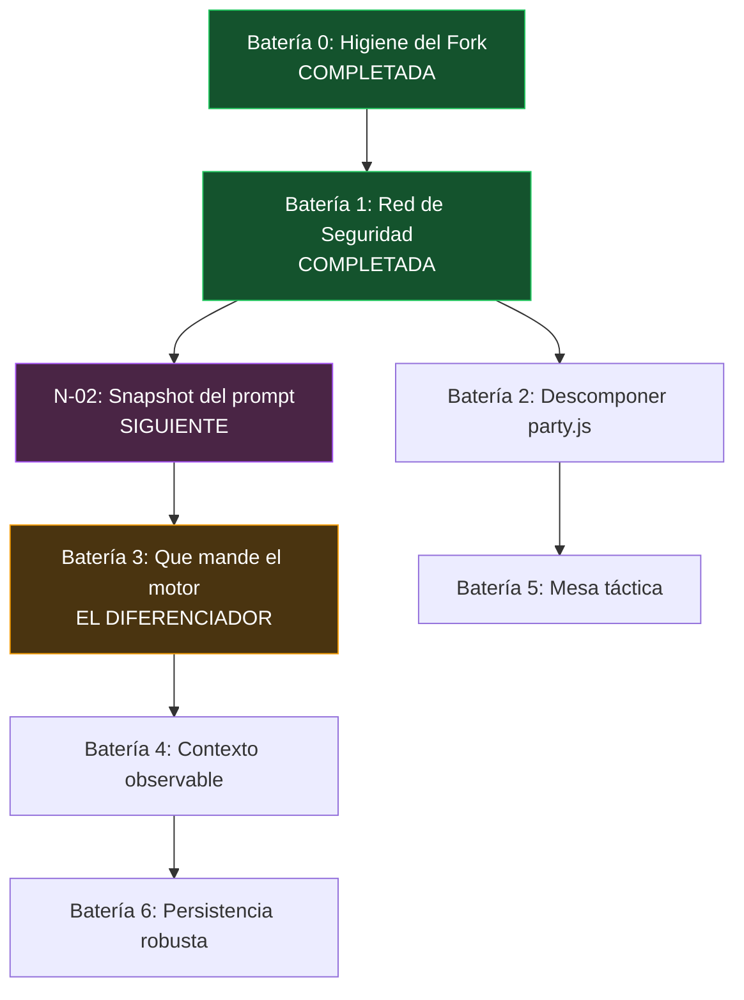

# 🎯 Roadmap Priorizado — Baterías de Trabajo

Este documento **no añade propuestas nuevas al catálogo**: selecciona, agrupa y ordena. Parte de las 200 de [[PROPUESTAS_MEJORA]] y los 15 hallazgos de [[PROBLEMAS_TECNICOS]], los filtra por coste real y los organiza en **baterías**: unidades de trabajo que comparten una razón de ser y que tiene sentido ejecutar juntas.

Al final se añade un bloque de **propuestas propias** (`N-xx`) sobre carencias detectadas al auditar el código que el catálogo original no cubre.

---

## 📐 El Filtro: Tres Criterios, Uno Domina

### Criterio 1 — Coste de fork (decisivo)

Este proyecto es un fork de SillyTavern sobre la rama `my-silly`. Medido el 2026-09-20 contra `upstream/release`:

| Métrica | Valor |
| :--- | :--- |
| Commits de upstream pendientes de integrar | **194** |
| Archivos **nuevos** tuyos (motor RPG) | **38** → colisión con upstream: **0** |
| Archivos de upstream **modificados** | **14** |
| Archivos con conflicto real en el merge | **4** |
| Bloques en conflicto en `index.html` | 39 → **38 son ruido de formato**, 1 real |

> [!IMPORTANT]
> **La conclusión operativa**: tus 38 archivos nuevos son gratis para siempre. Upstream no los toca y nunca los tocará. Cada línea que escribes en un archivo de upstream, en cambio, se paga en **cada merge futuro**.
>
> Por eso este roadmap prioriza sistemáticamente el trabajo que vive en `party.js`, `dnd-system.js`, `world-map-renderer.js`, `dynamic-context-manager.js` y compañía, y pospone o descarta lo que exigiría reescribir `script.js`, `index.html` o `src/`.

### Criterio 2 — Efecto palanca
¿Desbloquea otro trabajo? Los tests desbloquean la refactorización. La observabilidad desbloquea el ajuste de prompts.

### Criterio 3 — Valor de juego
¿Mejora la partida de verdad, o solo la sensación de estar progresando?

---

## ✅ Batería 0 — Higiene del Fork `COMPLETADA 2026-09-20`

> **Razón de ser**: es lo más barato del roadmap y protege todo lo demás.

| ID | Acción | Resultado |
| :--- | :--- | :--- |
| **B0.1** | Desactivar el formateo automático de archivos de upstream. | ✅ `.vscode/settings.json` |
| **B0.2** | Remote `upstream` con push desactivado. | ✅ Verificado: el push falla al instante |
| **B0.3** | Integrar los 194 commits pendientes. | ✅ Merge `76125af27` |
| **B0.4** | Regla explícita: **código nuevo va en archivo nuevo**. | ✅ [[Guia-Desarrollo-Flujo]] §2 |

> [!WARNING]
> **Corrección a B0.1**: el plan original proponía un `.prettierignore`. **No habría servido de nada: este proyecto no usa Prettier** — no hay `.prettierrc`, ni dependencia, ni script; solo ESLint. El responsable real del ruido es el formateador HTML integrado de VSCode, desactivado ahora con `editor.formatOnSave: false` y `html.format.enable: false`.

### Resultado del merge

| Métrica | Valor |
| :--- | :--- |
| Commits integrados | 194 |
| Archivos cambiados | 220 (+15.110 / −3.242) |
| Conflictos | 4 archivos |
| Bloques en `index.html` | 39 → **38 resueltos a favor de upstream** por script, 1 manual |
| Líneas del fork perdidas en `index.html` | **0** de 3.281 (verificado contra patrón de marcadores RPG) |

El único conflicto que exigió criterio fue el input de la clave de Azure: upstream cambió `type="password"` a `type="text"` de forma deliberada y sistemática en ~20 campos (commit `742d5601b`, para que Chrome no ofrezca guardarlas como contraseñas; el enmascarado pasa a hacerse por CSS con `-webkit-text-security`). Se aceptó su tipo conservando el atributo `form="openai_form"` del fork, que hace trabajo real porque ese input vive fuera de su formulario.

---

## ✅ Batería 1 — Red de Seguridad Mínima `COMPLETADA 2026-09-20`

> **Razón de ser**: precondición de la Batería 2. No se puede partir un archivo de 4.733 líneas a ciegas.

| ID | Acción | Resultado |
| :--- | :--- | :--- |
| **PROP-181** | Tests para las reglas D&D puras. | ✅ `tests/dnd-system.test.js` — **47 tests** |
| **PROP-194** | Chequeo de tipos exigible. | ✅ `tools/check-fork-types.mjs` — **0 errores** |
| **PROP-003 / MAINT-01** | Retirar los `@ts-nocheck`. | ✅ Ninguno queda en `public/scripts/` |
| **PROP-184** | CI que ejecute lo anterior. | ✅ `.github/workflows/fork-checks.yml` |

### Qué cubren los 47 tests

`getAbilityModifier` · `formatModifier` · `calculateCarryingCapacity` · `calculateTotalWeight` (incluye contenedores anidados y ciclos) · `clampRelationshipScore` · `normalizeItem` · `applyEquipmentEffects` · `addItemToInventory` · `removeItemFromInventory` · `consumeItemInInventory` · `equipItem` / `unequipItem` / `getEquippedItem`

`dnd-system.js` resultó ser **prácticamente puro**: cero imports y una sola referencia al DOM (`window.droll` en `rollInitiative`), así que se pudo testear sin refactorizar nada.

> [!WARNING]
> **Corrección a PROP-194**: un `tsc --noEmit` global es **inviable** — reporta 3.588 errores, de los cuales 3.127 están en librerías vendorizadas (`public/lib`, `scripts/extensions/tts/lib`) y el resto en código de upstream. El gate se acotó a los 9 archivos propios del fork, que están a cero y deben seguir así. El script se verificó en ambas direcciones: pasa en verde y **falla** ante un error inyectado a propósito.

> [!NOTE]
> **PROP-184 ya venía medio hecho**: el merge trajo el `pr-checks.yml` de upstream (ESLint + tests). Pero solo se dispara en `pull_request`, así que empujando directo a `my-silly` no corría nunca. El workflow nuevo cubre también `push`.

### Hallazgos de paso

- **3 errores de tipos reales** en código del fork, ahora corregidos. Uno era un bug latente: en `party.js`, `$(this).val()` puede devolver una cadena y se le llamaba `.map()` directamente, que habría lanzado excepción si el select dejaba de ser múltiple.
- Los otros dos eran `selectCharacterById(String(charIdx))` en `campaigns.js`, contra una firma que documenta `number`.
- Quitar los `@ts-nocheck` destapó **12 errores** más, todos corregidos con JSDoc acotado. Uno era real (`TS1016`: un parámetro obligatorio tras opcionales en `showCategoryPopup`), el resto estrechamiento de tipos del DOM.
- El merge trajo de regalo **la suite de tests de upstream**: de 3 archivos a 19. Ninguno cubre `public/scripts/`, así que `MAINT-03` sigue vigente para el motor RPG — pero el backend ya está cubierto.
- `tests/.eslintrc.cjs` de upstream aplica el plugin de Playwright a archivos de Jest. Su regla `no-standalone-expect` da falsos positivos con `test.each` salvo que el `describe` declare además un hook. Verificado empíricamente contra `config-init.test.js`.

**Estado de verificación**: 458 tests pasando en 20 suites · 0 errores de tipos en archivos del fork · 0 errores de ESLint añadidos (los 53 preexistentes siguen igual).

---

## 🔋 Batería 2 — Descomponer `party.js`

> **Razón de ser**: 4.733 líneas mezclando estado, reglas D&D, DOM, comandos y red. Solo abordable **después** de la Batería 1.

- **PROP-001** — Dividir en `party/state.js`, `party/ui.js`, `party/combat.js`, `party/commands.js`.
- **PROP-007** — Centralizar utilidades D&D duplicadas (`normalizeDndEntityType`, `getDndEntryType`) en `dnd-system.js`.
- **PROP-016** — Separar el modelo de datos de la sesión del árbol DOM.

> [!WARNING]
> Extrae por **la costura que los tests de la Batería 1 ya cubren**, no por categorías que suenen ordenadas. Si un bloque de código no tiene test, no lo muevas todavía.

---

## 🔋 Batería 3 — El Diferenciador: Que Mande el Motor

> **Razón de ser**: es lo que separa un juego de rol de un chat que finge serlo. **Si solo se ejecuta una batería, que sea esta.**

- **PROP-135** — Interceptar las tiradas que el LLM se inventa y sustituirlas por el resultado del motor determinista de dados. *La mejor propuesta de las 200.*
- **PROP-121** — Function calling: que el modelo modifique HP, inventario y posición mediante esquemas JSON, no interpretando prosa.
- **PROP-124** — Salidas estructuradas garantizadas (gramáticas BNF / JSON Schema) en modelos locales.
- **PROP-127** — Prefill dinámico para controlar el arranque de la respuesta.

---

## 🔋 Batería 4 — Contexto Que No Miente

> **Razón de ser**: observabilidad antes que funcionalidad. Hoy el Dynamic Context se afina a ciegas.

- **PROP-104** — Vista previa del prompt compilado, con color según el origen de cada bloque.
- **PROP-118** — Registrar en el `extra` del mensaje qué reglas se dispararon en ese turno.
- **PROP-120** — Aviso cuando una sola instrucción consume más del 30% del presupuesto.
- **PROP-107** — Condiciones numéricas en las reglas (`HP < 20%` activa instrucciones de agonía).
- **PROP-114** — Seguimiento de objetivos de misión con inyección automática de metas activas.

---

## 🔋 Batería 5 — Mesa Táctica (VTT)

> **Razón de ser**: todo vive en `world-map-renderer.js`, archivo tuyo. Coste de merge **cero**, valor de juego alto.

- **PROP-081** — Rastreador de turnos e iniciativa.
- **PROP-083** — Medidor de distancia y movimiento restante.
- **PROP-086** — Ajuste magnético a la cuadrícula.
- **PROP-088** — Marcadores de estado sobre los tokens.
- **PROP-099** — Escalado de token según tamaño D&D (Grande 2x2, Enorme 3x3...).
- **PROP-043** — Método `destroy()` en `createZoomableContainer`.

**Aplazado dentro de esta misma área**: línea de visión (PROP-084), cuadrícula hexagonal (PROP-085), mapas animados (PROP-096). Mucho trabajo, poco retorno frente a los seis de arriba.

---

## 🔋 Batería 6 — Persistencia Que No Se Corrompe

> **Razón de ser**: `CONC-02` de la auditoría es real, y el esquema de datos sigue cambiando en cada commit de funcionalidad.

- **PROP-170** — Cerrojo transaccional por conversación (mutex en memoria por archivo).
- **PROP-018** — Validar `chat_metadata` contra un esquema al cargarlo de disco.
- **PROP-165** — Migración de esquemas versionada. *Llevas 15 commits cambiando la forma de los datos; esto va a morder.*
- **PROP-167** — Papelera de reciclaje con recuperación temporal.
- **PROP-166** — Exportar campaña como paquete autónomo `.tavernworld`.

---

## 💡 Propuestas Propias

Carencias detectadas al auditar el código que las 200 propuestas originales no cubren.

### N-01 · El estado del mundo no es la narración
Hoy la prosa del LLM **es** el estado del juego. Propongo un almacén canónico (HP, posición, inventario, banderas de misión) del que la narración se *renderiza*, sin que el modelo sea nunca la autoridad sobre los hechos. PROP-135 es un caso particular de este principio; el principio general no aparece en el catálogo.

> [!IMPORTANT]
> Es la idea arquitectónica más importante de todo el documento. Las Baterías 3 y 4 son consecuencias suyas.

### N-02 · Tests de fichero dorado sobre el prompt compilado
PROP-104 aporta un visor para inspeccionar a mano. Lo que falta es **congelar el prompt compilado como snapshot en CI**, de forma que cualquier cambio en el Dynamic Context que lo altere en silencio haga fallar la build. Es el test con mayor retorno de todo el sistema, y cuesta menos que la suite de reglas D&D.

### N-03 · Reconciliar el contador de tokens con el del proveedor
El presupuesto de tokens se calcula con una estimación local que **se va a desviar** del recuento real del proveedor, y hoy no habría forma de enterarse. Comparar contra el uso real que devuelve la API tras cada llamada y mostrar la deriva acumulada.

### N-04 · Turnos transaccionales
PROP-129 cubre reintentos y fallback de proveedor. Nadie cubre qué ocurre con el **estado del juego** cuando un turno se corta a mitad: ¿se aplicó el daño o no? ¿se consumió la flecha? Los cambios de estado deben confirmarse solo cuando el turno se completa.

### N-05 · Repetición determinista de turno
Reejecutar un turno con el mismo contexto y la misma semilla para comprobar si un cambio de prompt mejoró algo. Sin esto, afinar prompts es adivinar. No aparece en las 200.

### N-06 · Registro de contradicciones
Generaliza PROP-111 más allá de lo espacial: tras cada turno, contrastar la narración contra el estado canónico (HP, ubicación, quién está presente, qué lleva equipado) y registrar los desajustes. Convierte "el modelo a veces se lía" en datos concretos sobre dónde fallan los prompts.

### N-07 · Sanear en la entrada, no en la salida
El problema de las 10 implementaciones divergentes de `escapeHtml` existía porque la sanitización ocurre al renderizar, repartida por todo el código. Normalizar y validar las entradas de World Info **al cargarlas o importarlas** permite que el resto del código confíe en los datos. Complementa PROP-033.

### N-08 · Presupuesto de merge como métrica
Un script (o hook de pre-commit) que falle si un commit toca un archivo de upstream sin justificación explícita. Convierte la disciplina del fork en algo **verificado** en lugar de recordado. Deriva directamente de lo medido en el Criterio 1.

---

## 🚫 Lo Que Descartaría del Catálogo

| Propuesta | Motivo del descarte |
| :--- | :--- |
| **PROP-161** Migración a SQLite | Reescribe la capa de persistencia de upstream entera. Convierte cada merge futuro en un infierno. Además contradice a PROP-168. |
| **PROP-004** Bundler Vite | Afecta a la carga de scripts de todo upstream. |
| **PROP-002** Eliminar jQuery | Enorme, y **contradice directamente a PROP-025** (actualizar jQuery). Hay que elegir una. |
| **PROP-123** Multi-agente para PNJs | Latencia y coste altos, beneficio incierto frente a PROP-121. |
| **PROP-187** Marketplace · **PROP-193** Deploy cloud · **PROP-198** Carga 50 usuarios | Dimensionados para un servicio con equipo detrás, no para un proyecto personal. |
| **PROP-140** Temperatura por curva de entropía | Proyecto de investigación, no de producto. |
| **PROP-005** Desmontar `index.html` | Solo en **versión estrecha**: extraer *tus* modales del motor RPG, nunca los 50 de upstream. |

---

## 🗺️ Orden de Ataque



**Justificación del orden**: la higiene del fork fue primero porque era barata y protege todo lo demás. Con la red de seguridad ya puesta, el siguiente paso es el snapshot del prompt (`N-02`): es donde el sistema se rompe en silencio con más facilidad, y ahora hay infraestructura de tests donde apoyarlo. La Batería 3 entra después, porque es la que convierte el proyecto en un juego.

---

## ✅ Estado Actual

Correcciones de [[PROBLEMAS_TECNICOS]] ya aplicadas (2026-09-20, pendientes de commit):

| Hallazgo | Estado | Nota |
| :--- | :--- | :--- |
| **SEC-02** XSS en el renderizador de mapas | ✅ Corregido | Eran **4 puntos**, no 1: marcador, tarjeta de info, token y fila de personajes. Reconstruidos con `.text()` / `.attr()`. |
| **SEC-03** `escapeHtml` divergente | ✅ Corregido | Eran **10 implementaciones**, no 4. Consolidadas contra la de `utils.js`, que ya existía. |
| *(no catalogado)* XSS en `world-content-browser.js` | ✅ Corregido | **Hallazgo nuevo**: la variante `textContent`→`innerHTML` no escapa comillas y se usaba dentro de atributos. Era explotable. |
| **PERF-03** Límites de palabra con `\b` | ✅ Corregido | `\p{L}` con flag `u`. Los ejemplos del documento original (*Dragón*, *Montaña*) siempre funcionaron; lo que fallaba eran claves que **empiezan o terminan** en carácter no-ASCII (*Ávila*, *café*, *Ñu*). |
| **CONC-01** Doble persistencia del grupo | ✅ Corregido | `chat_metadata.party` es ya la única fuente de verdad. |
| **MEM-01** Fuga de listeners | ⚠️ Revisado | Sobrevalorado en la auditoría: el archivo ya usa `.off().on()` y limpia handlers con namespaces. Cubierto por PROP-043 en la Batería 5. |
| **MAINT-01** `@ts-nocheck` | ✅ Corregido | Batería 1. Ninguno queda en `public/scripts/`. |
| **MAINT-03** Sin tests | 🟡 Parcial | 47 tests para `dnd-system.js`. Faltan `dynamic-context-manager.js` (ver N-02) y el resto del motor. |
| **SEC-01** CSP · **SEC-04** Secretos · **SEC-05** jQuery | ⏸️ Fuera del fork | Decisiones de upstream. Reevaluar tras el merge: puede que algunas ya estén resueltas en los 194 commits integrados. |

### Comandos de verificación

```bash
npm run test:unit --prefix tests     # 458 tests, 20 suites
node tools/check-fork-types.mjs      # 0 errores en los 9 archivos del fork
```

---

## 🔗 Enlaces Relacionados

- [[HOME]]: Portal principal de la Wiki.
- [[PROBLEMAS_TECNICOS]]: Auditoría que motiva las Baterías 0, 1 y 6.
- [[PROPUESTAS_MEJORA]]: Catálogo completo del que se seleccionan estas propuestas.
- [[Guia-Desarrollo-Flujo]]: Convenciones para implementar estos cambios.
- [[Mapa-Codigo-Archivos]]: Distingue código de upstream de código del fork — imprescindible para aplicar el Criterio 1.
