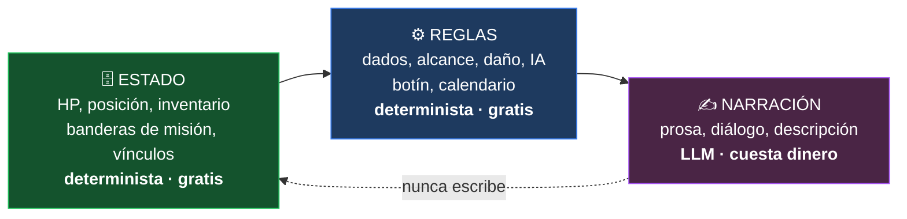
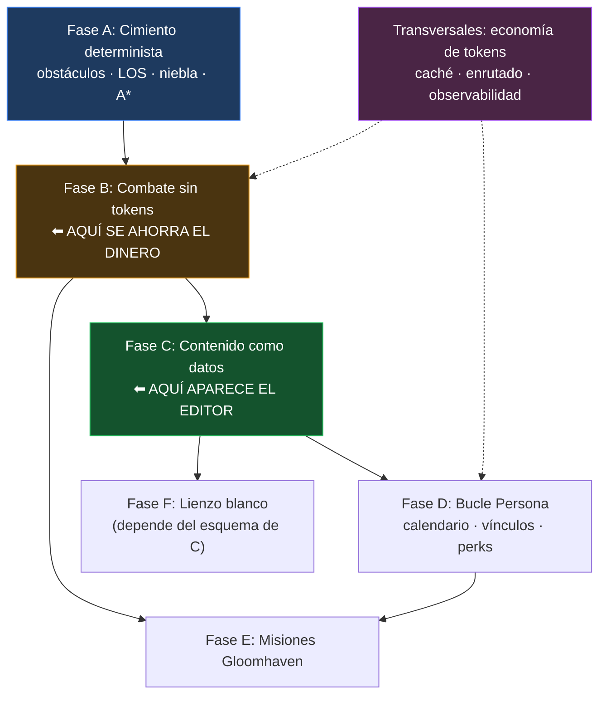

# 🎯 Roadmap — De SillyTavern a un Juego de Rol Táctico Asequible

Plan único de trabajo. Reconcilia tres fuentes: la auditoría de [[PROBLEMAS_TECNICOS]], el catálogo de [[PROPUESTAS_MEJORA]], y el diseño de juego de [[PROPUESTA_JUEGO_DND_GLOOMHAVEN_PERSONA]]. Sustituye a la versión anterior de este documento, que solo cubría higiene de ingeniería.

**El objetivo, en una frase**: un juego de rol táctico donde la IA escribe la historia y las relaciones, y **todo lo demás es lógica determinista**, editable por ti, que no cuesta nada ejecutar.

---

## 🧱 0. El Principio que Ordena Todo

Tres capas, y la línea que las separa es la decisión de diseño más importante del proyecto:



> [!IMPORTANT]
> **El LLM lee el estado, nunca lo escribe.** Narra lo que el motor ya decidió. En cuanto la prosa del modelo se convierte en la fuente de verdad de un HP o de un rango de vínculo, pierdes a la vez el control, la reproducibilidad y el dinero.

Esta regla es la que hace el juego barato, la que lo hace depurable, y la que permite que sea editable. Todo el resto del documento se deriva de ella.

---

## 💸 1. De Dónde Salen los 200 € al Mes

Antes de planificar hay que entender el gasto, porque determina el orden de las fases.

El coste de una partida **no** lo domina lo que el modelo escribe, sino lo que le mandas leer en cada turno: prompt de sistema, lorebook, fichas del grupo, estado del tablero, historial. Ese bloque se reenvía **entero, en cada llamada**.

```
coste ≈ (tokens de contexto) × (llamadas por sesión) × (precio de entrada)
```

De ahí salen tres palancas, en orden de impacto:

| # | Palanca | Efecto | Dónde se implementa |
| :-- | :--- | :--- | :--- |
| **1** | **Menos llamadas.** Un combate de 4 rondas × 5 combatientes narrado turno a turno son ~20 llamadas. Resuelto por el motor con un epílogo: **1 llamada**. | El mayor ahorro individual, con diferencia | Fase B |
| **2** | **Contexto cacheado.** Los proveedores que soportan caché de prompt cobran una fracción por el bloque estable reutilizado. Exige ordenar el prompt: estático delante, volátil detrás. | Reduce mucho el coste del bloque fijo | Transversal T1 |
| **3** | **Modelo por tarea.** Clasificar, extraer o validar no necesita tu modelo caro. Un modelo pequeño — o uno local — hace el trabajo mecánico a coste marginal cero. | Ahorro proporcional al reparto de tareas | Transversal T2 |

> [!WARNING]
> **No cito precios por token**: cambian y dependen del proveedor, y tienes ~20 conectores configurados. Consulta las tarifas vigentes del que uses. Lo que sí es estructural, y no cambia, es que **las tres palancas se multiplican entre sí**: menos llamadas × contexto más barato × modelo más barato.

### La consecuencia sobre el orden del plan

La Fase B (combate sin tokens) es la que más ahorra, pero **no se puede construir sin la Fase A**. Por eso A va primero aunque no ahorre nada por sí sola.

---

## ✅ 2. Lo Que Ya Está Hecho

| Batería | Resultado |
| :--- | :--- |
| **B0 · Higiene del fork** | Remote `upstream` con push desactivado · 194 commits integrados (merge `76125af27`) · formateo automático desactivado sobre archivos de upstream · regla *"código nuevo va en archivo nuevo"* escrita en [[Guia-Desarrollo-Flujo]] |
| **B1 · Red de seguridad** | 47 tests para las reglas D&D · gate de tipos acotado al fork (`tools/check-fork-types.mjs`) · `@ts-nocheck` eliminados · CI propio en `push` |
| **B2 · Descomposición** | `party.js` 4.707 → 4.279 líneas · `party/combat-rules.js`, `item-forms.js`, `types.js`, `html.js` · 68 tests nuevos |
| **Seguridad** | XSS del renderizador de mapas (4 puntos) · XSS vivo en `world-content-browser.js` · 11 copias de `escapeHtml` unificadas · límites de palabra Unicode · doble persistencia del grupo |

**Estado verificable**: 856 tests en 32 suites · 0 errores de tipos en 27 archivos del fork.

> [!NOTE]
> Este trabajo no era un desvío. Sin el merge no tendrías los 194 commits de upstream; sin los tests no podrías tocar el motor de combate sin miedo; sin el gate de tipos cada refactor sería a ciegas. Las fases que vienen se apoyan en eso.

---

## 🔍 3. El Punto de Partida Real

Verificado contra el código, porque el documento de diseño parte de supuestos incorrectos:

| Capacidad | Estado real |
| :--- | :--- |
| Zoom, panning, cuadrícula, drag & drop de tokens | ✅ Existe en `world-map-renderer.js` |
| Distancia Chebyshev, celdas alcanzables, dados, fórmulas de daño | ✅ Existe y **con tests** en `party/combat-rules.js` |
| **IA de enemigos** (foco → mover → atacar) | ✅ **Ya existe**: `resolveEnemyTurnAction`, 152 líneas, junto con `startCombat`, `runCombatTurnLoop`, `handlePlayerCombatMove/Attack` |
| **Niebla de guerra** | ❌ **No existe.** Cero coincidencias en todo `public/` |
| **Obstáculos, muros, terreno** | ❌ **No existen en el modelo de datos** |
| **Contenido editable** (armas, ataques, condiciones) | ❌ **25 tablas codificadas en JavaScript**, ~270 líneas en `dnd-system.js` |

> [!WARNING]
> **Dos correcciones que cambian el plan de la propuesta de diseño:**
>
> 1. **A\* sobre una cuadrícula sin obstáculos es una línea recta.** Ya tienes eso resuelto con Chebyshev. A* solo aporta cuando hay paredes que rodear — y las paredes no están en el modelo. Implementar A* antes que los obstáculos es trabajo tirado.
> 2. **La IA de enemigos no se escribe desde cero, se refactoriza.** `resolveEnemyTurnAction` ya hace foco por proximidad, movimiento y ataque. Lo que falta son los perfiles tácticos, no el esqueleto.

---

## 🟡 Fase A — El Cimiento Determinista `MOTOR COMPLETO — 2026-09-20`

> **Por qué primero**: nada del combate táctico existe sin esto. No ahorra tokens por sí sola; desbloquea la fase que sí lo hace.

| ID | Tarea | Resultado |
| :--- | :--- | :--- |
| **A1** | Modelo de obstáculos y terreno. | ✅ `game-engine/board/terrain.js` · 30 tests |
| **A2** | Línea de visión. | ✅ `game-engine/board/line-of-sight.js` · 25 tests |
| **A3** | Niebla de guerra. | ✅ `game-engine/board/fog-of-war.js` · 21 tests |
| **A4** | Pathfinding A*. | ✅ `game-engine/board/pathfinding.js` · 28 tests |
| **A5** | Tests. | ✅ **104 tests** |
| **A6** | Integración visual: editor de terreno y renderizado de niebla. | ✅ Capas en `world-map-renderer.js` + paleta de pintura |

### Decisiones de diseño que conviene recordar

**Almacenamiento disperso.** Terreno y niebla guardan solo las excepciones, no una matriz densa. Un tablero de 50×50 son 2.500 celdas y casi todas son suelo; esto vive dentro del world info, así que el tamaño importa. Un tablero entero de suelo abierto ocupa menos de 60 bytes.

**Tipos de terreno como tabla de datos, no como `switch`.** `TERRAIN_TYPES` ya tiene la forma que la Fase C necesita, así que extraerlo a un paquete de reglas será una mudanza, no una reescritura.

**La línea de visión es simétrica por construcción.** Bresenham elige distintas celdas según desde qué extremo empieces, así que un muro puede dejar que A vea a B sin que B vea a A. En un táctico eso se lee como un bug. La primera implementación **falló el test de simetría en 102 pares**; la solución fue canonicalizar el orden de los extremos para que el cálculo sea bit a bit idéntico en ambos sentidos. Hay un test que recorre los 10.000 pares de un mapa con muros.

**Tres estados de niebla**: `unknown`, `explored`, `visible`. Solo `explored` se persiste, porque es lo único que es memoria. Y la memoria recuerda el terreno, **no las criaturas**: un goblin que entró detrás de ti no aparece.

**No se cortan esquinas en diagonal.** Pasar entre dos muros que se tocan por la esquina no es legal por defecto, porque permite atravesar paredes diagonales selladas. Configurable con `allowCornerCutting`.

### Ya está conectado

`getReachableCells` sustituye al `buildReachableCells` anterior en los dos puntos de `party.js` que resaltan movimiento. Los tableros sin terreno se comportan igual que antes — un terreno vacío es suelo abierto — y pasan a respetar muros y terreno difícil en cuanto un tablero tenga terreno definido.

**Lo que falta para que sea jugable (A6)**: que el renderizador dibuje terreno y niebla, y una forma de pintar los muros. Ese editor encaja de forma natural con la Fase C.

---

## 🟡 Fase B — El Combate Sin Tokens `NÚCLEO LÓGICO COMPLETO — 2026-09-20`

> **Por qué ahora**: es la palanca #1 de coste. Aquí es donde dejas de pagar por cada golpe de espada.

| ID | Tarea | Resultado |
| :--- | :--- | :--- |
| **B1** | Máquina de turnos: iniciativa, rondas, estado de turno. | ✅ `combat/turn-machine.js` · 40 tests |
| **B3** | Economía de acciones: movimiento, acción, adicional, reacción. | ✅ En la misma máquina |
| **B2** | Perfiles tácticos de enemigo. | ✅ `combat/enemy-ai.js` · 33 tests |
| **B7** | Interceptar tiradas alucinadas (`PROP-135`). | ✅ `combat/roll-guard.js` · 26 tests |
| **B4** | Combat log gráfico que sustituye la narración por turno. | ✅ `ui/combat-log.js` · 19 tests · marco pixel art |
| **B6** | Puente narrativo único al terminar el combate. | 🟡 `buildEpiloguePrompt` listo; falta engancharlo al fin de combate |
| **B5** | Botín algorítmico por CR. | ⬜ Pendiente |
| **B8** | Rastreador de iniciativa, marcadores de estado, escalado por tamaño. | ⬜ Pendiente (interfaz) |

### Lo que se arregló al portar la IA

La versión dentro de `party.js` tenía dos defectos que solo se ven al escribirle tests:

1. **Se movía en línea recta con `Math.sign` y atravesaba muros.** Ahora usa el A* de la Fase A.
2. **El alcance de ataque estaba fijo a 5 pies**, daba igual qué empuñara la criatura.

Además, el modelo de encuentro **no contaba rondas**, solo un índice dentro del orden de iniciativa. Sin contador de rondas no hay forma de resolver *"sobrevive 6 rondas"* ni de hacer expirar la duración de un conjuro. La máquina nueva lo cuenta, y los encuentros guardados antes de que existiera se reanudan en la ronda 1 en vez de fallar.

### Los cuatro perfiles tácticos

| Perfil | Comportamiento |
| :--- | :--- |
| **Agresivo** | Se acerca al objetivo alcanzable más cercano por la ruta más corta y ataca. |
| **Tirador** | Mantiene distancia. Si algo lo alcanza en cuerpo a cuerpo, retrocede y luego dispara. |
| **Guardián** | Se interpone entre la amenaza y el aliado suyo peor herido. |
| **Cobarde** | Pelea mientras está sano; por debajo del 25% de vida huye y deja de atacar. |

La elección de objetivo usa **distancia de camino, no distancia en línea recta**: un personaje al otro lado de un muro deja de parecer más cercano de lo que está.

> [!IMPORTANT]
> **La IA devuelve un plan, no ejecuta nada.** `planEnemyTurn` entrega `{ focusId, path, destination, movementCostFeet, action, targetId, rationale }` y quien llama lo aplica. Eso es lo que permite testear al oponente de forma exhaustiva — y testearlo exhaustivamente es la única razón para confiar en un enemigo que nadie supervisa.

> [!NOTE]
> **Desempates deterministas.** Cuando dos casillas son tácticamente idénticas, el ganador dependía del orden en que el algoritmo de inundación las visitó: estable, pero imposible de razonar. Ahora hay una preferencia fija arriba-izquierda. Cuesta cero y garantiza que la misma situación produce siempre el mismo movimiento, que es la promesa entera de un oponente determinista.

### Sobre el guardián de tiradas (B7)

Solo corrige **afirmaciones estructuradas**: notación de dados seguida de un total (`1d20+5 = 23`, `2d6 -> 9`, `1d8: 4`, `2d6+3 (12)`). La prosa suelta se deja intacta, porque reescribirla exigiría entender la frase y una reescritura que se equivoca es peor que ninguna. El prompt debe pedir la forma estructurada; esto la hace cumplir.

Incluye `isClaimPossible`, que detecta el caso que más importa: totales que los dados **no pueden producir** (un `1d20+5` no puede dar 30).

### La interfaz (A6 + B4)

El renderizador gana dos capas nuevas: **terreno** bajo los tokens (es el tablero, no un adorno encima) y **niebla** sobre todo lo demás. Ambas dibujan solo lo necesario — el terreno pinta únicamente las celdas que no son suelo, igual que se almacenan.

El **editor de terreno** se abre con el botón *Terreno* bajo el tablero: eliges pincel (muro, terreno difícil, cobertura media o de tres cuartos, puerta) y pintas arrastrando. El terreno se guarda en el world info del tablero, así que sobrevive a la recarga. La niebla se activa por tablero con su propio interruptor.

El **registro de combate** tiene marco de pixel art generado con PixelLab (`public/img/game-engine/`), recortado en dos piezas y aplicado como `border-image` con los cortes medidos sobre el filete ámbar del arte original. Cada línea muestra el desglose de la tirada — `1d20+5 · 17 · vs 15` — porque un jugador que puede auditar cualquier resultado es lo que hace aceptable un resolutor que nadie supervisa.

> [!IMPORTANT]
> **Cada línea de ese registro era antes una frase que pagabas.** El motor ya sabe el movimiento, el fallo y los seis puntos de daño; el log los imprime gratis y al modelo le queda el único trabajo que hace bien: el epílogo.

**Entregable pendiente**: falta enganchar `buildEpiloguePrompt` al final del combate (B6) y el botín (B5).

---

## 🟡 Fase C — Contenido Como Datos (El Editor) `DATOS Y VALIDACIÓN LISTOS — 2026-09-20`

> **Por qué importa**: es tu requisito explícito — *"que yo pueda añadir tipos de ataques, armas, armaduras"*. Hoy es **imposible sin editar JavaScript**.

Ningún documento previo recogió esto. Las 25 tablas de `dnd-system.js` (`ITEM_WEAPON_DAMAGE_TYPE_OPTIONS`, `ITEM_WEAPON_FLAG_DEFINITIONS`, `CONDITIONS`, `ALIGNMENTS`…) son constantes de código. Mientras sigan ahí, no hay editor posible.

| ID | Tarea | Notas |
| :--- | :--- | :--- |
| **C1** | Extraer las 25 tablas a un paquete de reglas en datos. | ✅ `rules/default-ruleset.js` — 165 líneas fuera del código |
| **C2** | Esquema de validación del paquete. | ✅ `validateRuleset` · 36 tests |
| **C4** | Migración versionada de esquemas. | ✅ `migrateRuleset` + `RULESET_SCHEMA_VERSION` |
| **C5** | Exportación diferencial de paquetes. | 🟡 `toPortablePack` listo; falta la interfaz |
| **C3** | **Editor visual** de armas, daños, propiedades y condiciones. | ⬜ Pendiente — es tu requisito |

### Cómo funciona un paquete

Un paquete es JSON plano y se **fusiona sobre el paquete por defecto**, no lo sustituye. Uno que solo quiere añadir un tipo de daño no tiene que reescribir todo D&D 5e:

```json
{ "id": "mi-campana", "name": "Mi campaña", "version": 1,
  "items": { "damageTypes": [["void", "Vacío"]] } }
```

Tres decisiones que conviene recordar:

**Un paquete roto cae al por defecto entero, no a medias.** Medio paquete de reglas es peor que ninguno: una lista de condiciones ausente vaciaría en silencio todas las fichas.

**La fusión es por sección, no por elemento.** Un paquete que define `items.damageTypes` reemplaza la lista entera en vez de entremezclarse con la de origen. Entremezclar listas produce resultados que nadie pidió y que no se pueden deshacer desde el editor.

**La exportación es diferencial.** `toPortablePack` omite todo lo idéntico al paquete por defecto, así un archivo compartido dice qué cambia en vez de repetir el reglamento entero.

> [!NOTE]
> `dnd-system.js` fija sus exports al cargar, así que **cambiar de paquete exige recargar**. Está dicho en vez de esquivado: la alternativa era convertir cincuenta imports planos en llamadas a accesores, para comprar un cambio en caliente que un juego de un solo jugador no necesita.
>
> La prueba de que el traslado no cambió nada: **los 758 tests anteriores pasaron sin tocar uno solo.**

> [!IMPORTANT]
> **C1 es también lo que hace viable la Fase F.** Un generador de contenido con IA necesita un esquema contra el que validar. Sin paquete de reglas, el "lienzo blanco" produce datos que el motor no sabe interpretar.

**Entregable jugable**: creas un "Hacha de Guerra Élfica, 1d10 cortante, versátil, alcance 5 pies" desde un formulario, y aparece en el juego.

---

## 🟡 Fase D — El Bucle Persona `LÓGICA COMPLETA — 2026-09-20`

> **Por qué después del combate**: las perks de vínculo son mecánicas *de combate*. Sin motor táctico no hay dónde engancharlas.

| ID | Tarea | Resultado |
| :--- | :--- | :--- |
| **D1** | Calendario y bloques de tiempo. | ✅ `campaign/calendar.js` |
| **D2** | Rangos de vínculo 1–10 por eventos registrados. | ✅ `campaign/bonds.js` |
| **D3** | Perks mecánicas (rangos 3, 5, 8, 10). | ✅ En el mismo módulo |
| **D4** | Eventos de confidente: el motor decide, el LLM escribe. | ✅ `recordBondEvent` devuelve `rankedUp` y las perks desbloqueadas |
| **D5** | Descanso corto y largo. | ⬜ Pendiente |
| **D6** | 🖥️ Interfaz del calendario y de los vínculos. | ⬜ Pendiente |
> [!WARNING]
> **Corrección a la propuesta Persona.** Planteaba subir los rangos con `analyzeRelationshipsFromChat`, un analizador heurístico sobre la salida del LLM. Eso es exactamente el acoplamiento que el propio documento condena para el combate: el modelo decidiendo, de forma indirecta y no reproducible, cuándo desbloqueas una mecánica.
>
> **Los vínculos suben por acciones registradas**: completar una misión con el personaje, regalarle un objeto, elegir una opción en un evento. El analizador de chat puede seguir existiendo como *sugerencia* ("parece que la conversación fue bien, ¿+1 punto?"), nunca como autoridad.

### Cómo suben los vínculos

Diez rangos con **umbrales crecientes** (0, 6, 14, 24, 36, 50, 66, 84, 104, 126), así que los últimos se ganan en vez de acumularse por aparecer. Los puntos vienen de una tabla de **eventos que el motor puede señalar**: misión completada juntos, regalo acertado, escena de confidente, le salvaste la vida. Y también de los que restan: regalo desafortunado, le dejaste caer, traición.

`recordBondEvent` devuelve `rankedUp` y `unlockedPerks`, que es justo el momento de mostrar una escena — escrita por el modelo, a partir de un hecho que el motor ya decidió.

`suggestBondEvent` es la costura donde la heurística sí puede vivir: propone (*"la conversación reforzó el vínculo, ¿confirmas +1?"*) y el jugador decide.

**Entregable pendiente**: falta la interfaz del calendario y del panel de vínculos (D6), y los descansos (D5).

---

## 🟡 Fase E — Misiones Estilo Gloomhaven `LÓGICA COMPLETA — 2026-09-20`

| ID | Tarea | Resultado |
| :--- | :--- | :--- |
| **E1** | Escenarios con objetivos evaluados por el motor. | ✅ `campaign/scenarios.js` — 7 tipos de objetivo |
| **E2** | Salas y puertas sobre el modelo de terreno. | ✅ `campaign/campaign-map.js` |
| **E3** | Tablero de campaña con requisitos. | ✅ En el mismo módulo |
| **E4** | Seguimiento de misiones. | ✅ `QuestState` con sello de día |
| **E5** | 🖥️ Interfaz de escenarios y tablero de campaña. | ⬜ Pendiente |

### Los siete tipos de objetivo

`eliminate` · `eliminate_all` · `survive_rounds` · `reach_cell` · `escort` · `protect` · `loot`

Están como **tabla de datos**, no como `switch`, para que la Fase C pueda llevarlos a un paquete de reglas. Cada entrada declara qué campos necesita y el motor hace el resto.

**Los objetivos opcionales pagan, no bloquean.** Uno sin completar no impide la victoria; uno fallido no causa la derrota. Es lo que los hace opcionales en vez de requisitos escondidos.

### Salas, puertas y enemigos dormidos

Una sala es un conjunto de celdas más las puertas que llevan a ella. `openDoor` devuelve las tres cosas que siempre se mueven juntas — terreno nuevo, salas nuevas y los enemigos que despiertan — porque separarlas invita a olvidarse de una.

> [!IMPORTANT]
> **Un enemigo en una sala sin abrir no toma turnos.** Eso es lo que impide que una mazmorra sea un único combate enorme, y es la diferencia entre explorar y limpiar un mapa.

### El tablero de campaña

Las localizaciones se desbloquean por **requisitos que el motor comprueba**, no por confianza: misiones completadas, otras localizaciones superadas, o un rango de vínculo mínimo. `explainLock` devuelve el porqué, para un aviso que explica en vez de limitarse a negarse.

**Entregable pendiente**: la interfaz (E5). La lógica ya resuelve una mazmorra de tres salas con objetivo.

---

## 🅵 Fase F — El Lienzo Blanco

> **Por qué al final, aunque sea lo más vistoso**: generar contenido es fácil de enseñar y difícil de integrar bien. Y no arregla nada si el combate todavía no es divertido. Además **depende de C1**: sin esquema no hay nada contra lo que validar.

| ID | Tarea | Notas |
| :--- | :--- | :--- |
| **F1** | **Interfaz agnóstica de proveedor** para salidas estructuradas. | Ver aviso ⬇️ |
| **F2** | **Generación validada** contra los esquemas de la Fase C. Lo que no valide, se rechaza o se corrige, no se inyecta. | |
| **F3** | **Revisión humana antes de inyectar**: pantalla de previsualización con edición. | La IA propone, tú apruebas |
| **F4** | Inyección en el mundo: localizaciones al mapa, lore al lorebook, monstruos al bestiario, confidentes a la lista. | Propuesta |

> [!WARNING]
> **Corrección a la propuesta**: atarlo a Gemini es un error. SillyTavern es agnóstico de proveedor y tú tienes ~20 conectores funcionando — es una de tus mayores ventajas. Las salidas estructuradas existen en Anthropic, OpenAI y en modelos locales vía gramáticas. Escribe contra una interfaz, elige el proveedor en los ajustes.
>
> Y como el lienzo blanco es una tarea **mecánica** (rellenar un esquema), es la primera candidata al modelo barato de la palanca #3.

---

## 🔄 Transversales — La Economía de Tokens

No son una fase: se aplican durante todas.

| ID | Tarea | Palanca |
| :--- | :--- | :--- |
| **T1** | **Caché de prompt**: estructurar el prompt con el bloque estable delante y lo volátil detrás, para maximizar la reutilización en los proveedores que la soportan. | #2 — `PROP-128` |
| **T2** | **Enrutado por tarea**: modelo pequeño o local para clasificar, extraer y validar; modelo caro solo para prosa. | #3 — `PROP-133` |
| **T3** | **Vista previa del prompt compilado** con color por origen. No puedes optimizar lo que no ves. | `PROP-104` |
| **T4** | **Reconciliar el contador de tokens con el del proveedor** y mostrar la deriva y el gasto acumulado por sesión. | `N-03` |
| **T5** | **Snapshot del prompt compilado en CI**: un cambio que altere el prompt en silencio hace fallar la build. | `N-02` |
| **T6** | **Repetición determinista de turno** (mismo contexto, misma semilla) para poder comparar cambios de prompt. | `N-05` |
| **T7** | **Registro de contradicciones**: contrastar la narración contra el estado canónico y registrar desajustes. | `N-06` |
| **T8** | **Resumen periódico del historial** cada N turnos, para que el contexto no crezca sin límite. | `PROP-134` |

> [!TIP]
> **T1 y T8 son las que evitan que el coste crezca con la duración de la campaña.** Sin ellas, la partida 200 cuesta muchísimo más que la partida 1 aunque hagas lo mismo, porque el historial arrastra.

---

## 🧭 Orden de Ataque



**Si solo pudieras hacer dos fases**: A y B. Es lo que convierte el proyecto en un juego y lo que mata la factura.

**Si tuvieras que elegir una tercera**: C, porque sin ella no eres autónomo — cada arma nueva te obliga a programar.

---

## ⏱️ Sobre los Plazos

La propuesta de diseño estimaba **1–2 meses para los tres pilares**. Es irreal, y conviene decirlo para que no planifiques contra un número falso.

Referencia concreta: tu motor RPG actual son **26.005 líneas** en 38 archivos, construidas a lo largo de 15 commits. Cada una de estas fases es comparable en tamaño a una fracción significativa de eso:

- La Fase A sola es un modelo de datos nuevo, dos algoritmos de geometría y su cobertura de tests.
- La Fase C toca las 25 tablas, su validación, su migración y una interfaz de edición completa.
- La Fase D necesita persistencia nueva con migraciones, más el enganche con el combate.

**No des una fecha: da un orden.** Cada fase está definida para terminar en algo jugable, así que el progreso se mide en funcionalidad entregada y no en calendario.

---

## 🚫 Lo Que Descartaría

| Propuesta | Motivo |
| :--- | :--- |
| **Migrar a Unity / Godot** | Reescribir chat, streaming SSE, lorebooks, modales e integración con LLMs. Tu ventaja es justo eso, que ya está hecho. El documento de diseño acierta al descartarlo. |
| **Sidecar en Python** | Dos runtimes, latencia IPC, arranque dual. Los algoritmos tácticos son matemáticas: corren en V8 en submilisegundos. |
| **`PROP-161` Migración a SQLite** | Reescribe la persistencia de upstream entera. Mata el fork. |
| **`PROP-004` Vite · `PROP-002` Eliminar jQuery** | Afectan a todo upstream. Coste de merge permanente. |
| **`PROP-123` Multi-agente para PNJs** | Multiplica llamadas: va justo contra el objetivo de coste. |
| **`PROP-016` Desacoplar el modelo de sesión del DOM** | Cirugía mayor en `script.js` (upstream). Pertenece conceptualmente a la sección 0 y debe abordarse con diseño propio, no como refactor. |
| **Marketplace · deploy cloud · pruebas de carga** | Dimensionados para un servicio con equipo. Eres una persona. |

---

## 🔬 Verificación

```bash
npm run test:unit --prefix tests     # 856 tests, 32 suites
node tools/check-fork-types.mjs      # 0 errores en los 27 archivos del fork
git fetch upstream && git merge upstream/release
```

Cada fase nueva añade sus tests a la primera orden y sus módulos a la lista de la segunda.

---

## 🔗 Enlaces Relacionados

- [[HOME]]: Portal principal de la Wiki.
- [[POR_HACER]]: Lista viva de pendientes derivada de este plan.
- [[PROPUESTA_JUEGO_DND_GLOOMHAVEN_PERSONA]]: Diseño de juego del que salen las Fases B, D, E y F.
- [[PROBLEMAS_TECNICOS]]: Auditoría de la que salen las correcciones ya aplicadas.
- [[PROPUESTAS_MEJORA]]: Catálogo de 200 del que se seleccionan las `PROP-xxx` citadas.
- [[Guia-Desarrollo-Flujo]]: La disciplina de fork que hace todo esto sostenible.
- [[Mapa-Codigo-Archivos]]: Qué es de upstream y qué es tuyo.
