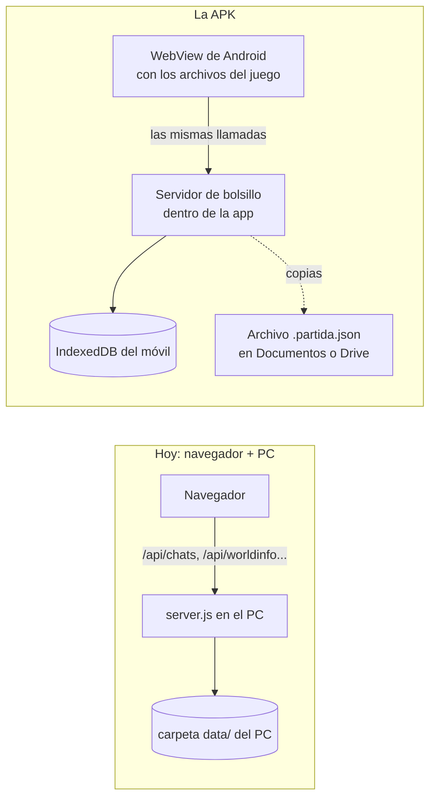

# 📱 Dnd Master en una APK de Android

> **Qué es:** el plan para que el juego sea **una app de Android** que instalas en tu móvil y juegas sin nada más: **sin el PC encendido, sin servidor, sin internet y sin publicar nada en ninguna web**. Lo pediste el 2026-10-03: solo Android, nada de Apple, nada de GitHub Pages; el repo sigue privado.
> **De dónde sale:**
> - tu plan [[ROADMAP_PWA_SIN_SERVIDOR]] (el adaptador de IndexedDB, los mundos como archivos, exportar e importar). De él **se queda** casi todo y **sobran** GitHub Pages, la instalación desde el navegador y la parte del iPhone;
> - el punto 3 del orden de después en [[ROADMAP_SIN_CONEXION]];
> - un repaso del código del 2026-10-03, con **tres partidas de prueba** (`e2e-gremio`, `e2e-guardar` y `e2e-importar-campana`) en las que se apuntó cada cosa que el juego le pide al servidor.
>
> **La idea en una frase:** la app lleva dentro los archivos del juego y un **«servidor de bolsillo»**, un trocito de código que contesta lo mismo que hoy contesta `server.js`, pero guardando en el propio teléfono (IndexedDB).

**Cómo leer la columna «Hoy»:**
- ✅ ya existe;
- 🟡 existe una parte (en el navegador del PC, o sin terminar);
- ⬜ no existe.

## 📍 Cómo va (2026-10-03)

**Avance: 0 %.** El plan está escrito; no se ha tocado código.

**Cuándo empieza:** cuando acabe [[ROADMAP_ENTRETENIDO]] (hoy, ~60 %). Es el punto 3 del orden de [[ROADMAP_SIN_CONEXION]].

**Lo único que puedes adelantar tú, si quieres:** instalar Android Studio en el PC (A0). No toca el juego y luego ahorra una tarde.

**El orden de las fases, cuando empiece:**
1. A0 (tu PC) y A1 (la copia del juego para la app).
2. A2 (el servidor de bolsillo) y A3 (apagar lo que no se usa), a la vez: son trozos distintos.
3. A4: el juego entero, probado sin servidor en el navegador del PC. **Hasta aquí no hace falta Android.**
4. A5: la primera APK. **Primer hito: abres Dnd Master en tu móvil y llegas al título.**
5. A6 (copias de seguridad) y A7 (campañas del Gem), a la vez.
6. A8: un solo comando que hace la APK firmada.
7. A9: una tarde entera jugando en el móvil. **Hito final.**

---

## 1. Lo que ya hay

| Qué | Dónde | Sirve para la APK |
| :--- | :--- | :--- |
| **El nombre «Dnd Master»** (provisional, D-J9) y su descripción | `APP_INFO` en `public/scripts/game-engine/ui/app-mode.js` | El nombre bajo el icono |
| **El icono** (el escudo con la espada, de PixelLab): 192, 512 y la versión «maskable» para los Android que recortan en círculo | `public/img/game-engine/pixel/app/` | Los iconos de Android salen de aquí (A5) |
| **El manifiesto** `public/juego.webmanifest` y la herramienta que lo escribe | `tools/app-movil.mjs` (J20.7), con su `--check` | La APK no lo usa, pero la herramienta ya sabe leer y escalar PNG píxel a píxel, sin suavizar: se amplía para los iconos de Android |
| **Entrar directo al juego** al abrir desde el icono (`/?juego`) y dejar sitio a la muesca (`html.gs-app`) | `app-mode.js` y `css/movil-app.css` | Lo mismo en la app |
| **El juego en pantallas pequeñas y a toques** (J20.1–J20.5, J20.7, J20.9) | J20 en [[ROADMAP_SIN_CONEXION]]; prueba `tools/e2e-movil.mjs` | Ya está hecho casi todo. Falta J20.6 (ligero en el móvil), que entra en A9 |
| **Exportar e importar la partida entera** (J15.6): un archivo `.partida.json` con los mundos, los chats, el narrador con su cara, tus archivos y el salón de la fama | `game-engine/campaign/game-archive.js` (lo puro) y `public/scripts/guardar-partida.js` (lo que lee y escribe) | Es la copia de seguridad y la forma de pasar tus partidas del PC al móvil. En el navegador funciona; dentro de la app hay que cambiar cómo se descarga (A6) |
| **Añadir una campaña al tablón** desde un archivo o pegando el texto del Gem (J5.4) | `hub-panel.js`; prueba `tools/e2e-importar-campana.mjs` | Es como entran las campañas nuevas (A7) |
| **Las campañas del juego** como paquetes JSON | `public/mundos/*.pack.json` (gremio, 1387, Strahd y las tres experimentales) | Van dentro de la APK tal cual |

**Lo que falta de verdad** es una sola cosa grande: que el juego no necesite `server.js`. Todo lo demás es empaquetar.

---

## 2. Cómo funciona la app

- **Los archivos del juego** (HTML, JS, CSS, imágenes, mundos) van dentro de la APK. Capacitor los sirve como si fueran una web en `https://localhost`, así que las rutas que usa el juego (`/scripts/...`, `/mundos/...`) siguen valiendo.
- **El servidor de bolsillo** contesta a `/api/...`, `/user/files/...`, `/user/images/...`, `/characters/...`, `/thumbnail`, `/csrf-token` y `/version`, con las mismas respuestas que daría `server.js`. Guarda en un **disco de mentira**: una base IndexedDB con las mismas carpetas que la `data/` del PC (`chats/`, `worlds/`, `characters/`, `user/files/`, `user/images/`, `settings.json`). Así el juego no se entera de que no hay servidor, y exportar e importar siguen siendo lo mismo.
- **Se enchufa con un service worker** (lo recomendado: también atiende las imágenes `` que el juego pide por ruta, como la cara del héroe). Si en el WebView de la app diera guerra, el mismo módulo se enchufa **parcheando `fetch` y `XMLHttpRequest`** antes de que arranque `script.js`, y las imágenes subidas se dan como `blob:`. La decisión se toma con una prueba de un día al principio de A2.
- **La versión del PC no cambia.** Todo esto vive en la copia que se hace para la app (A1) y detrás de un interruptor (`SIN_SERVIDOR`), como pide [[LO_OCULTO]]: se esconde, no se borra.

### Por qué Capacitor

| Opción | A favor | En contra | Veredicto |
| :--- | :--- | :--- | :--- |
| **Capacitor** (Ionic) | Envuelve una web en una APK con un comando. Trae lo que hace falta: archivos (`@capacitor/filesystem`), compartir (`@capacitor/share`), el botón «atrás» (`@capacitor/app`), la pantalla de carga y la barra del móvil. Se construye desde Windows con Android Studio. Mantenido y muy usado | Hay que escribir el servidor de bolsillo (A2) | ✅ **El elegido** |
| Node dentro del móvil (`nodejs-mobile`) con `server.js` tal cual | Cero cambios en el juego | Solo llega a Node 18 y SillyTavern pide Node 20 o más. Suma 30–50 MB, gasta batería y el proyecto está medio parado | ❌ |
| PWA / TWA | Sin herramientas de Android | Necesitan una web publicada con HTTPS: lo descartaste | ❌ |
| Cordova | Parecido a Capacitor | Es su antecesor: más viejo y con menos mantenimiento | ❌ |
| Tauri 2 (móvil) | APK pequeña | En Windows hace falta Rust y el NDK de Android: más difícil de montar y de mantener | ❌ |
| Una app Android escrita a mano con WebView | Sin dependencias | Hay que escribir en Java o Kotlin lo que Capacitor ya trae | ❌ |

---

## 3. Lo que el juego le pide hoy al servidor

Medido el 2026-10-03 con las tres partidas de prueba en un navegador de verdad. La de `e2e-gremio` (crear el héroe, la bodega, contratar, Strahd desde el tablón, volver, seguir) hizo **4.241 peticiones**: unas 4.000 son archivos del juego (van dentro de la APK) y **unas 420 van al servidor**. La columna «Veces» es de esa partida.

### 3.1 Lo que guarda la partida (el disco de mentira)

| Llamada | Para qué | Veces | Cómo se contesta en la app |
| :--- | :--- | :---: | :--- |
| `POST /api/chats/save` | Guardar el chat de la partida: ahí viven el grupo, el día, el hilo y los puntos de retorno (en sus metadatos) | 173 | Se guarda el chat entero en `chats/<narrador>/<chat>.jsonl` del disco de mentira |
| `POST /api/chats/get` | Abrir un chat (continuar, cargar) | 17 | Se lee de ahí |
| `POST /api/chats/recent` | La lista de partidas para «Continuar» y el título | 20 | Se listan los chats, con sus metadatos, del más nuevo al más viejo |
| `POST /api/chats/delete` | Quitar un chat (cargar una ranura encima) | 2 | Se borra |
| `POST /api/characters/chats` | Los chats de un narrador | 2 | Se listan |
| `POST /api/worldinfo/get` · `/edit` · `/delete` | Los **mundos**: el del gremio y uno por campaña empezada (lorebooks con el pueblo, la gente, los héroes) | 10 · 29 · 2 | `worlds/<nombre>.json`. La lista de nombres (`world_names`) sale de aquí también en `/api/settings/get` |
| `POST /api/characters/all` · `/get` · `/create` · `/edit` · `/merge-attributes` | Las fichas de quien narra (la posadera, el narrador de cada campaña, de `mundos/narradores.json`) | 6 · 8 · 2 · 8 · 2 | `characters/<ficha>.json` con sus campos; la cara, aparte, como imagen |
| `GET /characters/<ficha>.png` · `GET /thumbnail?type=avatar` | La cara del narrador (para exportarla y para enseñarla) | 12 | Se da la imagen guardada, o un retrato de relleno |
| `POST /api/files/upload` · `/delete` · `/verify` · `/sanitize-filename` y `GET /user/files/<archivo>` | **Tus archivos**: las ranuras de guardado (copias enteras de la partida), el mundo guardado de cada punto de retorno, los paquetes de campañas que añadiste y la lista del tablón (`tablon-campanas.json`) | 1 · 1 · — · 2 · 8 | `user/files/` del disco de mentira |
| `POST /api/images/upload` y `GET /user/images/...` | La cara que subes para tu héroe o un mapa en imagen | — (no salió en la prueba) | `user/images/`; la imagen se sirve por su ruta (por eso conviene el service worker) |
| `POST /api/settings/get` · `/save` | Los ajustes de SillyTavern (el juego guarda ahí, por ejemplo, las ranuras en `extension_settings`) | 12 · 20 | `settings.json` del disco de mentira. La primera vez, unos ajustes de partida limpios que se graban al hacer la APK (A1) |

### 3.2 Lo que pide el arranque de SillyTavern y el juego no usa

Se contestan con una respuesta fija y vacía, o mejor, se dejan de pedir en el modo `SIN_SERVIDOR` (A3).

| Llamada | Para qué es | En la app |
| :--- | :--- | :--- |
| `GET /csrf-token`, `GET /version` | La seguridad del servidor y su versión | Un token fijo; la versión de la APK |
| `GET /api/extensions/discover` | Buscar extensiones | Lista vacía: no se carga ninguna |
| `POST /api/secrets/read`, `/api/horde/status`, `/api/horde/text-models` | Claves y conexión a modelos de IA | Vacío y «sin conexión» |
| `POST /api/tokenizers/llama/encode` (15 veces, **síncrona**, por jQuery) | Contar tokens para la IA | Se apaga: el tokenizador pasa a «estimación» (ya existe en SillyTavern) |
| `POST /api/quick-replies/save` (24 veces) | La extensión de respuestas rápidas | No se carga la extensión; si llega, «hecho» sin guardar |
| `GET /api/sprites/get`, `POST /api/avatars/get`, `/api/groups/all`, `/api/backgrounds/all`, `/api/backgrounds/folders`, `/api/image-metadata/all`, `/api/sd/comfy/workflows` | Expresiones, personas, chats en grupo, fondos, galería e imágenes con IA | Listas vacías (la persona, la de por defecto) |
| `GET /css/user.css`, `GET /backgrounds/`, `GET /thumbnail?type=persona` | El CSS del usuario, el fondo y la cara de la persona | Vacío, o la imagen por defecto que ya está en `public/img` |

**Lo que no hay que hacer:** usuarios, contraseñas, lista blanca de IPs, proxy, copias del servidor, traducción, voz, búsqueda web, vectores. Nada de eso existe en la app.

**Lo que hay que construir aparte:** `lib.js`. Hoy no es un archivo: el servidor lo junta con webpack al arrancar (lodash, DOMPurify, Handlebars, moment…, **1,9 MB**). La copia para la app (A1) lo construye una vez y lo mete como archivo.

---

## 4. Cuánto ocupa

| Parte | Hoy en `public/` | En la APK |
| :--- | ---: | :--- |
| Scripts del juego (`game-engine` 6,6 MB, `party` 2,3 MB) | 8,9 MB | Entran |
| Resto de scripts de SillyTavern (`script.js`, `world-info.js`, `openai.js`, plantillas…) | 5,6 MB | Entran: el juego arranca sobre ellos |
| Extensiones de SillyTavern (`tts` 2,7 MB, galería, imágenes con IA, vectores…) | 4,5 MB | **Fuera** (el juego no importa ninguna; se ha comprobado) |
| Imágenes (`img/game-engine/pixel`: retratos 7,4 MB, escenarios 1,4, sitios 0,9, bestias 0,8…) | 14 MB | Entran (1.151 PNG; no se comprimen más) |
| Fuentes (`webfonts`: NotoSans en `.woff` y `.woff2`, Font Awesome en `.ttf` y `.woff2`) | 9,4 MB | Solo `.woff2`: **~4,5 MB** |
| Librerías (`lib/`: el lector de PDF 1,7 MB, jQuery UI…) | 2,7 MB | Sin el PDF: ~1 MB |
| Idiomas (`locales/`, 18 idiomas) | 2,4 MB | Solo español e inglés: 0,1 MB |
| Mundos (`mundos/`) | 1,5 MB | Entran |
| CSS, compendio, `index.html` | 3 MB | Entran |
| `lib.js` (hecho por webpack) | — | 1,9 MB |
| **Total** | **52 MB** | **~40 MB** sin comprimir |

**La APK, comprimida:** todo `public/` comprimido son 26 MB; sin lo que sobra, unos **19 MB**. Con Capacitor y lo de Android, **la APK rondará los 25–30 MB**. En el móvil ocupa eso más tus partidas (una ranura es una copia entera de la partida: de cientos de KB a unos pocos MB).

**En una partida** el juego pide unos 1.050 archivos distintos, **21 MB**. En la APK se leen del propio teléfono: abrir el juego será más rápido que contra el PC.

---

## 5. Las fases

| ID | Fase | Hoy | Tamaño | Quién |
| :--- | :--- | :---: | :---: | :--- |
| **A0** | **Preparar tu PC**: Android Studio (trae el JDK y el SDK), una APK de prueba vacía y la llave para firmar | ⬜ | S | Tú, con una guía paso a paso |
| **A1** | **La copia del juego para la app**: una herramienta que copia `public/` a la carpeta de la app, construye `lib.js`, quita lo que sobra y mete el cargador | ⬜ | M | Agente |
| **A2** | **El servidor de bolsillo**: contesta las llamadas de la tabla 3.1 guardando en IndexedDB | ⬜ | L | Agente |
| **A3** | **Apagar lo que no se usa**: el modo `SIN_SERVIDOR` (sin extensiones, sin tokenizador, sin conexión a modelos, sin la interfaz de SillyTavern) | ⬜ | M | Agente |
| **A4** | **Probarlo sin servidor en el PC**: las pruebas de siempre contra la copia de la app, servida como archivos sueltos | 🟡 | M | Agente |
| **A5** | **La app con Capacitor**: el proyecto de Android, el icono, el nombre, la pantalla entera, el botón «atrás» | 🟡 | M | Agente (+ tú, la primera instalación) |
| **A6** | **Copias de seguridad en el móvil**: exportar e importar la partida dentro de la app, y una copia sola cada noche en el gremio | 🟡 | M | Agente |
| **A7** | **Campañas nuevas del Gem en el móvil**: añadirlas desde un archivo o pegando el texto | 🟡 | S | Agente |
| **A8** | **Un comando para sacar versión**: la APK firmada, numerada y lista para instalar, y la guía en la wiki | ⬜ | S | Agente |
| **A9** | **Una tarde entera en el móvil**: rendimiento (J20.6), batería, lo que falle de verdad | 🟡 | M | Tú juegas; un agente arregla |

### A0 · Preparar tu PC

Una sola vez. Lo más sencillo en Windows:

1. **Android Studio** (gratis, de developer.android.com). Trae su propio **JDK 21** (en `C:\Program Files\Android\Android Studio\jbr`) y el gestor del SDK. No hace falta instalar Java aparte.
2. En Android Studio → *SDK Manager*: la plataforma de Android que pida la versión de Capacitor del momento (hoy, la API 35 o 36), *Build-Tools* y *Platform-Tools* (trae `adb`, para instalar por cable).
3. Dos variables de entorno: `JAVA_HOME` = la carpeta `jbr` de arriba, y `ANDROID_HOME` = `%LOCALAPPDATA%\Android\Sdk`.
4. **Node** ya lo tienes (el de SillyTavern).
5. **La llave para firmar** (un archivo `.jks`), hecha una vez con `keytool`, que viene con el JDK. **Se guarda fuera del repo** y con una copia aparte (ver decisiones). Sin ella no se puede actualizar la app sin perder las partidas.
6. En el móvil: *Ajustes → Acerca del teléfono →* tocar 7 veces «Número de compilación» para tener las *Opciones de desarrollador*, y dentro, *Depuración USB*. Solo hace falta si instalas por cable.

**Hecho cuando** `npx cap doctor` no se queja y una APK de prueba (una página que dice «Hola») se instala y se abre en tu móvil.

### A1 · La copia del juego para la app

`tools/apk.mjs --copiar` (o un `tools/apk-copia.mjs`; lo decide el agente):

- Copia `public/` a `app-android/www/`, **sin** lo de la sección 4 que va fuera: extensiones, idiomas que no son español ni inglés, fuentes `.woff`/`.ttf` con `.woff2` al lado, el lector de PDF.
- Construye `lib.js` con la configuración de webpack de siempre (`webpack.config.js`) y lo pone en la copia.
- En `index.html` de la copia (no en el de verdad) mete **el cargador** antes de `script.js`: enciende `SIN_SERVIDOR`, pone `?juego` en la dirección (para entrar directo al juego, como desde el icono) y registra el servidor de bolsillo.
- Graba **los ajustes de una partida limpia**: arranca el servidor de verdad una vez con una carpeta de datos vacía y guarda lo que devuelve `/api/settings/get`, para que la app empiece igual que el PC.
- Escribe la versión (la de `package.json` más la fecha) para `/version` y para la APK.
- El proyecto de la app vive en `app-android/`, con **su propio `package.json`** (Capacitor y sus plugins). Así no se mezclan con las dependencias del servidor. `app-android/www/` y las APK no se suben al repo.

**Hecho cuando** la copia se hace con un comando, pesa ~40 MB y una herramienta `--check` falla si falta un archivo que el juego pide (la lista sale de la tabla de la sección 3 y de las pruebas).

### A2 · El servidor de bolsillo

`public/scripts/sin-servidor/` (en la copia se activa; en el PC no se carga):

- **`disco.js`**: el disco de mentira sobre IndexedDB (una base `dndcoin`, un almacén por carpeta). Leer, escribir, listar y borrar, con las mismas rutas que `data/default-user/`.
- **`rutas.js`**: una función por llamada de la tabla 3.1, que recibe lo mismo que el servidor y devuelve lo mismo, sacado de `src/endpoints/chats.js`, `worldinfo.js`, `characters.js`, `files.js`, `images.js` y `settings.js`. Las de la tabla 3.2 devuelven su respuesta fija.
- **`responder(peticion)`**: el único punto de entrada. Si una llamada no está en la lista, contesta un error claro y lo apunta («el juego ha pedido `/api/x` y la app no lo sabe»).
- **El enchufe**: primero, una prueba de un día del **service worker** dentro de Capacitor (en Android necesita unas líneas en `MainActivity` para que pase por el servidor local de Capacitor). Si va, el service worker llama a `responder`. Si no, el cargador parchea `fetch` y `XMLHttpRequest`, y las imágenes subidas se enseñan como `blob:`.
- **Las fichas de los narradores**: en el PC son PNG con los datos dentro. En la app se guardan los datos como JSON y la cara como imagen aparte; al exportar se juntan como hoy.

**Hecho cuando**:
- unas pruebas unitarias pasan las mismas peticiones al servidor de verdad y al de bolsillo y comparan las respuestas (el contrato);
- una partida exportada en el PC (J15.6) se importa en el de bolsillo y se juega;
- `tools/check-sin-servidor.mjs` busca en `public/scripts` toda llamada a `/api/` que pueda pasar con `narratorMode() === 'motor'` y falla si alguna no tiene respuesta. Entra en la batería de siempre, para que lo que se añada al juego después no rompa la APK.

### A3 · Apagar lo que no se usa

Con `SIN_SERVIDOR` encendido, y apuntado en [[LO_OCULTO]]:

- no se buscan ni se cargan extensiones;
- el tokenizador pasa a estimación: no hay llamadas síncronas a `/api/tokenizers`;
- no se comprueban conexiones a modelos (Horde, OpenAI…), ni claves, ni fondos, ni galerías;
- **la interfaz de SillyTavern no se enseña**: la app abre directo en el título del juego y no hay forma de llegar a los ajustes de SillyTavern ni al chat suelto;
- «Jugar con conexión», la IA y todo lo que pide internet quedan escondidos.

**Hecho cuando** el arranque en modo `SIN_SERVIDOR` no hace **ninguna** llamada de la tabla 3.2, la consola está limpia y el título sale antes que hoy (se mide).

### A4 · Probarlo sin servidor en el PC

- La copia de A1 se sirve como archivos sueltos (un servidor estático cualquiera; ninguna `/api` detrás).
- Las pruebas de siempre aprenden `--sin-servidor`: arrancan ese servidor estático en vez de `server.js`. Como mínimo `e2e-gremio`, `e2e-guardar`, `e2e-importar-campana` y `e2e-movil`.
- Una prueba nueva: cerrar el navegador y volver a abrirlo con el mismo perfil, y la partida sigue ahí (IndexedDB de verdad, no la memoria).

**Hecho cuando** esas cuatro pruebas pasan sin servidor igual que con él. **Aquí ya se sabe que el juego vive sin `server.js`; lo que queda es Android.**

### A5 · La app con Capacitor

- `npx cap init` con el nombre **Dnd Master** y **el identificador de la app** (ver decisiones), y `npx cap add android`. `webDir` = `www`.
- **El origen no cambia nunca**: `https://localhost` (el de Capacitor por defecto). Si cambiara, la app no encontraría las partidas guardadas.
- **Iconos**: `tools/app-movil.mjs` aprende a escribir los de Android (las carpetas `mipmap-*` y el icono adaptable, con el escudo dentro del círculo) desde `pixel/app/`, **píxel a píxel**: las herramientas de iconos de siempre suavizan y el pixel art sale borroso.
- **Pantalla de carga** con el fondo del icono (`#1a181b`), como el manifiesto.
- **Pantalla entera**: sin la barra del móvil mientras juegas. En Android 15 la app va de borde a borde por obligación: `css/movil-app.css` ya deja sitio a la muesca con `env(safe-area-inset-*)`; se comprueba que en el WebView llega el valor bueno y, si no, Capacitor da los márgenes.
- **El botón «atrás» de Android**: hoy cerraría la app de golpe. Con `@capacitor/app`: cierra la ventana abierta del juego; si no hay ninguna, abre la pausa; desde la pausa, pregunta «¿Salir del juego?».
- **Girar el móvil**: vertical y horizontal, como en el navegador (J20.1), salvo que decidas otra cosa.
- **Al irse a segundo plano** (una llamada, cambiar de app) se guarda, como al cerrar.

**Hecho cuando** la APK se instala en tu móvil, se abre sin internet (en modo avión) y llegas a jugar la bodega. **Es el primer hito.**

### A6 · Copias de seguridad en el móvil

- **Exportar**: dentro de la app, el enlace de descarga de hoy (`saveFile` en `guardar-partida.js`) no hace nada: el WebView de Android no descarga `blob:`. En modo `SIN_SERVIDOR`, el archivo se escribe con `@capacitor/filesystem` y se abre la hoja de **compartir** de Android (`@capacitor/share`): «Guardar en Drive», «Archivos», mandártelo por correo…
- **Importar**: el selector de archivos ya funciona en la app. Pero Android filtra por tipo, y un `.partida.json` bajado de Drive puede salir en gris: en la app el selector acepta cualquier archivo y el juego dice si no es una partida (ya lo hace).
- **Copia sola cada noche**: al dormir en el gremio (cuando ya se guarda, J3.3), además se deja una copia en `Documentos/Dnd Master/`, guardando las 3 últimas. Esa carpeta se ve con la app «Archivos» y **sobrevive aunque desinstales la app**.
- **Recuperar después de reinstalar**: «Importar partida» y elegir la copia de `Documentos/Dnd Master/`.
- En el menú, una línea: «Tus partidas ocupan X MB en el móvil».

**Hecho cuando** exportas en el móvil, borras los datos de la app, importas y sigues en el mismo día, y una partida del PC pasa al móvil y al revés.

### A7 · Campañas nuevas del Gem en el móvil

Cómo entra una campaña nueva del Gem, sin PC:

1. El Gem te da la campaña (el JSON, con su cabecera y sus marcas, como hoy).
2. En el gremio → el tablón → **«Añadir una campaña»** (J5.4):
   - **pegando el texto** que copias de la app de Gemini; o
   - **desde un archivo** que hayas guardado en el móvil o en Drive.
3. El juego la comprueba (el validador de siempre), avisa de lo que esté mal en llano y la pone en el tablón. Se guarda en el disco de mentira y entra en las copias de seguridad.

Las campañas que hace el juego (1387, Strahd, las tres nuevas) van dentro de la APK y se ponen al día con cada versión.

**Hecho cuando** `e2e-importar-campana` pasa sin servidor y, en tu móvil, pegas una campaña del Gem y la empiezas.

**Más adelante, si quieres:** «Abrir con Dnd Master» desde Drive o desde el correo, para no tener que pasar por el tablón.

### A8 · Un comando para sacar versión

`node tools/apk.mjs` hace todo:

1. la copia del juego (A1) y sus comprobaciones;
2. `npx cap sync android`;
3. `android\gradlew.bat assembleRelease`, firmada con tu llave (la contraseña, en un archivo local que no se sube);
4. sube el número de versión (`versionCode`) solo, con la fecha;
5. deja la APK en `app-android/salida/DnD-Coin-<versión>.apk`;
6. con `--instalar`, la instala por cable (`adb install -r`), sin borrar tus partidas.

Y la guía para ti en [[Tutoriales]] (`wiki/05-tutoriales/TUTORIAL_APK_ANDROID.md`): instalar, actualizar, hacer copias y qué hacer si algo falla.

**Hecho cuando** desde un PC con A0 hecho, un solo comando da la APK y se instala encima de la anterior **sin perder la partida**.

### A9 · Una tarde entera en el móvil

- **J20.6, ligero en el móvil**: el tablero dibuja solo lo que se ve, animaciones cortas, «reducir movimiento». Que no caliente el teléfono en una hora.
- **Guardar sin tirones**: hoy el juego guarda el chat entero en cada cambio (173 veces en la partida de prueba). En IndexedDB eso va bien, pero se mide en tu móvil; si tarda, se guarda con un pequeño retraso o solo lo que cambió.
- Tu lista de lo que falle, y se arregla.

**Hecho cuando** juegas una tarde entera en el móvil, en modo avión, sin echar de menos el PC. **Es el hito final.**

---

## 6. Instalar en tu móvil

Sin Play Store. Dos maneras:

- **Por cable (la recomendada):** conectas el móvil con la depuración USB encendida y `node tools/apk.mjs --instalar`. Actualizar es lo mismo.
- **Con el archivo:** pasas la APK al móvil (por cable, por Drive o mandándotela a ti mismo) y la abres. La primera vez Android pide permiso para «instalar aplicaciones desconocidas» desde esa app (Archivos o Drive). Play Protect puede avisar de que no conoce la app: «Instalar de todos modos».

**APK de depuración o de publicación:**

| | De depuración (*debug*) | De publicación (*release*) firmada con tu llave |
| :--- | :--- | :--- |
| La llave | La que Android Studio crea sola en tu PC (`%USERPROFILE%\.android\debug.keystore`) | La tuya (A0), guardada con copia |
| Si cambias de PC o lo reinstalas | **La llave cambia**: para actualizar hay que desinstalar, y eso borra las partidas | Copias la llave y sigue igual |
| Tamaño y velocidad | Algo más grande | Más pequeña |
| Mirar los errores desde el PC (`chrome://inspect`) | Sí | Si se enciende en la configuración |
| **Recomendación** | Solo para las pruebas de A0 | **Desde la primera versión de verdad** |

---

## 7. Las partidas al actualizar la APK

- **Al instalar una versión nueva encima, las partidas se quedan**, siempre que sean la **misma app** (el mismo identificador), **firmada con la misma llave** y con **el mismo origen** (`https://localhost`). Los tres se fijan en A5 y no se tocan nunca.
- **Si desinstalas la app o le das a «Borrar datos»**, Android borra sus partidas. Para eso está la copia de cada noche en `Documentos/Dnd Master/` (A6).
- **Si una versión nueva cambia cómo se guarda algo**, pasa lo mismo que en el PC: el juego lee las partidas viejas y pone lo de por defecto donde falta una clave (la lista de claves está en `state-registry.js`). Si un cambio rompiera eso, esa versión trae su paso para poner al día las partidas; el archivo de partida ya lleva su número de formato (`ARCHIVE_VERSION` en `game-archive.js`). Y antes de instalar una versión grande, se exporta la partida por si acaso.
- **No se puede volver a una versión más vieja** instalándola encima (Android no deja). Para eso: desinstalar, instalar la vieja e importar una copia.

---

## 8. Riesgos

| Riesgo | Qué pasaría | Qué se hace |
| :--- | :--- | :--- |
| **El juego sigue cambiando** mientras se hace esto, y alguien añade una llamada nueva al servidor | La APK falla justo ahí | `tools/check-sin-servidor.mjs` en la batería de siempre (A2), y las pruebas con `--sin-servidor` (A4) |
| **El service worker no va bien dentro de Capacitor** | Las imágenes subidas (la cara del héroe) no salen | Plan B ya pensado: parchear `fetch` y `XMLHttpRequest`, e imágenes como `blob:`. Se decide con la prueba de un día de A2 |
| **Perder la llave de firmar** | No se puede actualizar sin desinstalar (y perder las partidas) | Llave fuera del repo y con copia en otro sitio (decisión 3) |
| **Cambiar el identificador o el origen de la app** | Las partidas «desaparecen» (siguen ahí, pero la app no las ve) | Se fijan en A5 y se apuntan en la guía como intocables |
| **Guardar va lento en un móvil modesto** | Tirones al jugar | Se mide en A9; guardar con retraso o solo lo cambiado |
| **La pantalla en Android 15** (de borde a borde, con muesca) | Botones debajo de la barra o de la cámara | `movil-app.css` + los márgenes de Capacitor; capturas en A5 |
| **El selector de archivos de Android** filtra por tipo | No se puede elegir el `.partida.json` | En la app acepta cualquier archivo y el juego lo comprueba (A6) |
| **La verificación de desarrolladores de Google** (anunciada en 2025: desde septiembre de 2026 en Brasil, Indonesia, Singapur y Tailandia, y en el resto del mundo desde 2027) | Instalar APK de desarrolladores sin verificar en móviles con Google podría pedir pasos de más | **Instalar por cable con `adb` sigue permitido**. Google anunció también una cuenta gratuita para aficionados y un camino para «usuarios avanzados». Se mira cómo está al llegar a A8 |
| **El juego pide algo de internet sin que se note** (una fuente, una librería) | Falla en modo avión | En el repaso del código no salió nada de fuera. A5 se prueba siempre en modo avión |

---

## 9. Decisiones para Daniel

1. **Capacitor** como envoltorio (sección 2). ¿Vale?
2. **El identificador de la app** (no se ve, pero **no se puede cambiar nunca** sin perder las partidas). Propuesta: `com.dndcoin.juego`. El nombre que se ve, «Dnd Master», sí se puede cambiar cuando quieras (D-J9).
3. **La llave para firmar**: APK de publicación firmada con tu llave desde la primera versión. ¿Dónde guardas la copia de la llave y su contraseña? Propuesta: una carpeta fuera del repo en el PC, más una copia en un USB o en tu Drive privado.
4. **Cómo instalas**: ¿por cable con un comando (recomendado), o pasándote el archivo?
5. **La copia de cada noche** en `Documentos/Dnd Master/` (las 3 últimas). ¿Sí? ¿Cuántas?
6. **Girar la pantalla**: ¿vertical y horizontal (como ahora en el navegador), o fijo en horizontal?
7. **Mirar los errores desde el PC** (`chrome://inspect` con el móvil enchufado): ¿encendido en tu APK? Ayuda mucho a arreglar cosas; para ti no cambia nada.
8. **¿La APK es solo para ti, o también para amigos?** Si se la pasas, la instalan igual; cada uno juega lo suyo (jugar juntos, J6, sigue aparcado).
9. **La interfaz de SillyTavern dentro de la app**: escondida del todo (la propuesta). ¿O quieres poder llegar a ella?

---

## 10. Fuera de este plan

- **iPhone y iPad:** descartado (2026-10-03).
- **Publicar en una web, GitHub Pages o la Play Store:** descartado (2026-10-03).
- **La IA** (la capa de J17): pide internet y una clave. La APK es sin conexión; queda escondida.
- **Jugar con amigos** (J6): aparcado. Si vuelve, en la APK haría falta otro plan (la misma wifi, sin servidor de fuera).
- **Pasar las partidas solas entre el PC y el móvil:** no hay servidor que las junte. Se pasan con exportar e importar (A6).
