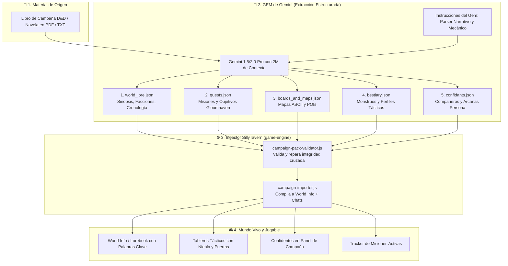

# 📚 Roadmap: Ingesta de Libros y Módulos a Mundos Jugables
## *De un PDF / Novela a una Campaña D&D + Persona + Gloomhaven en SillyTavern*

> **Tu Visión**: Tomas un libro de campaña de D&D (ej. *La Maldición de Strahd*, *Las Minas Perdidas de Phandelver*) o una novela fantástica (*El Señor de los Anillos*, *Nacidos de la Bruma*), lo procesas con un **GEM de Gemini entrenado**, este produce una serie de archivos estructurados (Historia principal, Misiones, Objetos, Bestiario, Mapas), los importas en tu programa y al instante tienes un mundo vivo por el que moverte libremente y jugar tu partida de rol.

---

## ⚠️ 0. Estado y correcciones — 2026-09-21

Este documento se escribió antes de comprobar el contrato de datos contra el motor. La visión se sostiene entera; **los cinco JSON de ejemplo, no**. Tal y como están, el paquete que produjera el Gem no se podría importar, y lo descubrirías después de procesar un libro completo.

### El alcance, acotado

> [!IMPORTANT]
> **El GEM (sección 4) queda fuera de este plan.** Lo harás con tu suscripción de Gemini, no con llamadas a la API, así que el código no lo diseña, no lo llama y no lo paga. Lo único que el programa debe hacer por él es **entregarte el esquema exacto** para que lo pegues en sus instrucciones, y **validar sin piedad** lo que devuelva.
>
> Esa división cambia la prioridad: cuando el productor de datos vive fuera del repositorio, el contrato deja de ser un detalle de implementación y pasa a ser **la pieza principal**. Es lo único que une las dos mitades.

### Lo que ya no es cierto de la sección 1

| Decía | Realidad, comprobada en el código |
| :--- | :--- |
| *Falta la interfaz visual de misiones (E5)* | **Hecha** el 2026-09-21. Los objetivos se evalúan durante el combate y se dibujan sobre el rastreador de iniciativa |
| *Lógica de misiones: solo conectar el panel* | Conectada. Un escenario **decide** el combate: se gana *aguantando rondas* con enemigos en pie, se pierde si cae quien había que proteger |
| *Motor de combate y Persona al 100%* | Cierto, y ahora además **conectados**: las perks de vínculo cambian el combate, y 29 de los 30 módulos del motor los carga el juego |

**Desde el 2026-09-21 no falta ninguno**, `campaign-map.js` incluido — salas, puertas y enemigos dormidos. Y eso importa aquí más que en ninguna otra parte:

---

## 🧭 1. Diagnóstico Honesto: ¿Cómo de lejos estás hoy?

**Respuesta directa**: Estás **mucho más cerca de lo que imaginas: a un ~75% - 80% de completar la visión.**

La inmensa mayoría de proyectos que intentan esto fracasan porque intentan construir la ingesta de IA *antes* de tener un motor de juego que sepa qué hacer con esos datos. Tú has hecho lo correcto: **has construido el motor primero**.

### Lo que YA TIENES listo y testeado en tu código:
1. **El Motor Táctico y de Tableros (Fase A y B)**:
   - Pathfinding A*, niebla de guerra, línea de visión y combate 100% determinista sin gasto de tokens (`game-engine/combat/`, `board/`).
   - El motor ya sabe interpretar mapas en ASCII (`# . D ~ c`) creados por datos o plantillas (`terrainFromAsciiMap`).
2. **El Bucle Persona (Fase D)**:
   - Sistema de calendario (Día / Franjas horarias), vínculos de confianza del 1 al 10 y perks mecánicas reales en combate (`bonds.js`, `bond-perks.js`).
3. **El Motor de Misiones Gloomhaven (Fase E)**:
   - Ya tienes implementada en `campaign/scenarios.js` la lógica de **7 tipos de objetivo** (`eliminate`, `eliminate_all`, `survive_rounds`, `reach_cell`, `escort`, `protect`, `loot`), con objetivos principales y opcionales.
4. **El Asistente de Creación y Esquemas de Mundo (Fase F)**:
   - `world-schema.js` ya valida, repara y compila mundos generados con esquemas estrictos de JSON hacia el Lorebook (`world_info`) de SillyTavern sin tocar código de upstream.
5. **El Editor y Paquete de Reglas D&D (Fase C)**:
   - Un sistema desacoplado (`rules/default-ruleset.js`) que permite añadir armas, tipos de daño y condiciones sin programar.

### Lo que te FALTA exactamente (La brecha del ~20-25%):
1. **El Esquema del Paquete Extendido de Campaña**: Tu `world-schema.js` actual genera un mundo básico de 1 localización y 2-3 monstruos. Falta definir la estructura para una campaña multicapítulo (arcos argumentales, cadena de misiones, múltiples tableros y confidentes).
2. **El GEM / Asistente de Extracción en Gemini**: El prompt maestro del Gem con ventana de 2M de tokens para trocear el libro y generar los JSONs válidos.
3. **El Ingestor de SillyTavern**: Una función o comando (`/import-campaign` o botón en el asistente) que lea esa carpeta/ZIP de JSONs y ejecute en bloque los constructores que ya tienes (`buildWorldMetadata`, `buildWorldEntries`, `buildEncounterRules`).
4. **La Interfaz Visual de Misiones (Fase E5)**: El panel donde el jugador ve la lista de misiones activas en el HUD de la partida.

---

## 🔄 2. Arquitectura del Pipeline: Del Libro a la Partida



---

## 📦 3. El Contrato de Datos: Los 5 Archivos del Paquete

> [!WARNING]
> **Los ejemplos de esta sección están corregidos** contra el motor real (2026-09-21). La versión anterior usaba cinco campos que el juego no lee, y un paquete escrito así se importaría vacío o a medias. Lo que sigue es lo que el código entiende hoy.

### La decisión que lo ordena todo: el Gem escribe **nombres**, el ingestor resuelve **ids**

Un libro no conoce —no puede conocer— los identificadores que el motor asignará: el id de un monstruo es el `uid` de su entrada de World Info, y esa entrada no existe hasta el momento de importar. Pedirle al Gem `targetIds` sería pedirle que invente ids que luego no coincidirán con nada.

Así que el contrato usa **nombres legibles** y el ingestor los traduce al crear las entradas. Es exactamente el mismo problema que ya apareció con las reglas de encuentro del asistente: el tablero se escribía con la lista vacía porque los ids aún no existían, y `/fight` no encontraba enemigos en ninguna campaña nueva. La solución fue escribirlas **después**, y aquí vale igual.

| El Gem escribe | El ingestor produce | Por qué |
| :--- | :--- | :--- |
| `"target": "Líder del Culto"` | `targetIds: ["<uid>"]` | El uid se crea al importar |
| `"required": true` | `optional: false` | El motor razona en objetivos opcionales, no en requeridos |
| `spawnPoints.party` | `partyStart` | El nombre que usan las plantillas |
| `"enemies": [{name, x, y}]` | `encounterRules` + posiciones | Igual que `buildEncounterRules` |

### 1. `world_lore.json` — sin cambios

El ejemplo original es correcto: nombre, género, sinopsis, facciones y entradas de lore. Va directo al Lorebook.

### 2. `quests.json` — corregido

```json
[
  {
    "id": "q_death_house",
    "name": "La Casa de la Muerte",
    "act": 1,
    "description": "Explora el sótano de la mansión encantada y destruye el culto.",
    "boardId": "board_death_house_dungeon",
    "objectives": [
      { "type": "eliminate",  "label": "Acabar con el líder del culto", "target": "Líder del Culto" },
      { "type": "survive_rounds", "label": "Aguantar el ritual", "rounds": 5 },
      { "type": "loot", "label": "Recuperar el relicario", "treasures": ["Relicario de Obsidiana"], "optional": true }
    ],
    "unlockedLocations": ["pueblo_de_barovia"]
  }
]
```

**Los siete tipos y lo que pide cada uno** — el motor ignora en silencio cualquier otro, así que el Gem solo puede usar estos:

| Tipo | Campo que necesita | Se cumple cuando |
| :--- | :--- | :--- |
| `eliminate` | `target` (nombre) | Ese enemigo cae |
| `eliminate_all` | — | No queda ninguno en pie |
| `survive_rounds` | `rounds` | Se alcanza esa ronda |
| `reach_cell` | `cell: {x, y}` | Alguien del grupo pisa la casilla |
| `escort` | `ally` (nombre) + `cell` | Ese aliado llega vivo |
| `protect` | `ally` (nombre) | Sigue en pie al terminar |
| `loot` | `treasures` (nombres) | Se han recogido todos |

`optional: true` marca los que pagan pero no bloquean. **No uses `required`**: el motor no lo lee.

> [!NOTE]
> **Las recompensas (`rewards`) no están en el motor.** Hoy el botín se calcula por el CR de lo que caiga (`combat/loot.js`), no lo fija la misión. Un paquete puede traerlas, pero se ignorarán hasta que exista soporte — y conviene decidir si lo queremos, porque una recompensa fija y una tabla por CR son dos economías distintas peleándose.

### 3. `boards_and_maps.json` — corregido

```json
[
  {
    "id": "board_death_house_dungeon",
    "name": "Cripta del Culto",
    "locationId": "loc_death_house",
    "map": [
      "##############",
      "#....#.......#",
      "#.##.#.#####.#",
      "#..D...#...#.#",
      "#.##.###.D.#.#",
      "#....~...#...#",
      "#.######.###.#",
      "#c...#.....c.#",
      "#....#.....#.#",
      "##############"
    ],
    "partyStart": [{ "x": 3, "y": 8 }, { "x": 2, "y": 8 }],
    "enemies": [{ "name": "Ghoul de Barovia", "x": 8, "y": 8 }]
  }
]
```

Cambios: `partyStart` en lugar de `spawnPoints.party`, y **nada de `S` ni `E` dentro del mapa** — el motor solo entiende `#` muro, `.` suelo, `D` puerta cerrada, `o` puerta abierta, `~` terreno difícil, `c` cobertura media, `C` cobertura de tres cuartos. Cualquier otro carácter se convierte en suelo, con aviso. `width` y `height` sobran: salen del propio mapa.

### 4. `bestiary.json` — sin cambios en lo esencial

Correcto: `name`, `cr`, `hp`, `armorClass`, `profile` (solo `aggressive`, `skirmisher`, `guardian`, `coward`) y `attackRangeFeet`.

**`actions` no se lee todavía.** El daño de un enemigo se deriva hoy de su CR. Un paquete puede traerlas para el futuro, pero no cambiarán nada aún, y es mejor saberlo que descubrirlo cuando el ghoul pegue distinto de lo que dice su ficha.

### 5. `confidants.json` — corregido

```json
[
  {
    "name": "Ireena Kolyana",
    "description": "Joven noble perseguida por el señor del valle.",
    "initialBondPoints": 0,
    "arcana": "Sacerdotisa"
  }
]
```

**Las perks no se definen por personaje.** `bonds.js` las tiene fijas por rango — 3 ataque de seguimiento, 5 relevo, 8 aguantar, 10 contenido — iguales para todos. `startingPerk` y `rank10Perk` no existen; `arcana` se guarda como sabor y no hace nada mecánicamente. Cambiar eso significaría perks por confidente, que es una decisión de diseño, no un campo más.

### Y un sexto archivo que la sección 4 menciona y la 3 no

`items.json` aparece en el paso 2 del Gem pero no entre los cinco. O son seis, o los objetos viven dentro del bestiario y del lore. **Recomiendo cinco**, con los objetos como entradas de lore: el motor todavía no sabe crear un `DndItem` desde un paquete, así que un sexto archivo sería un archivo que nadie lee.

---

## 🧠 4. El GEM de Gemini `FUERA DEL CÓDIGO — LO LLEVAS TÚ`

> [!IMPORTANT]
> **Esto no se desarrolla aquí.** Lo harás con tu suscripción de Gemini, en la web, no con llamadas a la API. El programa no diseña el Gem, no lo invoca y no paga por él.
>
> Lo que el programa sí te debe, y es lo único que necesita de este lado:
>
> 1. **El esquema exacto, listo para pegar** en las instrucciones del Gem — generado desde el código, no copiado a mano, porque una copia a mano se desincroniza en cuanto el motor cambie y el fallo aparecerá dos libros más tarde.
> 2. **Un validador que no perdone**, que al importar diga qué falta, qué sobra y qué se ha reparado. Cuando el productor vive fuera del repositorio, la frontera tiene que ser dura.
> 3. **Un paquete de ejemplo** que puedas enseñarle al Gem como muestra de salida correcta.

La estrategia de tres pasos que describe el texto original —esqueleto, bestiario, campaña y mazmorras— es sensata por el límite de tokens de salida, y se mantiene como nota tuya. El resto de esta sección es tuyo y el código no opina.

---
## 🛠️ 5. El Roadmap de Implementación `REDEFINIDO — 2026-09-21`

Cuatro tareas, en este orden. El orden importa: cada una produce lo que la siguiente necesita, y la primera es la que desbloquea que puedas empezar a trabajar con tu Gem **mientras** se construye el resto.

### G1 · El esquema, exportable `HECHO — 2026-09-21`

**`/esquema-campana`** abre el contrato con ocho vistas: las instrucciones completas, el esquema a secas, un ejemplo de salida correcta y una por cada sección — porque un libro no cabe en una respuesta y el Gem tendrá que producirlo por partes.

Los siete tipos de objetivo salen de `scenarios.js`, los cuatro perfiles de `enemy-ai.js` y los caracteres del mapa de `terrain.js`. **Se genera, no se escribe**: si el motor cambia, cambia lo que pegas.

Incluye las diez reglas que un JSON Schema no puede expresar —las cruzadas entre secciones, que es donde un paquete generado falla de verdad— y un ejemplo que no es el caso fácil: dos tableros, una referencia cruzada, un objetivo opcional y uno de proteger.

**Ya puedes montar el Gem con esto.**

### G2 ✅ HECHO · El validador del paquete (`campaign-pack.js`)

Puro, y duro. Comprueba lo que el documento original proponía y algunas cosas más que la experiencia de este proyecto añade:

- Que cada `boardId` de una misión exista entre los tableros, y que cada nombre de enemigo exista en el bestiario — **la integridad cruzada es donde un paquete generado falla**, no en el formato de un campo suelto.
- Que cada mapa sea rectangular, tenga el borde sellado y deje sitio transitable donde empieza el grupo. *(Ese fue un fallo real: dos personajes dentro de un muro.)*
- Que los tipos de objetivo sean de los siete, y que cada uno traiga su campo.
- Que los perfiles tácticos sean de los cuatro.
- Que los nombres no se repitan: el Lorebook indexa por nombre y el segundo borraría al primero. *(También fue un fallo real.)*

Repara lo reparable y **lo enumera**; rechaza lo que no. Igual que el generador de mundos, y por la misma razón.

**Hecho el 2026-09-21, con 34 tests.** Tres clases de hallazgo en vez de una lista: **errores** que impiden importar, **avisos** que no —un tablero al que ninguna misión te lleva se juega igual— y **reparaciones**, lo que ya se arregló al leerlo, listado y nunca en silencio. Y cuando un nombre está en la lista equivocada lo dice con esas palabras: *«"Mira" no está en el bestiario: está en `confidants`»*. El ejemplo que el propio contrato publica valida limpio, y hay un test que lo fija: si la muestra que el Gem imita no pasara, todo lo de abajo estaría discutiendo consigo mismo.

### G3 ✅ HECHO · El compilador (`campaign-importer.js`)

Toma el paquete validado y lo convierte en campaña jugable reutilizando lo que ya existe: `buildWorldMetadata`, `buildWorldEntries`, `buildEncounterRules`, `QuestState`, y las fichas del grupo con sus vínculos.

**Lo que hace distinto a un mundo de plantilla**: varios tableros, varias localizaciones y una cadena de misiones. Ahí es donde el esquema actual se queda corto — hoy produce una localización y un tablero.

Y aquí es donde se resuelven los nombres a ids, después de crear las entradas.

**Hecho el 2026-09-21, con 24 tests.** Partido en dos a propósito: `buildImportPlan` es puro —paquete dentro, metadatos del mundo y entradas fuera, con los huecos marcados en vez de rellenos— e `importPack` escribe, con sus dependencias inyectadas, y llama a `resolveNames` cuando los ids ya existen. Un nombre que no se resuelve **se informa**: un objetivo que apunta a nadie es una misión que no se puede cumplir y que nunca lo explica.

### G4 ✅ HECHO · Importar desde el asistente

Pegas el JSON que te ha dado el Gem en la cuarta tarjeta, pulsas **Comprobar**, y el informe del validador sale **antes de que se cree nada**: qué trae el paquete, qué está mal y qué se ha reparado. El nombre del mundo lo propone el propio paquete.

Un añadido que el bloque destapó: los enemigos aparecían en una casilla **al azar** de la esquina 10×10, muros incluidos. Con un libro eso importa, porque un libro dibuja a sus monstruos donde quiere. `combat/spawn.js` usa las casillas del tablero cuando las hay y nunca coloca a nadie dentro de un muro.

El plan original decía así:

Una cuarta tarjeta junto a *Mazmorra clásica* y *Generar con IA*: **Importar campaña**. Arrastras los cinco archivos, ves qué trae —título, misiones, tableros, confidentes, y los avisos de reparación— y decides. Igual que la previsualización de la generación con IA, que ya funciona así.

### Lo que hay que hacer antes o a la vez: las salas

**Hecho el 2026-09-21.** Las salas se **deducen del propio mapa**, así que el contrato del paquete no crece ni una línea: abres una puerta, se revela la sala que guardaba y despierta lo que dormía dentro, en la casilla donde lo dibujó el libro. Sin esto, una mazmorra de libro habría sido un único combate gigante.

---

## ⏱️ Dónde estás de verdad

| Pieza | Estado |
| :--- | :--- |
| Motor de combate y tableros | ✅ Hecho, probado y **conectado** |
| Persona: calendario, vínculos y perks | ✅ Hecho y conectado; las perks cambian el combate |
| Misiones Gloomhaven | ✅ Los siete objetivos deciden el combate y se ven en pantalla |
| Salas, puertas y enemigos dormidos | ⬜ **El último módulo sin conectar** |
| Esquema de un paquete multicapítulo | ✅ `campaign-pack-schema.js`, generado desde el motor · 31 tests |
| Validador de integridad cruzada | ⬜ |
| Compilador de ingesta | ⬜ |
| Interfaz de importación | 🟡 El asistente existe; falta la cuarta tarjeta |
| El Gem | ⚪ Tuyo, fuera del código |

> [!NOTE]
> **Sobre el «75-80%»**: la mitad del motor que se da por hecha es real y está medida — `node tools/check-engine-wiring.mjs` dice 29 de 30 módulos cargados por el juego. Lo que no mediría bien ese porcentaje es el esfuerzo restante: lo que queda no es el trozo difícil de programar, es el trozo **difícil de acordar**. El contrato entre tu Gem y el motor es donde este plan se gana o se pierde, y por eso la primera tarea es escribirlo de forma que no se pueda copiar mal.

---

## 🔗 Enlaces Relacionados
- [[HOME]]: Hub central de la wiki.
- [[ROADMAP]]: Estado del motor y baterías ejecutadas.
- [[PROPUESTA_JUEGO_DND_GLOOMHAVEN_PERSONA]]: Documento de diseño general del motor híbrido.
