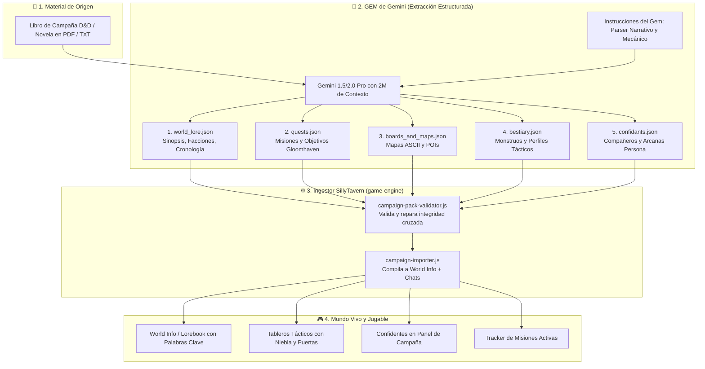

# 📚 Roadmap: Ingesta de Libros y Módulos a Mundos Jugables
## *De un PDF / Novela a una Campaña D&D + Persona + Gloomhaven en SillyTavern*

> **Tu Visión**: Tomas un libro de campaña de D&D (ej. *La Maldición de Strahd*, *Las Minas Perdidas de Phandelver*) o una novela fantástica (*El Señor de los Anillos*, *Nacidos de la Bruma*), lo procesas con un **GEM de Gemini entrenado**, este produce una serie de archivos estructurados (Historia principal, Misiones, Objetos, Bestiario, Mapas), los importas en tu programa y al instante tienes un mundo vivo por el que moverte libremente y jugar tu partida de rol.

---

## 🧭 1. Diagnóstico Honesto: ¿Cómo de lejos estás hoy?

**Respuesta directa**: Estás **mucho más cerca de lo que imaginas: a un ~75% - 80% de completar la visión.**

La inmensa mayoría de proyectos que intentan esto fracasan porque intentan construir la ingesta de IA *antes* de tener un motor de juego que sepa qué hacer con esos datos. Tú has hecho lo correcto: **has construido el motor primero**.

### Lo que YA TIENES listo y testeado en tu código:
1. **El Motor Táctico y de Tableros (Fase A y B)**:
   - Pathfinding A*, niebla de guerra, línea de visión y combate 100% determinista sin gasto de tokens (`game-engine/combat/`, `board/`).
   - El motor ya sabe interpretar mapas en ASCII (`# . D ~ c`) creados por datos o plantillas (`terrainFromAsciiMap`).
2. **El Bucle Persona (Fase D)**:
   - Sistema de calendario (Día / Franjas horarias), vínculos de confianza del 1 al 10 y perks mecánicas reales en combate (`bonds.js`, `bond-perks.js`).
3. **El Motor de Misiones Gloomhaven (Fase E)**:
   - Ya tienes implementada en `campaign/scenarios.js` la lógica de **7 tipos de objetivo** (`eliminate`, `eliminate_all`, `survive_rounds`, `reach_cell`, `escort`, `protect`, `loot`), con objetivos principales y opcionales.
4. **El Asistente de Creación y Esquemas de Mundo (Fase F)**:
   - `world-schema.js` ya valida, repara y compila mundos generados con esquemas estrictos de JSON hacia el Lorebook (`world_info`) de SillyTavern sin tocar código de upstream.
5. **El Editor y Paquete de Reglas D&D (Fase C)**:
   - Un sistema desacoplado (`rules/default-ruleset.js`) que permite añadir armas, tipos de daño y condiciones sin programar.

### Lo que te FALTA exactamente (La brecha del ~20-25%):
1. **El Esquema del Paquete Extendido de Campaña**: Tu `world-schema.js` actual genera un mundo básico de 1 localización y 2-3 monstruos. Falta definir la estructura para una campaña multicapítulo (arcos argumentales, cadena de misiones, múltiples tableros y confidentes).
2. **El GEM / Asistente de Extracción en Gemini**: El prompt maestro del Gem con ventana de 2M de tokens para trocear el libro y generar los JSONs válidos.
3. **El Ingestor de SillyTavern**: Una función o comando (`/import-campaign` o botón en el asistente) que lea esa carpeta/ZIP de JSONs y ejecute en bloque los constructores que ya tienes (`buildWorldMetadata`, `buildWorldEntries`, `buildEncounterRules`).
4. **La Interfaz Visual de Misiones (Fase E5)**: El panel donde el jugador ve la lista de misiones activas en el HUD de la partida.

---

## 🔄 2. Arquitectura del Pipeline: Del Libro a la Partida



---

## 📦 3. El Contrato de Datos: Los 5 Archivos del Paquete

Para que el GEM y SillyTavern se entiendan sin fisuras, el GEM generará un paquete de 5 archivos JSON normalizados:

### 1. `world_lore.json` (Fondo y Ambientación)
Contiene la mitología, las facciones políticas, rumores y secretos del libro:
```json
{
  "name": "La Maldición de Strahd",
  "genre": "Gothic Horror / Fantasía Oscura",
  "synopsis": "Las brumas de Ravenloft han atrapado al grupo en el valle de Barovia...",
  "factions": [
    { "id": "vistani", "name": "Los Vistani", "reputation": 0, "goals": "Servir a Strahd o comerciar" },
    { "id": "martikov", "name": "La Orden de la Pluma", "reputation": 10, "goals": "Resistencia secreta de cuervos" }
  ],
  "loreEntries": [
    { "key": "Barovia", "content": "Valle sombrío rodeado de brumas mortales...", "type": "location" },
    { "key": "Strahd von Zarovich", "content": "Señor vampiro del Castillo Ravenloft...", "type": "npc" }
  ]
}
```

### 2. `quests.json` (Misiones estilo Gloomhaven)
Utiliza directamente los 7 tipos de objetivo que ya reconoce tu `campaign/scenarios.js`:
```json
[
  {
    "id": "q_death_house",
    "name": "La Casa de la Muerte",
    "act": 1,
    "description": "Explora el sótano de la mansión encantada y destruye el culto.",
    "boardId": "board_death_house_dungeon",
    "objectives": [
      { "type": "eliminate", "target": "Líder del Culto", "required": true },
      { "type": "loot", "target": "Relicario de Obsidiana", "required": false }
    ],
    "rewards": { "xp": 300, "gold": 50, "items": ["capa_de_proteccion"] },
    "unlockedLocations": ["pueblo_de_barovia"]
  }
]
```

### 3. `boards_and_maps.json` (Localizaciones y Tableros Tácticos)
Aprovecha tu formato ASCII que ya compila `terrainFromAsciiMap` (`#` muro, `.` suelo, `D` puerta, `~` terreno difícil, `c`/`C` cobertura):
```json
[
  {
    "id": "board_death_house_dungeon",
    "name": "Cripta del Culto",
    "locationId": "loc_death_house",
    "width": 14,
    "height": 10,
    "map": [
      "##############",
      "#....#.......#",
      "#.##.#.#####.#",
      "#..D...#...#.#",
      "#.##.###.D.#.#",
      "#....~...#...#",
      "#.######.###.#",
      "#c...#.....c.#",
      "#..S.#..E..#.#",
      "##############"
    ],
    "spawnPoints": { "party": [{ "x": 3, "y": 8 }], "enemies": [{ "name": "Ghoul", "x": 8, "y": 8 }] }
  }
]
```

### 4. `bestiary.json` (Enemigos y Perfiles Tácticos)
Utiliza los perfiles de IA que ya ejecuta tu `enemy-ai.js`:
```json
[
  {
    "name": "Ghoul de Barovia",
    "cr": 1,
    "hp": 22,
    "armorClass": 12,
    "profile": "aggressive",
    "attackRangeFeet": 5,
    "actions": [{ "name": "Garras Paralizantes", "damage": "2d4+2", "dc": 10 }]
  },
  {
    "name": "Murciélago Gigante",
    "cr": 0.25,
    "hp": 13,
    "armorClass": 13,
    "profile": "skirmisher",
    "attackRangeFeet": 5
  }
]
```

### 5. `confidants.json` (Compañeros y Social Links Persona)
Inyecta confidentes para tu pestaña de Campaña (`bonds.js`):
```json
[
  {
    "name": "Ireena Kolyana",
    "arcana": "Sacerdotisa",
    "initialBond": 0,
    "description": "Joven noble perseguida por el señor del valle.",
    "startingPerk": "Apoyo Moral",
    "rank10Perk": "Destino Inquebrantable"
  },
  {
    "name": "Ismark el Menor",
    "arcana": "Carro",
    "initialBond": 1,
    "description": "Espadachín y hermano protector de Ireena."
  }
]
```

---

## 🧠 4. El GEM de Gemini: Cómo Diseñarlo

Dado que un libro de campaña suele tener entre 100 y 300 páginas (o unas 50.000 a 150.000 palabras), **Gemini 1.5 Pro o 2.0 Pro es el modelo idóneo del mercado para esto**, gracias a su ventana de contexto de **2 millones de tokens** y su fidelidad a esquemas JSON.

### Estrategia de Extracción del Gem (3 Fases de Inferencia):
No le pidas al Gem que escriba los 5 archivos en una sola llamada (chocarías contra el límite de tokens de salida, que suele ser de 8.192 tokens por respuesta). Se estructura en **3 pasos secuenciales**:

1. **Paso 1: El Esqueleto del Mundo**:
   * *Entrada*: El PDF completo del libro.
   * *Prompt*: *"Analiza este libro. Extrae la sinopsis, las facciones principales, la lista de todas las localizaciones clave y los personajes que pueden ser compañeros. Devuelve `world_lore.json` y `confidants.json`."*
2. **Paso 2: Bestiario y Objetos**:
   * *Prompt*: *"Basándote en las criaturas e ítems descritos en el texto, genera `bestiary.json` y `items.json` usando exclusivamente las categorías y perfiles tácticos admitidos por el motor (`aggressive`, `skirmisher`, `guardian`, `coward`)."*
3. **Paso 3: Campaña, Misiones y Mazmorras ASCII**:
   * *Prompt*: *"Extrae los arcos de aventura como una cadena de escenarios Gloomhaven. Para cada mazmorra o encuentro principal, diseña un tablero táctico en ASCII con casillas transitables y muros sellados. Devuelve `quests.json` y `boards_and_maps.json`."*

> [!TIP]
> Puedes crear este Gem en la web de **Google AI Studio** o en el creador de Gems de Gemini Advanced, guardando los esquemas JSON de tu proyecto en las instrucciones del sistema del Gem.

---

## 🛠️ 5. El Roadmap de Implementación en tu Proyecto

Para hacer esto realidad sin romper la arquitectura de tu fork, este es el plan de trabajo estructurado en 4 baterías concisas:

### 🟡 Batería I — Especificación y Validador del Paquete (`campaign-pack.js`)
* **Qué hacer**: Crear `public/scripts/game-engine/campaign/campaign-pack.js`.
* **Misión**: Una función pura `validateCampaignPack(pack)` que verifique:
  * Que los `boardId` mencionados en las misiones existan en la lista de tableros.
  * Que los nombres de enemigos en los spawns existan en el bestiario.
  * Que los mapas ASCII sean rectangulares, tengan muros exteriores y al menos un punto de inicio para el grupo.
* **Coste**: 0 cambios en upstream. ~25 tests unitarios.

### 🟡 Batería II — El Compilador de Ingesta (`campaign-importer.js`)
* **Qué hacer**: Crear `public/scripts/game-engine/campaign/campaign-importer.js`.
* **Misión**: Tomar el paquete JSON validado y:
  1. Crear la entrada de Campaña con su `world_info` mediante `buildWorldMetadata` y `buildWorldEntries`.
  2. Registrar las reglas de encuentro (`buildEncounterRules`) para cada tablero.
  3. Registrar el estado inicial de misiones en `QuestState`.
  4. Crear las fichas de compañeros en `chat_metadata.party` con sus vínculos iniciales a rango 0.
* **Coste**: 0 cambios en upstream. Reutiliza las funciones que ya escribiste en `campaign-worlds.js` y `starter-templates.js`.

### 🟡 Batería III — Interfaz de Usuario: "Importar Campaña"
* **Qué hacer**: Extender el diálogo de bienvenida (`ui/campaign-wizard.js`).
* **Misión**: 
  * Añadir una cuarta tarjeta en el Asistente de Campaña: **"Importar Campaña (JSON / ZIP)"**.
  * Permitir arrastrar los 5 archivos generados por el Gem o seleccionarlos desde el explorador de archivos.
  * Botón de vista previa donde ves el título del libro, número de misiones y tableros antes de confirmar.
  * Al pulsar "Comenzar Aventura", te sitúa en la primera localización del libro con el grupo listo.

### 🟡 Batería IV — El HUD de Misiones (Completar Fase E5)
* **Qué hacer**: Conectar `campaign/scenarios.js` a la interfaz de juego.
* **Misión**:
  * Un botón o pestaña desplegable **"Misiones"** (junto a Party y Campaña).
  * Muestra el objetivo activo actual (ej. *"Derrota al Líder del Culto en la Cripta (0/1)"*).
  * Cuando el motor táctico resuelve la última muerte o el grupo llega a la casilla objetivo, el motor marca la misión como completada, entrega el oro/XP y desbloquea el siguiente escenario en el mapa.

---

## ⏱️ Estimación de Esfuerzo

| Módulo | Estado actual en tu código | Trabajo restante |
| :--- | :--- | :--- |
| **Motor de Combate & Tableros** | ✅ 100% Hecho y testeado | Ninguno |
| **Sistema Persona & Vínculos** | ✅ 100% Hecho y testeado | Ninguno |
| **Lógica de Misiones Gloomhaven** | ✅ 100% Hecho (`scenarios.js`) | Solo conectar el panel visual (E5) |
| **Validador & Compilador de Ingesta** | 🟡 60% Hecho (`world-schema.js`) | Ampliar el esquema para múltiples tableros y misiones |
| **Interfaz de Importación** | 🟡 50% Hecho (`campaign-wizard.js`) | Añadir el lector de archivos JSON |
| **GEM de Extracción en Gemini** | ⚪ 0% (Fuera del código) | Redactar el System Prompt del Gem con los schemas |

> [!IMPORTANT]
> **Conclusión**: No necesitas meses de desarrollo. Con solo implementar el **Validador/Compilador de Campaña** y el **Prompt del Gem**, podrás meter cualquier libro de rol o novela fantástica en tu SillyTavern y empezar a jugar de inmediato.

---

## 🔗 Enlaces Relacionados
- [[HOME]]: Hub central de la wiki.
- [[ROADMAP]]: Estado del motor y baterías ejecutadas.
- [[PROPUESTA_JUEGO_DND_GLOOMHAVEN_PERSONA]]: Documento de diseño general del motor híbrido.
