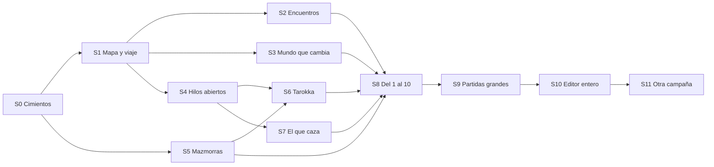

# 🗺️ El mundo semiabierto, construido con Strahd

> **Qué es.** El plan para que el juego tenga **un mundo semiabierto**: una tierra entera a la vista, por la que se viaja libre, que cambia con el tiempo y con lo que haces, y en la que la historia principal sigue llevando de la mano sin llevarte en fila. Se construye **a la vez que *La Maldición de Strahd* se amplía a fondo**: Barovia entera, de la Casa de la Muerte al Castillo Ravenloft, con el Templo de Ámbar, el paso de Tsolenka y la lectura de Tarokka.
>
> **La idea que lo ordena.** No se hace «un Strahd a mano y ya está». Cada cosa que Strahd necesita se hace **tres veces de una**:
> 1. **la pieza del motor**, que sirve para cualquier campaña;
> 2. **su sitio en el editor** (el taller de campañas, los Gems y las herramientas de comprobación), para que la próxima campaña grande la use sin programar;
> 3. **su uso en Strahd**, que es la prueba de que la pieza funciona.
>
> Al final hay un **motor y un editor de mundos semiabiertos**, y la prueba de fuego es meter otra campaña grande de 5e con él (S11) sin tocar el motor.
>
> **De dónde sale.**
> - Lo pediste el 2026-10-04: «creo que lo mejor para implementar el mundo semi abierto sea precisamente con el desarrollo profundo de Strahd… estas bases del motor deben servir también a forma de editor de mundo semiabierto para poder implementar también otras campañas grandes».
> - Los puntos 4 (la ampliación definitiva de Strahd) y 5 (el modo mundo semiabierto) del orden de después de [[ROADMAP_SIN_CONEXION]]. **Aquí van juntos.**
> - Un repaso del código del 2026-10-04: `public/mundos/strahd.pack.json`, el contrato del paquete, el modo guiado, las facciones, los plazos, `world/`, `board/`, el taller y las herramientas (`tools/`). Lo que es un hecho del código lleva su archivo; lo que es opinión, lo digo como opinión.
>
> **Las reglas que respeto.**
> - El motor decide; sin IA y sin tokens.
> - El contenido son datos que se editan sin programar.
> - **Sin narrador** (D-J60): todo lo dice alguien que está allí.
> - El texto se entiende **a la primera**, sin acertijos (también la lectura de Tarokka).
> - Para el jugador, «localización».
> - Lo que se apaga, **se esconde y no se borra** ([[LO_OCULTO]]).
> - **D&D puro** (D-J58): reglas de 5e (2024) primero; lo de cosecha propia va marcado.
> - **El texto de Strahd, con palabras propias.** Del libro se toma qué pasa y dónde, nunca sus frases (como ya hacen `libro.json` y [[GEM_GUIONISTA]]). Los mapas del libro, solo si los traes tú y para jugar en privado.
> - **El arte no se genera aquí**: se apunta en [[PIXELLAB_PENDIENTE]].
> - No toco [[GEM_DIRECTOR_UX]].

**Cómo leer las tablas.**
- **Hoy:** ✅ ya existe; 🟡 existe a medias, apagado o sin contenido que lo use; ⬜ no existe.
- **Capa:** **Motor** (código que vale para cualquier campaña), **Editor** (taller, Gems, herramientas), **Strahd** (contenido) o **Prueba** (bots y comprobaciones).
- **Tam.** (tamaño): **S** cabe en una sesión; **M**, dos o tres; **L**, más.

---

## 📍 Cómo va (2026-10-04)

**Avance: 0 %.** El plan está escrito; no se ha tocado código.

**Cuándo empieza:** cuando acabe [[ROADMAP_APK_ANDROID]] (hoy al 0 %). El orden de después de [[ROADMAP_SIN_CONEXION]] queda así:

1. ✅ Las tres campañas experimentales, escritas enteras.
2. ✅ [[ROADMAP_ENTRETENIDO]] (~99 %; solo quedan tus decisiones).
3. ⬜ [[ROADMAP_APK_ANDROID]] (A0–A9).
4. ⬜ **Este roadmap**, que junta la ampliación de Strahd y el mundo semiabierto.

**Lo que se puede adelantar sin esperar a la APK** (no toca el juego):
- **Tus decisiones** (sección 8): sobre todo D-S1 (una sola Strahd), D-S2 (niveles 1-10) y D-S10 (los mapas).
- **Los mapas de Barovia**: el del valle y los de las mazmorras (Ravenloft por plantas, la Casa de la Muerte, el Templo de Ámbar), si los tienes, en una carpeta.
- **La biblia de las regiones** con el Gem guionista (en prosa, sin JSON): quién vive en cada región, qué quiere y qué se oye allí.

| Fase | Qué deja jugable | Tam. | % |
| :--- | :--- | :---: | :---: |
| **S0** · Los cimientos | Cada campaña sabe si es guiada o semiabierta; las fuentes de Strahd, por regiones | M | 0 % |
| **S1** · El mapa del valle y viajar libre | Barovia entera en el mapa; se viaja a cualquier localización conocida | L | 0 % |
| **S2** · El camino peligroso | Encuentros y sucesos por región, franja y estación; la noche da miedo | M | 0 % |
| **S3** · Un mundo que cambia | Localizaciones con estados; facciones y plazos reencendidos con cuidado | L | 0 % |
| **S4** · Rumores, pistas y misiones abiertas | Varios hilos a la vez, en el orden que quieras | M | 0 % |
| **S5** · Mazmorras grandes | Ravenloft por plantas y salas, sobre sus mapas; salir y volver | L | 0 % |
| **S6** · La lectura de Tarokka | El sorteo que reparte el mundo en cada partida | M | 0 % |
| **S7** · El enemigo que caza | Strahd os busca, os pone a prueba y se lleva a quien no debe | M | 0 % |
| **S8** · Del nivel 1 al 10 | La curva entera, de la Casa de la Muerte a la cripta | M | 0 % |
| **S9** · Partidas grandes | Guardar sin tirones y sin que la partida engorde, también en el móvil | M | 0 % |
| **S10** · El editor entero y su guía | El taller, los Gems y los bots, listos para otra campaña grande | L | 0 % |
| **S11** · La prueba de fuego | Otra campaña grande de 5e, hecha con el editor | L | 0 % |

**Los hitos jugables:**

| Hito | Qué se puede hacer al llegar | Fases |
| :--- | :--- | :--- |
| **MS1 · Barovia en el mapa** | La Strahd de hoy, con el valle entero dibujado y el viaje libre entre sus localizaciones | S0, S1 |
| **MS2 · Un valle vivo y peligroso** | Encuentros de día y de noche, Vallaki que cambia según cuándo llegues, hilos en cualquier orden. **Aquí Strahd pasa a semiabierta en el tablón** (D-S1) | S2, S3, S4 |
| **MS3 · Ravenloft, las cartas y el conde** | El castillo entero por plantas, la lectura que esconde los tesoros y Strahd que os caza | S5, S6, S7 |
| **MS4 · Del 1 al 10, también en el móvil** | Barovia entera de principio a fin, en el PC y en la APK | S8, S9 |
| **MS5 · El editor probado** | Otra campaña grande, hecha casi entera por los Gems con este editor | S10, S11 |

---

## 1. Qué es «semiabierto» aquí

### 1.1 Guiado, semiabierto y abierto

| | **Guiado** (D-J62, hoy) | **Semiabierto** (este plan) | **Abierto** (no se hace) |
| :--- | :--- | :--- | :--- |
| **El mapa** | Se ve entero | Se ve entero, con regiones y caminos | Se genera sin fin |
| **Viajar** | Solo adonde manda la historia, un encargo o un rumor oído | A cualquier localización **conocida**, con su tiempo y su peligro | A cualquier parte |
| **Entrar en un tablero** | Porque la historia o un encargo te lleva | También al **explorar** una localización-mazmorra («Entrar en el castillo») y al toparte con un encuentro | Siempre |
| **La historia** | Hitos en fila, uno tras otro | Hitos **ancla** que siempre se ven, y varios hilos abiertos a la vez | No hay |
| **El mundo** | Quieto mientras no lo tocas | Las facciones y el tiempo **lo cambian** (con tope y avisando) | Simulación entera |
| **Plazos** | Apagados (D-J46) | Pocos, avisados, y llegar tarde cambia la rama, nunca cierra el final | — |
| **El reparto** | Fijo | **La semilla reparte** (la lectura de Tarokka) | Todo al azar |

**Semiabierto, en una frase:** el valle entero está a tu alcance desde pronto y lo recorres como quieras, pero la historia principal sigue diciéndote siempre qué tienes entre manos, y el final sigue siendo uno de los escritos.

### 1.2 Lo que vuelve de [[LO_OCULTO]], y con qué condiciones

Nada vuelve de golpe ni para todas las campañas. **Lo enciende el paquete de cada campaña** (`world.mode: "semiabierto"`, S0.2). El gremio, 1387 y las experimentales siguen guiadas.

| Lo oculto | Interruptor | ¿Vuelve en semiabierto? | Con qué condiciones |
| :--- | :--- | :--- | :--- |
| **«Viajar» a cualquier sitio** y **«Viajar aquí»** en el mapa | `GUIDED_MODE` (`campaign/guided-mode.js`) | **Sí** | Solo a localizaciones conocidas (no escondidas) y con el camino abierto. Antes de salir, uno de los tuyos dice cuánto se tarda, si llegaréis de noche, el peligro y el nivel de la región |
| **«Tableros de aquí»** | `GUIDED_MODE` | **No como lista** | Se entra en un tablero al **explorar** una localización-mazmorra (S5) o al toparse con un encuentro (S2). Los tableros sueltos de un pueblo siguen entrándose por la historia o un encargo |
| **La fila de acciones libres** (tablón, mercenarios, mirar, rumores, «Tirada», «+N más») | `GUIDED_MODE` | **No** | Lo que hacía ya vive en su sitio (la Casa del Gremio, la taberna, el sitio que se mira). La «Tirada» suelta no vuelve |
| **«Explorar los alrededores»** | `GUIDED_MODE` (y `world/growth.js`, tope de 18 sitios) | **No en Strahd** | Barovia está escrita entera: no hay sitios que inventar. Vuelve para las campañas de semilla (D-S13) |
| **La simulación de facciones** (relojes, quién manda, noticias) | `FACTION_WORLD` (`campaign/factions.js`) | **Sí, a medias** (S3.2) | Solo las facciones que el paquete marca con reloj, como mucho tres; relojes lentos y visibles en el Diario; lo que pasa llega contado por la gente. **Los precios por facción no vuelven** (D-S5) |
| **Los plazos del hilo** (J9.5) | `STORY_DEADLINES` (`campaign/plot.js`) | **Sí, pocos** (S3.3) | Solo en hitos marcados, con `late` escrito (qué pasa si llegáis tarde), avisados en la cabecera y por un compañero. Como mucho dos o tres a la vez (D-S6) |
| **La ayuda «¿Qué puedo hacer aquí?»** con tableros y viajes | `GUIDED_MODE` | **Sí** | Ofrece lo que el modo semiabierto deja hacer |
| Los gestos de los retratos, los botones directos de tu gente, los tres tableros huérfanos de 1387 | `PORTRAIT_MOODS`, `DIRECT_SOCIAL_BUTTONS` | No tiene que ver | Siguen como están |

**Un hecho del código que manda en S0:** los tres interruptores (`GUIDED_MODE`, `FACTION_WORLD`, `STORY_DEADLINES`) son hoy **constantes de todo el juego** (`{ on: true }` o `{ on: false }`). Para que una campaña sea semiabierta y las demás no, tienen que pasar a decidirse **por campaña**: el interruptor de siempre se queda como interruptor general (apagado, nunca), y dentro, manda el modo de la campaña en curso.

### 1.3 Cómo convive con la historia principal

El peligro del mundo abierto es perder la guía: el jugador no sabe qué hacer y se aburre. Para que no pase:

- **Los actos y los finales se quedan.** Strahd sigue teniendo sus actos (hoy 5) y sus finales (hoy 3, por la facción que os ganáis: `endingBy`). Lo que cambia es que dentro de un acto **varios hitos están abiertos a la vez**.
- **Hitos ancla.** Cada acto tiene uno o dos hitos que **siempre** se ven en «Lo que pide la historia» y en la cabecera (por ejemplo, «Llevar a Ireena a un sitio seguro»). Los demás hilos salen en «Lo que tienes entre manos» (S4.1).
- **Puertas de la historia, pocas.** `closedUntil` (un camino cerrado hasta un hito) se usa solo donde el libro lo pide de verdad (las puertas del castillo, el paso de Tsolenka). Lo demás se cierra **por nivel, con aviso** y no con candado: puedes ir a Argynvostholt a nivel 3, pero uno de los tuyos te dice que allí van grupos de nivel 6.
- **Siempre se sabe qué hacer.** Si llevas un rato sin avanzar, un compañero lo dice con su voz (G6.3 de [[ROADMAP_AUTOMATIZAR]], S4.4).
- **Nada se rompe por el orden.** Si un hilo depende de alguien (Ireena), el hilo dice qué pasa si ese alguien falta (otra rama, nunca un atasco). Lo comprueba el bot jugando en órdenes distintos (S4.8).

### 1.4 El Tarokka: la semilla que reparte el mundo

En el libro, la adivina echa cinco cartas al empezar y esas cartas deciden **dónde están los tres tesoros** contra Strahd, **quién es vuestro aliado** y **en qué sala del castillo espera el conde**. Es justo lo que un mundo semiabierto necesita: **dos partidas del mismo mundo no se juegan igual**.

En el motor esto es una pieza general, **el sorteo** (`world.draws`, S6.1): el paquete dice qué se reparte y entre qué candidatos, la semilla de la partida lo decide y la escena de la lectura lo cuenta **en llano** (sin versos crípticos: «La espada está en la torre del lago, donde se esconde el cazador de vampiros»). Otra campaña puede usarlo para esconder un tesoro, elegir al traidor o decidir dónde se esconde el villano.

**Un hecho de hoy:** en `strahd.pack.json` la lectura **no existe**. El hito «Lectura interrumpida» empieza a leer, los lobos atacan, se gana la pelea y la lectura no se retoma; el Tarokka solo sale en la descripción de Madam Eva. El Tomo de Strahd, el Símbolo Sagrado de Ravenkind y la Espada del Sol sí existen como objetos.

---

## 2. Las bases del motor, separadas de Strahd

Lo que un mundo semiabierto necesita, sea cual sea la campaña. Cada base dice qué hay ya, qué falta y en qué fase entra.

| Base | Qué hay ya (archivo) | Qué falta | Fase |
| :--- | :--- | :--- | :---: |
| **El modo de cada campaña** | Los interruptores generales (`guided-mode.js`, `factions.js`, `plot.js`) | Que lo decida el paquete (`world.mode`) y la campaña en curso | S0 |
| **El mapa del mundo por regiones** | Localizaciones con `region` como texto, que nada usa (solo sabor). El mapa dibujado con CSS que pone cada sitio donde dice `map: {x, y}` o lo reparte solo (`world/map-layout.js`, J10.5) | Regiones como datos (nivel, peligro, bioma, encuentros); el mapa sobre una **imagen** del mundo; el editor que pone sitios y caminos pulsando | S1 |
| **Caminos** | Rutas en días (`world/travel.js`), cerradas hasta un hito, por estación (`seasons.js`), por reputación y llaves (`route-gates.js`), por mar (`ships.js`), monturas (`mounts.js`) | Tramos de **menos de un día** (en franjas: mañana, tarde, noche; el reloj ya las tiene en `calendar.js` y `day-parts.js`), el **tipo** de camino y su peligro, y la vuelta escrita sola | S1 |
| **Viaje libre con tiempo y peligro** | Viajar con decisiones (`travel-choices.js`), papeles (`travel-roles.js`), tarjetas del camino (`road-cards.js`), atajos y mercaderes (`road.js`). Todo escondido tras el modo guiado salvo adonde manda la historia | Encenderlo por campaña, viajar por varias localizaciones seguidas y el aviso de nivel y de llegar de noche | S1 |
| **Encuentros y sucesos por región y hora** | Sucesos con momento (viaje, llegada, descanso, semana), sitio, tiempo, bioma y disparadores de facción (`sucesos.js`, `suceso-triggers.js`). **El viaje no trae peleas**, a propósito (`travel.js`) | Tablas de encuentros por región, franja y estación, con pelea en un tablero generado del bioma (`world-builder/board-intent.js`) y sus salidas; sucesos con región y franja | S2 |
| **Localizaciones que cambian** (estado del mundo) | Lo que el grupo hace deja huella (`world-marks.js`, `world-memory.js`, `world-echoes.js`); a un sitio le va mejor o peor (`world/fortune.js`); la gente se muda o muere (`people-fate.js`) | **Estados escritos** de una localización (Vallaki en fiesta, tomada, ardiendo) con lo que cambia (gente, servicios, tableros, fondo) y qué los dispara | S3 |
| **Facciones** (`FACTION_WORLD`) | La simulación entera, hecha y apagada (D-J58): relojes lentos sin azar, quién manda, noticias (`news.js`), encargos y sucesos de facción. Las cinco facciones de Strahd **ya traen meta y ritmo** (`goal`, `pace`) | Encenderla por campaña, con tope, y que sus metas cambien estados de localizaciones | S3 |
| **Plazos** (`STORY_DEADLINES`) | Hechos y apagados (D-J46): `within`, `late`, `since` | Encenderlos por campaña, solo en hitos marcados y avisados | S3 |
| **Rumores que llevan a sitios** | Rumores con quién, dónde y adónde llevan; un rumor destapa una localización (`rumors.js`); en el modo guiado ya se viaja adonde dice un rumor oído | Que un rumor abra también una misión o una pista, y el Diario que agrupa las pistas por hilo | S4 |
| **Misiones abiertas y en cadena** | Hitos que se abren de seis formas y piden de nueve (`plot.js`: `OPENS`, `ASKS`), cadenas de encargos (Strahd tiene 4), el grafo del hilo en el taller (`plot-graph.js`) | Varios hilos a la vez en la pantalla, hitos que se abren con **cualquiera** de varios, y la comprobación de que el orden no rompe nada | S4 |
| **Mazmorras grandes por salas** | Mapas en imagen con muros, puertas, alturas y salas con nombre (`board/map-image.js`, `zones.js`, J12.8–J12.13); varias plantas con escaleras y estado propio (`dungeon-levels.js`); niebla de guerra; seguir o volver (E2.4, `press-on.js`); explorar hacia delante (E7.1) | La localización-mazmorra que se **explora** desde su puerta, plantas desde imágenes en lote, estado entre visitas, habitantes que se mueven | S5 |
| **El sorteo** (Tarokka) | La semilla de la partida (`campaign/seed.js`) | `world.draws`: qué se reparte, entre qué candidatos y cómo se anuncia | S6 |
| **El enemigo que caza** | Un villano que asoma por actos (`villain.js`), la némesis que vuelve (`nemesis.js`) | `world.hunter`: atención que sube y baja, visitas, lo que no puede hacer | S7 |
| **Tramos de nivel** | Los cuatro tramos de 5e en el tablón (`level-tiers.js`, E8.1); el ajuste con tope (D-J56); el aviso antes de un tablero final (D-J59); dones épicos (E8.2) | Nivel por región; la cuenta de si la experiencia de una región llega al nivel de la siguiente | S8 |
| **Guardar partidas grandes** | Una partida es su chat y su Lorebook; el estado, 117 claves declaradas (`state-registry.js`); el paquete entra entero en el Lorebook al empezar (`campaign-importer.js`); se guarda el chat entero en cada cambio (173 veces en la partida de prueba de la APK) | Medir con Barovia entera y, si hace falta, guardar solo lo cambiado y cargar por partes | S9 |

---

## 3. El editor de mundos semiabiertos

### 3.1 Cómo se describe un mundo en el paquete

**La regla: ampliar sin romper.** Todo lo nuevo es **opcional**. Un paquete sin `world.mode` es guiado y se juega como hoy. `CAMPAIGN_PACK_VERSION` se queda en 1 mientras nada de lo viejo cambie de significado; `normalizePack` (`campaign/campaign-pack.js`) rellena lo que falte. El esquema se sigue **generando desde el motor** (`campaign/campaign-pack-schema.js`), y `node tools/gem-instructions.mjs --check` sigue en verde: así el Gem aprende cada campo nuevo sin escribirlo a mano.

Lo nuevo, en un esbozo (los nombres exactos los fija cada fase):

```json
{
  "world": {
    "name": "La Maldición de Strahd",
    "mode": "semiabierto",
    "levels": [1, 10],
    "map": { "image": "mundos/strahd/mapas/barovia.webp" },
    "regions": [
      {
        "id": "svalich", "name": "El bosque de Svalich", "biome": "bosque",
        "danger": 2, "levels": [1, 3],
        "encounters": [
          { "franjas": ["noche"], "weight": 3, "enemies": ["Lobo gris", "Lobo gris", "Lobo terrible"] },
          { "franjas": ["mañana", "tarde"], "weight": 2, "suceso": "el-ahorcado-del-cruce" }
        ]
      }
    ],
    "draws": [
      {
        "id": "espada", "what": "Espada del Sol",
        "places": [ { "location": "Torre de Van Richten" }, { "location": "Argynvostholt", "zone": "La capilla" } ],
        "tell": "La espada está en {lugar}."
      }
    ],
    "hunter": {
      "who": "Strahd von Zarovich", "home": "Castillo Ravenloft", "cannotEnter": ["templo"],
      "raise": { "kill": 1, "milestone": 1 }, "visits": [ { "at": 2, "beats": [] } ]
    }
  },
  "locations": [
    {
      "name": "Ciudad de Vallaki", "region": "vallaki", "map": { "x": 38, "y": 52 },
      "states": [ { "id": "festival", "when": { "day": [3, 10] }, "description": "…", "services": ["posada", "tienda"] } ],
      "routes": [ { "to": "Lago Zarovich", "franjas": 1, "kind": "sendero" } ]
    }
  ],
  "boards": [ { "id": "ravenloft-1", "name": "Ravenloft: el gran salón", "image": "…", "grid": { "cell": 70 }, "next": "ravenloft-2", "zones": [] } ]
}
```

| Campo nuevo | Para qué | Fase |
| :--- | :--- | :---: |
| `world.mode` | `"guiado"` (sin nada) o `"semiabierto"` | S0 |
| `world.map`, `locations[].map` | La imagen del mundo y dónde cae cada localización (el `map: {x, y}` ya lo lee `map-layout.js`) | S1 |
| `world.regions[]` | Nombre, bioma, peligro, nivel y encuentros de cada región. Las localizaciones la nombran con `region`, como hoy | S1, S2 |
| `routes[].franjas`, `routes[].kind`, `routes[].danger` | Tramos cortos, tipo de camino y su peligro | S1 |
| `sucesos[].when.region`, `when.franja` | Sucesos por región y hora | S2 |
| `locations[].states[]` | Los estados de una localización y lo que los dispara | S3 |
| `world.factions[].clock` | Qué facciones tienen reloj (las demás, solo reputación, como hoy) | S3 |
| `plot.milestones[].within`, `late` | Ya existen; ahora se leen en las campañas semiabiertas | S3 |
| `plot.milestones[].anchor`, `opens.anyOf` | El hito ancla de cada acto y abrirse con cualquiera de varios | S4 |
| `boards[].next`, `boards[].entrance` | Ya existe `next` (escaleras); la entrada desde la localización | S5 |
| `world.draws[]` | El sorteo | S6 |
| `world.hunter` | El enemigo que caza | S7 |

### 3.2 Las fuentes de una campaña grande, por regiones

Hoy Strahd se escribe en tres archivos (`wiki/campanas/strahd/original.json`, `libro.json` y `mejoras.json`) que `node tools/campana-a-paquete.mjs strahd` junta en `public/mundos/strahd.pack.json`. Con Barovia entera, esos archivos crecerían a cuatro veces lo de hoy y **dos agentes no podrían tocarlos a la vez**.

**Propuesta (S0.4):** una carpeta por región.

```
wiki/campanas/strahd/
  original.json            tal cual llegó; no se toca
  comun.json               el mundo, las facciones, el hilo, los sorteos y el cazador
  regiones/
    svalich.json           sus localizaciones, gente, tableros, misiones, encargos, rumores, sucesos y encuentros
    aldea-de-barovia.json
    vallaki.json
    ...
```

`campana-a-paquete` las junta en orden y su `--check` dice si el paquete escrito es el que saldría. El primer paso es **repartir lo de hoy sin cambiar el paquete** (byte a byte). Lo mismo vale para cualquier campaña grande que venga.

### 3.3 El taller de campañas (J5.9), con una pestaña «Mundo»

El taller del gremio ya sube el guion (Markdown del Gem, Word o JSON), da el informe con «Copiar la lista para tu Gem», rellena huecos, simula cada pelea y edita mapas en imagen. Para los mundos semiabiertos se le añade, fase a fase:

| Herramienta del taller | Qué hace | Fase |
| :--- | :--- | :---: |
| **Mapa del mundo** | Subes la imagen del mapa; pulsas para poner cada localización; arrastras de una a otra para hacer un camino (te pide días o franjas y el tipo); pintas las regiones | S1 |
| **Encuentros** | La tabla de cada región, con la simulación rápida que dice si cada encuentro es fácil o duro para el nivel de la región | S2 |
| **Estados y tiempo** | Los estados de cada localización, y «Dejar pasar 30 días sin hacer nada»: qué cambia, día a día | S3 |
| **El hilo como grafo** | Ya existe para los hitos (`plot-graph.js`); se le añaden misiones y encargos, y avisa de un hito que no se abre por ningún camino | S4 |
| **Mazmorras** | Subir las plantas en lote, emparejar escaleras, ver la mazmorra entera con lo que falta en cada sala | S5 |
| **Sorteos** | Qué se reparte y entre qué candidatos, con «Probar 10 semillas» | S6 |
| **El que caza** | Su tabla por atención y una simulación de 30 días | S7 |
| **El informe por región** | El medidor de densidad, región a región | S10 |

### 3.4 Los Gems hacen la mayor parte

Como hoy ([[GEM_COMO_HACER_CAMPANA]]), con **dos Gems** y un cambio de forma: **una campaña grande se trabaja región a región**.

- **El Gem de campaña** ([[GEM_CREAR_CAMPANA]]) escribe primero `comun.json` (el mundo, las regiones con su nivel y peligro, las facciones, los actos, los hitos ancla, los sorteos y el cazador) y luego **una región por mensaje**: sus localizaciones con estados, gente, tableros, misiones, encargos, rumores, sucesos y encuentros. Sus instrucciones salen del esquema (`gem-instructions.mjs`), así que aprende cada campo nuevo sola.
- **El Gem guionista** ([[GEM_GUIONISTA]]) añade una **ronda de región**: las conversaciones de los hitos de esa región, las charlas, lo que se mira, las salidas de las peleas y las visitas del que caza.
- **No hace falta un tercer Gem** (D-S12 lo deja en tus manos).
- El bucle de siempre: pegar → el informe → «Copiar la lista para tu Gem» → corregir. Ahora con el informe por región.

### 3.5 Mapas desde imágenes

- **El mapa del mundo** no tiene cuadrícula: no se lee por píxeles. Se ponen los sitios **pulsando** encima en el taller (S1.5). Es rápido: Barovia son unos 30 puntos.
- **Las mazmorras** sí se leen solas, con lo de J12.8–J12.13 (`board/map-image.js`, `tools/mapa-a-tablero.mjs`): cuadrícula, muros, puertas, alturas y salas con nombre. Lo nuevo es hacerlo **en lote** (todas las plantas de un castillo de una vez) y emparejar las escaleras entre plantas (S5.6).
- **Límites del motor:** un tablero es como mucho de 40 × 30 casillas (`BOARD_LIMITS`). Una planta más grande se parte en dos tableros unidos por una puerta o una escalera.

### 3.6 Las herramientas de comprobación

| Herramienta | Hoy | Lo que se le añade |
| :--- | :--- | :--- |
| `tools/check-world-density.mjs` (y el informe del taller) | Strahd llega al listón entero (14 de 14 localizaciones con algo que hacer, 7 secretos, 41 rumores) | **Un listón por región**: algo que hacer en cada localización, encuentros de día y de noche, un sitio seguro para dormir a menos de un día, al menos dos rumores que llevan a otra región; todo alcanzable; sorteos alcanzables; la curva de niveles (S8.2) |
| `tools/sim-campana.mjs` | Juega cada tablero que pide el hilo, en orden, con un grupo como el que tendrías | `--region X`: los encuentros y tableros de una región, al nivel de la región y dos por debajo |
| `tools/vuelta-strahd.mjs` y `vuelta-campana.mjs` (el bot de `vuelta-bot.mjs`) | Juega los hitos en un orden fijo y apunta silencios y atascos | **`tools/vuelta-mundo.mjs`**: el bot con objetivos abiertos. Elige hilos en orden al azar (con semilla), viaja de verdad, para en los encuentros y llega a un final. Con `--semillas 5`, cinco partidas distintas. La vuelta guiada de hoy se queda como prueba de que el modo guiado no se rompe |
| `ProbarCampañas.exe` (J16.6) | Elige campaña, «Correr», pestañas Bien, Regular y Mal | La opción «Mundo semiabierto» con su semilla, y los números nuevos: regiones visitadas, días, peleas por día, hilos cerrados, veces que caza el enemigo |
| `tools/guion-word.mjs` (el guion en Word, J5.7 y J5.8) | Todo el texto de una campaña, ida y vuelta | Por **región** y por **categoría** (escenas, charlas, sucesos, encuentros, rumores, lo que se mira), para no sacar Barovia entera de una vez. Va con el exportador por categorías en `.exe` que pediste el mismo día (va aparte de este plan) |
| `tools/retratos-pendientes.mjs` | Quién no tiene retrato, con su prompt | Nada: ya sirve por campaña |

### 3.7 Guía paso a paso: meter otra campaña grande con este editor

Para cuando el editor esté entero (S10). Es el camino que seguirá S11, y saldrá también como tutorial en [[Tutoriales]] (S10.6).

| Paso | Quién | Qué | Tiempo |
| :--- | :--- | :--- | :--- |
| **1. Elegir y traer** | Tú | La aventura (D-S11) y lo que tengas de ella: tu JSON, los mapas en imagen (privados) | — |
| **2. La biblia** | Gem guionista | En prosa: premisa, tono, lo que el mundo no tiene, el conflicto, la gente principal y **las regiones** (qué hay en cada una, para qué nivel, qué se oye allí) | 1 tarde |
| **3. Lo común** | Gem de campaña | `comun.json`: el mundo con `mode: "semiabierto"`, las regiones, las facciones (las de reloj, marcadas), los actos con sus hitos ancla, los finales, los sorteos y el que caza (si los hay) | 30-60 min |
| **4. El mapa del mundo** | Tú, en el taller | Subir la imagen, poner las localizaciones pulsando y unir los caminos | 30 min |
| **5. Región a región** | Gem de campaña | Una región por mensaje: localizaciones con estados, gente con aspecto, tableros, misiones, encargos, rumores, sucesos y encuentros | 20-40 min por región |
| **6. El informe** | El juego y el Gem | Pegar, leer el informe por región, «Copiar la lista para tu Gem», corregir. Hasta que salga en verde | 5-15 min por vuelta |
| **7. Las mazmorras** | Tú, en el taller | Subir las plantas en lote, revisar muros y puertas, nombrar las salas | 10 min por planta |
| **8. Las voces** | Gem guionista | Una ronda por región: conversaciones, charlas, lo que se mira, salidas de las peleas, visitas del que caza | 15-30 min por región |
| **9. La curva** | El juego | El informe de niveles (S8.2) y `sim-campana --region` en cada región | Solo, 10-20 min |
| **10. El bot** | `ProbarCampañas.exe` | «Mundo semiabierto», cinco semillas. Mirar la pestaña Mal y Regular | Solo, 30-90 min |
| **11. Los retratos y el arte** | Claude con PixelLab | `retratos-pendientes.mjs` y los escenarios, cuando haya créditos | — |
| **12. Leerla** | Tú | El guion en Word por regiones; corregir y devolverlo | Lo que tardes en leer |
| **13. Jugarla** | Tú y tus amigos | La plantilla de «Vuestras pruebas» (J16.5) | — |

**La meta de S11:** hacer estos pasos **sin tocar el motor**. Lo que obligue a programar se apunta como hueco del editor y se arregla en el editor, no en la campaña.

---

## 4. Strahd a fondo, el primer caso

### 4.1 Lo que hay hoy (medido el 2026-10-04)

`public/mundos/strahd.pack.json` (227 KB), hecho con `tools/campana-a-paquete.mjs strahd` desde `original.json` (18 KB), `libro.json` (86 KB) y `mejoras.json` (119 KB).

| Qué | Hoy | Comparado con 1387 |
| :--- | :---: | :---: |
| Localizaciones | 14 (8 a la vista, 6 escondidas) | 14 |
| Regiones | 7, solo de nombre (El Valle Oriental, Río Ivlis, El Valle Central, Las Colinas Occidentales, Lago Baratok, Río Luna, Borde de la niebla) | — |
| Tableros | 18, todos dibujados con letras (el mayor, 13 × 22); **ninguno con imagen ni salas con nombre** | 19 |
| Tableros del Castillo Ravenloft | 3: la entrada, el comedor del conde y la cripta | — |
| Gente con nombre / confidentes | 36 / 5 (Ismark, Ireena, Madam Eva, Van Richten, Ezmerelda) | 25 / 5 |
| Bestiario / objetos | 19 / 28 | 15 / 26 |
| Misiones / encargos / rumores | 18 / 15 (4 cadenas) / 41 | 17 / 17 / 31 |
| Sucesos propios / charlas con ramas | 3 / 1 (Ismark) | 4 / 1 |
| Hilo | 13 hitos en 5 actos, 3 finales según la facción que os ganáis, 3 presagios | 20 hitos, 3 finales |
| Facciones | 5, **ya con meta y ritmo** (la corte de Strahd quiere controlar Vallaki; la Orden del Dragón de Plata, destruir el campamento vistani…), apagadas por D-J58 | — |
| Nivel / viaje | 1 a 7 (en `mundos.json`); la cripta, para 6-7 (D-J56); 9 días desde el gremio | — |
| Retratos | 179 archivos en `retratos/strahd/` | — |
| Densidad | Llega al listón entero | Llega |

**El hilo de hoy, en una línea:** aldea (la bruja de la taberna, la mansión, el sótano) → campamento vistani (la lectura interrumpida) → Vallaki (el festival) → tres ramas a la vez (el molino; Argynvostholt; la bodega y Krezk) → las puertas del castillo → la cena → la cripta. Es casi una fila: un camino principal y tres ramas cortas.

### 4.2 Barovia entera: región a región

Lo que pide el libro, contado con palabras propias, frente a lo que hay. La región y su nivel son una propuesta; la curva final sale de S8.

| Región (propuesta) | Localizaciones | Hoy | Qué falta | Nivel | Fase |
| :--- | :--- | :---: | :--- | :---: | :---: |
| **Prólogo** | **La Casa de la Muerte** (la casa, los pisos de arriba, el desván, las mazmorras del culto) | ⬜ | Todo: 3-4 plantas, su gente (los niños fantasma), su final (la casa que se cierra) | 1→3 | S5 |
| **El bosque de Svalich** | Las puertas de Barovia, el camino viejo de Svalich, la encrucijada de la horca, el cruce del Ivlis | ⬜ | Localizaciones de paso con algo que mirar y un suceso; encuentros de bosque | 1-3 | S1, S2 |
| **La aldea de Barovia** | La taberna, la mansión del burgomaestre, la iglesia y su sótano, la tienda de Bildrath, la casa de María la Loca, el cementerio | 🟡 | El cementerio y el entierro de Kolyan; la casa de María la Loca como sitio (hoy es un encargo); los estados de la aldea según Ireena se vaya o no | 1-3 | S3 |
| **Río Ivlis y el Tser** | El campamento del estanque Tser, la cascada | ✅ | **La lectura de verdad** (S6); el puente del Tser | 3 | S6 |
| **Vallaki y el lago Zarovich** | La plaza, el taller del ataudero, la posada del Agua Azul, la iglesia de San Andral, la mansión del barón, la casa de Lady Wachter, el campamento vistani de Vallaki, **el lago Zarovich** | 🟡 | La ciudad entera con **estados** (el festival con plazo, Lady Wachter al mando, Vallaki ardiendo o libre); los huesos de San Andral; Arabelle y el lago | 3-5 | S3, S4 |
| **El molino** | El Viejo Mascahuesos | ✅ | Los pastelitos de los sueños como hilo con Vallaki | 4-5 | S4 |
| **Las colinas occidentales** | La bodega El Mago de los Vinos, Krezk, **la abadía de Santa Markovia**, la poza sagrada | 🟡 | La abadía y el Abad como hilo (hoy solo es gente de Krezk); las tres gemas de la bodega; los estados de Krezk | 5-6 | S3, S4 |
| **Yester y Berez** | La colina Yester, las ruinas de Berez (la choza de Baba Lysaga), el río Luna | ✅ | Interiores y la relación de Baba Lysaga con el conde | 5-7 | S4 |
| **Argynvostholt** | La mansión de los caballeros, la baliza | 🟡 | Interiores (una o dos plantas), el cráneo del dragón y encender la baliza | 6-7 | S5 |
| **El lago Baratok** | La torre de Van Richten, la guarida de los hombres lobo | ✅ | La trampa de la torre; los lobos de Kiril y Emil como hilo | 6-7 | S4 |
| **Las montañas Balinok** | **El paso de Tsolenka** (el puente y la torre), **el Templo de Ámbar** (dos plantas), el monte Ghakis | ⬜ | Todo: el paso con su guardia, el templo con sus dones oscuros (D-S7), Kasimir y su hilo | 8-9 | S5 |
| **El Castillo Ravenloft** | Las puertas y el patio, el gran salón y la capilla, los aposentos, las torres, las bodegas y las mazmorras, las catacumbas, la cripta | 🟡 | De 3 tableros a unos 10-14, por plantas, con salas con nombre; Strahd que se mueve por el castillo; la sala del sorteo | 9-10 | S5, S6, S7 |

**En números, a ojo:** de 14 localizaciones a **unas 28-32**; de 7 regiones a **9-10**; de 18 tableros a **unos 45-55** (casi la mitad, plantas de mazmorra sobre imagen); de 36 personas a **unas 55**; de 13 hitos a **unos 30-35**; de 3 sucesos a **unos 25**; y tablas de encuentros nuevas en cada región. **Unas cuatro veces lo de hoy.**

### 4.3 La gente y sus hilos

| Hilo | Gente | Hoy | Qué falta |
| :--- | :--- | :---: | :--- |
| **Ireena** | Ireena, Ismark, Strahd | 🟡 Confidentes; acompaña en la historia | Llevarla a un sitio seguro (Vallaki, Krezk, la abadía): una decisión con consecuencias, y lo que pasa en el lago |
| **Las armas contra el conde** | Madam Eva y la lectura | ⬜ | S6 entera |
| **El cazador de vampiros** | Van Richten (y su disfraz de Rictavio), Ezmerelda | 🟡 Confidentes | Su reencuentro, la torre con trampa |
| **Vallaki** | El barón, Lady Wachter, Izek, el padre Lucian, los Martikov | 🟡 Gente y la plaza | El festival con plazo, el golpe de Lady Wachter, los huesos |
| **La bodega y los cuervos** | Davian y Urwin Martikov, los Guardianes de la Pluma | 🟡 | Las tres gemas como cadena |
| **La abadía** | El Abad, Vasilka | 🟡 El Abad es gente | La «novia» del conde: decisión con consecuencia |
| **Los caballeros muertos** | Vladimir Horngaard, Sir Godfrey | 🟡 | La baliza y el final de la Orden |
| **Los lobos** | Kiril, Emil, la Madre Noche | 🟡 Kiril en el bestiario | La lucha por la manada |
| **Las brujas y los druidas** | Baba Lysaga, los druidas de Yester, Morgantha | ✅ Tableros | Su relación con el conde, contada |
| **El Templo de Ámbar** | Kasimir, Patrina | ⬜ | Todo |
| **El conde** | Strahd, Rahadin, sus esposas, Escher | 🟡 Strahd jefe final, Rahadin gente | Strahd que caza (S7), sus esposas y su corte |

### 4.4 Los tres tesoros, el aliado y Strahd que caza

- **Los tres tesoros** (Tomo de Strahd, Símbolo Sagrado de Ravenkind, Espada del Sol) **ya existen como objetos**. Con S6 cada uno tiene sus candidatos (seis a ocho localizaciones o salas cada uno, repartidas por regiones) y **un efecto en la pelea final** (S6.7): el Símbolo, la luz que le quema; la Espada, el daño radiante; el Tomo, saber sus debilidades. Sin ellos, el final es durísimo (D-J59), como en el libro.
- **El aliado del sorteo** se une para el final, con su escena (S6.4): uno de la gente que ya existe (Ismark, Ezmerelda, Van Richten, Sir Godfrey, Davian…) o Kasimir.
- **Strahd que caza** (S7): sube su atención lo que hacéis (matar a los suyos, ganaros a sus enemigos, acercaros a los tesoros, llevar a Ireena). Según cuánto os mire: una visita hablada, los suyos en el camino, una carta con lacre, una cena, o se lleva a Ireena (un hito de rescate). En sus visitas **no mata** (D-S9).
- **La sala del castillo donde espera** también la reparte el sorteo, entre las salas de S5.

### 4.5 Niveles 1 a 10

Propuesta (la decide D-S2; la ajusta S8 con la simulación):

| Tramo | Dónde | Nivel |
| :--- | :--- | :---: |
| Prólogo | La Casa de la Muerte | 1 → 3 |
| Llegar | El bosque de Svalich, la aldea de Barovia, el Tser | 3 |
| Vallaki | Vallaki, el lago Zarovich, el molino | 3-5 |
| Las colinas | Krezk y la abadía, la bodega, Yester, Berez | 5-7 |
| Los caballeros y el lago | Argynvostholt, el lago Baratok | 6-8 |
| Las montañas | Tsolenka, el Templo de Ámbar | 8-9 |
| El castillo | Ravenloft entero | 9-10 |

**Choca con dos decisiones de hoy:** la cripta para 6-7 (D-J56) y que no se sube por hitos (D-J59). Con Barovia entera, la cripta pasa a 9-10 y Strahd (hoy 120 PG) se rehace para ese nivel (S8.6). D-J59 se puede mantener si cada región trae encargos y encuentros de sobra: lo mide S8.2.

### 4.6 El arte

No se genera nada en este plan. Cada fase de contenido apunta lo suyo en [[PIXELLAB_PENDIENTE]], con su prompt, tamaño y carpeta:
- **Retratos** de la gente nueva (unas 20): `node tools/retratos-pendientes.mjs strahd` los lista con su `aspecto`.
- **Escenarios** de las localizaciones nuevas (unos 15) y de los estados que cambian el fondo (Vallaki en fiesta, Vallaki ardiendo).
- **Bestias** nuevas de nivel alto (unas 10).
- **El mapa del valle** y **las plantas de mazmorra**: los tuyos, si los traes (D-S10). Si no, el mapa del valle puede ser un escenario grande de PixelLab y las mazmorras se dibujan con letras, como hoy.
- **Las cartas de Tarokka** (unas 15 que salgan en la lectura), como iconos de 64 × 64.

---

## 5. Las fases

### S0 · Los cimientos

**Para qué.** Que se pueda construir sin romper lo que funciona: la Strahd guiada sigue en el tablón mientras se hace la semiabierta.

| ID | Qué | Capa | Hoy | Tam. | Cómo se comprueba |
| :--- | :--- | :--- | :---: | :---: | :--- |
| S0.1 | **Tus decisiones** (sección 8), al menos D-S1, D-S2 y D-S10 | — | ⬜ | S | — |
| S0.2 | **El modo de cada campaña.** `world.mode` en el paquete; un módulo puro (`campaign/world-mode.js`) dice en qué modo va la campaña en curso; `guidedOn`, `factionWorldOn` y `hasDeadline` lo consultan. El interruptor general se queda: apagado, nunca. El gremio y las demás campañas, guiadas | Motor | 🟡 | M | `e2e-modo-guiado` y `e2e-quick` en verde; con Strahd en modo semiabierto de prueba, «Viajar» libre sale en Strahd y no en 1387 |
| S0.3 | **El modo de prueba**: mientras se construye, una opción escondida (`SEMIOPEN_PREVIEW`) abre Strahd en semiabierto para los bots y para ti. Strahd guiada sigue siendo la del tablón hasta MS2 | Motor | ⬜ | S | La vuelta guiada y la nueva salen las dos |
| S0.4 | **Las fuentes de Strahd por regiones** (3.2): `comun.json` y `regiones/*.json`; `campana-a-paquete` las junta. Primero se reparte lo de hoy **sin cambiar el paquete** | Editor | ⬜ | M | `node tools/campana-a-paquete.mjs strahd --check` en verde con las fuentes nuevas |
| S0.5 | **La regla del contrato**: los campos nuevos de cada fase viven en su propio archivo de esquema (`campaign/schema-mundo.js`), que `campaign-pack-schema.js` solo importa. Así dos agentes no pisan el mismo archivo | Editor | ⬜ | S | `gem-instructions --check` en verde |
| S0.6 | **La línea base**: la vuelta de Strahd (tiempo, silencios), lo que pesa una partida guardada tras acabar Strahd, lo que tarda en guardarse y lo que pesa el paquete. Se apunta en el marcador (sección 7) | Prueba | ⬜ | S | Los números, apuntados |

**Hecho cuando** el juego sabe en qué modo va cada campaña, el paquete de Strahd sale idéntico de las fuentes por regiones y todas las pruebas de hoy siguen en verde.

### S1 · El mapa del valle y viajar libre

**Para qué.** La base de todo: un mundo que se ve entero y se recorre.

| ID | Qué | Capa | Hoy | Tam. | Cómo se comprueba |
| :--- | :--- | :--- | :---: | :---: | :--- |
| S1.1 | **Regiones de verdad**: `world.regions[]` con nombre, bioma, peligro (0 a 3), nivel y descripción. Las localizaciones la nombran con `region`, como hoy (si no hay regiones escritas, se sacan de los nombres que ya traen) | Motor | 🟡 | M | Pruebas del módulo; Strahd con sus regiones leídas |
| S1.2 | **Caminos con forma**: `franjas` para tramos de menos de un día (el reloj ya sabe gastar una franja en un viaje corto, `day-parts.js`), `kind` (camino, sendero, río, paso de montaña, a campo traviesa) y `danger`. La vuelta de un camino se escribe sola | Motor | 🟡 | M | Pruebas de `travel.js`; un tramo de una franja gasta una franja |
| S1.3 | **Viajar libre** en las campañas semiabiertas: «Viajar aquí» en el mapa e «Ir a…» a cualquier localización conocida; un viaje largo pasa por las intermedias y se puede parar en ellas. Antes de salir, uno de los tuyos dice cuánto se tarda, si llegaréis de noche, el peligro y el nivel («Allí van grupos de nivel 6; nosotros somos de 4») | Motor | 🟡 | M | e2e: de la aldea a Krezk pasando por Vallaki, parando en Vallaki |
| S1.4 | **El mapa del mundo sobre una imagen**: `world.map.image`; cada localización donde dice `map: {x, y}`; las regiones con su nombre; lo no descubierto, en niebla; zoom y arrastre también con el dedo. Sin imagen, el mapa de CSS de hoy | Motor | 🟡 | M | Capturas a 1280 × 720 y 390 × 844 |
| S1.5 | **El taller: «Mapa del mundo»** (3.3): subir la imagen, poner sitios pulsando, unir caminos arrastrando, pintar regiones | Editor | ⬜ | L | `e2e-taller`: tres sitios y dos caminos sobre una imagen, y el viaje se juega |
| S1.6 | **Barovia en el mapa**: la imagen del valle (D-S10), las 14 localizaciones de hoy en su sitio, las regiones repasadas (de 7 a 9-10), los caminos del libro con sus franjas. Las localizaciones nuevas, escondidas hasta su fase | Strahd | ⬜ | M | `check-world-density` en verde |
| S1.7 | **Las localizaciones de paso** del bosque de Svalich (las puertas de Barovia, la encrucijada de la horca, el cruce del Ivlis…): algo que mirar, un rumor y un suceso cada una; no todas necesitan tablero | Strahd | ⬜ | M | Densidad por región |
| S1.8 | **El bot viajero**: `vuelta-mundo.mjs strahd --visitar` va a cada localización conocida por el camino que quiera | Prueba | ⬜ | M | 0 atascos; los días gastados, apuntados |

**Hecho cuando** en Strahd semiabierta se ve Barovia entera en el mapa, se va a cualquier localización conocida, el viaje avisa del tiempo, la noche y el peligro, el bot las visita todas sin atascos y 1387 sigue guiada.

### S2 · El camino peligroso: encuentros y sucesos por región y hora

**Para qué.** Que viajar sea jugar: de día se puede, de noche da miedo.

| ID | Qué | Capa | Hoy | Tam. | Cómo se comprueba |
| :--- | :--- | :--- | :---: | :---: | :--- |
| S2.1 | **Encuentros por región, franja y estación**: la tabla de la región (`encounters`, con peso, franjas, estaciones, enemigos del bestiario o un suceso) se tira en cada tramo según su peligro, más de noche (en 5e, los encuentros aleatorios). La pelea, en un tablero del bioma generado con intención (`board-intent.js`), con sus salidas de siempre (J12.2) | Motor | ⬜ | L | Pruebas: con la misma semilla, el mismo encuentro; de noche, más |
| S2.2 | **Sucesos con región y franja** (`when.region`, `when.franja`) en `sucesos.js` y `suceso-triggers.js` | Motor | 🟡 | S | Pruebas |
| S2.3 | **Viajar de noche y dormir al raso**: llegar de noche pregunta si seguir o acampar; acampar en una región peligrosa tira en su tabla y la guardia decide (E2.3 ya existe) | Motor | 🟡 | S | e2e corto |
| S2.4 | **Que el camino no pese**: los encuentros triviales se resuelven rápido (E7.2), como mucho una pelea por tramo, y tras dos peleas seguidas lo siguiente es un suceso o una charla (G6.1 en pequeño) | Motor | 🟡 | M | El bot: en 20 días de viaje, nunca tres peleas seguidas sin respiro |
| S2.5 | **El taller: «Encuentros»**, con la simulación rápida (`quick-sim`) que dice si cada uno es fácil o duro para el nivel de la región; el medidor cuenta encuentros de día y de noche por región | Editor | ⬜ | M | `e2e-taller` |
| S2.6 | **Las tablas de Barovia**, de día y de noche, región a región (15-20 filas cada una): lobos y lobos terribles, zombis del conde, plagas de ramas y agujas, druidas, vistani, cuervos, un ahorcado en la encrucijada, y Strahd que pasa a caballo y os mira (escena, no pelea) | Strahd | ⬜ | M | `sim-campana --region` en cada región |
| S2.7 | **Los sucesos de Barovia**, de 3 a unos 25, con quien los dice | Strahd | 🟡 | M | El guion en Word sin «Narrador» en rojo |

**Hecho cuando** cruzar Svalich de noche cuesta de verdad y de día se puede, cada encuentro se puede evitar o resolver rápido si es trivial, y el bot hace 20 días de viaje sin atascos ni tres peleas seguidas.

### S3 · Un mundo que cambia

**Para qué.** Que llegar el día 3 o el día 20 no sea lo mismo, y que se note lo que hicisteis.

| ID | Qué | Capa | Hoy | Tam. | Cómo se comprueba |
| :--- | :--- | :--- | :---: | :---: | :--- |
| S3.1 | **El estado de cada localización**: `states[]` con lo que cambia (descripción, gente que está o se ha ido, servicios, tableros, fondo, lo que se mira) y qué lo dispara (un hito, una decisión, un día, el reloj de una facción). Se guarda como una sola clave del estado (`state-registry.js`) | Motor | 🟡 | L | Pruebas; el estado sobrevive a guardar y cargar |
| S3.2 | **Facciones vivas por campaña**: `FACTION_WORLD` encendido solo en las campañas semiabiertas y solo para las facciones con reloj (como mucho tres). Sus metas cambian estados y caminos; lo que pasa lo cuenta la gente (`news.js`, D-J60). Sin precios por facción (D-S5) | Motor | 🟡 | M | `e2e-mundo-vivo` en verde con el modo por campaña |
| S3.3 | **Plazos con cuidado**: `STORY_DEADLINES` por campaña; solo hitos con `within` y `late`; avisados en la cabecera y por un compañero; como mucho dos o tres a la vez; llegar tarde lleva a otra rama, nunca cierra el final | Motor | 🟡 | M | Pruebas: un plazo perdido abre `late` |
| S3.4 | **La gente se mueve**: dónde está cada confidente y la gente clave según el estado y la hora (`whereabouts.js` ya lo hace por pueblo), y quién se muda cuando cambia un estado (`people-fate.js`) | Motor | 🟡 | M | e2e: tras el golpe de Lady Wachter, el barón ya no está en su mansión |
| S3.5 | **El taller: «Estados y tiempo»**, y «Dejar pasar 30 días sin hacer nada» | Editor | ⬜ | M | `e2e-taller` |
| S3.6 | **Vallaki entera**: la posada del Agua Azul, la iglesia de San Andral, la mansión del barón, la casa de Lady Wachter, el campamento vistani; los estados: el festival del Sol Ardiente (con plazo), Lady Wachter al mando, Vallaki ardiendo, Vallaki libre | Strahd | 🟡 | L | Densidad; el bot llega a Vallaki el día 3 y el día 20 |
| S3.7 | **Krezk y la abadía** (sus estados); **la bodega** y sus estados (tomada, recuperada) | Strahd | 🟡 | M | Densidad |
| S3.8 | **Las cinco facciones con reloj de verdad**, repasadas para que sus metas cambien estados (hoy apuntan a sitios, pero sin estados no cambian nada que se vea) | Strahd | 🟡 | M | «Dejar pasar 30 días» en el taller cuenta algo con sentido |

**Hecho cuando** dos partidas que llegan a Vallaki en días distintos encuentran una Vallaki distinta y lo dice su gente, llegar tarde al festival cambia la rama sin cerrar el final, y el Diario enseña los relojes que importan.

### S4 · Rumores, pistas y misiones abiertas en cadena

**Para qué.** Varios hilos a la vez, en el orden que quieras, sin perderse.

| ID | Qué | Capa | Hoy | Tam. | Cómo se comprueba |
| :--- | :--- | :--- | :---: | :---: | :--- |
| S4.1 | **Varias cosas entre manos**: «Lo que tienes entre manos» lleva el hilo principal y los abiertos, con uno marcado (el que sigues) y lo que pide cada uno; la cabecera, el marcado | Motor | 🟡 | M | Captura; e2e |
| S4.2 | **Hitos que se abren con cualquiera de varios** (`opens.anyOf`) y el **hito ancla** de cada acto (`anchor`), que siempre se ve | Motor | 🟡 | M | Pruebas de `plot.js` |
| S4.3 | **Rumores que abren misiones y pistas**, además de localizaciones; el Diario agrupa las pistas por hilo | Motor | 🟡 | S | Pruebas |
| S4.4 | **«¿Qué hacemos ahora?»**: tras un rato sin avanzar, un compañero dice con su voz el siguiente paso de un hilo abierto que encaje con vuestro nivel (G6.3) | Motor | ⬜ | S | e2e |
| S4.5 | **El grafo del hilo en el taller** con misiones y encargos, y la comprobación de que cada hito se abre por algún camino en cualquier orden (prueba N órdenes al azar) | Editor | 🟡 | M | Un hito sin camino sale en rojo |
| S4.6 | **Los hilos de Barovia** (4.3): Ireena y dónde ponerla a salvo, los huesos de San Andral, las gemas de la bodega, la baliza de Argynvostholt, Arabelle y el lago, los lobos de Kiril y Emil, la torre y Ezmerelda, Baba Lysaga, los druidas, los pastelitos del molino. El hilo de Strahd pasa de casi una fila a **actos con varias puertas abiertas** | Strahd | 🟡 | L | Densidad; el grafo sin rojos |
| S4.7 | **El bot en desorden**: `vuelta-mundo.mjs strahd --orden azar --semillas 3` | Prueba | ⬜ | M | Tres órdenes distintos llegan a un final, 0 atascos |

**Hecho cuando** en Strahd se puede seguir cualquier hilo abierto en el orden que quieras, tres órdenes distintos del bot llegan a un final, y un compañero sabe decir qué hacer si te pierdes. **Con esto (MS2), Strahd pasa a semiabierta en el tablón** (D-S1).

### S5 · Mazmorras grandes: Ravenloft por plantas y salas

**Para qué.** Que el castillo sea un castillo y no tres peleas sueltas. Puede empezar justo después de S0: no depende del mapa del mundo.

| ID | Qué | Capa | Hoy | Tam. | Cómo se comprueba |
| :--- | :--- | :--- | :---: | :---: | :--- |
| S5.1 | **La localización-mazmorra**: se entra por su puerta («Entrar en el castillo»), sin «Tableros de aquí»; cada planta es un tablero (40 × 30 como mucho) con su imagen (J12.12), sus salas con nombre (J12.11) y lo que hay en cada una (encuentro, tesoro, nota); las escaleras (`next`, `dungeon-levels.js`) llevan de una a otra | Motor | 🟡 | L | e2e: entrar, bajar una planta, subir y salir |
| S5.2 | **Lo que se deja, se queda**: puertas abiertas, salas vistas, caídos y cofres vacíos, por planta, entre visitas; salir a medias con «Seguir o volver» (E2.4) y volver días después | Motor | 🟡 | M | e2e: salir y volver, y todo como estaba |
| S5.3 | **Atajos**: una puerta o un pasadizo que, una vez abierto, lleva de una planta honda a la entrada; las salas vacías se cruzan rápido (E7.1, E9.4) | Motor | ⬜ | S | e2e |
| S5.4 | **Quien vive dentro se mueve** entre visitas (las esposas del conde, sus siervos), con lo de S7 | Motor | ⬜ | M | Pruebas |
| S5.5 | **El taller: «Mazmorras»**: subir plantas en lote (también `mapa-a-tablero.mjs --lote carpeta`), emparejar escaleras, ver la mazmorra entera con lo que falta en cada sala | Editor | 🟡 | M | `e2e-mapa-imagen` con tres plantas |
| S5.6 | **El Castillo Ravenloft por plantas**: de 3 tableros a 10-14 (las puertas y el patio, el gran salón y la capilla, los aposentos, las torres, las bodegas y las mazmorras, las catacumbas, la cripta), cada sala con nombre, encuentro y lo que se mira. Se quedan el comedor del conde y la cripta de hoy, con sus columnas (E1.4) | Strahd | 🟡 | L | `sim-campana` planta a planta |
| S5.7 | **La Casa de la Muerte**, el prólogo (D-S4): 3-4 plantas, su gente y su final | Strahd | ⬜ | M | La vuelta del prólogo |
| S5.8 | **El Templo de Ámbar y Tsolenka** (dos plantas el templo; el puente y la torre del paso), y los interiores de Argynvostholt, la abadía y la torre de Van Richten | Strahd | ⬜ | L | Densidad por región |
| S5.9 | **El bot por el castillo**: cruza Ravenloft planta a planta | Prueba | ⬜ | M | 0 atascos |

**Hecho cuando** se entra en Ravenloft por su puerta, se recorre planta a planta sobre sus mapas, se sale con media vida y se vuelve días después con las puertas como las dejasteis.

### S6 · La lectura de Tarokka: el sorteo que reparte el mundo

**Para qué.** Que dos partidas de Strahd no se jueguen igual, y que la lectura de Madam Eva por fin pase.

| ID | Qué | Capa | Hoy | Tam. | Cómo se comprueba |
| :--- | :--- | :--- | :---: | :---: | :--- |
| S6.1 | **El sorteo** (`world.draws`): qué se reparte (objetos, un aliado, dónde espera el jefe), entre qué candidatos (localización y, si hace falta, sala) y cómo se anuncia; la semilla de la partida decide al empezar y se guarda. Los textos, misiones y tesoros lo nombran (`{lugar:espada}`, `place: {draw: "espada"}`) | Motor | ⬜ | M | Pruebas: misma semilla, mismo reparto |
| S6.2 | **La lectura como escena**: quien lee saca las cartas y dice cada pista **en llano**, con su cara, como conversación (D-J60) | Motor | ⬜ | S | e2e |
| S6.3 | **El aliado del sorteo**: alguien se une para el final, con su escena | Motor | 🟡 | M | e2e |
| S6.4 | **El sorteo, comprobado**: cada reparto posible es alcanzable (la localización existe y se llega; la sala existe); el taller lo prueba con 50 semillas | Editor | ⬜ | S | `check-world-density` |
| S6.5 | **El taller: «Sorteos»**, con «Probar 10 semillas» | Editor | ⬜ | S | `e2e-taller` |
| S6.6 | **Las cartas de Barovia**: los tres tesoros con sus candidatos, el aliado y la sala del conde; la lectura, **tras ganar a los lobos** (hoy se interrumpe y no vuelve), dicha por Madam Eva | Strahd | ⬜ | M | La vuelta, con dos semillas |
| S6.7 | **Lo que cambian los tesoros en la pelea final** (S8.6) | Strahd | ⬜ | S | `sim-campana` de la cripta con y sin tesoros |
| S6.8 | **El bot con cinco semillas** encuentra los tres tesoros y llega al final | Prueba | ⬜ | S | 5 de 5 |

**Hecho cuando** dos semillas esconden la Espada del Sol en sitios distintos, la lectura lo dice en llano y el bot la encuentra en las dos.

### S7 · El enemigo que caza

**Para qué.** Que Strahd sea alguien que os busca, no un jefe que espera al final.

| ID | Qué | Capa | Hoy | Tam. | Cómo se comprueba |
| :--- | :--- | :--- | :---: | :---: | :--- |
| S7.1 | **El que caza** (`world.hunter`): una atención de 0 a 5 que sube con lo que hacéis y baja con el tiempo; según la atención, de noche o en el camino: una visita hablada, los suyos en un encuentro, una carta, una invitación, o se lleva a alguien (abre un hito de rescate). Se apoya en `villain.js` y `nemesis.js` | Motor | 🟡 | M | Pruebas |
| S7.2 | **Dónde está**: en qué localización anda (en casa, si nada), con señales que se ven (cuervos, niebla, lobos aullando); nunca donde el paquete dice que no puede entrar (un templo, una casa a la que no le han invitado) | Motor | ⬜ | M | Pruebas |
| S7.3 | **Lo que no hace**: no mata en sus visitas (D-S9), no aparece fuera de su sitio en un tablero final, como mucho una visita por semana (cosecha propia, ajustable) | Motor | ⬜ | S | Pruebas |
| S7.4 | **El taller: «El que caza»**, con 30 días simulados | Editor | ⬜ | S | `e2e-taller` |
| S7.5 | **Strahd caza**: sus visitas (la cena, el lobo en la ventana, la carta con lacre, Ireena), sus esposas y Rahadin; más atención si Ireena va con vosotros | Strahd | ⬜ | M | La vuelta: Strahd aparece de 2 a 6 veces |
| S7.6 | **El bot, 30 días**: Strahd aparece, nunca mata en una visita y nunca deja la partida sin salida | Prueba | ⬜ | S | 0 atascos |

**Hecho cuando** en una partida de 30 días Strahd se deja ver varias veces, por cosas que habéis hecho, y una de ellas se lleva a Ireena y hay que ir a buscarla.

### S8 · Del nivel 1 al 10

**Para qué.** Una curva que llegue sin baches de la Casa de la Muerte a la cripta.

| ID | Qué | Capa | Hoy | Tam. | Cómo se comprueba |
| :--- | :--- | :--- | :---: | :---: | :--- |
| S8.1 | **El nivel de cada región** en el mapa, en el tablón y en el aviso antes de viajar; el ajuste de D-J56 dentro de su margen | Motor | 🟡 | S | Pruebas |
| S8.2 | **La cuenta de la curva** (sin subir por hitos, D-J59): cuánta experiencia da cada región (encuentros, tableros, encargos, misiones) y si llega al nivel de la siguiente. En el informe del taller y en `check-world-density` | Editor | ⬜ | M | Strahd: cada tramo llega al siguiente |
| S8.3 | **Descansar en un valle enemigo**: posadas seguras en pocas localizaciones (la aldea, Vallaki, Krezk); en el resto, acampar con riesgo (E2.3) | Motor | 🟡 | S | e2e |
| S8.4 | **El oro de nivel alto** (E9.3): en qué gastarlo cuando ya tienes de todo (la sede del gremio a otra escala, componentes caros de rituales). Va aquí porque Strahd será la primera campaña del tramo 2 | Motor | ⬜ | M | — |
| S8.5 | **La curva de Barovia** (4.5): bestiario de nivel alto, encuentros y encargos de cada región ajustados | Strahd | 🟡 | M | `sim-campana --region` al nivel de cada región |
| S8.6 | **Strahd para nivel 9-10**, con lo de los tesoros (S6.7) y su caza (S7) | Strahd | 🟡 | S | La cripta: dura sin tesoros, ganable con dos |
| S8.7 | **La simulación entera**: un grupo de 4 del nivel 1 al 10, región a región | Prueba | ⬜ | M | Cada región se gana a su nivel y cuesta mucho dos por debajo |

**Hecho cuando** el bot, empezando en la Casa de la Muerte a nivel 1, llega a la cripta a nivel 9-10 sin pasarse horas buscando experiencia.

### S9 · Partidas grandes: guardar y rendimiento, también en la APK

**Para qué.** Que Barovia entera no haga la partida lenta, sobre todo en el móvil.

| ID | Qué | Capa | Hoy | Tam. | Cómo se comprueba |
| :--- | :--- | :--- | :---: | :---: | :--- |
| S9.1 | **Medir** con Barovia entera: lo que pesa la partida tras 60 días, lo que tarda en guardarse y en cargarse, en el PC y en tu móvil (con A9 de [[ROADMAP_APK_ANDROID]]) | Prueba | ⬜ | S | Los números, en el marcador |
| S9.2 | **Lo que crece, a raya**: el estado del mundo guarda solo lo que cambió; la crónica y los sucesos vistos, en forma compacta; cada planta de mazmorra, solo sus diferencias | Motor | 🟡 | M | `check-state-keys` en verde; la partida no pasa del tope |
| S9.3 | **Guardar sin tirones**: con un pequeño retraso o solo lo cambiado (lo mismo que pide la APK) | Motor | ⬜ | M | Guardar, por debajo del tope |
| S9.4 | **Cargar por partes** (solo si S9.1 dice que hace falta): hoy el paquete entero entra en el Lorebook al empezar (`campaign-importer.js`); con un mundo grande, los tableros se leerían del paquete al entrar y las regiones se importarían al descubrirlas | Motor | ⬜ | L | Empezar Strahd tarda lo mismo que hoy |
| S9.5 | **Las imágenes de mapas**, ligeras (formato y tamaño), dentro del presupuesto de la APK (hoy rondará los 25-30 MB) | Prueba | ⬜ | S | La APK con Strahd entera, por debajo del tope |

**Hecho cuando** una partida de 60 días en Barovia entera guarda en menos de lo que se fije (propuesta: 0,3 s en el PC y 1 s en el móvil), pesa menos de 10 MB y la APK no pasa de 45 MB.

### S10 · El editor entero y su guía

**Para qué.** Que lo hecho fase a fase sea **un** editor, y que la próxima campaña grande no necesite programar.

| ID | Qué | Capa | Hoy | Tam. | Cómo se comprueba |
| :--- | :--- | :--- | :---: | :---: | :--- |
| S10.1 | **La pestaña «Mundo» del taller**, que junta lo de cada fase (mapa, regiones, caminos, estados, encuentros, sorteos, el que caza, mazmorras) con el informe por región | Editor | 🟡 | L | `e2e-taller`: un mundo pequeño de dos regiones, de cero a jugable, sin consola |
| S10.2 | **Los Gems al día**: `gem-instructions.mjs` saca del esquema lo del mundo semiabierto; [[GEM_CREAR_CAMPANA]] y su anexo, regenerados («trabajar región a región»); [[GEM_GUIONISTA]], con la ronda de región; [[GEM_COMO_HACER_CAMPANA]], con «Una campaña grande». [[GEM_DIRECTOR_UX]], sin tocar | Editor | ⬜ | M | `gem-instructions --check` en verde |
| S10.3 | **El medidor por región** (3.6), en la herramienta y en el taller | Editor | ⬜ | M | Strahd en verde |
| S10.4 | **El bot del mundo en `ProbarCampañas.exe`**: «Mundo semiabierto» con su semilla y los números nuevos | Prueba | ⬜ | M | Elegir Strahd, «Correr» y ver el resultado |
| S10.5 | **El guion por regiones y categorías** (con el exportador por categorías que va aparte) | Editor | 🟡 | S | Sacar solo Vallaki, corregir tres líneas y devolverlas |
| S10.6 | **El tutorial**: `wiki/05-tutoriales/TUTORIAL_MUNDO_SEMIABIERTO.md`, la guía de 3.7 paso a paso, en [[Tutoriales]] | Editor | ⬜ | S | — |

**Hecho cuando** un mundo pequeño de dos regiones se hace de cero en el taller, sin consola, y se juega semiabierto.

### S11 · La prueba de fuego: otra campaña grande

**Para qué.** Saber si el editor sirve de verdad.

| ID | Qué | Capa | Hoy | Tam. | Cómo se comprueba |
| :--- | :--- | :--- | :---: | :---: | :--- |
| S11.1 | **Elegirla** (D-S11) y traer lo que tengas | — | ⬜ | S | — |
| S11.2 | **Hacerla con la guía** (3.7), con los Gems, región a región | Editor | ⬜ | L | El informe en verde |
| S11.3 | **Contar lo que hizo falta programar.** Meta: nada del motor. Lo que haga falta, al editor | Prueba | ⬜ | S | La lista, apuntada |
| S11.4 | **El bot** con cinco semillas, y tus partidas (J16.5) | Prueba | ⬜ | M | 5 de 5 llegan a un final |

**Hecho cuando** otra campaña grande se juega semiabierta de principio a fin, hecha casi entera por los Gems, sin tocar el motor.

---

## 6. Cómo se reparte en agentes sin pisarse

### 6.1 El orden y los carriles



| Carril | Fases | Dónde toca (es suyo) | No toca |
| :--- | :--- | :--- | :--- |
| **A · El mundo y el viaje** | S1, S2 | `world/` (`travel.js`, `map-layout.js`, nuevos `regions.js` y `encounters.js`), `campaign/sucesos.js`, `suceso-triggers.js` | `board/`, `plot.js` |
| **B · El estado del mundo** | S3, S7 | `campaign/factions.js`, `world-mode.js`, nuevos `location-states.js` y `hunter.js`, `villain.js`, `nemesis.js`, `whereabouts.js`, `people-fate.js` | `world/travel.js`, `board/` |
| **C · El hilo** | S4, S6 | `campaign/plot.js`, `plot-graph.js`, `rumors.js`, nuevo `draws.js`, `guided-mode.js` | `world/`, `board/` |
| **D · Las mazmorras** | S5 | `board/` (`dungeon-levels.js`, `map-image.js`, `zones.js`), `campaign/press-on.js`, `tools/mapa-a-tablero.mjs` | `campaign/plot.js`, `world/` |
| **E · El editor** | S1.5, S2.5, S3.5, S4.5, S5.5, S6.5, S7.4, S10 | `ui/` del taller (`world-workshop.js`), `campaign/guion-workshop.js`, `taller.js` | Los módulos puros de los otros carriles (los llama, no los cambia) |
| **F · Las pruebas** | S1.8, S4.7, S8.7, S10.3, S10.4 | `tools/` (`vuelta-mundo.mjs`, `check-world-density.mjs`, `sim-campana.mjs`, `probar-campanas/`), `campaign/world-density.js` | El juego |
| **G · Barovia** (varios agentes a la vez) | Las filas «Strahd» | **Un agente por archivo de región** (`wiki/campanas/strahd/regiones/<región>.json`) | `comun.json` y el código |
| **H · El hilo de Strahd** (uno solo) | S4.6, S6.6, S7.5 | `wiki/campanas/strahd/comun.json` | Los archivos de región |

### 6.2 Las reglas para no pisarse

- **Los archivos calientes, con dueño.** `campaign-pack-schema.js`, `campaign-pack.js` (`normalizePack`), `state-registry.js`, `party/*.js` y `ui/shell/game-shell.js` los tocan casi todas las fases. En cada tanda, **uno solo** los toca; los demás le pasan lo que necesitan. Lo nuevo del contrato va en su propio archivo (S0.5).
- **Una clave nueva del estado, por carril**, declarada en `state-registry.js` por el dueño de la tanda (`node tools/check-state-keys.mjs`).
- **El contenido, por región.** Dos agentes de Barovia nunca tocan el mismo archivo; el hilo (`comun.json`) tiene un dueño.
- **Primero el motor, luego el contenido.** Un agente de región empieza cuando su región tiene lo que necesita (por ejemplo, Vallaki espera a S3.1).
- **Se hace commit de lo comprobado**, carril a carril, como siempre.

### 6.3 Cómo se prueba (sin pasarse)

- **Lo que cambia, y solo eso.** Cada pieza del motor: pruebas de su módulo puro y, si tiene pantalla, un e2e corto. Cada región de Barovia: `campana-a-paquete --check`, `check-world-density` y `sim-campana --region`.
- **Después de cada cambio:** `node tools/e2e-todo.mjs --rapido`.
- **Al cerrar cada hito MS:** la vuelta del mundo con semillas (`vuelta-mundo.mjs`), la vuelta guiada de 1387 (que el modo guiado no se rompe) y `ProbarCampañas.exe`.
- **Sin oleadas de revisores.** Lo que manda al final son **tus partidas**, con la plantilla de J16.5.

---

## 7. El marcador

| Qué | Hoy | Meta |
| :--- | :---: | :---: |
| Localizaciones de Strahd | 14 | 28-32 |
| Regiones con nivel, peligro y encuentros | 0 (7 de nombre) | 9-10 |
| Tableros de Strahd / sobre imagen | 18 / 0 | 45-55 / la mitad |
| Plantas del Castillo Ravenloft | 3 tableros sueltos | 10-14, unidas |
| Hitos / hitos abiertos a la vez | 13 / 1-3 | 30-35 / 3-6 |
| Sucesos propios | 3 | ~25 |
| Partidas distintas (semillas) que el bot lleva a un final | — | 5 de 5 |
| Atascos del bot en el mundo abierto | — | 0 |
| Nivel de entrada y de la cripta | 1 / 6-7 | 1 / 9-10 |
| Guardar una partida de 60 días (PC / móvil) | sin medir | < 0,3 s / < 1 s |
| Lo que pesa esa partida | sin medir | < 10 MB |
| Líneas del motor tocadas para la segunda campaña grande | — | 0 |

---

## 8. Decisiones para Daniel

| ID | Pregunta | Mi recomendación |
| :--- | :--- | :--- |
| **D-S1** | ¿Strahd pasa entera a semiabierta, o hay dos (la guiada de hoy y «Barovia entera»)? | **Una sola**, semiabierta, desde MS2. La guiada de hoy se queda escondida (no borrada) como prueba del modo guiado |
| **D-S2** | ¿Barovia del nivel 1 al 10, con la cripta para 9-10 (cambia D-J56, que la pone en 6-7)? | **Sí**, como el libro |
| **D-S3** | ¿Se mantiene D-J59 (no se sube de nivel por hitos) en una campaña tan larga? | **Sí**, si S8.2 dice que cada región da experiencia de sobra; si no, se revisa con números |
| **D-S4** | La Casa de la Muerte: ¿obligatoria, opcional o un encargo del tablón del gremio? | **Opcional al llegar**, como se salta la prueba de la bodega; para nivel 1-3 |
| **D-S5** | ¿Qué vuelve de la simulación de facciones (D-J58)? | **Relojes lentos y quién manda en una localización, sí; precios por facción, no.** Como mucho tres facciones con reloj |
| **D-S6** | ¿Cómo vuelven los plazos (D-J46)? | **Solo en hitos marcados** (el festival de Vallaki, la boda que quiere el conde), avisados, como mucho dos o tres a la vez; llegar tarde cambia la rama y nunca cierra el final |
| **D-S7** | Los dones oscuros del Templo de Ámbar (poder a cambio de un precio) | **Sí**, como decisiones con consecuencia, con el aviso de lo que no tiene vuelta atrás (J11.1). Las reglas de cada don, cosecha propia marcada |
| **D-S8** | La lectura de Tarokka: ¿al azar en cada partida o fija? | **Al azar por la semilla**, con una regla: en la primera partida, nunca los tres tesoros dentro del castillo |
| **D-S9** | ¿Puede Strahd matar en sus visitas, o llevarse a Ireena? | **No mata en sus visitas** (la muerte, solo peleando, D-J64). **Sí puede llevarse a Ireena**: abre un hito de rescate |
| **D-S10** | Los mapas: ¿los del libro (imágenes que traes tú, uso privado) o hechos aparte? | **Los tuyos** para jugar en privado; PixelLab para los escenarios. Sin mapa de una mazmorra, se dibuja con letras como hoy |
| **D-S11** | La segunda campaña grande, para probar el editor | ***La tumba de la aniquilación*** (Chult): es exploración por naturaleza y prueba otras piezas (la jungla por regiones, un plazo que pesa sobre toda la campaña, un sorteo). Alternativa más barata: ampliar una experimental (*Las tierras del ocaso*) a mundo semiabierto |
| **D-S12** | ¿Un tercer Gem para mundos, o se amplían los dos de hoy? | **Se amplían los dos**: el de campaña trabaja región a región y el guionista gana la ronda de región |
| **D-S13** | «Explorar los alrededores» (descubrir sitios generados) en el modo semiabierto | **No en Strahd** (Barovia está escrita entera); **sí** en las campañas de semilla, más adelante |
| **D-S14** | ¿Los viajes cortos de Barovia en franjas (mañana, tarde, noche) en vez de días? | **Sí**: en Barovia importa si llegas de noche, y el reloj ya tiene franjas |

---

## 9. Riesgos, dichos claro

- **El tamaño.** Barovia entera son unas **cuatro veces** lo de hoy. Sin las fuentes por regiones (S0.4) y agentes en paralelo, no se acaba. Por eso cada fase deja algo jugable: si se para a la mitad, lo hecho sirve.
- **Perder la guía.** Un mundo abierto sin rumbo aburre. Los hitos ancla, «Lo que tienes entre manos» y el compañero que sugiere (1.3) son la defensa; el bot en desorden (S4.7) lo vigila.
- **La simulación que hace ruido.** La trampa de *Bannerlord* (`factions.js` ya la nombra): relojes que avanzan y nadie ve. Por eso pocas facciones, lentas, y lo que pasa se cuenta.
- **Plazos que frustran.** Por eso pocos, avisados y sin cerrar el final.
- **Romper el modo guiado.** Las demás campañas tienen que seguir igual. La vuelta guiada de 1387 y `e2e-modo-guiado` van en cada hito.
- **La partida que engorda.** Más estado, más Lorebook y más imágenes. En el móvil se nota antes. S9 mide pronto y corta lo que crezca.
- **Los archivos calientes.** El esquema, el registro del estado y `party/` los tocan todos. Dueño por tanda (6.2).
- **Un bot no mide la diversión.** Mide atascos y silencios; lo divertido lo dicen tus partidas.
- **El texto del libro.** Hay que contarlo con palabras propias. Es más trabajo para los Gems, y el guion en Word sirve para revisarlo.
- **El arte.** Muchas caras y fondos nuevos: créditos de PixelLab. Todo apuntado en [[PIXELLAB_PENDIENTE]] y, mientras, silueta o el retrato de otro de la misma clase.
- **La curva sin hitos que suben nivel** (D-J59) en una campaña de 10 niveles puede obligar a rellenar con peleas. S8.2 lo mide antes de escribir de más.

---

## 10. Lo que no se hace

- **Un mundo abierto del todo**, sin historia: el semiabierto siempre tiene su hilo y sus finales.
- **Un mapa del mundo en casillas**: el mundo sigue siendo una lista de localizaciones con caminos (`travel.js`), dibujada encima de una imagen.
- **Barovia generada**: está escrita entera; la semilla solo reparte (el sorteo) y elige encuentros.
- **Ravenloft en un solo tablero gigante**: va por plantas.
- **Precios por facción** y economía fina (D-S5).
- **Jugar con amigos** (J6), aparcado.
- **Copiar el libro**, frases o mapas para publicar.
- **Generar el arte** aquí: va a [[PIXELLAB_PENDIENTE]].
- **De [[ROADMAP_AUTOMATIZAR]]** solo entran lo que sirve aquí: las noticias contadas por la gente (G3.1, en S3), el villano que responde (G2.5, en S7), «¿qué hacer ahora?» (G6.3, en S4) y el ritmo del camino (G6.1, en S2). Lo demás (la gente que habla sola, las campañas con un botón) va después y usará este editor.

### Lo que espera a la capa de IA (J17)

- **Hablar con cualquiera de Barovia de lo que quieras**: sin IA, se habla con charlas escritas y con lo que el motor arma.
- **Strahd que improvisa**: sus visitas son escenas escritas que el motor elige; con IA, podría contestar a lo que le digas.
- **Lecturas de Tarokka con palabras nuevas** cada vez, y encuentros contados sin escribirlos antes.
- **Hacer algo que nadie escribió** («quemo el molino»): sin IA, se hace lo que el juego ofrece.

---

## 🔗 Enlaces

- [[ROADMAP_SIN_CONEXION]]: el orden de después (puntos 4 y 5), D-J46, D-J56, D-J58, D-J59, D-J60, D-J62 y D-J64.
- [[ROADMAP_APK_ANDROID]]: va antes; su A9 (rendimiento) se cruza con S9.
- [[ROADMAP_ENTRETENIDO]]: E2.4 (seguir o volver), E7 (sin fricción), E8.1 (tramos de nivel) y E9.3 (el oro de nivel alto).
- [[ROADMAP_AUTOMATIZAR]]: lo que el juego podría hacer solo, y qué entra aquí (sección 10).
- [[LO_OCULTO]]: lo escondido que vuelve (1.2).
- [[GEM_COMO_HACER_CAMPANA]], [[GEM_CREAR_CAMPANA]] y [[GEM_GUIONISTA]]: cómo se hacen las campañas hoy.
- [[TUTORIAL_PROBAR_CAMPANAS]] y [[TUTORIAL_GUION_WORD]]: el bot y el guion en Word.
- [[PIXELLAB_PENDIENTE]]: el arte que falta.
