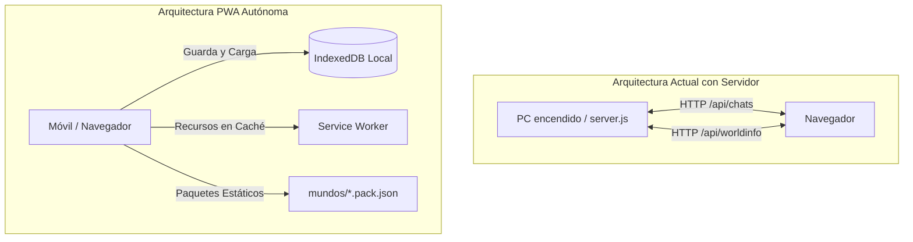

# 📱 Roadmap: El Juego como PWA Autónoma (Sin Servidor Node.js)

> **Qué es esto:** El plan para convertir el juego en una **Single Page Application (PWA) 100% estática** que se ejecuta directamente en el navegador del teléfono móvil (Android e iOS) o PC, **sin necesidad de tener ningún servidor Node.js en activo**, sin depender de un ordenador encendido, y con capacidad de funcionar completamente sin conexión tras la primera carga.

---

## 🎯 1. Diagnóstico y Visión Técnica

### 1.1. La gran ventaja actual del proyecto
Todo el núcleo del juego desarrollado hasta la fecha ya corre enteramente en el cliente:
- Los **334 módulos del motor** (`public/scripts/game-engine/` y `public/scripts/party/`) se ejecutan en el motor JavaScript del navegador del usuario.
- El combate táctico, el movimiento por cuadrícula, las tiradas de dados, la IA enemiga, las reglas de D&D 5e, la novela visual, las partes del día, el pueblo y el gremio **no consumen ni una sola API de servidor para sus cálculos**.

### 1.2. Lo que hoy ata el juego a `server.js` (Node.js)
Actualmente, el backend de SillyTavern solo se utiliza para:
1. **Servir archivos estáticos:** HTML, CSS, JavaScript y las imágenes pixel art de `public/img/game-engine/pixel/`.
2. **Sistema de persistencia en disco:**
   - Guardar y leer metadatos de partida (`chat_metadata` vía endpoints `/api/chats/...`).
   - Leer lorebooks/mundos (`loadWorldInfo` vía `/api/worldinfo/...`).
   - Listar partidas recientes (`/api/chats/recent`).

### 1.3. La solución
Sustituir la persistencia basada en llamadas HTTP a disco por **IndexedDB** (la base de datos estructurada que incluyen todos los navegadores modernos en móviles y ordenadores) y añadir un **Service Worker** con **Web App Manifest** para convertir el cliente en una PWA instalable y 100% offline.

---

## 🗺️ 2. Fases del Roadmap

| Fase | Título | Esfuerzo | Estado | Meta Principal |
| :--- | :--- | :---: | :---: | :--- |
| **P1** | Adaptador de Almacenamiento Local (`IndexedDB`) | **M** | 🟡 En diseño | Desacoplar `saveMetadata` y `loadWorldInfo` de los endpoints REST |
| **P2** | Distribución de Paquetes y Campañas Estáticas | **S** | ⚪ Pendiente | Cargar mundos (`gremio.pack.json`, etc.) directamente por `fetch` estático |
| **P3** | Service Worker y Modo Offline Total | **M** | ⚪ Pendiente | Cachear activos para jugar en avión o sin cobertura |
| **P4** | Adaptación Táctil Móvil y Ergonomía (J20) | **L** | 🟡 67% (CSS listo) | Tablero táctil a toques (sin ratón) y botones de dedo |
| **P5** | Exportación / Importación de Partidas (J15.6) | **S** | ⚪ Pendiente | Mover partidas entre PC y móvil con un archivo `.json` descargable |
| **P6** | Publicación y Despliegue en 1 Clic (GitHub Pages) | **S** | ⚪ Pendiente | URL pública gratuita con HTTPS lista para «Añadir a pantalla de inicio» |

---

## 🛠️ 3. Detalle de Cada Fase

### Fase P1 · Adaptador de Almacenamiento Local (`IndexedDB`)
**Objetivo:** Que guardar o cargar una partida no requiera hacer `fetch('/api/...')` a un servidor Node.js.

- [ ] **P1.1 — Patrón Adapter de Almacenamiento:**
  Crear `public/scripts/game-engine/storage/storage-adapter.js` con una interfaz abstracta:
  - `saveSession(id, data)`
  - `loadSession(id)`
  - `listSessions()`
  - `deleteSession(id)`
  - `saveWorld(worldId, data)`
  - `loadWorld(worldId)`
- [ ] **P1.2 — Implementación IndexedDB (`idb-storage.js`):**
  - Implementar la interfaz usando `indexedDB` nativo (con base de datos `sillytavern_rpg_db`).
  - Almacén de objetos (stores): `sessions`, `worlds`, `settings`.
- [ ] **P1.3 — Detección Automática de Entorno:**
  - Si el juego detecta que no hay backend respondiendo a `/api/chats` (o se arranca en modo standalone), conmuta a `IndexedDB` de forma transparente.
  - Redirigir `saveMetadata()` y `chat_metadata` hacia el almacenamiento local.

---

### Fase P2 · Distribución de Paquetes y Campañas Estáticas
**Objetivo:** Que los mundos de juego (*Puerto Alba / Gremio*, *1387*, *La Maldición de Strahd*) se lean como recursos estáticos o archivos locales.

- [ ] **P2.1 — Bundling de Mundos Oficiales:**
  - Asegurar que `public/mundos/gremio.pack.json`, `public/mundos/1387.pack.json` y `public/mundos/strahd.pack.json` estén accesibles mediante rutas relativas estándar.
- [ ] **P2.2 — Cargador Estático de Mundos:**
  - Modificar `ensureWorldData()` y `loadWorldInfo()` para que, si no hay backend, lean directamente el JSON del paquete estático vía `fetch('./mundos/...')`.
- [ ] **P2.3 — Importador de Campañas Personalizadas:**
  - Un botón «Cargar archivo de campaña» en la portada para subir cualquier JSON de campaña generado externamente y almacenarlo en la base de datos local `IndexedDB`.

---

### Fase P3 · Service Worker y Modo Offline Total (PWA)
**Objetivo:** Abrir la web una sola vez y poder seguir jugando para siempre sin conexión a internet ni wifi.

- [ ] **P3.1 — Creación del Service Worker (`sw.js`):**
  - Estrategia: **Cache-First** para activos estáticos (imágenes pixel art, fuentes, CSS).
  - Estrategia: **Stale-While-Revalidate** para scripts del juego.
- [ ] **P3.2 — Web App Manifest (`manifest.json`):**
  - Configurar nombre: `SillyTavern RPG` (o nombre comercial deseado).
  - Icono de app: Pixel art dedicado (512×512, 192×192) con `maskable`.
  - `display: standalone` (sin barra de direcciones ni controles del navegador).
  - `orientation: any` (soporte vertical para diálogos y horizontal para tableros).
- [ ] **P3.3 — Registro e Instalación:**
  - Banner sutil de «Instalar como App» cuando el navegador dispare el evento `beforeinstallprompt`.

---

### Fase P4 · Adaptación Táctil Móvil y Ergonomía (J20)
**Objetivo:** Que no se eche de menos ni el ratón ni el teclado en pantallas de 390px a 900px.

- [ ] **P4.1 — Tablero Táctil a Dos Toques:**
  - Primer toque en un personaje/monstruo: lo selecciona y resalta casillas accesibles.
  - Toque en casilla de destino: muestra trayectoria, coste de movimiento y flecha.
  - Segundo toque (o botón flotante «Mover»): ejecuta el desplazamiento.
  - Zoom y paneo con dos dedos (*pinch-to-zoom* y arrastre suave).
- [ ] **P4.2 — Botones de Dedo (Touch Targets):**
  - Fichas de acción y botones con área mínima de 44×44 px.
  - Espaciado seguro para evitar pulsaciones erróneas en combate.
- [ ] **P4.3 — Prevención de Gestos Nativos Parásitos:**
  - Desactivar `overscroll-behavior-y: contain` para evitar que el navegador recargue la página (*pull-to-refresh*) accidentalmente al interactuar con el mapa o los inventarios.

---

### Fase P5 · Exportación e Importación de Partidas (J15.6)
**Objetivo:** Total soberanía de los datos: poder jugar en el PC y llevarse la partida al móvil al salir de casa.

- [ ] **P5.1 — Exportar Partida Completa:**
  - Botón «Descargar Partida» que genera un archivo `partida-gremio-[fecha].json` con:
    - Estado del gremio, cofre, edificios y salón de la fama.
    - Personajes creados y compañeros.
    - Campañas activas y progreso de tableros.
- [ ] **P5.2 — Importar Partida:**
  - Carga inmediata del JSON en `IndexedDB`, permitiendo retomar la aventura en cualquier navegador móvil al instante.

---

### Fase P6 · Publicación y Despliegue en 1 Clic
**Objetivo:** Tener una URL lista sin pagar un céntimo en infraestructura.

- [ ] **P6.1 — Despliegue Estático en GitHub Pages / Vercel:**
  - Script en `tools/build-pwa.mjs` que copia los archivos estáticos necesarios a `dist/` o configura la rama `gh-pages`.
  - Al hacer push, GitHub Pages publica la web con certificado HTTPS gratuito (imprescindible para que funcionen los Service Workers y la instalación PWA).
- [ ] **P6.2 — Proceso de Instalación para el Usuario:**
  - **En Android:** Abrir en Chrome $\rightarrow$ «Instalar aplicación» $\rightarrow$ Acceso directo en el cajón de apps.
  - **En iPhone (iOS):** Abrir en Safari $\rightarrow$ Compartir $\rightarrow$ «Añadir a pantalla de inicio» $\rightarrow$ Funciona en ventana completa sin controles de Safari.

---

## ⚖️ 4. Comparativa de Alternativas para Jugar Móvil

| Criterio | Servidor en PC (Actual) | Termux en Android | **PWA Estática (Este Roadmap)** |
| :--- | :---: | :---: | :---: |
| **¿Necesita PC encendido?** | Sí | No | **No** |
| **¿Funciona en iPhone (iOS)?** | Solo si el PC está encendido | No (imposible por Apple) | **Sí (100% nativo)** |
| **¿Funciona en Android?** | Solo si el PC está encendido | Sí (requiere consola) | **Sí (1 clic)** |
| **Instalación para el usuario** | Abrir navegador con IP local | Instalar Termux y teclear | **«Añadir a inicio»** |
| **Coste de servidores** | Consumo eléctrico del PC | Batería del móvil | **0 € (GitHub Pages)** |
| **Complejidad de código** | Ya construido | 0 cambios | **Media (adaptador IndexedDB)** |

---

## 📌 5. Primer Paso Recomendado

El paso con mayor retorno inmediato para este roadmap es la **Fase P1.1 y P1.2**: crear el wrapper de almacenamiento para `chat_metadata` sobre `IndexedDB`. Una vez el juego pueda guardar y recuperar el estado sin llamar a `/api/chats`, el resto del empaquetado PWA y Service Worker se implementa de manera directa y estandarizada.
